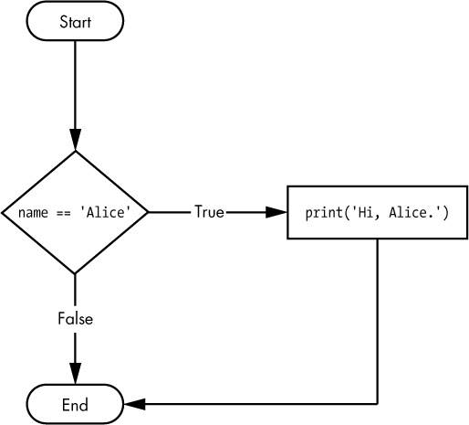

Now that we have covered the foundations, it is time to get a little bit more advanced. In this lesson, we will cover some more advanced ways to use Python, including how to write and run scripts, and how to use built-in methods for strings and data structures. We will also cover how to use control flow structures like loops, functions, and conditional statements.

## Advanced Python

The Python interpreter is great, but why might we not want to write all our code in the interpreter? What happens every time you quit?

*It gets erased!*

Rather than having to start from scratch every time, we can write our code in a script and then run that script. This is also how we can share our code with others.

### Writing and Running Scripts

Open your `is310-coding-assignments` folder in VS Code, and create a new folder `python-scripting`. This is where we will store all our scripts for this lesson. Inside the `python-scripting` folder, create a new file called `first_script.py`. You can do this in the terminal by typing:

For Mac:

```sh
touch first_script.py
```

For Windows PowerShell:

```sh
ni first_script.py
```

We're going to copy our code from the interpreter into this file:

```python
favorite_movies =[
    {
        "name": "The Matrix I",
        "release_year": 1999,
        "sequels": ["The Matrix II", "The Matrix III", "The Matrix IV"]
    },
    {
        "name": "Star Wars IV",
        "release_year": 1977,
        "sequels": ["Star Wars V", "Star Wars VI", "Star Wars VII", "Star Wars VIII", "Star Wars IX"],
        "prequels": ["Star Wars I", "Star Wars II", "Star Wars III"]
    }
]
```

Now save this file. You can do this by clicking `File` and then `Save` or by using the keyboard shortcut `Cmd + S` or `Ctrl + S`. Our next step is to run this script.

In our terminal, we can run the script by typing (but make sure you aren't in the Python interpreter):

```sh
python first_script.py
```

What happens?


Because we aren't in the interpreter anymore, it will not display a value unless we explicitly tell it to do so (or unless there is an error).

One solution is the built-in **`print()` function**.

In `first_script.py`, add the line to the bottom of the script:

```python
print(favorite_movies)
```

This time you should see the list of movies printed out in the terminal when you run the script.

*So what does the `print()` function do?*

### Built-In Functions

`print()` is a *built-in Python function*, which means it comes with Python and we can use it whenever we are writing Python.

`print()` displays variables, values, and data in the terminal, which is useful for seeing what our code is doing. It is also useful for debugging, the process of finding and fixing errors in our code.

`print()` is just one of many built-in functions. Let's take a look at a few more.

1. `len()`

In `first_script.py`, after our existing code, add the following:

```python
total_favorite_movies = len(favorite_movies)
print("How many total favorite movies do we have?", total_favorite_movies)
```

Then try saving your file and running the code in the terminal. You should see first our favorite movies, and then the total number of favorite movies printed out. While this example might seem trivial since we can easily count the number of items in our list, imagine we had hundreds or thousands of items in our list. This is where the **`len()` function** comes in handy.

The **`len()` function** can return the length of a list, dictionary, or string in Python.

2. `type()`

So far we have been writing all our variables, but sometimes you will work with code that you did not write. When that happens, you might want to know what type of value you are working with, which is where the **`type()` function** comes in.

In `first_script.py`, add to the bottom of the script:

```python
print(type(favorite_movies), type(favorite_movies[0]))
```

Once you save and run the script, you should see that we have both a `list` and a `dictionary`. You can pass multiple items to `print()` as long as they are separated by commas. You can also call built-in functions inside `print()` instead of assigning their results to variables first.

3. `input()`

So far, we have written all our data directly in the script. But what if we wanted to get input from the user? This is where the **`input()` function** comes in.

In `first_script.py`, type the following at the bottom of the script:

```python
print('Enter your favorite movie from the last year:')
recent_favorite_movie = input()
print('Your favorite movie from the last year is:', recent_favorite_movie)
```


*What did we just do?*

First, we displayed a prompt with `print()`. Then we used `input()` to collect the user's response and assigned the returned string to a variable called `recent_favorite_movie`. Finally, we displayed the value of that variable along with some explanatory text.

You have now used several built-in functions. Later in this lesson, we will also use methods attached to particular data types, such as strings, lists, and dictionaries.

| Method | Description | Example |
| --- | --- | --- |
| `print()` | Prints out a value to the terminal | `print('Hello World')` |
| `len()` | Returns the length of a list, dictionary, or string | `len([1,2,3,4,5])` |
| `type()` | Returns the type of a variable | `type('Hello World')` |
| `input()` | Gets input from the user | `input('What is your name?')` |

For more information about built-in functions, check out the [Python documentation](https://docs.python.org/3/library/functions.html){target="_blank"}.

### Built-In Methods for Strings

Now that we have worked with more complex data structures, we can start manipulating our data. With cultural data, we are often working with text, which Python represents as a `string`. Strings are sequences of characters, and Python provides many methods for manipulating them.

1. `Split()`

The **split** method lets us split up a string and turn it into a list. In `first_script.py`, add the following description of the movie `The Matrix`:

```python
favorite_movies[0]['long_description'] = "The Matrix is a 1999 science fiction action film written and directed by the Wachowskis. It is the first installment in The Matrix film series, starring Keanu Reeves, Laurence Fishburne, Carrie-Anne Moss, Hugo Weaving, and Joe Pantoliano. The Wachowskis created a plot set in a dystopian future where humanity is unknowingly trapped inside a simulated reality, the Matrix, created by intelligent machines to distract humans while using their bodies as an energy source. In the movie, the main character, Neo, is a computer programmer who learns this truth and is drawn into a rebellion against the machines, which involves other people who have been freed from the Matrix."
print(favorite_movies[0])
```

When we save and rerun our code, we should now see this `long_description` printed out. As a reminder, to create `long_description` we are using indexing of our list and then adding a new key to the dictionary called `long_description`. We are then assigning a string to that key.

But what if we wanted to get a list of all the words in the description? We can use the **split** method to do this.

```python
split_description = favorite_movies[0]['long_description'].split(' ')
print(split_description)
```

The **`split()` method** takes a string and splits it into a list of substrings. In this case, we are splitting the description of the movie `The Matrix` into a list of words. We are using the space character as the **separator**, which means that each space marks where a new item begins. The separator can be another character or a string containing more than one character.

Now that we have this split list, we could use `len` to count the number of words in the description:

```python
print(len(split_description))
```

We could also decide that we want to create a shorter description key in our dictionary and use indexing range to get the first 10 words of the description:

```python
favorite_movies[0]['short_description'] = ' '.join(split_description[:10])
print(favorite_movies[0]['short_description'])
```

2. `Join()`

You'll notice that we use a new method in the example above called **join**. This method lets us take a list and join all the values together.

```python
print(' '.join(split_description))
```

Like `split()`, `join()` uses a separator, which in this case is a space. This means that the items in the list will be joined together with a space between them. The separator can be another character or string; for example, people often use a comma to join a list into a string.

3. `Replace()`

Now currently our description names the directors as `the Wachowskis`. But what if we wanted to change that to `Lana and Lilly Wachowski`? We can use the **replace** method to do this.

```python
edited_description = favorite_movies[0]['long_description'].replace('the Wachowskis', 'Lana and Lilly Wachowski')
print(edited_description)
```

The **replace** method lets us find a string and replace it with another string. You can also specify how many times you want to replace a string. For example, if you only wanted to replace the first instance of `the Wachowskis` you could use the following:

```python
edited_description = favorite_movies[0]['long_description'].replace('the Wachowskis', 'Lana and Lilly Wachowski', 1)
print(edited_description)
```

4. `Lower()`, `Upper()`, `Title()`, `Strip()`

Some additional methods that can be helpful include **lower**, **upper**, **title**, and **strip**. These methods let you change the case of a string, remove white space from the beginning and end of a string, and capitalize the first letter of each word in a string.

```python
print(favorite_movies[0]['long_description'].lower())
print(favorite_movies[0]['long_description'].upper())
print(favorite_movies[0]['long_description'].title())
print(favorite_movies[0]['long_description'].strip())
```

| Method | Explanation | Example |
| --- | --- | --- |
| `split('delim')` | Returns a list of substrings separated by the given delimiter | `split_description = favorite_movies[0]['long_description'].split(' ')` |
| `join(list)` | Opposite of split(), joins the elements in the given list together using the string | `' '.join(split_description)` |
| `replace('old string', 'new string')` | Replaces old string with new string | `favorite_movies[0]['long_description'].replace('the Wachowskis', 'Lana and Lilly Wachowski')` |
| `lower()` | Makes the string lowercase | `favorite_movies[0]['long_description'].lower()` |
| `upper()` | Makes the string uppercase | `favorite_movies[0]['long_description'].upper()` |
| `title()` | Makes the string titlecase | `favorite_movies[0]['long_description'].title()` |
| `strip()` | Removes leading and trailing whitespace | `favorite_movies[0]['long_description'].strip()` |


You can find more information about string methods here
[https://www.w3schools.com/python/python_ref_string.asp](https://www.w3schools.com/python/python_ref_string.asp){target="_blank"}

#### Quick Exercise For Practice (Optional But Recommended)

1. Create two dictionaries in your script: one for a favorite movie and one for a favorite book. We will continue using movies and books as shared practice data, but you may adapt the exercise to another type of cultural object.
2. Each dictionary should include a title, a release or publication year, and any relevant series, sequel, or prequel information.
3. Ask the user to enter a description of each cultural object and assign each response to a new `long_description` key in the appropriate dictionary.
4. Create and print a short description of each object. Then print the length of each long description.

### Control Flow

So far we have been writing code that runs from top to bottom, but what if we moved our latest `print()` call to the top of our script? What would happen?

```python
print(favorite_movies)
favorite_movies =[
    {
        "name": "The Matrix I",
        "release_year": 1999,
        "sequels": ["The Matrix II", "The Matrix III", "The Matrix IV"]
    },
    {
        "name": "Star Wars IV",
        "release_year": 1977,
        "sequels": ["Star Wars V", "Star Wars VI", "Star Wars VII", "Star Wars VIII", "Star Wars IX"],
        "prequels": ["Star Wars I", "Star Wars II", "Star Wars III"]
    }
]
```


We have hit a problem. Let's break down what happened here. When the `print()` call was at the bottom of the script, it worked; when it was at the top, it did not.

That is because the `print()` call references the variable `favorite_movies`, but we have not **defined** that variable yet. This is an example of a **NameError**. It also helps us understand that Python reads code from top to bottom, line by line. This is called **sequential execution**, and we can alter that sequence with **control flow structures**.

Understanding control flow structures is essential to writing more complex code. These structures let us control the flow of our code, and they include **loops**, **functions**, and **conditional statements**.

#### Looping

So far, we have been working with a list of dictionaries and writing individual `print()` calls for each value. But this gets tedious quickly, especially as we add more values (imagine if we had hundreds or thousands of movies, for example).

There is a much faster way to traverse data structures in Python: **looping**. A loop lets us move through an iterable object, such as a list, dictionary, or string, and perform an action for each item.

**For loops** are one of the most common ways in Python to loop over an iterable. But what does looping mean exactly?

Let's take our list of favorite movies and print out the name of each movie.

```python
for movie in favorite_movies:
    print(movie['name'])
```


This diagram helps us understand this new syntax. We start with the `for` keyword (which is another reserved word in Python), followed by a variable name (in this case `movie`) and the `in` keyword (reserved word again), followed by the sequence we want to loop over (in this case `favorite_movies`). We then end the line with a colon, and indent the code we want to run for each item in the sequence.

**Indenting** is very important in Python. It tells Python that the indented code belongs to the loop. If we do not indent it, Python will raise an error. Python's standard style uses four spaces for each indentation level. VS Code normally inserts these spaces automatically when you press `Tab`. This use of whitespace is called **indentation** and is a core part of Python's syntax.

Within the loop, we can use the variable `movie` to access each item in the sequence. This is called **iteration**. In this code, we are using `print()` to display the name of each movie.

While we named our variable `movie`, we could have named it anything. For example, we could have named it `film` or `item`. The name of the variable is up to you, but ideally it should be descriptive of the items in the sequence.

Now what would happen if we tried to print movie outside of the loop?

```python
for movie in favorite_movies:
    print(movie['name'])
print(movie)
```

Python's `for` loops do not create a separate local scope. After this loop finishes, `movie` still refers to the last item in `favorite_movies`, so the final `print()` displays the last movie dictionary. If the iterable had been empty and `movie` had never been assigned, trying to print it would instead raise a `NameError`.

We can also use for loops with dictionaries. Looping directly over a dictionary gives us its keys. If we want both its keys and values, we can use the dictionary's `.items()` method.

```python
individual_movie = favorite_movies[0]
for key, value in individual_movie.items():
    print(key, value)
```

Here, the `.items()` method provides each key-value pair from the dictionary. We place two variables, `key` and `value`, before `in` so that Python assigns each part of the pair to the corresponding variable. We then end the line with a colon and indent the code that should run for every pair. We could use other variable names, but `key` and `value` clearly communicate what each variable contains.

Finally we can even loop through a string. Let's try and print out each letter in the first name of our favorite movie.

```python
first_movie_name = favorite_movies[0]['name']
for letter in first_movie_name:
    print(letter)
```

Looping is fairly complex, but the core thing to remember is the reserved words `for` and `in`, and the colon at the end of the line. We then indent the code we want to run for each item in the sequence.

For more about looping in Python, check out the [Python documentation](https://docs.python.org/3/tutorial/controlflow.html#for-statements){target="_blank"} and the [W3Schools tutorial](https://www.w3schools.com/python/python_for_loops.asp){target="_blank"}.

| Looping keyword | Explanation | Example |
| --- | --- | --- |
| `for` | Used to loop over a sequence | `for movie in favorite_movies:` |
| `in` | Used to specify the sequence to loop over | `for movie in favorite_movies:` |
| `items()` | Used to get the key/value pairs of a dictionary | `for key, value in individual_movie.items():` |

#### Functions

Looping is very powerful, but if we want to loop through a second list of movies or a different variable, we would have to repeat our code later in the script. An alternative is to create a function.

A function is a way to organize code into a reusable block. It's a way to avoid repeating code, and also to make our code more readable. Functions are also a way to make our code more modular and easier to fix.

**Function Syntax**


To create a function, we use the reserved word `def` and then create a unique name for our function, followed by parentheses and colon. Similar to variables, function names can contain letters, numbers, and underscores, but they cannot start with a number. We usually write function names in lowercase and use underscores to separate words.

Inside the parentheses, we define *parameters*: variables that the function can use internally. When we call the function, we supply *arguments*, which are the actual values assigned to those parameters. Finally, a function can *return* the result of its work.

For example let's create a function that takes a movie and prints out the name of the movie.

```python
def print_movie_name(movie):
    print(movie['name'])

print_movie_name(favorite_movies[0])
```

This function takes a movie as an argument and then prints out the name of the movie. We can then call this function and pass in a movie as an argument. This is called **calling** the function.

Now we can create a more complex function that takes a movie dictionary and displays a string containing its name and release year.

```python
def print_movie_name_and_year(movie):
    movie_data = movie['name'] + ' was released in ' + str(movie['release_year'])
    print(movie_data)

print_movie_name_and_year(favorite_movies[0])
```

You'll notice in this example that we are using the `+` operator to concatenate the strings together. We are also using the `str` method to convert the integer to a string. This is because you can't concatenate a string and an integer together. This type of transformation is called **type casting**, which is when we change the type of a variable. Finally we are assigning the result of our manipulation to a new variable called `movie_data` and printing that out.

What would happen if you try to access the variable `movie_data` outside of the function?

```python
def print_movie_name_and_year(movie):
    movie_data = movie['name'] + ' was released in ' + str(movie['release_year'])
    print(movie_data)

print_movie_name_and_year(favorite_movies[0])
print(movie_data)
```

```sh
NameError: name 'movie_data' is not defined
```

Unlike a loop, a function creates a local scope. The variable `movie_data` only exists inside this function, so trying to access it after the function call raises a `NameError`. This is also why different functions can use the same local variable names without those variables conflicting with one another.


This diagram shows how the location where we define a variable determines its **scope**. Our `favorite_movies` list is defined in the surrounding script, or module scope. The parameters and variables defined inside a function, such as `movie` and `movie_data`, belong to that function's local scope. If we try to access a local variable outside its function, Python raises an error. Scope can feel complex at first, but it becomes clearer with practice.

The final part of a function is the **return statement**. It passes data back to the code that called the function. We can then assign that returned value to a variable in the surrounding script.

```python
def print_movie_name_and_year(movie):
    movie_data = movie['name'] + ' was released in ' + str(movie['release_year'])
    return movie_data

new_movie_data = print_movie_name_and_year(favorite_movies[0])
print(new_movie_data)
```

Now we are assigning the returned string to a new variable called `new_movie_data`. Because that assignment occurs outside the function, the variable is available throughout the surrounding module after that line runs.

For more about functions in Python, check out the [Python documentation](https://docs.python.org/3/tutorial/controlflow.html#defining-functions){target="_blank"} and the [W3Schools tutorial](https://www.w3schools.com/python/python_functions.asp){target="_blank"}.

| Function keyword | Explanation | Example |
| --- | --- | --- |
| `def` | Used to define a function | `def print_movie_name(movie):` |
| `return` | Used to pass data back from the function | `return movie_data` |


#### Conditional Statements

So far we have been manipulating all our code the same way, but what if we wanted to have a different manipulation for different types of movies? Or for movies versus books? This is where **conditional statements** come in.

Earlier we learned about *booleans* (`True or False`). So we could test if our two movies are the same.

```python
print(favorite_movies[0] == favorite_movies[1])
```

This should output `False`, but we can also use this type of condition to perform different actions with our code.



```python
if favorite_movies[0] == favorite_movies[1]:
    print('The same')
else:
    print('Different')
```

In this example, we are doing the same comparison as before, but now we are using the `if` keyword, followed by the condition we want to test, followed by a colon. We then indent the code we want to run if the condition is `True`. We can also use the `else` keyword to run code if the condition is `False`. This is called an **if/else statement**. Both `if` and `else` are reserved words in Python. And with these keywords, we can create complex logic in our code.

We can also use the `elif` keyword to add more complexity to our code. Each of the conditional blocks (the three `print()` statements) are only run if the associated conditional statement is `True` (in the boolean logic sense). We can have multiple `elif` blocks if we want. We can also omit `elif` and `else` blocks altogether.

```python
if favorite_movies[0] == favorite_movies[1]:
    print('The same')
elif favorite_movies[0] != favorite_movies[1]:
    print('Different')
else:
    print('No idea')
```

In this example, if our initial condition is True, we print out `The same`. If it's False, we then test the next condition with the `elif` (which stands for else if). If that's True, we print out `Different`. Finally, if that is also False, we print out `No idea`.

In conditional statements, we can use any of the previous operators we've learned about, including `==`, `!=`, `>`, `>=`, `<`, and `<=`. We can also test more complicated comparisons using various comparison operators:


For strings, we can use `==` for comparison and operators like `in` to see whether one string appears inside another.

```python
if 'Matrix' in favorite_movies[0]['name']:
    print('Matrix')
else:
    print('No Matrix')
```

We can also use `==` to test numbers:

```python
if favorite_movies[0]['release_year'] == 1999:
    print('The Matrix')
else:
    print('Not The Matrix')
```

For numbers, we can also use `>`, `>=`, `==`, `<`, and `<=` to make numeric comparisons.

```python
if favorite_movies[0]['release_year'] > favorite_movies[1]['release_year']:
    print('The Matrix')
else:
    print('Star Wars')
```


We can also do more than one condition, we can use `and`, `or`, and `not`:

```python
if favorite_movies[0]['release_year'] > 1999 and 'Matrix' in favorite_movies[0]['name']:
    print('The Matrix')
else:
    print('Star Wars')

if not favorite_movies[0]['release_year'] > 1999:
    print('The Matrix')
else:
    print('Star Wars')
```

Finally, we can use `is` and `is not` to test object identity. Their most common beginner use is checking whether a value is `None`:

```python
if favorite_movies[0]['sequels'] is not None:
    print('Sequels')
else:
    print('No Sequels')
```

You will notice that we are using a new keyword, `None`. This special Python object represents the absence of a value. It is similar to `null` in other programming languages. The recommended way to check for it is with `is None` or `is not None`, rather than `==` or `!=`.

For more about conditional statements in Python, check out the [Python documentation](https://docs.python.org/3/tutorial/controlflow.html#if-statements){target="_blank"} and the [W3Schools tutorial](https://www.w3schools.com/python/python_conditions.asp){target="_blank"}.

| Conditional keyword | Explanation | Example |
| --- | --- | --- |
| `if` | Used to test a condition | `if favorite_movies[0] == favorite_movies[1]:` |
| `elif` | Used to test another condition | `elif favorite_movies[0] != favorite_movies[1]:` |
| `else` | Used to run code if the condition is False | `else:` |
| `in` | Used to test if a string exists in another string | `if 'Matrix' in favorite_movies[0]['name']:` |
| `and` | Used to test if two conditions are True | `if favorite_movies[0]['release_year'] > 1999 and 'Matrix' in favorite_movies[0]['name']:` |
| `or` | Used to test if one of two conditions is True | `if favorite_movies[0]['release_year'] > 1999 or 'Matrix' in favorite_movies[0]['name']:` |
| `not` | Used to test if a condition is False | `if not favorite_movies[0]['release_year'] > 1999:` |
| `is` | Used to test if a variable is None | `if favorite_movies[0]['sequels'] is not None:` |
| `is not` | Used to test if a variable is not None | `if favorite_movies[0]['sequels'] is not None:` |
| `None` | A special Python object that represents the absence of a value | `None` |

### Homework: Scripting Python Foundations (Optional But Recommended)

This homework assignment is **optional but highly recommended** for those that do not have experience with writing Python scripts. If you decide to complete the homework, it will be **added to your grade as extra credit but if you do not complete it, it will not be counted against you.**

In the first quick exercise, you created dictionaries for two cultural objects, asked the user to enter descriptions, created shorter descriptions, and printed the length of each long description.

Now we will augment this script to include loops, functions, and conditional statements.

In your `first_script.py`, try to complete the following tasks:

1. Create a function that takes a movie as an argument. Inside the function, it should check if the movie was released before 2000. If it was, it should print a string that says "This movie was released before 2000". If it wasn't, it should print a string that says "This movie was released after 2000". The function should only return the movie name if it was released after 2000.
2. Below the function create an empty list called `recent_movies`.
3. Outside and below the function and `recent_movies`, use a for loop to loop through all the movies in your list of favorite movies. For each movie, call the function and save its returned value in a variable. If that value is not `None`, append the returned movie name to the `recent_movies` list.
4. Finally, outside of the loop, print out the `recent_movies` list.

Once you have completed this script, save it and run it in the terminal. You should see a list of all the movies that were released after 2000. If you prefer, you can use books or another cultural object instead of movies.

After confirming that the script works, you should push it up to your GitHub repository. You can do this by using the following commands in the terminal:

```sh
git add .
git commit -m "Completed homework for Python Foundations"
git push origin main # or master if you haven't changed the default branch name
```

You should then post a link to your work in our GitHub discussion [https://github.com/CultureAsData-UIUC/is310-fall-2026/discussions/5](https://github.com/CultureAsData-UIUC/is310-fall-2026/discussions/5){target="_blank"}.
