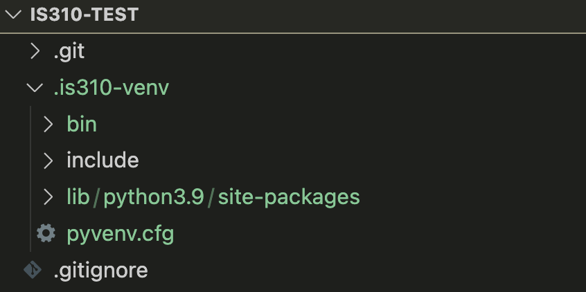
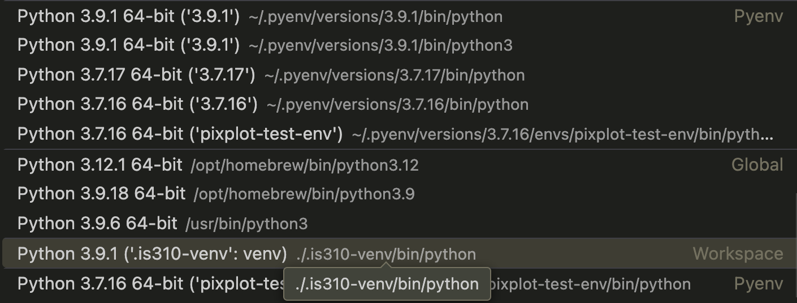
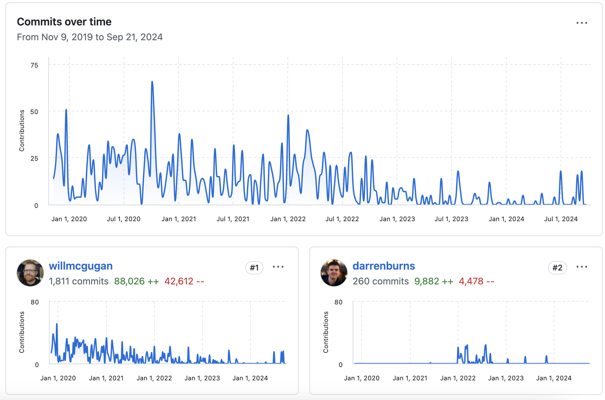
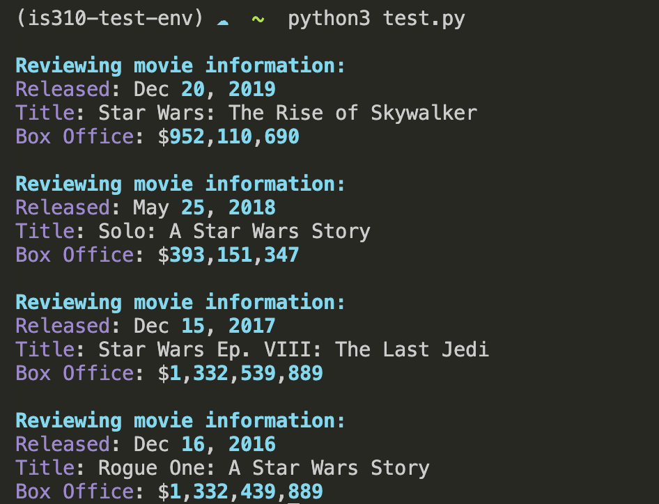

::: {.callout-note}
⚡️ If you already have experience with virtual environments and have a preferred setup, feel free to keep using what you have already though do reach out if you start having any errors or strange messages in your terminal.
:::

## What Is a Virtual Environment?

We have started exploring Python libraries that come pre-installed with Python when you set it up on your computer, but that still need to be imported so that we can use it (remember `Pathlib`!). Now we're going to start installing additional libraries that don't come pre-installed with Python. However, before we install these libraries, we need to create a virtual environment. A virtual environment is necessary to keep the libraries we install contained to each project.

The Python documentation explains that:

> "Python applications will often use packages and modules that don’t come as part of the standard library. Applications will sometimes need a specific version of a library, because the application may require that a particular bug has been fixed or the application may be written using an obsolete version of the library’s interface.

> This means it may not be possible for one Python installation to meet the requirements of every application. If application A needs version 1.0 of a particular module but application B needs version 2.0, then the requirements are in conflict and installing either version 1.0 or 2.0 will leave one application unable to run.

>The solution for this problem is to create a virtual environment, a self-contained directory tree that contains a Python installation for a particular version of Python, plus a number of additional packages."

You can read more here about [virtual environments](https://docs.python.org/3/library/venv.html#venv-def){target="_blank"}.

`pip` is Python's package installer. A virtual environment created with `venv` normally includes it automatically. After activating the environment, you can check and update `pip` with:

```sh
python -m pip --version
python -m pip install --upgrade pip
```

You can also follow the steps here to check if you have pip installed [https://stackoverflow.com/questions/40868345/checking-whether-the-pip-is-installed](https://stackoverflow.com/questions/40868345/checking-whether-the-pip-is-installed){target="_blank"}.

If Python reports that `pip` is unavailable, follow the official [pip installation instructions](https://pip.pypa.io/en/stable/installation/){target="_blank"} or ask an instructor for help.

Now we'll use the built-in Python virtual environment, called `venv`, which you can read more about here [https://docs.python.org/3/library/venv.html](https://docs.python.org/3/library/venv.html){target="_blank"}. One thing to note is that there are LOTS of different ways to setup your virtual environment (which lots of people have *very* strong feelings about). I like this answer from Stack Overflow for giving an overview of the differing options [https://stackoverflow.com/a/65854168/7437781](https://stackoverflow.com/a/65854168/7437781){target="_blank"}.

## Creating Virtual Environments

Now that we have a sense of what a virtual environment is, let's start creating one. We'll start by creating a virtual environment in VS Code and then we'll move to the terminal.

### Creating Virtual Environments in VS Code

::: {.callout-note}
⚡️ This information has been adapted from <a target="_blank" href="https://code.visualstudio.com/docs/python/environments">https://code.visualstudio.com/docs/python/environments</a>. I've also updated the lesson to focus on VS Code, though still recommend taking a look at the terminal version as well.
:::

In VS Code, first open your project folder and then open the Command Palette. On macOS, type `⇧⌘P`; on Windows, type `Ctrl+Shift+P`. You can also select `View` > `Command Palette`.

Once it is open, type `Python: Create Environment` and select it from the menu. Choose `Venv`, which uses Python's built-in virtual-environment tool.


Once you select `Venv`, you'll be prompted to select the Python interpreter you want to use. You can choose the one that comes with Python, or you can select a different one if you have multiple versions of Python installed on your computer. Please make sure to **not select a Python 2 interpreter, as Python 2 is no longer supported**.


Once you've created your virtual environment, you should see a `.venv` folder inside the project folder you opened in VS Code. If you try to create an environment without first opening a folder, VS Code will ask you to open a workspace.



If you've successfully created your virtual environment, you should see a `.venv` folder in your project directory. Do **not** rename or move this folder after creating it. Virtual environments contain paths to their original location; if you want a different name or location, delete the environment and recreate it there.

VS Code should select the new environment automatically. If it does not, reopen the Command Palette, choose `Python: Select Interpreter`, and select the interpreter inside `.venv`:



VS Code organizes interpreters by environment type and location. Once you select `.venv`, its interpreter should appear in the VS Code status bar.


If you have not activated your virtual environment, you'll notice that the status bar will say `Select Python Interpreter` and if you click it you'll be able to select the virtual environment you want to use.


Now open a **new** terminal in VS Code. You should see `(.venv)` at the beginning of the terminal prompt, indicating that the environment is active.


## OPTIONAL Creating Virtual Environments in the Terminal

To be honest, VS Code has gotten very good at creating virtual environments and I would recommend using that method. However, if you are interested in creating a virtual environment in the terminal, you can follow the instructions below. I'm mostly including this because I still work this way, so you'll see me doing this in class.

To create a virtual environment in the terminal, first navigate to your `is310-coding-assignments` project directory. We will create a project-local environment named `.venv`, matching the VS Code convention.

On macOS or Linux:

```sh
python3 -m venv .venv
```

On Windows PowerShell:

```powershell
python -m venv .venv
```

If Windows does not recognize `python`, try `py -m venv .venv`. These commands tell Python to run the `venv` module and create an environment in a folder named `.venv`. **You should only create one virtual environment for this course repository.** For unrelated projects or courses, create separate environments so their package requirements do not conflict.

Now you need to activate the virtual environment. Activation adjusts your terminal's path so that `python` and installed packages come from `.venv` rather than your system-wide Python. This helps prevent dependency conflicts between projects.

On macOS or Linux, run this from the project directory:

```sh
source .venv/bin/activate
```

On Windows Command Prompt:

```bat
.venv\Scripts\activate.bat
```

On Windows PowerShell:

```powershell
.\.venv\Scripts\Activate.ps1
```

If PowerShell says that script execution is disabled, you can allow locally created scripts for the **current PowerShell session only** and then retry activation:

```powershell
Set-ExecutionPolicy -ExecutionPolicy RemoteSigned -Scope Process
```

Only change an execution policy when you understand and trust the script you are running. The `Process` scope ends when you close that PowerShell window. After activation, your prompt should begin with `(.venv)`.

### Deactivating Virtual Environments from the Terminal

While usually you'll want to keep your virtual environment activated while you're working on a project, you can deactivate it by running the following command in your terminal:

```sh
deactivate
```

This works in macOS/Linux shells, Command Prompt, and PowerShell. The environment name will disappear from your prompt. In VS Code, you can also close the active terminal and open a new one after selecting a different interpreter.

## Adding Virtual Environments to `.gitignore`

Since we are using `git` to track our work, we don't want to include our virtual environment in our repository. This is because the virtual environment is specific to your computer and the libraries you have installed. If someone else were to clone your repository, they wouldn't have the same virtual environment as you. This is why we add the virtual environment to our `.gitignore` file. This file tells `git` to ignore certain files or directories when tracking changes. You can add the following line to your `.gitignore` file to ignore your virtual environment:

```text
.venv/
```

Now when we run `git status`, we shouldn't see our virtual environment in the list of files that have been changed. If you accidentally added your virtual environment to your repository, you can remove it by running the following command:

```sh
git rm -r --cached .venv
```

Only run `git rm` if `.venv` was already committed or staged. This removes it from Git's index without deleting your local environment. Then commit the updated `.gitignore`. If you have further issues, request assistance from the instructors.

## Installing Libraries in Virtual Environments

Now that we have our virtual environment created and activated in VS Code, we can start to try installing external Python libraries.

Today, we will try installing the Python package `Rich` by running the following command:

```sh
python -m pip install rich
```

This command asks the active Python interpreter to run `pip` and install the `Rich` library. **Only run it after your virtual environment is activated.** Using `python -m pip` helps ensure that the package is installed for the same Python interpreter you are using.

Unlike `Pathlib`, `rich` isn't built into Python, which is why we need to install it. `pip` is a package manager for Python that allows you to install and manage Python packages. You can read more about it here [https://pip.pypa.io/en/stable/](https://pip.pypa.io/en/stable/){target="_blank"}.

Check which version of Python is active by running:

```sh
python --version
```

However, you'll want to make sure that you're running this **with your virtual environment activated**.

You can confirm that Rich was installed into the active environment with:

```sh
python -m pip show rich
```

You can also list all installed packages:

```sh
python -m pip list
```

Which will show you all the libraries that are installed in your virtual environment. You should see `Rich` in the list of installed libraries.

You can also look in your virtual environment directory and see if there is a `site-packages` directory. This is where all the libraries you install with `pip` are stored. You can see that the `Rich` library is installed in the `site-packages` directory.


Either command should show whether you have installed `Rich` and which version is present. You can also check a package's version from Python:

```python
from importlib.metadata import version

print(version("rich"))
```

**Going forward, install Python libraries inside your virtual environment.**

## Recording Package Requirements

Virtual environments should not be committed to Git or copied between computers. Instead, record the packages needed to recreate the environment in a `requirements.txt` file:

```sh
python -m pip freeze > requirements.txt
```

The `>` operator writes the list of installed packages and their versions into `requirements.txt`. Commit this small text file to Git. Someone who clones your repository can create and activate their own virtual environment and then install the same package versions with:

```sh
python -m pip install -r requirements.txt
```

Run `python -m pip freeze > requirements.txt` again whenever you intentionally add or update packages. Review the file before committing it so that it contains only dependencies relevant to your project.

### Rich Python Library

Rich is a Python library created by [Will McGugan](https://www.willmcgugan.com/){target="_blank"} to add formatted text, tables, progress indicators, and other visual elements to terminal applications. Its source code and development history are available in the [Rich GitHub repository](https://github.com/Textualize/rich){target="_blank"}.



The repository's history shows that the project began in 2019 and continues to be maintained by a large open-source community.


We can start to get a sense of what the library can do by looking at the features listed on the GitHub repository but we can also read the documentation for the library to get a better sense of what it can do [https://rich.readthedocs.io/en/stable/introduction.html](https://rich.readthedocs.io/en/stable/introduction.html){target="_blank"}.

This documentation is **very** detailed, but we can start with the Quickstart guidelines [https://rich.readthedocs.io/en/stable/introduction.html#quick-start](https://rich.readthedocs.io/en/stable/introduction.html#quick-start){target="_blank"} to get a sense of how to use the library.

From the guidelines we can see how to import the library into our Python script. In your `is310-coding-assignments` directory, create a new folder called `python-libraries` and create a new file called `rich_example.py`. In this file, add the following code:

```python
from rich import print

print("Hello, [bold magenta]World[/bold magenta]!", ":vampire:")
```

Now you can run the script by running the following command in your terminal:

```sh
python rich_example.py
```

If your terminal is in the `is310-coding-assignments` directory rather than `python-libraries`, run `python python-libraries/rich_example.py` instead.

You should see the following output in your terminal:

```shell
Hello, World! 🧛
```


Notice that the word `world` is in bold and magenta and that there is a vampire emoji at the end of the sentence. This is the power of the `Rich` library.

We can also start to format our text in different ways. For example, we can add a table to our script by adding the following code:

```python
from rich.console import Console
from rich.table import Table

console = Console()

table = Table(title="Star Wars Movies")
table.add_column("Released", style="cyan", no_wrap=True)
table.add_column("Title", style="magenta")
table.add_column("Box Office", justify="right")
table.add_row("Dec 20, 2019", "Star Wars: The Rise of Skywalker", "$952,110,690")
table.add_row("May 25, 2018", "Solo: A Star Wars Story", "$393,151,347")
table.add_row("Dec 15, 2017", "Star Wars Ep. VIII: The Last Jedi", "$1,332,539,889")
table.add_row("Dec 16, 2016", "Rogue One: A Star Wars Story", "$1,332,439,889")

console.print(table)
```

Now you can run the script by running the following command in your terminal:

```sh
python rich_example.py
```

If your terminal is in the repository's root directory, run `python python-libraries/rich_example.py` instead.

And you should see the following output in your terminal:


As you can likely tell, both `Console` and `Table` are classes built into the `Rich` library that allow us to format our text in different ways. We can see that we are able to add a title to our table, add columns, and add rows to our table. We can also see that we are able to format our text in different ways, such as changing the color of the text, justifying the text, and wrapping the text. You can read more about the `Console` class [https://rich.readthedocs.io/en/stable/reference/console.html#rich.console.Console](https://rich.readthedocs.io/en/stable/reference/console.html#rich.console.Console){target="_blank"} in the documentation.


You'll notice this documentation is somewhat difficult to read, but it does show us the different methods and attributes that are available to us in the `Console` class. We can also click the small green `source` button to see the source code for the class [https://rich.readthedocs.io/en/stable/_modules/rich/console.html#Console](https://rich.readthedocs.io/en/stable/_modules/rich/console.html#Console){target="_blank"}. While you won't usually need to go so deep into a Python library's code, it is helpful to know how to read it if you are getting errors or are unsure how to use a library.

We can also use `Rich` with some of the more advanced data structures we have been working with. In your `rich_example.py` file, add the following code:

```python
from rich.console import Console
from rich.table import Table

# Create a Console instance to print formatted text
console = Console()

# Initial movie data stored in a list of dictionaries
movies = [
    {
        "Released": "Dec 20, 2019",
        "Title": "Star Wars: The Rise of Skywalker",
        "Box Office": "$952,110,690"
    },
    {
        "Released": "May 25, 2018",
        "Title": "Solo: A Star Wars Story",
        "Box Office": "$393,151,347"
    },
    {
        "Released": "Dec 15, 2017",
        "Title": "Star Wars Ep. VIII: The Last Jedi",
        "Box Office": "$1,332,539,889"
    },
    {
        "Released": "Dec 16, 2016",
        "Title": "Rogue One: A Star Wars Story",
        "Box Office": "$1,332,439,889"
    }
]

# Loop through the list of movies
for movie in movies:
    console.print("\n[bold cyan]Reviewing movie information:[/bold cyan]")
    for field, value in movie.items():
        console.print(f"[magenta]{field}[/magenta]: {value}")
```

Now we should see the following output in our terminal:



As you can see, we are able to loop through the list of movies and print the information for each movie in a formatted way. This is a great way to start to see how we can use the `Rich` library to format our text in different ways.

## Homework: Command Line Data Curation

Now that we have completed:

- [ ] the Python refresher lessons on data types and structures
- [ ] the Complex Python lesson on scripting and classes
- [ ] and finally, this lesson on virtual environments and packages

it is time to start putting this all together.

## Part 1: Build a CLI Application

Everyone will create a Python script that allows someone to enter data in the terminal and then saves that data in a structured file format such as `.csv` or `.json`.

In your `python-libraries` folder, you should create a new file called `cli_data_entry.py`. In this file, you should create a Python script that does the following:

1. Imports the `Rich` library and creates a `Console` instance, so that you can print formatted text to the terminal.
2. The script should then show the user some pre-created example data using `Rich`. This data could be related to our movie example, such as the title of a movie, the release date, and the box office earnings. Or you can also ask the user to enter data that is related to your own interests or hobbies. Or really anything you want! You can use the `Table` class to do this, or you can use the `console.print` function to format the text in a different way.
3. Now the goal is to get the user to add some **additional data**

To do this, you will need to use the built-in `input()` function to ask the user to enter data for each field. Rich also provides `Console.input()`, documented [here](https://rich.readthedocs.io/en/stable/console.html#rich.console.Console.input){target="_blank"}. You can use either option, but the goal is to let a user enter data relevant to your topic.

Here's an example of what this *could* look like:

```python
from rich.console import Console
from rich.table import Table

console = Console()
console.print("Here is some initial data:", style="bold cyan")

table = Table(title="Star Wars Movies")
table.add_column("Released", style="cyan", no_wrap=True)
table.add_column("Title", style="magenta")
table.add_column("Box Office", justify="right")
table.add_row("Dec 20, 2019", "Star Wars: The Rise of Skywalker", "$952,110,690")
table.add_row("May 25, 2018", "Solo: A Star Wars Story", "$393,151,347")
table.add_row("Dec 15, 2017", "Star Wars Ep. VIII: The Last Jedi", "$1,332,539,889")
table.add_row("Dec 16, 2016", "Rogue One: A Star Wars Story", "$1,332,439,889")

console.print(table)
console.print("\n[bold cyan]Now I want you to enter your preferred movies:[/bold cyan]")

movie_title = input("Enter the title of the movie: ")
release_date = input("Enter the release date of the movie: ")
box_office = input("Enter the box office earnings of the movie: ")
```

However, you'll notice that this script doesn't allow for multiple entries or writes the data to a file. This is where you come in! You should ensure that **your script allows for multiple entries** (maybe creating a `for-loop` or a `function`, though you can use whatever you think is best) and then save the data to a file.

1. Once the user has entered the data, the script should print out their entry and ask the the user to confirm that the data they entered is correct. If the user confirms that the data is correct, the script should save the data to a file. If the user says the data is incorrect, the script should ask the user to re-enter the data. It is up to you to decide when to write data to a file, but you should only write the data to a file once the user has confirmed that the data is correct.
2. Finally, the script should print a message to the user that the data has been saved to a file and the full path to the file, so they can locate it.

::: {.callout-tip}
## Consider Your Cultural Data Focus

While you can create your CLI app to collect data on any topic, I would highly recommend developing one that might be useful for your final project or at least somewhat related to your group's cultural topic. To be clear, this is simply a suggestion, but it might help you consider how best to design your CLI App if you have a clear dataset or topic in mind.
:::

## Part 2: Choose Your Development Pathway

The assignment has two pathways based on how you develop your code.

### Pathway 1: CLI Without AI

If you complete the assignment without using AI to generate, substantially revise, or troubleshoot your code, submit the working CLI application described above.

### Pathway 2: AI-Assisted CLI and HTML

If you use AI to generate, substantially revise, or troubleshoot your code, you must create the same data-curation workflow in **two forms**:

1. The working Python CLI application described above.
2. A working HTML interface that collects equivalent cultural data.

Your HTML version may use HTML, CSS, and JavaScript in a single page or in separate files. It should:

- Include clearly labeled fields for the same kinds of data collected by your CLI.
- Allow someone to enter and review at least two records.
- Use basic validation to prevent required fields from being left empty.
- Display the resulting records or allow the user to download them in a structured format.

The HTML version does **not** need a server, database, user accounts, or elaborate visual design. The goal is to compare two interfaces for curating the same cultural data, not to build a complete web application.

In your `README.md`, briefly compare the two approaches:

- What does each interface make easier or harder?
- Did the interfaces lead you to make different choices about fields, instructions, or validation?
- What did the AI contribute, and what did you change, reject, or troubleshoot?
- Which interface better fits your cultural material and intended user, and why?

::: {.callout-note}
## What Kind of AI Use Triggers Pathway 2?

Complete Pathway 2 if AI helped generate, substantially revise, or troubleshoot code for this assignment. Using AI only to clarify a course concept or explain documentation does not require the HTML extension, though you should still document relevant use. If you are unsure which pathway applies, ask an instructor.
:::

## Part 3: Submission and Peer Testing

Once your script is working, push the assignment folder to your GitHub repository and post its link in the appropriate thread in our [Fall 2026 GitHub Discussions](https://github.com/CultureAsData-UIUC/is310-fall-2026/discussions){target="_blank"}. Include:

- Your `cli_data_entry.py` script.
- A `README.md` explaining what the script collects, how to install its requirements, and how to run it.
- The `requirements.txt` file used to recreate your environment.
- A sample data file produced by your script.
- An `ai-chat-log.md` containing the relevant prompts and responses if you used an AI chatbot. If you did not use AI, include a brief note stating that.
- If you completed Pathway 2, your HTML, CSS, and JavaScript files and your comparison of the two interfaces in the `README.md`.

Next, test **one interface** created by a classmate. You may choose either their CLI or HTML version; you do not need to test both. Enter at least two records and reply to their post with:

- Which interface you tested.
- The data file or output you generated.
- Brief, constructive feedback about what worked and what could be clearer or easier to use.

If you have questions or need help, ask during class or contact the instructors through the course communication channels. You may use the AI tool of your choice, but you remain responsible for understanding, testing, and documenting any AI-assisted code according to our [AI policy](../../policies.qmd#ai-policy){target="_blank"} and [GitHub Style Guide](../../assessments/05-github-style-guide.qmd#ai-chat-log-notes){target="_blank"}.
