::: {.callout-note}
⚡️ This lesson has been adapted from Melanie Walsh's chapter on Web Scraping in <i>Introduction to Cultural Analytics & Python</i> textbook <a target="_blank" href="https://melaniewalsh.github.io/Intro-Cultural-Analytics/04-Data-Collection/02-Web-Scraping-Part1.html">https://melaniewalsh.github.io/Intro-Cultural-Analytics/04-Data-Collection/02-Web-Scraping-Part1.html</a>. Many thanks to Melanie for sharing their materials!

Also the materials from our in-class scraping are available to download. Here is our <a target="_blank" href="../../assets/files/first_web_scraping.py" download>`first_web_scraper.py`</a>; our <a target="_blank" href="../../assets/files/hp_scraper.py" download>`hp_scraper.py`</a>; and the complete <a target="_blank" href="../../assets/files/tolkien_gateway_scraper.py" download>`tolkien_gateway_scraper.py`</a> that we build up over the second half of this lesson.
:::

::: {.callout-important}
## A Note on This Lesson (Updated 2026)

The web changed underneath this lesson. When it was first written, you could scrape a Fandom wiki with a few lines of Python. Today those sites sit behind bot protection that blocks automated requests entirely, and the `cloudscraper` library we used to get around it no longer works.

Rather than pretend otherwise, this lesson now walks you into that wall on purpose. You will see a real `403`, understand why it happens, and then work through what a researcher should actually do about it. The technical skills are unchanged — `requests` and `BeautifulSoup` work exactly as they always have — but you'll also come away knowing how to tell the difference between a site that is open to you and one that has asked you to stay out.
:::

Now that we have learned how to work with Python modules and read and write files, we can start to think about how to get data from the web. This is a very important skill for a digital humanist, as many of the sources we might want to work with are online.

## What Is Web Scraping and Why Is It Useful?

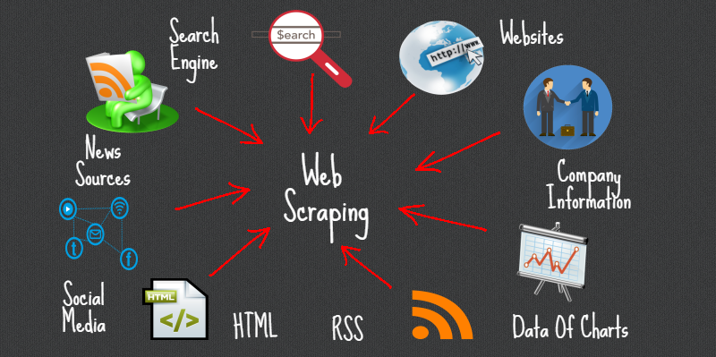

So far when it comes to working with the web, you have been creating your own HTML pages and hosting them via GitHub. But we can also use Python to interact with the web in a different way: by scraping data from web pages. The data we extract is exactly the same as what you have been writing, so elements like headers, paragraphs, and links, etc.

Web scraping can be incredibly useful considering how much data is available on the web and how little of it is often put into tabular format. For example, you might want to scrape a web archive to get data for a research project, or you might want to scrape a social media site to get access to data that isn't available through their API.

Web scraping is also what we use to preserve the web. Remember the Wayback Machine? That's a web archive that uses web scraping to save web pages. The way it works is that it uses a web crawler to find links to web pages and then it uses web scraping to save the content of those pages.


This method has also been used by scholars to do community-driven data preservation. For example, when Russia invaded Ukraine, a group of scholars and librarians founded the *Saving Ukrainian Cultural Heritage Online* (SUCHO) group and used web scraping to preserve the content of Ukrainian websites [https://www.sucho.org/](https://www.sucho.org/){target="_blank"}. This was important because if servers are bombed, the content of those websites would be lost forever.

### Is Web Scraping Legal or Ethical?

Technically, most publicly available internet data is considered legal to collect, even if it's not explicitly licensed. In 2019, "the Ninth Circuit Court of Appeals ruled that automated scraping of publicly accessible data likely does not violate the Computer Fraud and Abuse Act (CFAA)."[^1] However, there are some important caveats to this. For example, this ruling only applies to US based websites and the laws in other countries might be different. One of the more recent and important European developments was the passing of the General Data Protection Regulation (GDPR) in 2018, which has implications for web scraping. In particular, the GDPR bans the scraping of emails and personal names from websites. More recently, a consortium of regulators from multiple countries released a joint statement warning social media companies that they must protect user data from scraping.[^2]

In terms of ethics, web scraping can be a bit of a grey area. It's generally considered ethical to scrape publicly available data, but it's not ethical to scrape data from a website that has a terms of service that prohibits scraping. It can be difficult to find those terms of service, but one more obvious example of a website banning scraping is if it prohibits scraping in its `robots.txt` file. A robots.txt file is a file that websites use to tell web crawlers which pages they are allowed to scrape.


For example,the above image is of the robots.txt file for the New York Times website is [https://www.nytimes.com/robots.txt](https://www.nytimes.com/robots.txt){target="_blank"}. We can see that it lists a number of pages that are not allowed to be scraped (those are the ones with the `Disallow` directive). You might also come across `robots.txt` files that have a `Crawl-delay` directive, which tells web crawlers how long to wait between requests. The reason this is important is that if you try to web scrape a website that has a `robots.txt` file that prohibits scraping, you could be banned from the website. This is because the website might think you are a web crawler and not a human, and it might block your IP address.

What to collect and how to collect it is a big part of the ethics of web scraping. Melanie Walsh has a great overview of some of these tradeoffs:

> Just because something is legal or gets approved by an IRB does not mean it is ethical. Collecting, sharing, and publishing internet data created by or about individuals can lead to unwanted public scrutiny, harm, and other negative consequences for those individuals. For these reasons, some researchers attempt to anonymize internet data before sharing it or before publishing an article that cites a post specifically. Yet anonymizing internet data also does not give credit to internet users as creators and authors.

> There is no single, simple answer to the many difficult questions raised by internet data collection. It is important to develop an ethical framework that responds to the specifics of your particular research project or use case (e.g., the platform, the people involved, the context, the potential consequences, etc.).

> In my own research, I have started seeking explicit permission from internet users when I want to quote them in a published article. In this book, I only share internet data that meets a certain threshold of publicness, such as tweets from verified Twitter accounts or Reddit posts with a certain number of upvotes. This is an approach that I have developed based on some of the models and readings included below.

IRB refers to the Institutional Review Board, which is a committee that reviews and approves research involving human subjects at universities, and most of the time, web scraping or accessing digital data is considered not to be human subjects research. However, even if we don't need IRB approval, it's still important to think about the ethics of web scraping and to consider the potential consequences of our actions. I personally think Walsh's approach is a good one: to think about the specifics of your research project and to develop both a legal *and* an ethical framework that responds to those specifics. And also to think about the consent of the people whose data you are collecting. There's no one size fits all answer, but we should always think about not only if we can collect data, but also if we should and how we should.

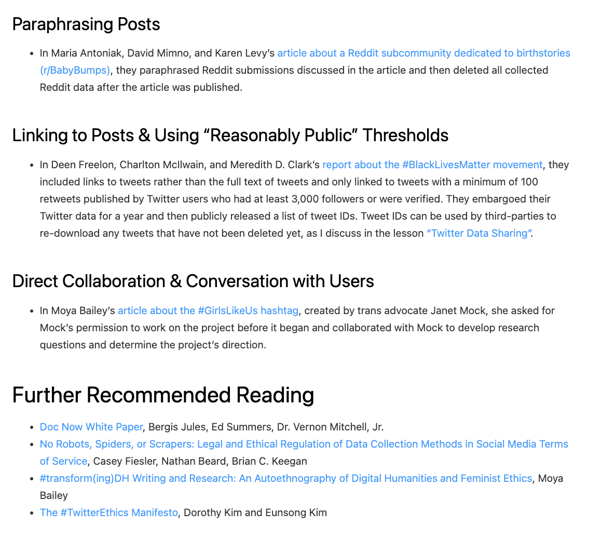

As you can see above, Walsh also has a great overview of different strategies and resources for this type of work, so highly recommend visiting the original chapter to explore these further in depth [https://melaniewalsh.github.io/Intro-Cultural-Analytics/04-Data-Collection/01-User-Ethics-Legal-Concerns.html](https://melaniewalsh.github.io/Intro-Cultural-Analytics/04-Data-Collection/01-User-Ethics-Legal-Concerns.html){target="_blank"}.

## Web Scraping with Python

Now that we have a sense of web scraping generally, it's time to try it out in Python. We will be using two Python libraries to do this: `requests` and `beautifulsoup4`. The `requests` library is a library that allows us to send HTTP requests to web pages. The `beautifulsoup4` library is a library that allows us to parse HTML and XML documents. We will be using `requests` to get the web page and `beautifulsoup4` to parse the web page.

### Installing Required Packages

The first step is to install our required packages into our virtual environment. If you have yet to set up a virtual environment, you can follow the instructions in the [previous lesson](../creating-curating-cad/04-virtual-environments){target="_blank"}.

If you have already created your virtual environment, then you can either activate it using Visual Studio Code or by using the terminal. If you are using the terminal, you can activate your virtual environment by running the following command:

```bash
source venv/bin/activate
pip install requests beautifulsoup4
```

Notice here we are installing two packages: `requests` and `beautifulsoup4` in a single line. **You can install as many packages as you want in a single `pip install` command, just separate them with a space.**

----

We previously discussed Python libraries when we talked about classes and virtual environments, but let's dig in a bit deeper.

**Library**

- There's a lot of different definitions for this term, but most generally you can think of this as a collection of software that's directly used by other software. Most often, this will be a generalizable piece of logic that is useful to bundle separately so that other, unrelated pieces of software can use it. Because it's an informal term in Python and not a specific, technical one, it's more useful to think about libraries in terms of how code is organized. Used in this way, the concept of "software libraries" spans many different programing languages and development contexts: we have Python libraries, C++ libraries, Javascript libraries, operating system libraries, etc.
- Let's consider libraries that we've used. The [Python Standard Library](https://docs.python.org/3/library/){target="_blank"} is the most obvious example which encompasses many different purposes and packages (more on that later), but is unified in that it is included in all Python installations so that Python code that's written using the Standard Library will run on any compatible Python environment of the expected version. Parts of the Standard Library that we've used before include packages like [pathlib](https://docs.python.org/3/library/pathlib.html){target="_blank"}.
- There are also third-party libraries that people build in Python, which can be found on The Python Package Index (PyPI) <https://pypi.org/>. These are usually less expansive than the Standard Library, but can be useful because they are written for specialized tasks. This week, we'll take a look at [Beautiful Soup](https://www.crummy.com/software/BeautifulSoup/){target="_blank"}, which is analogous in scope to packages like pathlib. In fact, third party libraries are often organized into a single package. A library like Beautiful Soup can best be thought of in terms of purpose: you want to accomplish the a particular, common task like scraping a website and Beautiful Soup helps accomplish it.

**Package**

- A package is a formal term in the Python context. It's a specific organization of code which all lives in a single directory. Libraries sometimes (often) consist of a single package (e.g. PathLib or BS4), so the term is sometimes (often) used interchangeably. Packages are the basic unit by which we install and use libraries. So when we type `pip install beautifulsoup4` into the terminal, we're installing the `beautifulsoup4` package.

This is very detailed, but just remember that while these terms are often used interchangeably, a package is a more specific concept referring to the structure and distribution of code, whereas a library is a broader concept referring to reusable code functionality.

Finally, you'll see that I often use `pip` or `pip3` when installing packages. This is because `pip` is the package installer for Python and `pip3` is the package installer for Python 3. If you're using Python 3, you can use either `pip` or `pip3`, but if you're using Python 2, you should use `pip2`. So generally, you'll want to use `pip` to install packages but to double check you're installing packages for the right version of Python, you can check the version of Python you're using by running `python --version` and then use the corresponding `pip` command.

----

Now we can starting using these packages in our Python code. First, we need to create a new folder in our `is310-coding-assignments` called `web-scraping` and then create a new file called `first_web_scraping.py`. Then we can add the following code to our file:

```python
import beautifulsoup4
```

You'll likely see the following error if you try to run this code:

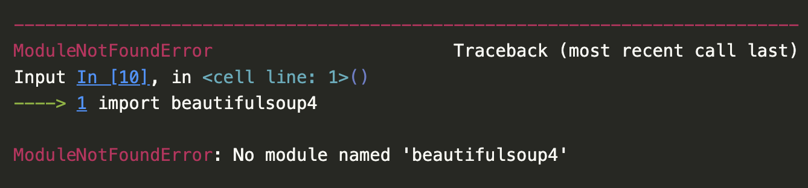

That is because `beautifulsoup4` is not a package that we can import directly. Instead, we need to import the `BeautifulSoup` class from the `bs4` package. This difference is a bit confusing since the name of the package on PyPI (`beautifulsoup4`) doesn't match the actual Python code package (`bs4`).

But this is a great example of why we always want to read the documentation, which is available here [https://www.crummy.com/software/BeautifulSoup/bs4/doc/](https://www.crummy.com/software/BeautifulSoup/bs4/doc/){target="_blank"}.


If we click on the `Quick Start` link, we can see that the documentation tells us to import the `BeautifulSoup` class from the `bs4` package. So we can update our code to look like this:

```python
from bs4 import BeautifulSoup
```

Remember that the `from` keyword is used to import a specific module (aka Class or function in Python) from a package. Alternatively we could also import the entire package and then use the `BeautifulSoup` class like this:

```python
import bs4
soup = bs4.BeautifulSoup(html_doc, 'html.parser')
```

Finally we could technically use the asterisk symbol, which often means "all" or "any", to import all the modules (aka Classes and functions) in the package:

```python
from bs4 import *
soup = BeautifulSoup(html_doc, 'html.parser')
# imports * imports all modules in a package
```

However, this is generally not recommended because it can make it difficult to understand where a particular module is coming from.

You may also need to install a parser for `BeautifulSoup`. The `html.parser` parser is included with Python, but you can also use the `lxml` parser, which is faster and more lenient. You can install the `lxml` parser by running the following command:

```bash
pip install lxml
```

There's actually a number of possible parsers you can use with `BeautifulSoup`. Here's a quick overview of the different parsers you can use with `BeautifulSoup` from the library's documentation:

| Parser                     | Typical usage                                | Advantages                                                                 | Disadvantages                                      |
|----------------------------|----------------------------------------------|---------------------------------------------------------------------------|----------------------------------------------------|
| Python’s `html.parser`     | `BeautifulSoup(markup, "html.parser")`       | Batteries included<br>Decent speed<br>Lenient (As of Python 2.7.3 and 3.2)| Not as fast as lxml<br>Less lenient than html5lib  |
| lxml’s HTML parser         | `BeautifulSoup(markup, "lxml")`              | Very fast<br>Lenient                                                      | External C dependency                              |
| lxml’s XML parser          | `BeautifulSoup(markup, "lxml-xml")`<br>`BeautifulSoup(markup, "xml")` | Very fast<br>The only currently supported XML parser                      | External C dependency                              |
| html5lib                   | `BeautifulSoup(markup, "html5lib")`          | Extremely lenient<br>Parses pages the same way a web browser does<br>Creates valid HTML5 | Very slow<br>External Python dependency            |

I usually just use the built-in `html.parser` parser, but you can use the `lxml` parser if you want to. Next we'll learn what these parsers are doing and how to use them!

### BeautifulSoup Basics

In the `Quick Start` guide [https://beautiful-soup-4.readthedocs.io/en/latest/#quick-start](https://beautiful-soup-4.readthedocs.io/en/latest/#quick-start){target="_blank"}, we have an example of how to use the `BeautifulSoup` class to parse an HTML document. Let's try this example in our `first_web_scraping.py` file.

```python
html_doc = """
<html><head><title>The Dormouse's story</title></head>
<body>
<p class="title"><b>The Dormouse's story</b></p>

<p class="story">Once upon a time there were three little sisters; and their names were
<a target="_blank" href="http://example.com/elsie" class="sister" id="link1">Elsie</a>,
<a target="_blank" href="http://example.com/lacie" class="sister" id="link2">Lacie</a> and
<a target="_blank" href="http://example.com/tillie" class="sister" id="link3">Tillie</a>;
and they lived at the bottom of a well.</p>

<p class="story">...</p>
"""

soup = BeautifulSoup(html_doc, 'html.parser')

print(soup.prettify())
```

We can see that `html_doc` is a variable that holds a multiline string that contains HTML. We are then using the `BeautifulSoup` class to parse the HTML document and the `prettify()` method to print the HTML document in a more readable format.

The power of `BeautifulSoup` is that it let's us use the structure of the HTML document to extract the data we want. For example, we can use the built-in `find_all()` method to get all the links in the document and then use the `get_text()` method to get the text of each link.

```python
links = soup.find_all('a')
for link in links:
	print(link.get('href'))
	print(link.get_text())
```

From this we can see that we are getting all the links in the document and then printing the `href` attribute of each link and the text of each link. This is a very simple example, but it shows how we can use the structure of the HTML document to extract the data we want.

In `BeautifulSoup`, we have four kinds of objects that we can work with: `Tag`, `NavigableString`, `BeautifulSoup`, and `Comment`. The `Tag` object is the most important object and represents an HTML or XML tag. The `NavigableString` object represents the text within a tag. The `BeautifulSoup` object represents the whole of the document. The `Comment` object represents an HTML or XML comment. We'll just focus on the `Tag` and `BeautifulSoup` objects for now.

**BeautifulSoup Class**

We've already started to use `BeautifulSoup` class, but let's take a closer look at it. The `BeautifulSoup` class is the main class in the `BeautifulSoup` library and represents the whole of the document.

We usually define a `BeautifulSoup` object by passing in the HTML document and the parser we want to use. You'll notice that the variable containing the `BeautifulSoup` object is often called `soup`, but you can call it whatever you want.

The core power of `BeautifulSoup` is that it let's you navigate the HTML Document like a tree, which you can read more about here [https://beautiful-soup-4.readthedocs.io/en/latest/index.html#navigating-the-tree](https://beautiful-soup-4.readthedocs.io/en/latest/index.html#navigating-the-tree){target="_blank"}.

Remember in HTML we can have nested HTML elements, and so `BeautifulSoup` let's us use that structure to find elements. Otherwise, this would just be **unstructured text** which is difficult to work with.

So far to navigate the tree we've been using the `find_all` method, which has the following documentation [https://beautiful-soup-4.readthedocs.io/en/latest/index.html#find-all](https://beautiful-soup-4.readthedocs.io/en/latest/index.html#find-all){target="_blank"}.

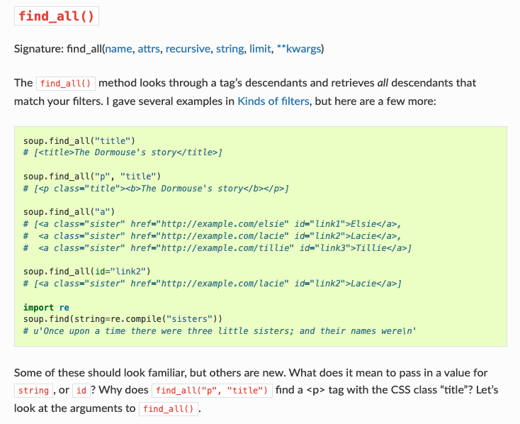

In the documentation, it talks about how this method "looks through a tag’s descendants and retrieves all descendants that match your filters." This is a bit confusing, but what it means is that the `find_all` method searches through the HTML document and retrieves all the elements that match the filter you give it.

So to go back to our previous example:

```python
links = soup.find_all('a')
for link in links:
	print(link.get('href'))
	print(link.get_text())
```

Here we are passing in the `a` tag name to the `find_all` method. We could also pass in other filters like a class name:

```python
links = soup.find_all('a', class_='sister')
```

Now this code should pretty identically because we only have links with the class name `sister`. However, you can imagine how this could be useful if you only wanted to get links with a specific class name.

You can also pass in other filters like `id`, `href`, etc. For example, if you wanted to get the link with the `id` attribute `link1`, you could do this:

```python
link = soup.find_all('a', id='link1')
```

The filter can be a tag name, a tag attribute, a tag attribute value, a tag class, a tag id, etc. The `find_all` method returns a list of tags that match the filter.

**Tag Class**

So far we have been just searching the HTML tree to find elements, but it is helpful to understand that in `BeautifulSoup` each element is represented by a `Tag` object. The `Tag` object is the most important object in `BeautifulSoup` and represents an HTML or XML tag.

For example, in our existing code we could use the `find_all()` method to get all the `p` tags in the document and then use the `get_text()` method to get the text of each `p` tag.

```python
paragraphs = soup.find_all('p')
for paragraph in paragraphs:
	print(paragraph.get_text())
```

Tags are equivalent to the elements in HTML, so any time you want to see if tag exists in the HTML document, you can use either the `find_all()` method to search for it or simply `soup.p` to get the first `p` tag in the document.

We can also use the `.name` attribute to get the name of the tag and the `.attrs` attribute to get the attributes of the tag.

```python
paragraphs = soup.find_all('p')
for paragraph in paragraphs:
	print(paragraph.name)
	print(paragraph.attrs)
```

Now we should see the name of the tag and the attributes of the tag printed for each `p` tag in the document.

Attributes are equivalent to the attributes in HTML, so any time you want to see if an attribute exists in the HTML document, you can use either the `.get()` method to get the value of the attribute or simply square brackets to get the value of the attribute.

```python
paragraphs = soup.find_all('p')
for paragraph in paragraphs:
	print(paragraph.get('class'))
	print(paragraph['class'])
```

Now that we are understanding how `BeautifulSoup` represents HTML, we can start to further navigate the HTML tree. In addition to searching for elements, we can also navigate the tree by moving up, down, and sideways. We can use the `parent`, `children`, `descendants`, `next_sibling`, and `previous_sibling` attributes to navigate the tree. So for example in our basic HTML doc variable we have paragraphs that are siblings, so we can use the `next_sibling` attribute to get the next sibling of a tag.

```python
paragraphs = soup.find_all('p')
for paragraph in paragraphs:
	print(paragraph.next_sibling)
```

We could also use the `parent` attribute to get the parent of a tag.

```python
paragraphs = soup.find_all('p')
for paragraph in paragraphs:
	print(paragraph.parent)
```

You don't need to memorize every functionality in `BeautifulSoup`, but it's good to know that it's there and to know how to look up the documentation. The documentation has lots of examples, so it's a great resource to use when you're working with `BeautifulSoup`.

### Scraping Project Gutenberg

So far we've been using some fairly basic HTML but we can start working with an actual HTML document. Today we'll be using *Project Gutenberg*'s Top 100 eBooks page [https://www.gutenberg.org/browse/scores/top](https://www.gutenberg.org/browse/scores/top){target="_blank"}. This page lists the top 100 eBooks on *Project Gutenberg* and we can use `BeautifulSoup` to scrape the titles.

First, we're going to save the page as an HTML file. You can do this by right clicking on the page and selecting "Save As" and then saving it as `top_100_ebooks.html` in the same directory as your `first_web_scraping.py` file.

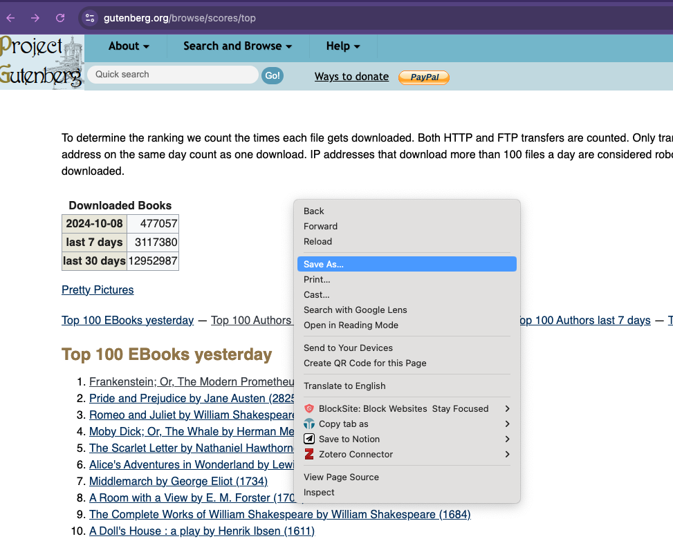

Now we can try scraping the page!

```python
from bs4 import BeautifulSoup
soup = BeautifulSoup(open("top_100_ebooks.html"), features="html.parser")

print(soup.prettify())
```

You can see we now have the full html page in all it's weirdly organized HTML glory!

While it's great to be able to just see the HTML, usually we are scraping to structured HTML data and turn it into a structured data format like a CSV or JSON file. So let's try and get the titles of the top 100 eBooks.

First, let's take a look at the structure of the HTML document. We can use the inspect feature in your browser to do this.

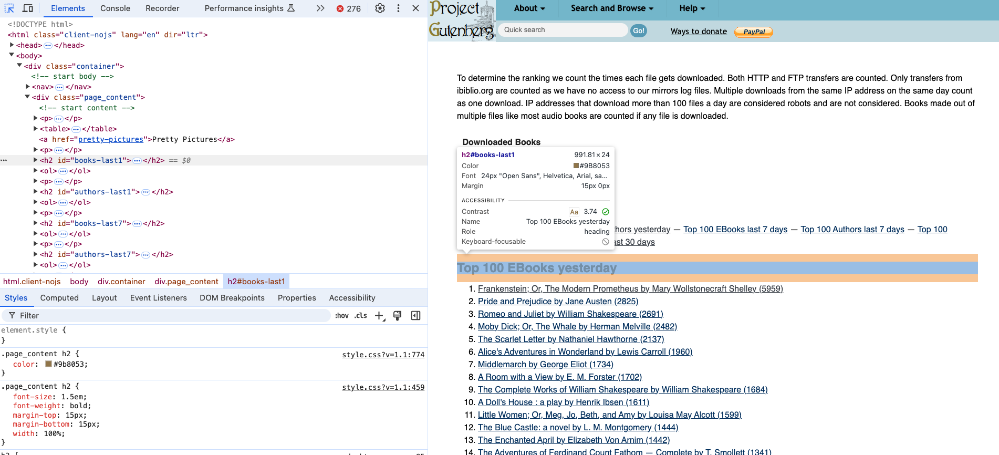

If we click the small arrow icon in our inspector, we can start to select relevant HTML elements. We can see that the `Top 100 EBooks yesterday` is an `h2` tag. After our readings about bestsellers and top of TikTok, we can imagine that scraping this list of books might be useful to researchers interested in what people are reading on *Project Gutenberg*.


If we select the titles, we can see that they are nested in an `ol` tag and then each title is in a `li` tag. So we can use the `find_all()` method to get all the `li` tags in the document and then use the `get_text()` method to get the text of each `li` tag.

```python
titles = soup.find_all('li')
for title in titles:
	print(title.get_text())
```

However, you'll notice if we are running this code that we will get **all** the links on the page, not just the titles. This is because the `find_all()` method is searching the whole document and not just the `ol` tag. So we need to be more specific in our search.

#### Quick In-Class Exercise

In your `first_web_scraping.py` file, try to modify the code so that it only prints the titles of the `Top 100 EBooks yesterday` section. To do this, you'll need to access the correct tag for `Top 100 EBooks yesterday` and then use `BeautifulSoup` to navigate to the correct `ol` tag. Finally, we want to print just the title of each book. To help you I would recommend taking a look at the following functions in the `BeautifulSoup` documentation:

- `find_next()` [https://beautiful-soup-4.readthedocs.io/en/latest/index.html#find-all-next-and-find-next](https://beautiful-soup-4.readthedocs.io/en/latest/index.html#find-all-next-and-find-next){target="_blank"}
- `get_text()` [https://beautiful-soup-4.readthedocs.io/en/latest/index.html#get-text](https://beautiful-soup-4.readthedocs.io/en/latest/index.html#get-text){target="_blank"}

However, you are welcome to solve this problem in any way you want!

### Requesting and Scraping Web Pages

We are now officially scraping a web page 🥳!! But what if we wanted to scrape more than one? Saving each manually would get tiring really quickly!

Let's try taking our updated code but rather than working with the saved version of the web page, let's try to get the web page programmatically. To do this, we need to use the `requests` library to get the web page. We already installed requests initially so now we need to import it into our `first_web_scraping.py` file.

```python
from bs4 import BeautifulSoup
import requests
```

Let's also take a look at the documentation for the `requests` library [https://requests.readthedocs.io/en/latest/](https://requests.readthedocs.io/en/latest/){target="_blank"}.

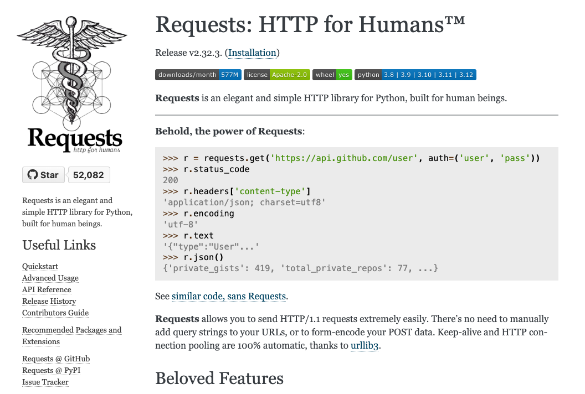

You'll notice the tag line for the library is "HTTP for Humans" which is a great way to think about it. The `requests` library is a library that allows us to send HTTP requests to web pages as if we were a web browser. As you remember from our [lesson on the web](../introducing-defining-cad/08-intro-web){target="_blank"}, when you go to a URL in your browser, your browser sends an HTTP request to the server and the server sends back an HTTP response. The `requests` library allows us to do the same thing in Python.

If we go to the `Quickstart` page [https://requests.readthedocs.io/en/stable/user/quickstart/](https://requests.readthedocs.io/en/stable/user/quickstart/){target="_blank"}, we can see how we not only import the library but also how we can use it.

For example, the core method in the `requests` library is the `get()` method, which is used to get a web page. The `get()` method returns a `Response` object, which has a `status_code` attribute that contains the status code of the request and a `headers` attribute that contains the headers of the request. Let's try it with our `Project Gutenberg` page.

```python
response = requests.get("https://www.gutenberg.org/browse/scores/top")
print("Status code:", response.status_code)
print("Headers:",response.headers)
```

We should see the following output:

```bash
Status code: 200
Header: {'date': 'Wed, 06 Oct 2021 17:00:01 GMT', 'server': 'Apache', 'content-location': 'top.php', 'vary': 'negotiate,Accept-Encoding', 'tcn': 'choice', 'content-encoding': 'gzip', 'content-length': '11521', 'x-backend': 'gutenweb5', 'content-type': 'text/html; charset=UTF-8'}
```

The `status_code` attribute contains the status code of the request and the `headers` attribute contains the headers of the request. The status code `200` means that the request was successful and the headers contain information about the request. If you don't get a `200` you can refresh your knowledge of the [other status codes in our lesson on the web](../introducing-defining-cad/08-intro-web#what-is-http){target="_blank"} but it usually means that either:

- you don't have access to the web page (so a status code of `403` or `404`)
- that there's an error on the server (so a status code of `500`)
- that the page doesn't exist (so a status code of `404`)
- Or there's an error with your internet connection.

Now that we have the `Response` object, we can use the `text` attribute to get the HTML of the page. Let's try it out.

```python
soup = BeautifulSoup(response.text, "html.parser")
print(soup.prettify())
```

We should see the HTML of the same page we downloaded printed out. This is great because it means we can now scrape any web page we want, not just the ones we have saved locally.

So returning to our previous our code, we can now use the `requests` library to get the web page and the `text` attribute of the `Response` object to get the HTML of the page.

```python
from bs4 import BeautifulSoup
import requests

response = requests.get("https://www.gutenberg.org/browse/scores/top")
soup = BeautifulSoup(response.text, "html.parser")
top_100_ebooks = soup.find(id="books-last1")
list_of_books = top_100_ebooks.find_next('ol').find_all('li')
for book in list_of_books:
	print(book.get_text())
```

Now that our code is working, we can start to consider what data we would actually want and how to structure it.

So far, we are only getting the `Top 100 EBooks Yesterday` but there's a number of top lists that we could scrape, including authors. So we could expand our code to get all top lists from this page and then store it in some sort of data structure, like a list of dictionaries.

```python
from bs4 import BeautifulSoup
import requests

response = requests.get("https://www.gutenberg.org/browse/scores/top")
soup = BeautifulSoup(response.text, "html.parser")
top_lists = soup.find_all("h2")

data = []
for top_list in top_lists:
	top_list_name = top_list.get_text()
	top_list_items = top_list.find_next('ol').find_all('li')
	for item in top_list_items:
		data.append({"list": top_list_name, "title": item.get_text()})
```

Now since we are getting both books and authors, let's create two separate lists of dictionaries, one for books and one for authors.

```python
from bs4 import BeautifulSoup
import requests

response = requests.get("https://www.gutenberg.org/browse/scores/top")
soup = BeautifulSoup(response.text, "html.parser")
top_lists = soup.find_all("h2")

books = []
authors = []

for top_list in top_lists:
	top_list_name = top_list.get_text()
	top_list_items = top_list.find_next('ol').find_all('li')
	for item in top_list_items:
		if "EBooks" in top_list_name:
			books.append({"list": top_list_name, "title": item.get_text()})
		else:
			authors.append({"list": top_list_name, "author": item.get_text()})
```

Finally, so far we are just saving the names of items but we could also save the links to the items. We could do this by getting the `href` attribute of the `a` tag.

```python
from bs4 import BeautifulSoup
import requests

response = requests.get("https://www.gutenberg.org/browse/scores/top")
soup = BeautifulSoup(response.text, "html.parser")
top_lists = soup.find_all("h2")

books = []
authors = []

for top_list in top_lists:
	top_list_name = top_list.get_text()
	top_list_items = top_list.find_next('ol').find_all('li')
	for item in top_list_items:
		if "EBooks" in top_list_name:
			books.append({"top_list": top_list_name, "book_title": item.get_text(), "book_link": item.find('a').get('href')})
		else:
			authors.append({"top_list": top_list_name, "author_name": item.get_text(), "author_link": item.find('a').get('href')})
```

Now we just need to save the data to a file. We could either create text files, but in this case it might be easier to create a csv file. To do that we would need to use the `csv` library, which is part of the Python Standard Library. We would also need to use the `open()` method to open a file and the `write()` method to write to the file. We would also need to use the `writerow()` method to write a row to the file.

```python
import csv

with open('top_100_ebooks.csv', 'w') as file:
	writer = csv.writer(file)
	# Write the headers
	writer.writerow(['top_list', 'book_title', 'book_link'])
	for book in books:
		writer.writerow([book['top_list'], book['book_title'], book['book_link']])

with open('top_100_authors.csv', 'w') as file:
	writer = csv.writer(file)
	# Write the headers
	writer.writerow(['top_list', 'author_name', 'author_link'])
	for author in authors:
		writer.writerow([author['top_list'], author['author_name'], author['author_link']])
```

You'll notice that I am using the `with` statement to open the file. This is a context manager that automatically closes the file when the block of code is done. This is a good practice because it ensures that the file is closed properly and that there are no issues with the file. Furthermore, I'm making the column headers the first row of the csv file and using lowercase and underscores in the names. This is a good practice because it makes it easier to read the file later on and to work with the data.

Now that we have links to other pages, we could also start using requests to get those pages and scrape them. Let's create a function to check if the web page exists and if we would be able to scrape it based on the status code.

```python
def check_page_exists(url):
	response = requests.get(url)
	if response.status_code == 200:
		return True
	else:
		return False
```

Now we can use this function to check if we can scrape the links to the books and authors.

```python
for book in books:
	book['webpage_exists'] = check_page_exists(book['book_link'])

for author in authors:
	author['webpage_exists'] = check_page_exists(author['author_link'])
```

You'll likely notice that we get a lot of errors when we run this code. Why is that?

Take a look at our links. You'll notice that the top book, *Frankenstein; Or, The Modern Prometheus* has a link of `/ebooks/84`. This is a relative link, which means that it's a link that is relative to the current page. This is different from an absolute link, which is a link that is absolute to the root of the website. So we need to convert the relative links to absolute links.

We can simply click on the link in the web page to see what the full URL is. In this case, the full URL is `https://www.gutenberg.org/ebooks/84`. So we can use this information to convert the relative links to absolute links.

```python
def check_gutenberg_page_exists(url):
	gutenberg_url = "https://www.gutenberg.org" + url
	response = requests.get(gutenberg_url)
	if response.status_code == 200:
		return True
	else:
		return False
```

Now when we rerun our code, we should see that we are able to get the status code for each of the links!

Many web pages use relative links, so this is a common issue when scraping web pages and it's why it's important to always inspect and explore the HTML of the web page you are scraping.

### Advanced Web Scraping

So far we have been scraping web pages that are relatively simple, but what if we wanted to scrape a more complex web page? For example, what if we wanted to scrape a fandom wiki page? These pages are often more complex because they have more complex HTML and CSS. Let's try scraping the *Lord of the Rings* wiki page [https://lotr.fandom.com/wiki/Main_Page](https://lotr.fandom.com/wiki/Main_Page){target="_blank"}.


For those unfamiliar, fandom wikis are fan-created wikis that are often used to document popular culture. I haven't been able to find a list of all of these wikis, but there is a wikipedia page listing some of the most prominent ones [https://en.wikipedia.org/wiki/List_of_fan_wikis](https://en.wikipedia.org/wiki/List_of_fan_wikis){target="_blank"}. You'll notice that many of these wikis started in the mid-2000s and have grown in popularity since then. For example, there's actually a wikipedia page for the *Star Wars* wiki [https://en.wikipedia.org/wiki/Wookieepedia](https://en.wikipedia.org/wiki/Wookieepedia){target="_blank"}, which is called *Wookieepedia*.

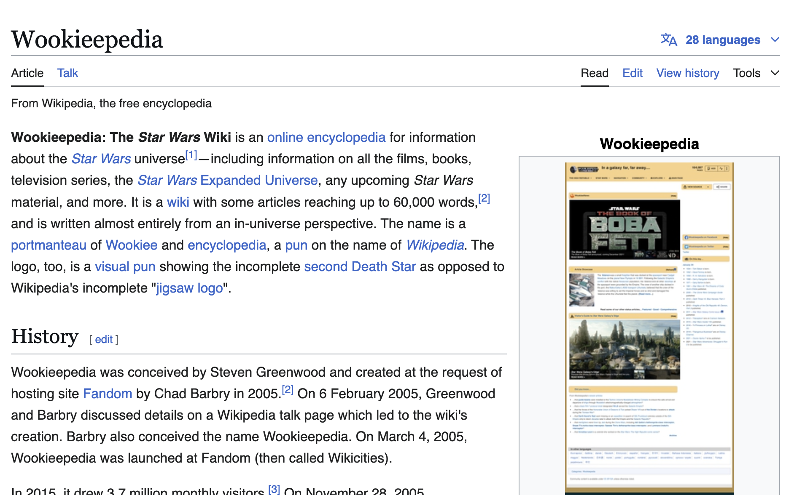

This page details some of the history and statistics of *Wookieepedia*, which started in 2005. You'll notice that it has over 150,000 articles and over 1,000,000 pages. This is a huge amount of information and this wiki is far larger than the *Lord of the Rings* wiki.

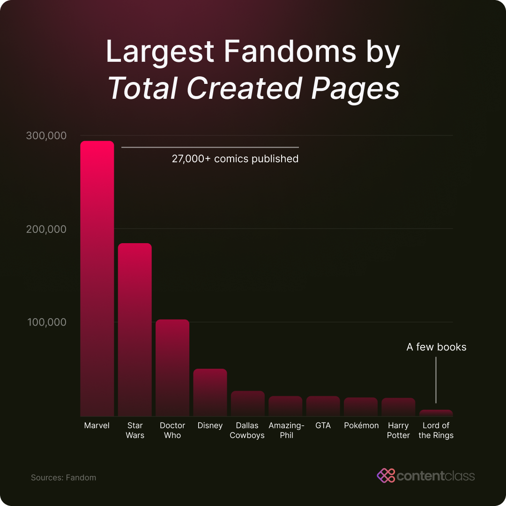

Before we start scraping this fandom wiki though, we need to check for the terms of service or user policies of the website. So far I've only been able to find the following page on the wiki [https://lotr.fandom.com/wiki/LOTR:Current_policies](https://lotr.fandom.com/wiki/LOTR:Current_policies){target="_blank"} which details the current policies of the wiki and that most of the content is under a `CC-BY-SA` license. There is a terms of service for Fandom wikis [https://www.fandom.com/terms-of-use](https://www.fandom.com/terms-of-use){target="_blank"} but that also doesn't have clear information about scraping. So the final place we can check is the `robots.txt` file.

We can access this by going to the root of the website and adding `/robots.txt` to the end of the URL. For example, the `robots.txt` file for the *Lord of the Rings* wiki is [https://lotr.fandom.com/robots.txt](https://lotr.fandom.com/robots.txt){target="_blank"}. This file contains the rules for web crawlers and scrapers and tells them what they can and can't scrape.

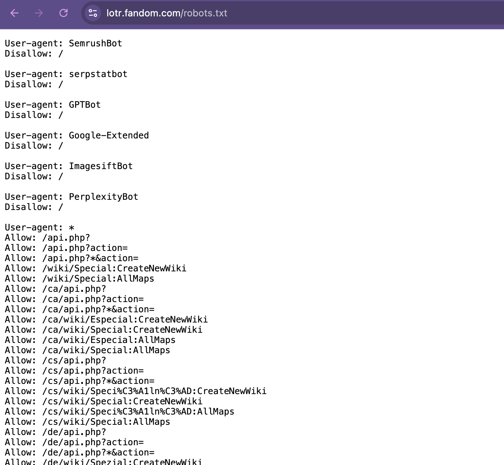

I won't post the full file here since it's quite long, but we can work through the main relevant sections:

1. The `User-agent` section tells us what web crawlers and scrapers are allowed to scrape the website. For example, the `User-agent: *` section tells us that all web crawlers and scrapers are allowed to scrape the website. This is the most common section and means that the website is open to scraping.
2. Within the `User-agent` section, we can see there is a `Disallow` section tells us what web crawlers and scrapers are not allowed to scrape the website. For example, the `Disallow: /wiki/Special:` section tells us that web crawlers and scrapers are not allowed to scrape the `Special:` pages on the website. You'll also notice that some bots are explicitly disallowed from scraping the website, like SemrushBot or GPTBot.
3. Similarly, the `Allow` section tells us what web crawlers and scrapers are allowed to scrape the website. For example, the `Allow: /wiki/*` section tells us that web crawlers and scrapers are allowed to scrape the `wiki` pages on the website. We can also see the `Allow: /api.php?`, which allows crawlers to access certain API endpoints, which are often set up for structured data access, making them a good option for ethical scraping. This section is less common than the `Disallow` section but is used to allow web crawlers and scrapers to scrape certain pages on the website.
4. The `Noindex` section tells us what web crawlers and scrapers are not allowed to index. For example, the `Noindex: /wiki/Special:` section tells us that web crawlers and scrapers are not allowed to index the `Special:` pages on the website. Although this doesn’t restrict access, it signals pages that the site prefers to keep less visible. Scraping these pages could go against the site’s intentions for privacy or low visibility.
5. Finally, the `Sitemap` section tells us where the sitemap for the website is. For example, the `Sitemap: https://lotr.fandom.com/sitemap-newsitemapxml-index.xml` section tells us that the sitemap for the website is at `https://lotr.fandom.com/sitemap-newsitemapxml-index.xml`. This is less common than the other sections but is used to help web crawlers and scrapers find the sitemap for the website.

One additional item you might see is a `Crawl-delay` section tells us how long web crawlers and scrapers should wait between requests. For example, if a `robots.txt` says `Crawl-delay: 5` that tells us that web crawlers and scrapers should wait 5 seconds between requests. However, in our case the `robots.txt` file for the *Lord of the Rings* wiki doesn't have this section.

Looking through this `robots.txt` tells us that we can scrape many of the pages on the *Lord of the Rings* wiki, but we should be careful to avoid the `Special:` pages and to respect the `Noindex` sections. This is a good practice to follow when scraping websites and it's always a good idea to check the `robots.txt` file before scraping a website.

So let's try scraping the *Lord of the Rings* wiki page. We can start by getting the web page using the `requests` library and then using the `BeautifulSoup` library to parse the HTML.

```python
response = requests.get("https://lotr.fandom.com/wiki/Main_Page")
print(response.status_code)
soup = BeautifulSoup(response.text, "html.parser")
```

### Bot Protection and the Limits of Scraping

Here is where our lesson runs into the actual state of the web in 2026. If you run the code above, you will not get a `200`. You will get this:

```bash
403
```

And if you print the first few hundred characters of `response.text`, you'll see something like:

```html
<!DOCTYPE html><html lang="en-US"><head><title>Just a moment...</title>
```

**The answer: Bot Protection.**

Many modern websites sit behind automated bot detection services like **Cloudflare**, which protect against unwanted scraping, denial-of-service attacks, and — increasingly — mass harvesting by AI training crawlers. Cloudflare inspects incoming requests and blocks the ones that look automated. When you visit the site in your browser, your browser presents a whole bundle of evidence that it is a browser: a `User-Agent` string, a particular ordering of headers, TLS fingerprints, the ability to execute JavaScript and store cookies. When you call `requests.get()`, you present almost none of that, and you announce yourself as `python-requests/2.x.x` besides. The `Just a moment...` page is Cloudflare's JavaScript challenge, which `requests` cannot solve because `requests` does not run JavaScript.

Notice the genuinely interesting thing here. We just read the `robots.txt` file together, and it *told us we could scrape* `/wiki/*`. But the site's edge network blocks us anyway. **The stated policy and the enforced policy do not match.** `robots.txt` is a request written for well-behaved crawlers; Cloudflare is an enforcement mechanism that does not consult it. This gap between what a site says and what a site does is worth sitting with — it is exactly the sort of thing that makes web data hard to reason about ethically, and it is a fairly recent development driven by the enormous volume of AI scraping since 2023.

::: {.callout-warning}
## A Note on `cloudscraper` (and Why It No Longer Works)

If you search for how to get around this, you will very quickly find the `cloudscraper` library [https://github.com/VeNoMouS/cloudscraper](https://github.com/VeNoMouS/cloudscraper){target="_blank"}, which for several years was the standard answer. It worked by imitating a browser closely enough to pass Cloudflare's challenge. Earlier versions of this very lesson taught it.

**It does not work anymore.** As of this writing, running it against a Fandom wiki returns exactly the same 403:

```python
import cloudscraper

scraper = cloudscraper.create_scraper()
response = scraper.get("https://lotr.fandom.com/wiki/Main_Page")
print(response.status_code)   # 403
print(response.text[:60])     # <!DOCTYPE html><html lang="en-US"><head><title>Just a moment
```

I am leaving this here rather than quietly deleting it, because the failure is the lesson. Bot detection is an **arms race**: the site improves its detection, the workaround library improves its imitation, the site improves again. `cloudscraper` lost. Whatever library replaces it will also eventually lose, because one side is a volunteer open-source project and the other is a company with a large security budget.

This matters for you as a researcher in two ways. **Practically**, any research pipeline built on evasion is a pipeline that will break, usually silently and usually right when you need it. **Ethically**, once a site has put up an active block, you can no longer tell yourself that scraping it is unobjectionable — you have been told no in the clearest terms a server has available. Writing code specifically to defeat that block is a meaningfully different act from writing code to read a page that was handed to you freely.

So when you hit a wall like this, you have three legitimate options, and "try harder to look like a browser" is not among them:

1. **Respect the block** and find a different source for your question.
2. **Choose a site that permits scraping** — plenty still do, as we're about to see.
3. **Use the site's sanctioned API**, if it offers one. This is usually the best answer, because an API is the site explicitly telling you *how* it wants to be read programmatically.

As it happens, Fandom does offer option 3, and we will take it up properly in [our next lesson on APIs](06-getting-data-apis.qmd){target="_blank"}. For the rest of *this* lesson, we're going to take option 2.
:::

### Finding a Wiki That Welcomes Us

The good news is that not every fan wiki is behind Cloudflare. In fact, one of the more interesting developments in fandom over the last several years has been communities **leaving** Fandom.com — frustrated by its advertising, autoplaying video, and control over community-written content — and re-establishing their wikis on independent infrastructure. The Zelda Wiki left in 2022; the Minecraft Wiki left in 2023; many others moved to hosts like [wiki.gg](https://www.wiki.gg/wikis){target="_blank"} or the nonprofit [Miraheze](https://miraheze.org/){target="_blank"}. This is itself a nice object lesson in who owns fan labor, and it is very much the kind of question this course is about.

For our *Lord of the Rings* example, there is a long-running independent alternative: **Tolkien Gateway** [https://tolkiengateway.net](https://tolkiengateway.net){target="_blank"}, a community-run Tolkien wiki that has been going since 2005.

Let's start where we always start — the `robots.txt` file [https://tolkiengateway.net/robots.txt](https://tolkiengateway.net/robots.txt){target="_blank"}:

```
#  _____     _ _    _               ____       _
# |_   _|__ | | | _(_) ___ _ __    / ___| __ _| |_ _____      ____ _ _   _
#   | |/ _ \| | |/ / |/ _ \ '_ \  | |  _ / _` | __/ _ \ \ /\ / / _` | | | |
#   | | (_) | |   <| |  __/ | | | | |_| | (_| | ||  __/\ V  V / (_| | |_| |
#   |_|\___/|_|_|\_\_|\___|_| |_|  \____|\__,_|\__\___| \_/\_/ \__,_|\__, |
#
# Are you a human? Maybe you want to help with the wiki?
#
# Please note: There are a lot of pages on this site, and there are
# some misbehaved spiders out there that go _way_ too fast. If you're
# irresponsible, your access to the site may be blocked.
```

Compare the tone of this to the Fandom file. This one is addressed to a person. It assumes you might be a human being who wants to help, and its one substantive request is simply: *don't go too fast*. The rest of the file blocks specific badly-behaved commercial crawlers by name (`MJ12bot`, `HTTrack`, `WebZIP`) — but there is no blanket ban on the sort of small, slow, scholarly scraping we want to do.

This is about as clear an invitation as you will find, and it comes with an obligation attached. **We are going to add a `time.sleep()` between our requests, and this time it is not decorative** — the site has explicitly asked us to be slow, and if we aren't, we get blocked and we deserve it.

We should also identify ourselves honestly. Rather than pretending to be a browser, we'll send a `User-Agent` that says who we are and how to reach us:

```python
import requests
from bs4 import BeautifulSoup

HEADERS = {"User-Agent": "is310-course-scraper/1.0 (student project; netid@illinois.edu)"}

response = requests.get("https://tolkiengateway.net/wiki/Main_Page", headers=HEADERS)
print(response.status_code)
soup = BeautifulSoup(response.text, "html.parser")
```

This should give us a `200`. Notice the difference in what we just did: we did not disguise ourselves to slip past a filter, we introduced ourselves to a site that was willing to be read. A site administrator looking at their logs can see exactly who we are and email us if we become a problem. That is what good-faith scraping looks like.

Now since this wiki is huge, we need to narrow our focus to a particular goal or question. Tolkien Gateway has tens of thousands of pages, so we need an actual research question rather than a vague intention to "get the data."

Here is one. There's been a recent adaptation of *The Lord of the Rings* by Amazon called *The Rings of Power*, and one of the persistent arguments about that show — in fan communities, in reviews, in a great deal of very heated internet discourse — is about **fidelity to the source material**. Some characters in the show come straight out of Tolkien's published writing. Others were invented for television. That is an argument we can actually put numbers on.

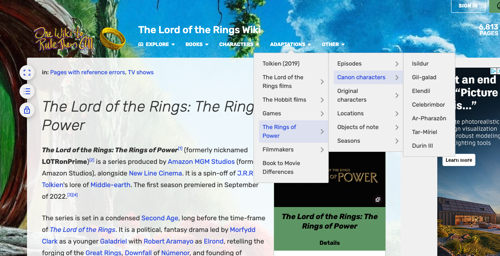

Specifically: a wiki article about a character drawn from Tolkien's books will cite those books. An article about a character invented for the show has very little to cite. So **the number of references on a character's wiki page is a rough measure of how much published text stands behind that character.** That gives us something concrete to scrape.

#### Finding the Characters

Tolkien Gateway organizes its pages with MediaWiki categories, and it has one for exactly what we want: [https://tolkiengateway.net/wiki/Category:The_Rings_of_Power_(TV_series)_characters](https://tolkiengateway.net/wiki/Category:The_Rings_of_Power_(TV_series){target="_blank"}_characters).

If you open this page in your browser and use the inspector, you'll see that MediaWiki uses a consistent structure for category listings: the members live inside a `div` with the id `mw-pages`, grouped into `div` elements with the class `mw-category-group`, and each individual page is a link inside a list item.

This is a good moment to notice something. The Fandom wiki used classes like `category-page__member-link`, which are specific to Fandom's own theme. Tolkien Gateway uses `mw-pages` and `mw-category-group`, which are **standard MediaWiki markup**. Because so many wikis run on MediaWiki, learning this one structure means you can scrape thousands of different wikis with nearly identical code. Recognizing which parts of a page's HTML are generic and which are site-specific is a large part of getting good at scraping.

We can use a CSS selector to pull out those links. We've been using `find_all()` so far, but `BeautifulSoup` also gives us `select()`, which takes a CSS selector like the ones you wrote in your stylesheets — and for nested structures like this one it is much more concise:

```python
import requests
from bs4 import BeautifulSoup

BASE = "https://tolkiengateway.net"
HEADERS = {"User-Agent": "is310-course-scraper/1.0 (student project; netid@illinois.edu)"}

response = requests.get(f"{BASE}/wiki/Category:The_Rings_of_Power_(TV_series)_characters", headers=HEADERS)
soup = BeautifulSoup(response.text, "html.parser")

characters = soup.select("#mw-pages .mw-category-group li a")

print(f"Found {len(characters)} characters")
for character in characters:
	print(character.get_text())
```

The selector `#mw-pages .mw-category-group li a` reads as: "find the element with id `mw-pages`, then inside it find elements with class `mw-category-group`, then inside those find `li` elements, then inside those find `a` elements." Remember from CSS that `#` means id and `.` means class.

This should print 51 characters:

```bash
Found 51 characters
Abigail
Adar (The Rings of Power)
Arondir
Astrid (The Rings of Power)
Berek
Brandyfoot Family
Bronwyn
...
```

Now, look carefully at that list, because it is telling us something we didn't ask for. There's no Galadriel here. No Elrond, no Sauron. This category contains *only* the characters **invented for the show** — the ones that exist nowhere else, and therefore need a Rings of Power page on a Tolkien wiki. Characters from the books already have pages, filed under their own categories.

That is a genuinely useful accident, and it is worth pausing on. **The category system is itself an argument.** Someone in this community made an editorial decision about what counts as a Rings of Power character versus a Tolkien character, and our data inherits that decision whether we notice it or not. This happens constantly in humanities data work: the categories you scrape were made by people, for their own purposes, and they encode a point of view. Part of your job as a researcher is to notice this rather than treat the categories as neutral facts.

For our comparison, it means we get the "invented" group for free, and we'll have to assemble the "from the books" group ourselves.

#### Scraping an Individual Character Page

Now let's write a function to pull the details from a single character page. Let's look at [https://tolkiengateway.net/wiki/Galadriel](https://tolkiengateway.net/wiki/Galadriel){target="_blank"} in the inspector.

Two things are useful to us. The references are in an ordered list with the class `references` at the bottom of the page, and the categories the page belongs to are in a `div` with the id `mw-normal-catlinks`.

```python
import time

def get_soup(url):
	response = requests.get(url, headers=HEADERS, timeout=10)
	if response.status_code != 200:
		print(f"Failed to get {url}: {response.status_code}")
		return None
	time.sleep(1)  # the robots.txt asked us to be slow, so we are
	return BeautifulSoup(response.text, "html.parser")

def get_character_details(character_link):
	soup = get_soup(BASE + character_link)
	if soup is None:
		return {"reference_count": 0, "categories": [], "category_count": 0}
	references = soup.select("ol.references li")
	categories = [category.get_text() for category in soup.select("#mw-normal-catlinks li a")]
	return {
		"reference_count": len(references),
		"categories": categories,
		"category_count": len(categories)
	}

print(get_character_details("/wiki/Galadriel"))
```

Notice a few things about this function. It returns a dictionary rather than printing, so the calling code decides what to do with the data. It handles failure by returning an empty result instead of crashing, so one bad page doesn't kill an hour-long scrape. And the `time.sleep(1)` lives inside `get_soup()`, which means **every** request we make is automatically polite — we cannot forget to slow down, because the slowdown is built into the only function that talks to the network.

Running this on Galadriel gives us `'reference_count': 85`. Eighty-five citations, on one character.

#### Comparing the Two Groups

Now we can put the comparison together. We need the invented characters (from the category) and the book characters (which we'll list ourselves, drawn from the show's principal cast):

```python
def fetch_category_characters(category, source):
	soup = get_soup(f"{BASE}/wiki/{category.replace(' ', '_')}")
	if soup is None:
		return []
	characters_data = []
	for character in soup.select("#mw-pages .mw-category-group li a"):
		character_data = {
			"character": character.get_text(),
			"character_link": character.get("href"),
			"source": source
		}
		character_data.update(get_character_details(character.get("href")))
		characters_data.append(character_data)
	return characters_data

def fetch_named_characters(names, source):
	characters_data = []
	for name in names:
		character_link = "/wiki/" + name.replace(" ", "_")
		character_data = {"character": name, "character_link": character_link, "source": source}
		character_data.update(get_character_details(character_link))
		characters_data.append(character_data)
	return characters_data

CANON_CHARACTERS = ["Galadriel", "Elrond", "Sauron", "Celebrimbor", "Gil-galad",
                    "Isildur", "Elendil", "Tar-Míriel", "Durin IV", "Círdan", "Ar-Pharazôn"]

invented_characters = fetch_category_characters("Category:The Rings of Power (TV series) characters", "Created for the show")
canon_characters = fetch_named_characters(CANON_CHARACTERS, "From Tolkien's writings")
```

**This will take a few minutes to run**, because we are making 62 requests with a one-second pause between each. That is the correct behavior. If it finished instantly, we would be hammering a volunteer-run wiki.

Now let's sort everything by reference count and display it with the `Rich` library from our last assignment:

```python
from rich.console import Console
from rich.table import Table

console = Console()

all_characters = canon_characters + invented_characters
all_characters.sort(key=lambda character: character["reference_count"], reverse=True)

table = Table(title="Textual Evidence Behind Rings of Power Characters")
table.add_column("Character", style="cyan")
table.add_column("References", style="magenta")
table.add_column("Categories", style="yellow")
table.add_column("Source", style="green")

for character in all_characters[:12]:
	table.add_row(character["character"], str(character["reference_count"]),
	              str(character["category_count"]), character["source"])

console.print(table)
```

Which gives us:

```bash
         Textual Evidence Behind Rings of Power Characters
┏━━━━━━━━━━━━━┳━━━━━━━━━━━━┳━━━━━━━━━━━━┳━━━━━━━━━━━━━━━━━━━━━━━━━┓
┃ Character   ┃ References ┃ Categories ┃ Source                  ┃
┡━━━━━━━━━━━━━╇━━━━━━━━━━━━╇━━━━━━━━━━━━╇━━━━━━━━━━━━━━━━━━━━━━━━━┩
│ Galadriel   │ 85         │ 12         │ From Tolkien's writings │
│ Sauron      │ 80         │ 16         │ From Tolkien's writings │
│ Celebrimbor │ 40         │ 13         │ From Tolkien's writings │
│ Círdan      │ 37         │ 16         │ From Tolkien's writings │
│ Gil-galad   │ 36         │ 12         │ From Tolkien's writings │
│ Elrond      │ 35         │ 15         │ From Tolkien's writings │
│ Ar-Pharazôn │ 17         │ 8          │ From Tolkien's writings │
│ Elendil     │ 16         │ 13         │ From Tolkien's writings │
│ Isildur     │ 14         │ 12         │ From Tolkien's writings │
│ Tar-Míriel  │ 10         │ 5          │ From Tolkien's writings │
│ Durin IV    │ 4          │ 8          │ From Tolkien's writings │
│ Disa        │ 4          │ 2          │ Created for the show    │
└─────────────┴────────────┴────────────┴─────────────────────────┘
```

And if we compute the averages:

```python
for group, label in [(canon_characters, "From Tolkien"), (invented_characters, "Created for show")]:
	average = sum(character["reference_count"] for character in group) / len(group)
	print(f"{label:18} n={len(group):3}  average references={average:.1f}")
```

```bash
From Tolkien       n= 11  average references=34.0
Created for show   n= 51  average references=1.3
```

This is a real result, and it's worth thinking about what it does and does not tell you. Every single character from Tolkien's writing outranks every single invented character. The gap is not subtle — it's roughly twenty-six to one. The show draws its named leads from a small pool of heavily-documented figures and then invents a much larger supporting cast around them, which is a defensible way to adapt a body of work that is mostly genealogy and chronicle rather than scene and dialogue.

But notice what we have **actually** measured. We have not measured how much Tolkien wrote about Galadriel. We have measured **how many citations Tolkien Gateway's editors added to a wiki page about Galadriel.** Those are different things. A popular character attracts more editors, and more editors add more citations. Our number is entangled with fan attention in ways we cannot separate from this data alone. Durin IV scores a 4 despite being drawn from the appendices, because his page is short — not because Tolkien was silent about the line of Durin.

This is the single most important habit to carry out of this lesson: **be precise about what your scraped numbers are counting.** It is rarely the thing you actually want to know. It is usually a proxy, and the distance between the proxy and the concept is where research arguments live.

#### Saving Our Data

Finally, let's save this to a CSV so we can use it later:

```python
import csv

with open("rings_of_power_characters.csv", "w", newline="") as file:
	writer = csv.writer(file)
	writer.writerow(["character", "character_link", "source", "reference_count", "category_count"])
	for character in all_characters:
		writer.writerow([
			character["character"],
			character["character_link"],
			character["source"],
			character["reference_count"],
			character["category_count"]
		])

print(f"Wrote {len(all_characters)} rows")
```

Note the `newline=""` argument in `open()`. This is a small detail that the `csv` documentation recommends on all platforms — without it, you can end up with blank rows between every line of your file on Windows.

We now have a full script that imports its libraries at the top, defines small functions that each do one job, respects the site's stated wishes about crawl speed, identifies itself honestly, handles errors without crashing, and produces both a readable table and a reusable data file. That is a realistic shape for a research scraper.

## Beyond BeautifulSoup and Requests

While `BeautifulSoup` and `requests` work well for most web scraping tasks, you may encounter websites that require more sophisticated tools. Two important libraries to be aware of are:

**Selenium** ([https://selenium-python.readthedocs.io/](https://selenium-python.readthedocs.io/){target="_blank"}) is a browser automation tool that controls a real web browser programmatically. Use Selenium when you need to scrape websites that render content dynamically with JavaScript, since BeautifulSoup only parses static HTML.

**Scrapy** ([https://scrapy.org/](https://scrapy.org/){target="_blank"}) is a full-featured web scraping framework designed for large-scale, production-grade projects. It includes built-in support for managing requests, following links, storing data, and more. Use Scrapy when you're building a sophisticated scraping pipeline that needs to handle many pages efficiently.

**When to use each:**

- **BeautifulSoup + requests**: Static websites, quick scripts, learning web scraping (what we've done here)
- **Selenium**: Websites requiring JavaScript execution or complex user interactions
- **Scrapy**: Large-scale scraping projects with complex requirements
- **The site's API, if it has one**: almost always the best option, and the subject of [our next lesson](06-getting-data-apis.qmd){target="_blank"}

Each approach has tradeoffs in complexity, speed, and resource use. For the tasks you'll encounter in this course, BeautifulSoup with error handling is typically the right choice.

One caution worth repeating: Selenium drives a real browser, which means it *can* get past some bot protection. That does not mean it should. The ethical question — has this site told me not to do this? — is separate from the technical question of whether you are able to, and reaching for a heavier tool because a lighter one got blocked is usually a sign you should be looking for a different source instead.

## Community Wikis and Web Scraping Homework

Now that you have learned the basics of web scraping, it's time to try it out for your next homework assignment. In your `is310-coding-assignments`, you should have already created a new directory called `web-scraping` and a new file called `first_web_scraping.py`. You should now create a new file called `wiki_scraping.py` in the `web-scraping` directory.

In this assignment, you will select a **community-run wiki** that interests you and scrape it to answer a question of your own. Because Fandom.com wikis are now behind Cloudflare, we will be working with independent wikis instead — which, as we discussed, are often the more interesting sites anyway.

### Step 0: Verify the Site Will Actually Talk to You

**Do this before you plan anything else.** Bot protection is now common enough that you should confirm a site is reachable before you invest time in it:

```python
import requests

HEADERS = {"User-Agent": "is310-course-scraper/1.0 (student project; YOUR_NETID@illinois.edu)"}
response = requests.get("YOUR_URL_HERE", headers=HEADERS, timeout=10)

print(response.status_code)
print(response.text[:300])
```

You want a `200`, and you want the preview to look like the actual page. If you see `403`, or the text contains `Just a moment...` or `Enable JavaScript and cookies`, that site is blocking you — **pick a different one rather than trying to get around it.**

These wikis were all reachable when this lesson was written, and any of them is a fine choice:

| Wiki | URL |
|---|---|
| Tolkien Gateway | [tolkiengateway.net](https://tolkiengateway.net){target="_blank"} |
| Bulbapedia (Pokémon) | [bulbapedia.bulbagarden.net](https://bulbapedia.bulbagarden.net){target="_blank"} |
| Terraria Wiki | [terraria.wiki.gg](https://terraria.wiki.gg){target="_blank"} |
| Minecraft Wiki | [minecraft.wiki](https://minecraft.wiki){target="_blank"} |
| Fallout Wiki | [fallout.wiki](https://fallout.wiki){target="_blank"} |
| Baldur's Gate 3 Wiki | [bg3.wiki](https://bg3.wiki){target="_blank"} |
| Old School RuneScape Wiki | [oldschool.runescape.wiki](https://oldschool.runescape.wiki){target="_blank"} |

You are also very welcome to find your own — [wiki.gg](https://www.wiki.gg/wikis){target="_blank"} and [Miraheze](https://miraheze.org/){target="_blank"} host hundreds of independent wikis, and non-wiki sites like [Standard Ebooks](https://standardebooks.org){target="_blank"} and [Open Library](https://openlibrary.org){target="_blank"} are also open to scraping. Just run Step 0 first. If a site you really care about turns out to be blocked, that is a legitimate finding — write it up in your `README.md` and choose another.

### Requirements

- [ ] **Check the site's `robots.txt` file** and any terms of service or community policies. Include a link to the `robots.txt` in your `README.md`, and briefly note what it permits and forbids. If it specifies a `Crawl-delay`, honor it.
- [ ] **Explain your choice of wiki and your question** in your `README.md`. What are you scraping, and **why might this data be of interest or useful to researchers?** A question is better than a shopping list — "which characters have the most references" beats "all the character data."
- [ ] **Write your scraper** in `wiki_scraping.py` using `requests` and `BeautifulSoup`. Your script must:
	- send an honest `User-Agent` header that identifies you
	- include a `time.sleep()` between requests
	- check `response.status_code` and handle failures without crashing
	- scrape at least two levels — a list or category page, and then the individual pages it links to
- [ ] **Save your data** in an interoperable format (CSV or JSON) in your `web-scraping` directory.
- [ ] **Reflect on what you actually measured**, in a short paragraph in your `README.md`. As we saw with reference counts on Tolkien Gateway, the number you collected is usually a proxy for the thing you care about, not the thing itself. What is the gap between them in your case? What would someone be wrong to conclude from your data?

That last item is the one I care most about, so please don't skip it.

Once you have completed the assignment, you should **post a link to your folder** in our GitHub discussion [https://github.com/CultureAsData-UIUC/is310-spring-2026/discussions/7](https://github.com/CultureAsData-UIUC/is310-spring-2026/discussions/7){target="_blank"}.

---

[^1]: Crocker, Camille Fischer and Andrew. “Victory! Ruling in hiQ v. Linkedin Protects Scraping of Public Data.” *Electronic Frontier Foundation*, September 10, 2019. [https://www.eff.org/deeplinks/2019/09/victory-ruling-hiq-v-linkedin-protects-scraping-public-data](https://www.eff.org/deeplinks/2019/09/victory-ruling-hiq-v-linkedin-protects-scraping-public-data){target="_blank"}.
[^2]: Lomas, Natasha. “Social Media Giants Urged to Tackle Data-Scraping Privacy Risks.” *TechCrunch* (blog), August 24, 2023. [https://techcrunch.com/2023/08/24/data-scraping-privacy-risks-joint-statement/](https://techcrunch.com/2023/08/24/data-scraping-privacy-risks-joint-statement/){target="_blank"}.