::: {.callout-note}
⚡️ This lesson has been adapted from Melanie Walsh's chapter on Web Scraping in <i>Introduction to Cultural Analytics & Python</i> textbook <a target="_blank" href="https://melaniewalsh.github.io/Intro-Cultural-Analytics/04-Data-Collection/02-Web-Scraping-Part1.html">https://melaniewalsh.github.io/Intro-Cultural-Analytics/04-Data-Collection/02-Web-Scraping-Part1.html</a>. Many thanks to Melanie for sharing their materials!

Also the materials from our in-class scraping are available to download. Here is our <a target="_blank" href="../../assets/files/first_web_scraping.py" download>`first_web_scraper.py`</a>; our <a target="_blank" href="../../assets/files/hp_scraper.py" download>`hp_scraper.py`</a>; and the complete <a target="_blank" href="../../assets/files/tolkien_gateway_scraper.py" download>`tolkien_gateway_scraper.py`</a> that we build up over the second half of this lesson.
:::

Now that we have learned how to work with Python modules and read and write files, we can start to think about how to get data from the web. This is a very important skill for a digital humanist, as many of the sources we might want to work with are online.

## What Is Web Scraping and Why Is It Useful?

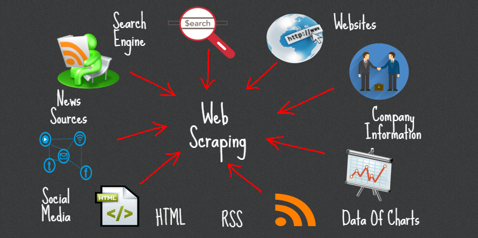

So far when it comes to working with the web, you have been creating your own HTML pages and hosting them via GitHub. But we can also use Python to interact with the web in a different way: by scraping data from web pages. The data we extract is exactly the same as what you have been writing, so elements like headers, paragraphs, and links, etc.

Web scraping can be incredibly useful considering how much data is available on the web and how little of it is often put into tabular format. For example, you might want to scrape a web archive to get data for a research project, or you might want to scrape a social media site to get access to data that isn't available through their API.

Web scraping is also what we use to preserve the web. Remember the Wayback Machine? That's a web archive that uses web scraping to save web pages. The way it works is that it uses a web crawler to find links to web pages and then it uses web scraping to save the content of those pages.


This method has also been used by scholars to do community-driven data preservation. For example, when Russia invaded Ukraine, a group of DH scholars and librarians founded the *Saving Ukrainian Cultural Heritage Online* (SUCHO) group and used web scraping to preserve the content of Ukrainian websites [https://www.sucho.org/](https://www.sucho.org/){target="_blank"} from being destroyed in the bombing.

### Is Web Scraping Legal or Ethical?

There is no general rule that anything publicly visible online is legal to scrape and reuse. In *hiQ Labs v. LinkedIn*, the Ninth Circuit held that accessing public LinkedIn profiles likely did not violate the Computer Fraud and Abuse Act's prohibition on access "without authorization," but that decision addressed one federal statute and one set of facts. Copyright, contracts, privacy law, state law, and restrictions on reuse may still apply.[^1] Outside the United States, different laws apply. Under the European Union's General Data Protection Regulation (GDPR), scraping that processes personal data requires a lawful basis and compliance with principles such as transparency, purpose limitation, and data minimization; the GDPR does not simply ban or permit scraping based on whether names or email addresses are public. The European Data Protection Board offers current guidance on these obligations [https://www.edpb.europa.eu/news/edpb-sheds-light-on-anonymisation-and-web-scraping-for-generative-ai-and-adopts-final-version_en](https://www.edpb.europa.eu/news/edpb-sheds-light-on-anonymisation-and-web-scraping-for-generative-ai-and-adopts-final-version_en){target="_blank"}. This lesson is an introduction to responsible research practice, not legal advice.

In terms of ethics, public availability is a starting point rather than automatic permission. Researchers should consider the site's terms, licenses, technical signals, community norms, server burden, the expectations of the people represented, and the possible harms of collecting or republishing the material. A site's `robots.txt` file communicates instructions to automated crawlers, but it is not a license, a contract, or a complete ethical framework. It tells us something important about a site's operational preferences, not everything we need to know about whether a project is responsible.


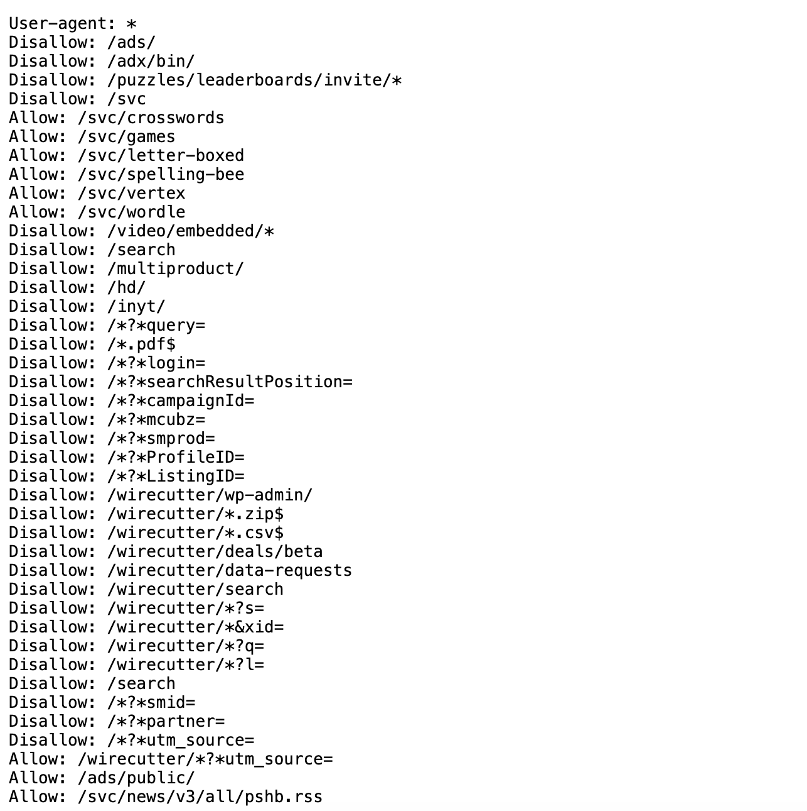

For example, the image above shows the *New York Times* `robots.txt` file [https://www.nytimes.com/robots.txt](https://www.nytimes.com/robots.txt){target="_blank"}. It lists paths that particular crawlers are asked not to access using the `Disallow` directive. You might also encounter a `Crawl-delay` directive asking crawlers to wait between requests. Ignoring these instructions can burden a site and may lead it to block your IP address, but following them does not override terms of service, copyright, privacy, or other obligations.

What to collect and how to collect it is a big part of the ethics of web scraping. Melanie Walsh has a great overview of some of these tradeoffs:

> Just because something is legal or gets approved by an IRB does not mean it is ethical. Collecting, sharing, and publishing internet data created by or about individuals can lead to unwanted public scrutiny, harm, and other negative consequences for those individuals. For these reasons, some researchers attempt to anonymize internet data before sharing it or before publishing an article that cites a post specifically. Yet anonymizing internet data also does not give credit to internet users as creators and authors.

> There is no single, simple answer to the many difficult questions raised by internet data collection. It is important to develop an ethical framework that responds to the specifics of your particular research project or use case (e.g., the platform, the people involved, the context, the potential consequences, etc.).

> In my own research, I have started seeking explicit permission from internet users when I want to quote them in a published article. In this book, I only share internet data that meets a certain threshold of publicness, such as tweets from verified Twitter accounts or Reddit posts with a certain number of upvotes. This is an approach that I have developed based on some of the models and readings included below.

IRB refers to the Institutional Review Board, which reviews research involving human subjects at universities. Whether a web-data project requires review depends on the people, data, interactions, risks, and institutional rules involved; researchers should not make that determination solely because material is publicly accessible. Even when formal review is not required, we still need to consider the consequences of collection and publication. I think Walsh's approach is a useful one: develop legal and ethical practices that respond to the specifics of the project, including the expectations and consent of the people whose data you are collecting. There is no one-size-fits-all answer, but we should always ask not only whether we can collect data, but whether and how we should.

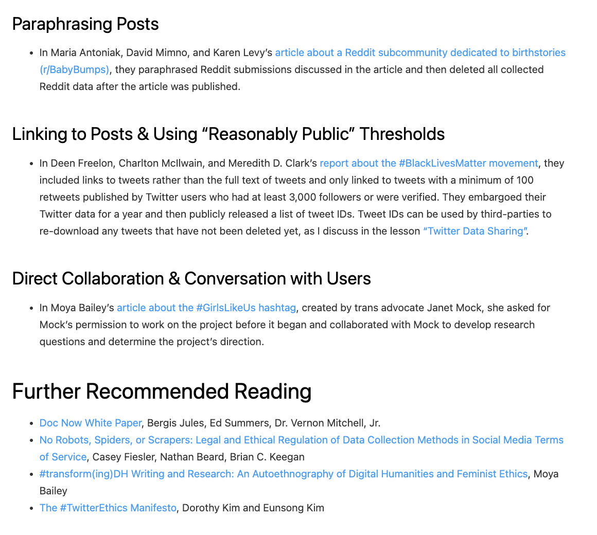

As you can see above, Walsh also has a great overview of different strategies and resources for this type of work, so highly recommend visiting the original chapter to explore these further in depth [https://melaniewalsh.github.io/Intro-Cultural-Analytics/04-Data-Collection/01-User-Ethics-Legal-Concerns.html](https://melaniewalsh.github.io/Intro-Cultural-Analytics/04-Data-Collection/01-User-Ethics-Legal-Concerns.html){target="_blank"}.

## Web Scraping with Python

Now that we have a sense of web scraping generally, it's time to try it out in Python. We will be using two Python libraries to do this: `requests` and `beautifulsoup4`. The `requests` library is a library that allows us to send HTTP requests to web pages. The `beautifulsoup4` library is a library that allows us to parse HTML and XML documents. We will be using `requests` to get the web page and `beautifulsoup4` to parse the web page.

### Installing Required Packages

The first step is to install our required packages into our virtual environment. If you have yet to set up a virtual environment, you can follow the instructions in the [previous lesson](../creating-curating-cad/04-virtual-environments){target="_blank"}.

If you have already created your virtual environment, then you can either activate it using Visual Studio Code or by using the terminal. If you are using the terminal, you can activate your virtual environment by running the following command:

For macOS or WSL:

```bash
source venv/bin/activate
python -m pip install requests beautifulsoup4 rich
```

For Windows PowerShell:

```powershell
.\venv\Scripts\Activate.ps1
python -m pip install requests beautifulsoup4 rich
```

Notice here we are installing two packages: `requests` and `beautifulsoup4` in a single line. **You can install as many packages as you want in a single `pip install` command, just separate them with a space.**

----

We previously discussed Python libraries when we talked about classes and virtual environments, but let's dig in a bit deeper.

**Library**

- There's a lot of different definitions for this term, but most generally you can think of this as a collection of software that's directly used by other software. Most often, this will be a generalizable piece of logic that is useful to bundle separately so that other, unrelated pieces of software can use it. Because it's an informal term in Python and not a specific, technical one, it's more useful to think about libraries in terms of how code is organized. Used in this way, the concept of "software libraries" spans many different programing languages and development contexts: we have Python libraries, C++ libraries, Javascript libraries, operating system libraries, etc.

- Let's consider libraries that we've used. The [Python Standard Library](https://docs.python.org/3/library/){target="_blank"} is the most obvious example which encompasses many different purposes and packages (more on that later), but is unified in that it is included in all Python installations so that Python code that's written using the Standard Library will run on any compatible Python environment of the expected version. Parts of the Standard Library that we've used before include packages like [pathlib](https://docs.python.org/3/library/pathlib.html){target="_blank"}.

- There are also third-party libraries that people build in Python, which can be found on The Python Package Index (PyPI) <https://pypi.org/>. These are usually less expansive than the Standard Library, but can be useful because they are written for specialized tasks. This week, we'll take a look at [Beautiful Soup](https://www.crummy.com/software/BeautifulSoup/){target="_blank"}, which is analogous in scope to packages like pathlib. In fact, third party libraries are often organized into a single package. A library like Beautiful Soup can best be thought of in terms of purpose: you want to accomplish the a particular, common task like scraping a website and Beautiful Soup helps accomplish it.

**Package**

- A package is a formal term in the Python context. It's a specific organization of code which all lives in a single directory. Libraries sometimes (often) consist of a single package (e.g. PathLib or BS4), so the term is sometimes (often) used interchangeably. Packages are the basic unit by which we install and use libraries. So when we type `pip install beautifulsoup4` into the terminal, we're installing the `beautifulsoup4` package.

This is very detailed, but just remember that while these terms are often used interchangeably, a package is a more specific concept referring to the structure and distribution of code, whereas a library is a broader concept referring to reusable code functionality.

Finally, you'll see that I often use `pip` or `pip3` when installing packages. This is because `pip` is the package installer for Python and `pip3` is the package installer for Python 3. If you're using Python 3, you can use either `pip` or `pip3`, but if you're using Python 2, you should use `pip2`. So generally, you'll want to use `pip` to install packages but to double check you're installing packages for the right version of Python, you can check the version of Python you're using by running `python --version` and then use the corresponding `pip` command.

----

Now we can starting using these packages in our Python code. First, we need to create a new folder in our `is310-coding-assignments` called `web-scraping` and then create a new file called `first_web_scraping.py`. Then we can add the following code to our file:

```python
import beautifulsoup4
```

You'll likely see the following error if you try to run this code:

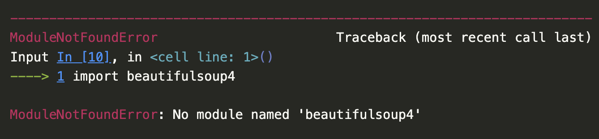

That is because `beautifulsoup4` is not a package that we can import directly. Instead, we need to import the `BeautifulSoup` class from the `bs4` package. This difference is a bit confusing since the name of the package on PyPI (`beautifulsoup4`) doesn't match the actual Python code package (`bs4`).

But this is a great example of why we always want to read the documentation, which is available here [https://www.crummy.com/software/BeautifulSoup/bs4/doc/](https://www.crummy.com/software/BeautifulSoup/bs4/doc/){target="_blank"}.

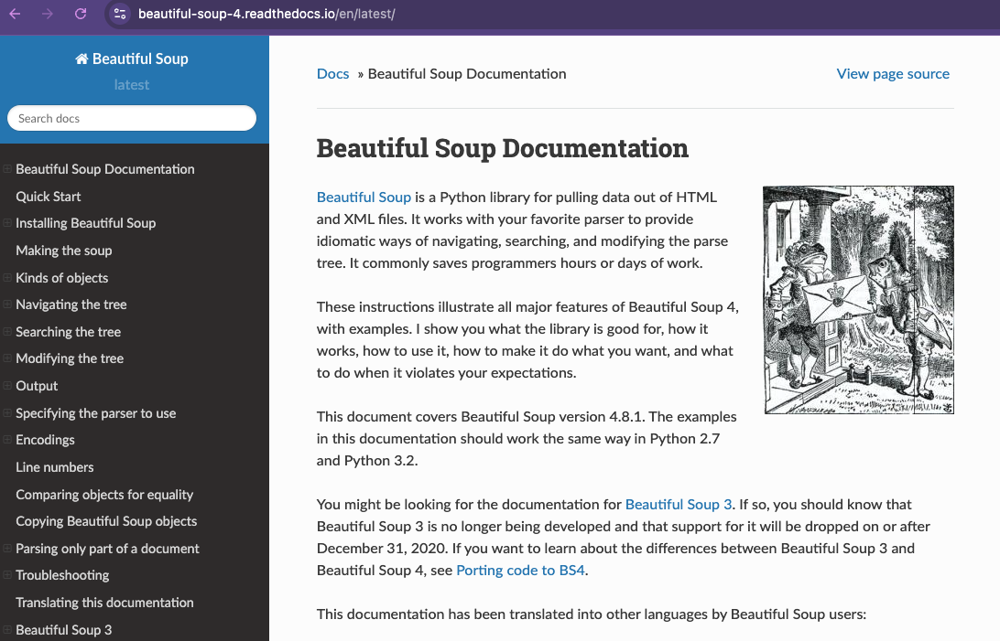

If we click on the `Quick Start` link, we can see that the documentation tells us to import the `BeautifulSoup` class from the `bs4` package. So we can update our code to look like this:

```python
from bs4 import BeautifulSoup
```

Remember that the `from` keyword is used to import a specific module (aka Class or function in Python) from a package. Alternatively we could also import the entire package and then use the `BeautifulSoup` class like this:

```python
import bs4
soup = bs4.BeautifulSoup(html_doc, 'html.parser')
```

Finally we could technically use the asterisk symbol, which often means "all" or "any", to import all the modules (aka Classes and functions) in the package:

```python
from bs4 import *
soup = BeautifulSoup(html_doc, 'html.parser')
# imports * imports all modules in a package
```

However, this is generally not recommended because it can make it difficult to understand where a particular module is coming from.

You may also need to install a parser for `BeautifulSoup`. The `html.parser` parser is included with Python, but you can also use the `lxml` parser, which is faster and more lenient. You can install the `lxml` parser by running the following command:

```bash
pip install lxml
```

There's actually a number of possible parsers you can use with `BeautifulSoup`. Here's a quick overview of the different parsers you can use with `BeautifulSoup` from the library's documentation:

| Parser                     | Typical usage                                | Advantages                                                                 | Disadvantages                                      |
|----------------------------|----------------------------------------------|---------------------------------------------------------------------------|----------------------------------------------------|
| Python’s `html.parser`     | `BeautifulSoup(markup, "html.parser")`       | Batteries included<br>Decent speed<br>Lenient (As of Python 2.7.3 and 3.2)| Not as fast as lxml<br>Less lenient than html5lib  |
| lxml’s HTML parser         | `BeautifulSoup(markup, "lxml")`              | Very fast<br>Lenient                                                      | External C dependency                              |
| lxml’s XML parser          | `BeautifulSoup(markup, "lxml-xml")`<br>`BeautifulSoup(markup, "xml")` | Very fast<br>The only currently supported XML parser                      | External C dependency                              |
| html5lib                   | `BeautifulSoup(markup, "html5lib")`          | Extremely lenient<br>Parses pages the same way a web browser does<br>Creates valid HTML5 | Very slow<br>External Python dependency            |

I usually just use the built-in `html.parser` parser, but you can use the `lxml` parser if you want to. Next we'll learn what these parsers are doing and how to use them!

### BeautifulSoup Basics

In the `Quick Start` guide [https://beautiful-soup-4.readthedocs.io/en/latest/#quick-start](https://beautiful-soup-4.readthedocs.io/en/latest/#quick-start){target="_blank"}, we have an example of how to use the `BeautifulSoup` class to parse an HTML document. Let's try this example in our `first_web_scraping.py` file.

```python
html_doc = """
<html><head><title>The Dormouse's story</title></head>
<body>
<p class="title"><b>The Dormouse's story</b></p>

<p class="story">Once upon a time there were three little sisters; and their names were
<a target="_blank" href="http://example.com/elsie" class="sister" id="link1">Elsie</a>,
<a target="_blank" href="http://example.com/lacie" class="sister" id="link2">Lacie</a> and
<a target="_blank" href="http://example.com/tillie" class="sister" id="link3">Tillie</a>;
and they lived at the bottom of a well.</p>

<p class="story">...</p>
"""

soup = BeautifulSoup(html_doc, 'html.parser')

print(soup.prettify())
```

We can see that `html_doc` is a variable that holds a multiline string that contains HTML. We are then using the `BeautifulSoup` class to parse the HTML document and the `prettify()` method to print the HTML document in a more readable format.

The power of `BeautifulSoup` is that it let's us use the structure of the HTML document to extract the data we want. For example, we can use the built-in `find_all()` method to get all the links in the document and then use the `get_text()` method to get the text of each link.

```python
links = soup.find_all('a')
for link in links:
	print(link.get('href'))
	print(link.get_text())
```

From this we can see that we are getting all the links in the document and then printing the `href` attribute of each link and the text of each link. This is a very simple example, but it shows how we can use the structure of the HTML document to extract the data we want.

In `BeautifulSoup`, we have four kinds of objects that we can work with: `Tag`, `NavigableString`, `BeautifulSoup`, and `Comment`. The `Tag` object is the most important object and represents an HTML or XML tag. The `NavigableString` object represents the text within a tag. The `BeautifulSoup` object represents the whole of the document. The `Comment` object represents an HTML or XML comment. We'll just focus on the `Tag` and `BeautifulSoup` objects for now.

**BeautifulSoup Class**

We've already started to use `BeautifulSoup` class, but let's take a closer look at it. The `BeautifulSoup` class is the main class in the `BeautifulSoup` library and represents the whole of the document.

We usually define a `BeautifulSoup` object by passing in the HTML document and the parser we want to use. You'll notice that the variable containing the `BeautifulSoup` object is often called `soup`, but you can call it whatever you want.

The core power of `BeautifulSoup` is that it let's you navigate the HTML Document like a tree, which you can read more about here [https://beautiful-soup-4.readthedocs.io/en/latest/index.html#navigating-the-tree](https://beautiful-soup-4.readthedocs.io/en/latest/index.html#navigating-the-tree){target="_blank"}.

Remember in HTML we can have nested HTML elements, and so `BeautifulSoup` let's us use that structure to find elements. Otherwise, this would just be **unstructured text** which is difficult to work with.

So far to navigate the tree we've been using the `find_all` method, which has the following documentation [https://beautiful-soup-4.readthedocs.io/en/latest/index.html#find-all](https://beautiful-soup-4.readthedocs.io/en/latest/index.html#find-all){target="_blank"}.

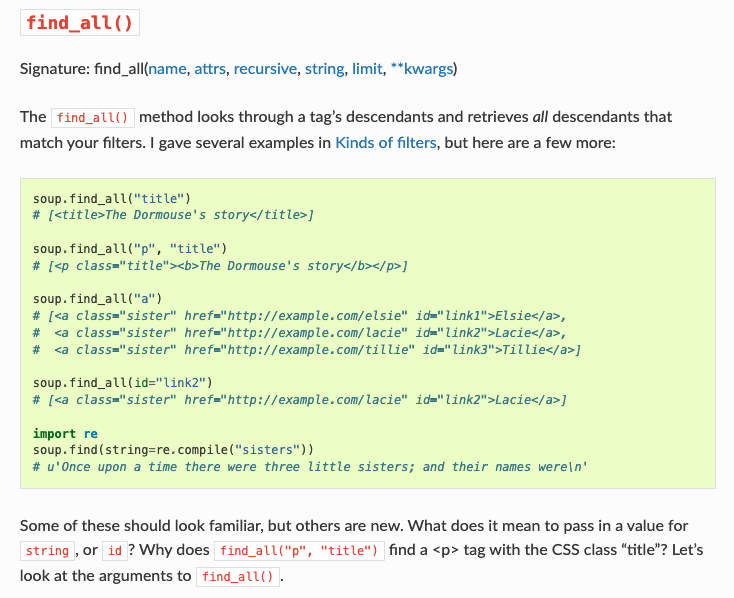

In the documentation, it talks about how this method "looks through a tag’s descendants and retrieves all descendants that match your filters." This is a bit confusing, but what it means is that the `find_all` method searches through the HTML document and retrieves all the elements that match the filter you give it.

So to go back to our previous example:

```python
links = soup.find_all('a')
for link in links:
	print(link.get('href'))
	print(link.get_text())
```

Here we are passing in the `a` tag name to the `find_all` method. We could also pass in other filters like a class name:

```python
links = soup.find_all('a', class_='sister')
```

Now this code should pretty identically because we only have links with the class name `sister`. However, you can imagine how this could be useful if you only wanted to get links with a specific class name.

You can also pass in other filters like `id`, `href`, etc. For example, if you wanted to get the link with the `id` attribute `link1`, you could do this:

```python
link = soup.find_all('a', id='link1')
```

The filter can be a tag name, a tag attribute, a tag attribute value, a tag class, a tag id, etc. The `find_all` method returns a list of tags that match the filter.

**Tag Class**

So far we have been just searching the HTML tree to find elements, but it is helpful to understand that in `BeautifulSoup` each element is represented by a `Tag` object. The `Tag` object is the most important object in `BeautifulSoup` and represents an HTML or XML tag.

For example, in our existing code we could use the `find_all()` method to get all the `p` tags in the document and then use the `get_text()` method to get the text of each `p` tag.

```python
paragraphs = soup.find_all('p')
for paragraph in paragraphs:
	print(paragraph.get_text())
```

Tags are equivalent to the elements in HTML, so any time you want to see if tag exists in the HTML document, you can use either the `find_all()` method to search for it or simply `soup.p` to get the first `p` tag in the document.

We can also use the `.name` attribute to get the name of the tag and the `.attrs` attribute to get the attributes of the tag.

```python
paragraphs = soup.find_all('p')
for paragraph in paragraphs:
	print(paragraph.name)
	print(paragraph.attrs)
```

Now we should see the name of the tag and the attributes of the tag printed for each `p` tag in the document.

Attributes are equivalent to the attributes in HTML, so any time you want to see if an attribute exists in the HTML document, you can use either the `.get()` method to get the value of the attribute or simply square brackets to get the value of the attribute.

```python
paragraphs = soup.find_all('p')
for paragraph in paragraphs:
	print(paragraph.get('class'))
	print(paragraph['class'])
```

Now that we are understanding how `BeautifulSoup` represents HTML, we can start to further navigate the HTML tree. In addition to searching for elements, we can also navigate the tree by moving up, down, and sideways. We can use the `parent`, `children`, `descendants`, `next_sibling`, and `previous_sibling` attributes to navigate the tree. So for example in our basic HTML doc variable we have paragraphs that are siblings, so we can use the `next_sibling` attribute to get the next sibling of a tag.

```python
paragraphs = soup.find_all('p')
for paragraph in paragraphs:
	print(paragraph.next_sibling)
```

We could also use the `parent` attribute to get the parent of a tag.

```python
paragraphs = soup.find_all('p')
for paragraph in paragraphs:
	print(paragraph.parent)
```

You don't need to memorize every functionality in `BeautifulSoup`, but it's good to know that it's there and to know how to look up the documentation. The documentation has lots of examples, so it's a great resource to use when you're working with `BeautifulSoup`.

### Scraping Project Gutenberg

So far we've been using some fairly basic HTML but we can start working with an actual HTML document. Today we'll be using *Project Gutenberg*'s Top 100 eBooks page [https://www.gutenberg.org/browse/scores/top](https://www.gutenberg.org/browse/scores/top){target="_blank"}. This page lists the top 100 eBooks on *Project Gutenberg* and we can use `BeautifulSoup` to scrape the titles.

First, we're going to save the page as an HTML file. You can do this by right clicking on the page and selecting "Save As" and then saving it as `top_100_ebooks.html` in the same directory as your `first_web_scraping.py` file.

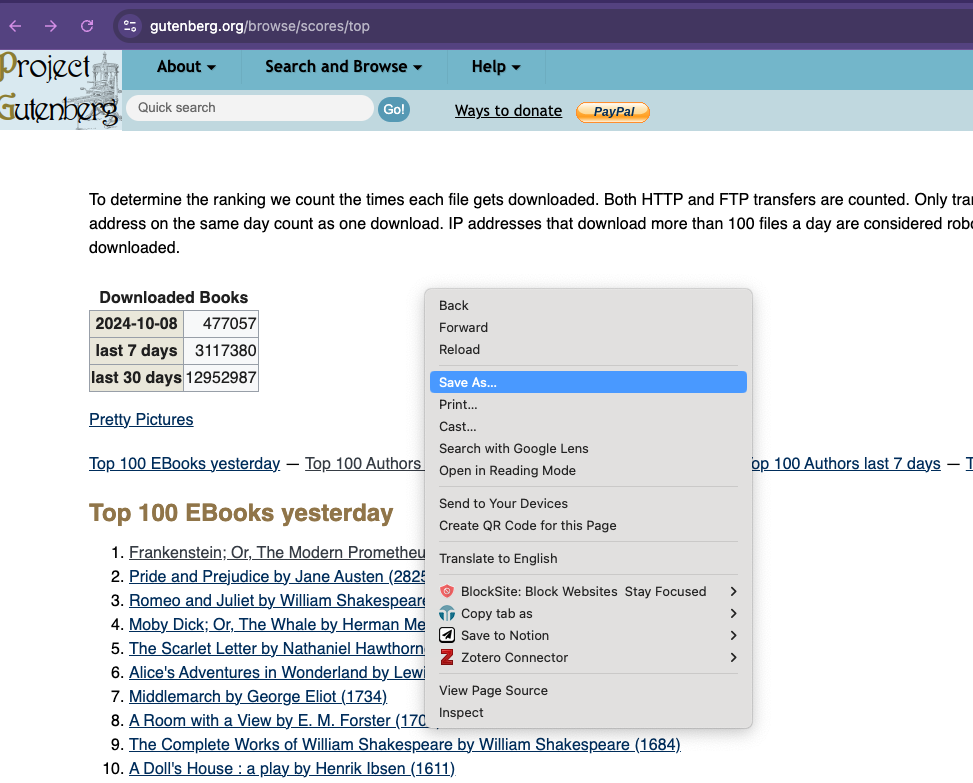

Now we can try scraping the page!

```python
from bs4 import BeautifulSoup
soup = BeautifulSoup(open("top_100_ebooks.html"), features="html.parser")

print(soup.prettify())
```

You can see we now have the full html page in all it's weirdly organized HTML glory!

While it's great to be able to just see the HTML, usually we are scraping to structured HTML data and turn it into a structured data format like a CSV or JSON file. So let's try and get the titles of the top 100 eBooks.

First, let's take a look at the structure of the HTML document. We can use the inspect feature in your browser to do this.

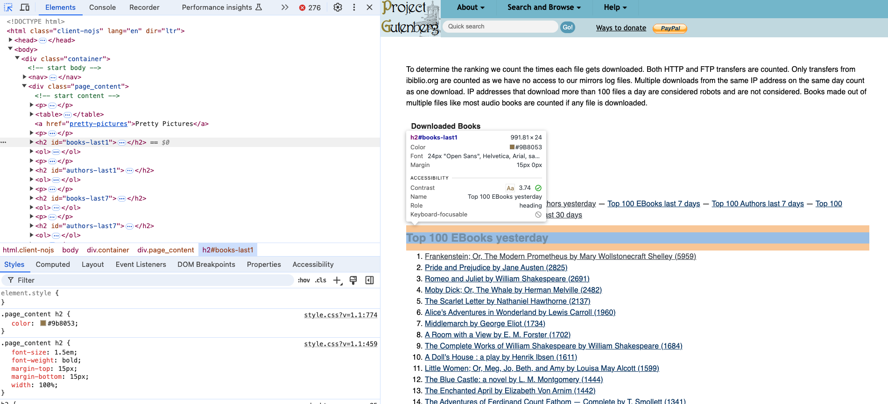

If we click the small arrow icon in our inspector, we can start to select relevant HTML elements. We can see that the `Top 100 EBooks yesterday` is an `h2` tag. After our readings about bestsellers and top of TikTok, we can imagine that scraping this list of books might be useful to researchers interested in what people are reading on *Project Gutenberg*.

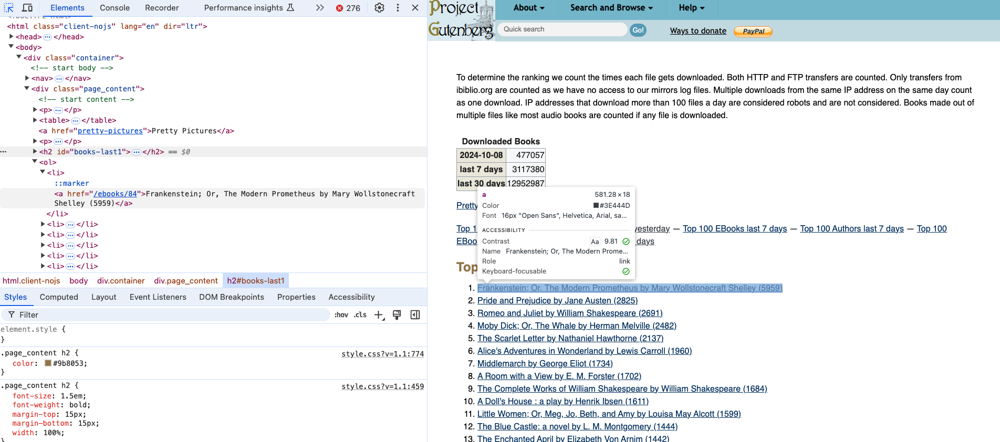

If we select the titles, we can see that they are nested in an `ol` tag and then each title is in a `li` tag. So we can use the `find_all()` method to get all the `li` tags in the document and then use the `get_text()` method to get the text of each `li` tag.

```python
titles = soup.find_all('li')
for title in titles:
	print(title.get_text())
```

However, you'll notice if we are running this code that we will get **all** the links on the page, not just the titles. This is because the `find_all()` method is searching the whole document and not just the `ol` tag. So we need to be more specific in our search.

#### Quick Practice Exercise

In your `first_web_scraping.py` file, try to modify the code so that it only prints the titles of the `Top 100 EBooks yesterday` section. To do this, you'll need to access the correct tag for `Top 100 EBooks yesterday` and then use `BeautifulSoup` to navigate to the correct `ol` tag. Finally, we want to print just the title of each book. To help you I would recommend taking a look at the following functions in the `BeautifulSoup` documentation:

- `find_next()` [https://beautiful-soup-4.readthedocs.io/en/latest/index.html#find-all-next-and-find-next](https://beautiful-soup-4.readthedocs.io/en/latest/index.html#find-all-next-and-find-next){target="_blank"}
- `get_text()` [https://beautiful-soup-4.readthedocs.io/en/latest/index.html#get-text](https://beautiful-soup-4.readthedocs.io/en/latest/index.html#get-text){target="_blank"}

However, you are welcome to solve this problem in any way you want!

### Requesting and Scraping Web Pages

We are now officially scraping a web page 🥳!! But what if we wanted to scrape more than one? Saving each manually would get tiring really quickly!

Let's try taking our updated code but rather than working with the saved version of the web page, let's try to get the web page programmatically. To do this, we need to use the `requests` library to get the web page. We already installed requests initially so now we need to import it into our `first_web_scraping.py` file.

```python
from bs4 import BeautifulSoup
import requests
```

Let's also take a look at the documentation for the `requests` library [https://requests.readthedocs.io/en/latest/](https://requests.readthedocs.io/en/latest/){target="_blank"}.

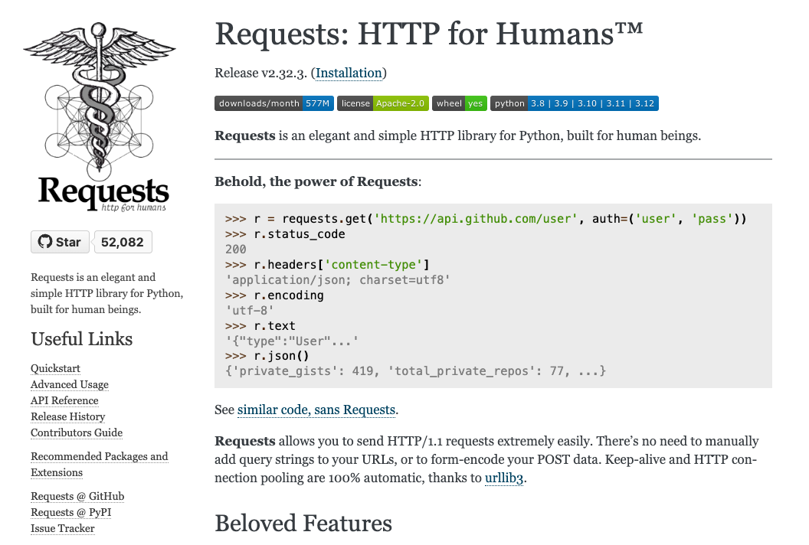

You'll notice the tag line for the library is "HTTP for Humans" which is a great way to think about it. The `requests` library is a library that allows us to send HTTP requests to web pages as if we were a web browser. As you remember from our [lesson on the web](../introducing-defining-cad/08-intro-web){target="_blank"}, when you go to a URL in your browser, your browser sends an HTTP request to the server and the server sends back an HTTP response. The `requests` library allows us to do the same thing in Python.

If we go to the `Quickstart` page [https://requests.readthedocs.io/en/stable/user/quickstart/](https://requests.readthedocs.io/en/stable/user/quickstart/){target="_blank"}, we can see how we not only import the library but also how we can use it.

For example, the core method in the `requests` library is the `get()` method, which is used to get a web page. The `get()` method returns a `Response` object, which has a `status_code` attribute that contains the status code of the request and a `headers` attribute that contains the headers of the request. Let's try it with our `Project Gutenberg` page.

```python
response = requests.get("https://www.gutenberg.org/browse/scores/top")
print("Status code:", response.status_code)
print("Headers:",response.headers)
```

We should see the following output:

```bash
Status code: 200
Header: {'date': 'Wed, 06 Oct 2021 17:00:01 GMT', 'server': 'Apache', 'content-location': 'top.php', 'vary': 'negotiate,Accept-Encoding', 'tcn': 'choice', 'content-encoding': 'gzip', 'content-length': '11521', 'x-backend': 'gutenweb5', 'content-type': 'text/html; charset=UTF-8'}
```

The `status_code` attribute contains the status code of the request and the `headers` attribute contains the headers of the request. The status code `200` means that the request was successful and the headers contain information about the request. If you don't get a `200` you can refresh your knowledge of the [other status codes in our lesson on the web](../introducing-defining-cad/08-intro-web#what-is-http){target="_blank"} but it usually means that either:

- you don't have access to the web page (so a status code of `403` or `404`)
- that there's an error on the server (so a status code of `500`)
- that the page doesn't exist (so a status code of `404`)
- Or there's an error with your internet connection.

Now that we have the `Response` object, we can use the `text` attribute to get the HTML of the page. Let's try it out.

```python
soup = BeautifulSoup(response.text, "html.parser")
print(soup.prettify())
```

We should see the HTML of the same page we downloaded printed out. This is great because it means we can now scrape any web page we want, not just the ones we have saved locally.

So returning to our previous our code, we can now use the `requests` library to get the web page and the `text` attribute of the `Response` object to get the HTML of the page.

```python
from bs4 import BeautifulSoup
import requests

response = requests.get("https://www.gutenberg.org/browse/scores/top")
soup = BeautifulSoup(response.text, "html.parser")
top_100_ebooks = soup.find(id="books-last1")
list_of_books = top_100_ebooks.find_next('ol').find_all('li')
for book in list_of_books:
	print(book.get_text())
```

Now that our code is working, we can start to consider what data we would actually want and how to structure it.

So far, we are only getting the `Top 100 EBooks Yesterday` but there's a number of top lists that we could scrape, including authors. So we could expand our code to get all top lists from this page and then store it in some sort of data structure, like a list of dictionaries.

```python
from bs4 import BeautifulSoup
import requests

response = requests.get("https://www.gutenberg.org/browse/scores/top")
soup = BeautifulSoup(response.text, "html.parser")
top_lists = soup.find_all("h2")

data = []
for top_list in top_lists:
	top_list_name = top_list.get_text()
	top_list_items = top_list.find_next('ol').find_all('li')
	for item in top_list_items:
		data.append({"list": top_list_name, "title": item.get_text()})
```

Now since we are getting both books and authors, let's create two separate lists of dictionaries, one for books and one for authors.

```python
from bs4 import BeautifulSoup
import requests

response = requests.get("https://www.gutenberg.org/browse/scores/top")
soup = BeautifulSoup(response.text, "html.parser")
top_lists = soup.find_all("h2")

books = []
authors = []

for top_list in top_lists:
	top_list_name = top_list.get_text()
	top_list_items = top_list.find_next('ol').find_all('li')
	for item in top_list_items:
		if "EBooks" in top_list_name:
			books.append({"list": top_list_name, "title": item.get_text()})
		else:
			authors.append({"list": top_list_name, "author": item.get_text()})
```

Finally, so far we are just saving the names of items but we could also save the links to the items. We could do this by getting the `href` attribute of the `a` tag.

```python
from bs4 import BeautifulSoup
import requests

response = requests.get("https://www.gutenberg.org/browse/scores/top")
soup = BeautifulSoup(response.text, "html.parser")
top_lists = soup.find_all("h2")

books = []
authors = []

for top_list in top_lists:
	top_list_name = top_list.get_text()
	top_list_items = top_list.find_next('ol').find_all('li')
	for item in top_list_items:
		if "EBooks" in top_list_name:
			books.append({"top_list": top_list_name, "book_title": item.get_text(), "book_link": item.find('a').get('href')})
		else:
			authors.append({"top_list": top_list_name, "author_name": item.get_text(), "author_link": item.find('a').get('href')})
```

Now we just need to save the data to a file. We could either create text files, but in this case it might be easier to create a csv file. To do that we would need to use the `csv` library, which is part of the Python Standard Library. We would also need to use the `open()` method to open a file and the `write()` method to write to the file. We would also need to use the `writerow()` method to write a row to the file.

```python
import csv

with open('top_100_ebooks.csv', 'w') as file:
	writer = csv.writer(file)
	# Write the headers
	writer.writerow(['top_list', 'book_title', 'book_link'])
	for book in books:
		writer.writerow([book['top_list'], book['book_title'], book['book_link']])

with open('top_100_authors.csv', 'w') as file:
	writer = csv.writer(file)
	# Write the headers
	writer.writerow(['top_list', 'author_name', 'author_link'])
	for author in authors:
		writer.writerow([author['top_list'], author['author_name'], author['author_link']])
```

You'll notice that I am using the `with` statement to open the file. This is a context manager that automatically closes the file when the block of code is done. This is a good practice because it ensures that the file is closed properly and that there are no issues with the file. Furthermore, I'm making the column headers the first row of the csv file and using lowercase and underscores in the names. This is a good practice because it makes it easier to read the file later on and to work with the data.

Now that we have links to other pages, we could also start using requests to get those pages and scrape them. Let's create a function to check if the web page exists and if we would be able to scrape it based on the status code.

```python
def check_page_exists(url):
	response = requests.get(url)
	if response.status_code == 200:
		return True
	else:
		return False
```

Now we can use this function to check if we can scrape the links to the books and authors.

```python
for book in books:
	book['webpage_exists'] = check_page_exists(book['book_link'])

for author in authors:
	author['webpage_exists'] = check_page_exists(author['author_link'])
```

You'll likely notice that we get a lot of errors when we run this code. Why is that?

Take a look at our links. You'll notice that the top book, *Frankenstein; Or, The Modern Prometheus* has a link of `/ebooks/84`. This is a relative link, which means that it's a link that is relative to the current page. This is different from an absolute link, which is a link that is absolute to the root of the website. So we need to convert the relative links to absolute links.

We can simply click on the link in the web page to see what the full URL is. In this case, the full URL is `https://www.gutenberg.org/ebooks/84`. So we can use this information to convert the relative links to absolute links.

```python
def check_gutenberg_page_exists(url):
	gutenberg_url = "https://www.gutenberg.org" + url
	response = requests.get(gutenberg_url)
	if response.status_code == 200:
		return True
	else:
		return False
```

Now when we rerun our code, we should see that we are able to get the status code for each of the links!

Many web pages use relative links, so this is a common issue when scraping web pages and it's why it's important to always inspect and explore the HTML of the web page you are scraping.

### Advanced Web Scraping: Community Wikis

So far we have been scraping web pages that are relatively simple, but what if we wanted to scrape a more complex web page? For example, what if we wanted to scrape a fandom wiki page? These pages are often more complex because they have more complex HTML and CSS. Let's try scraping the *Tolkien Gateway* wiki page [https://tolkiengateway.net/wiki/Main_Page](https://tolkiengateway.net/wiki/Main_Page), which is "The J.R.R. Tolkien Encyclopedia" and is a community-run wiki that has been going since 2005. This page has a lot of information about J.R.R. Tolkien and his works, including *The Lord of the Rings* and *The Hobbit*. It also has a lot of information about the characters, places, and events in Tolkien's works.

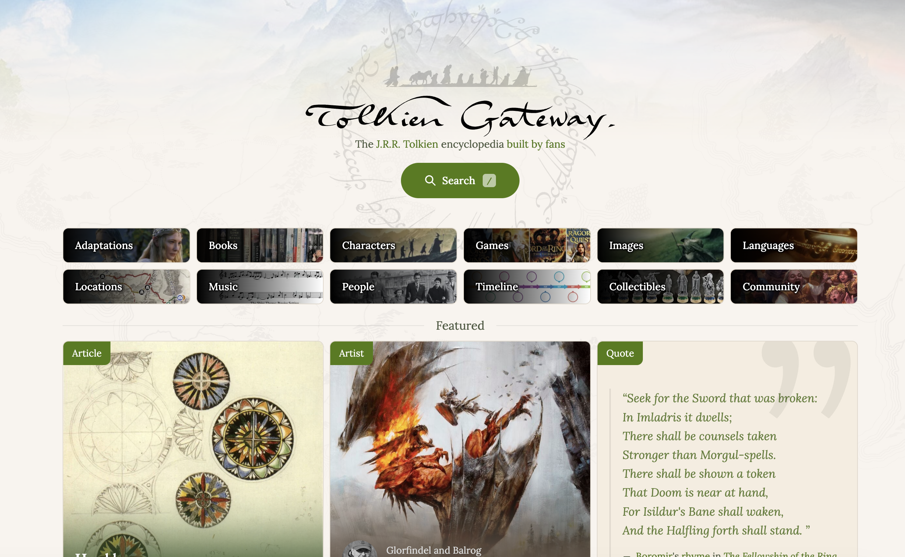

For those unfamiliar, fandom wikis are fan-created wikis that are often used to document popular culture. I haven't been able to find a list of all of these wikis, but there is a wikipedia page listing some of the most prominent ones [https://en.wikipedia.org/wiki/List_of_fan_wikis](https://en.wikipedia.org/wiki/List_of_fan_wikis). You'll notice that many of these wikis started in the mid-2000s and have grown in popularity since then. For example, there's actually a wikipedia page for the *Star Wars* wiki [https://en.wikipedia.org/wiki/Wookieepedia](https://en.wikipedia.org/wiki/Wookieepedia), which is called *Wookieepedia*.

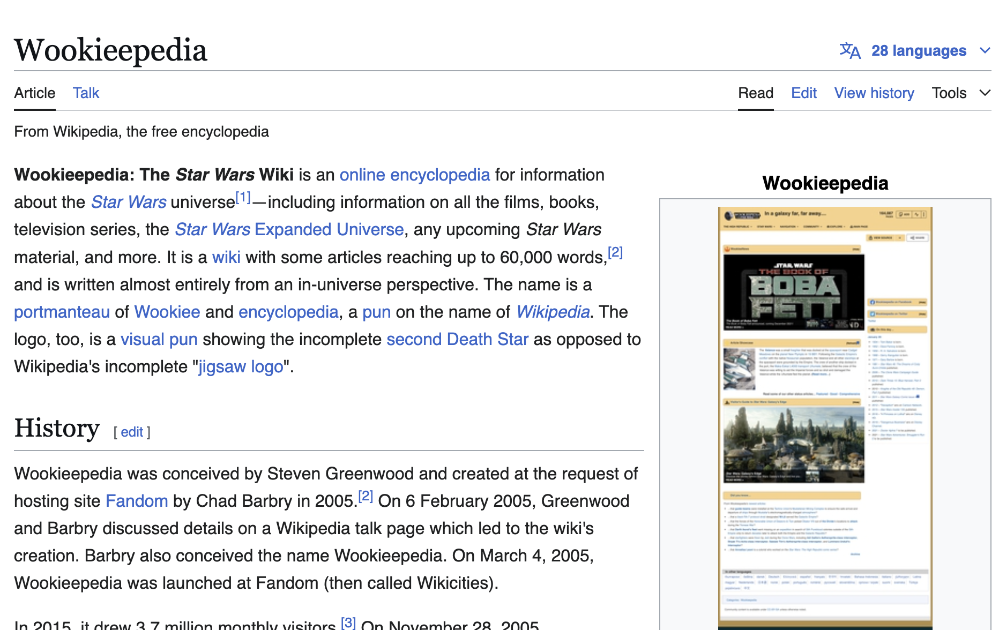

This page details some of the history and statistics of *Wookieepedia*, which started in 2005. You'll notice that it has over 150,000 articles and over 1,000,000 pages. This is a huge amount of information and this wiki is far larger than the *Lord of the Rings* wiki.

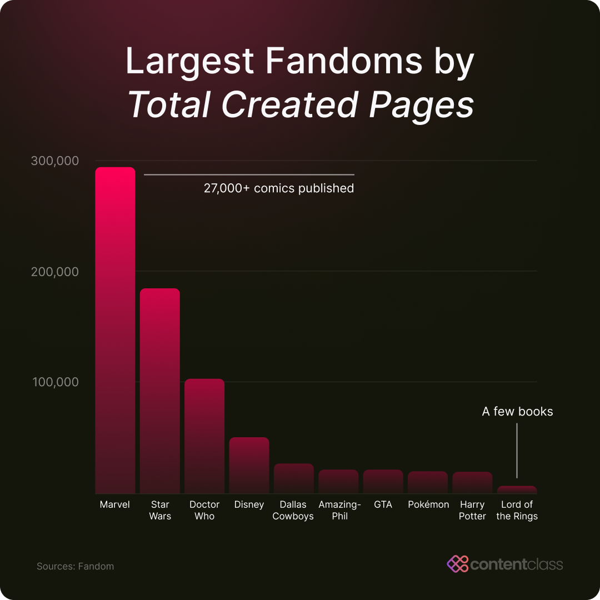

In a previous version of this lesson, we scraped these wikis directly, but in 2023 Fandom.com (the company that hosts many of these wikis) started using Cloudflare to block automated requests. This means that if you try to scrape these wikis, you'll get a `403` error. This is a common issue when scraping web pages and it's why it's important to always check the `robots.txt` file of the web page you are scraping.

The good news is that not every fan wiki is behind Cloudflare. In fact, one of the more interesting developments in fandom over the last several years has been communities **leaving** Fandom.com, frustrated by its advertising, autoplaying video, and control over community-written content and re-establishing their wikis on independent infrastructure. The Zelda Wiki left in 2022; the Minecraft Wiki left in 2023; many others moved to hosts like [wiki.gg](https://www.wiki.gg/wikis){target="_blank"} or the nonprofit [Miraheze](https://miraheze.org/){target="_blank"}. 

Let's start where we always start: the `robots.txt` file [https://tolkiengateway.net/robots.txt](https://tolkiengateway.net/robots.txt){target="_blank"}.

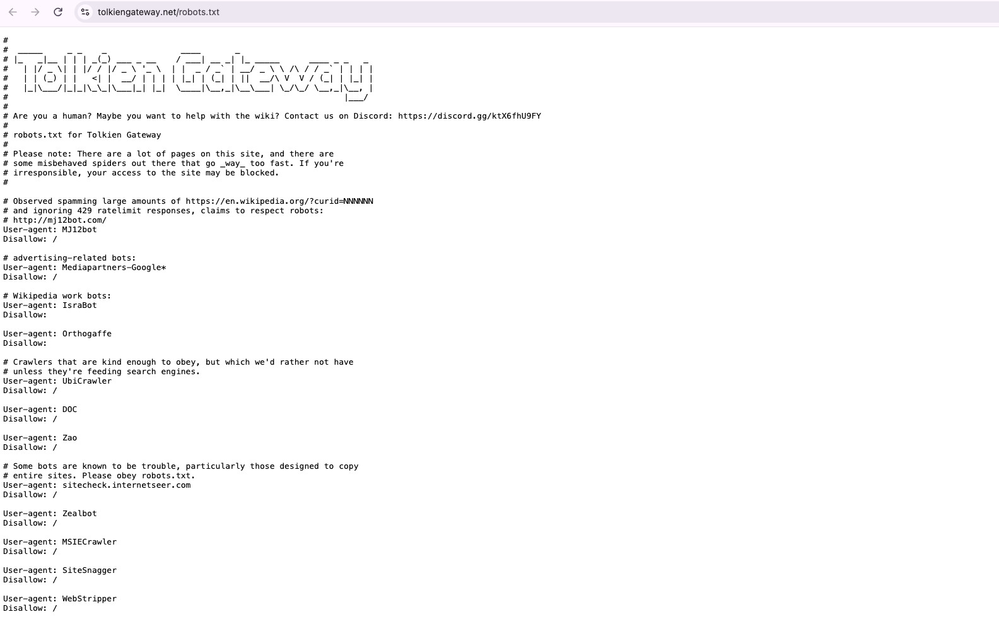

This file is addressed to a person. It assumes you might be a human being who wants to help, and its one substantive request is simply: *don't go too fast*. The rest of the file blocks specific badly-behaved commercial crawlers by name (`MJ12bot`, `HTTrack`, `WebZIP`), but there is no blanket ban on the sort of small, slow, scholarly scraping we want to do.

This file does not grant unrestricted permission, but it does give us unusually direct operational guidance for a small, good-faith request: identify ourselves, move slowly, and stop if the server refuses or rate-limits us. **We are going to add a `time.sleep()` between our requests, and this time it is not decorative.**

We should also identify ourselves honestly. Rather than pretending to be a browser, we'll send a `User-Agent` that says who we are and how to reach us:

```python
import requests
from bs4 import BeautifulSoup

HEADERS = {"User-Agent": "is310-course-scraper/1.0 (student project; netid@illinois.edu)"} # Replace netid with your actual netid

response = requests.get("https://tolkiengateway.net/wiki/Main_Page", headers=HEADERS)
print(response.status_code)
soup = BeautifulSoup(response.text, "html.parser")
```

This should give us a `200`. Notice the difference in what we just did. We did not disguise ourselves to slip past a filter, we introduced ourselves to a site that was willing to be read. A site administrator looking at their logs can see exactly who we are and email us if we become a problem, which is what good-faith scraping looks like.

Now since this wiki is huge, we need to narrow our focus to a particular goal or question. Tolkien Gateway has tens of thousands of pages, so we need an actual research question rather than a vague intention to "get the data."

#### Our Question: What Receives Attention in a Fan Encyclopedia?

Tolkien Gateway documents both characters from Tolkien's literary works and characters created for later adaptations. We could use the structure of the wiki to ask:

> **How does Tolkien Gateway distribute attention between characters from *The Lord of the Rings* books and characters created for recent *The Rings of Power* TV show?**

[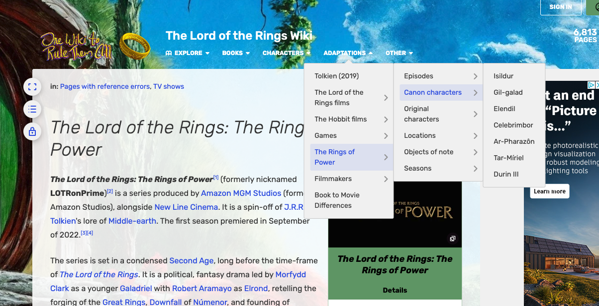](https://tolkiengateway.net/wiki/The_Lord_of_the_Rings:_The_Rings_of_Power){target="_blank"}

Part of this question requires thinking about how we can measure attention from the data available on the wiki. We might for instance look at the edits to each character's page over time or discussion pages associated with each character. But first, we might start with simple metrics that are readily available: word count, character count, and internal-link counts.

Word and character counts give us two rough measures of article length. Total internal-link count captures every qualifying link occurrence, while unique internal-link count captures the number of distinct wiki destinations. These are not perfect measures, but they are a starting point for understanding attention. A long page may reflect abundant source material, sustained editorial labor, debate, popularity, or simply the age of the page. Repeated links may show recurring topics or simply editorial conventions. By starting with several simple measures, we can compare what each one makes visible and then refine our approach as we learn more about the wiki's structure and content.

| Metric | How We Calculate It | What It Helps Us See | Important Limitation |
|---|---|---|---|
| `word_count` | Split the extracted text at whitespace and count the pieces | Approximate article length in words | This is not linguistic or language-model tokenization |
| `character_count` | Count every character in the extracted text | Article length at a finer scale | Spaces and punctuation are included |
| `internal_link_count` | Count every qualifying internal-link occurrence | How often the article connects readers elsewhere in the wiki | Repeated links to one destination count repeatedly |
| `unique_internal_link_count` | Count each internal destination once | The range of distinct wiki pages connected to the article | Different destinations may not be equally meaningful |

: Measurements collected from each character page {.striped .hover}

::: {.callout-tip}
## All Links Versus Unique Links

Imagine that one article links to `Elrond` three times and `Galadriel` twice. Its `internal_link_count` would be **5**, because five links occur in the HTML. Its `unique_internal_link_count` would be **2**, because those links lead to only two distinct pages.

Neither measure is automatically better. The total count captures repeated linking practices, while the unique count captures the breadth of the article's connections. Comparing them may reveal whether a page repeatedly returns to a few topics or connects outward to many different ones.
:::

#### Following the Website's Structure

Rather than typing a list of character names ourselves, we will let Tolkien Gateway's own categories guide the scraper and record the data. We begin with two category pages selected for our comparison:

```text
Characters in The Lord of the Rings category
└── every character page in that category

The Rings of Power (TV series) characters category
└── every character page in that category
```

Many wikis have a portal page that lists all the characters in a work, and in the case of Tolkien Gateway, there are multiple ways to get this data, from starting at the Main Page to following the "Characters" link in the sidebar to navigating through the category tree. But we will start with the two category pages above, which are the most direct way to get a complete list of characters for each work.

- [Characters in *The Lord of the Rings*](https://tolkiengateway.net/wiki/Category:Characters_in_The_Lord_of_the_Rings){target="_blank"}
- [*The Rings of Power* (TV series) characters](https://tolkiengateway.net/wiki/Category:The_Rings_of_Power_(TV_series)_characters){target="_blank"}

Our first step is to explore the underlying HTML of these pages to see how the character links are structured. We can use the browser's "Inspect" feature to look at the HTML and find the relevant elements.

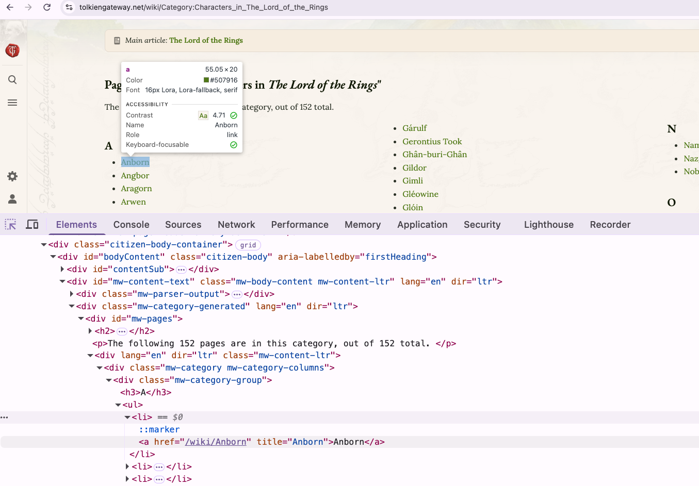

We can notice that the character links are inside a `div` with the id `mw-pages`, and each character link is inside an `li` element. We can compare this structure to the *Rings of Power* category page to see if this logic holds for both pages. If it does, we can write a function that scrapes the character links from both pages.

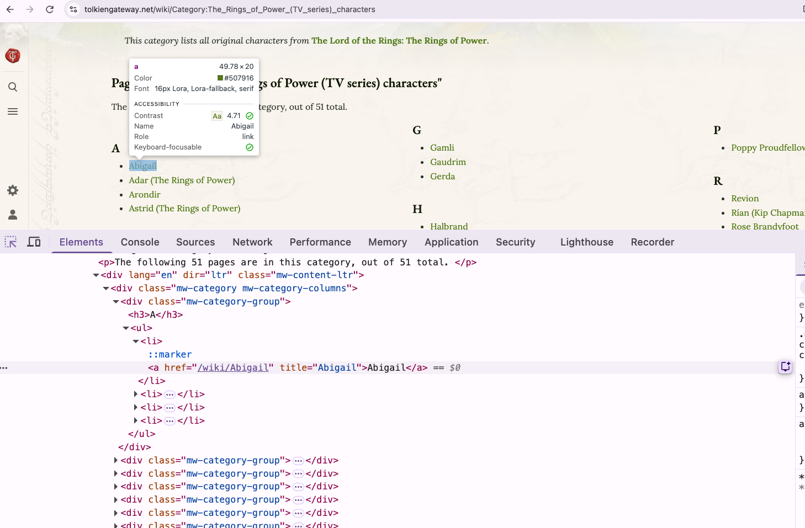

Now that we see that both pages have the same structure, we next need to take a look at the individual character pages to see how we can measure their text and internal links. We can use the "Inspect" feature again to look at the HTML of a character page.

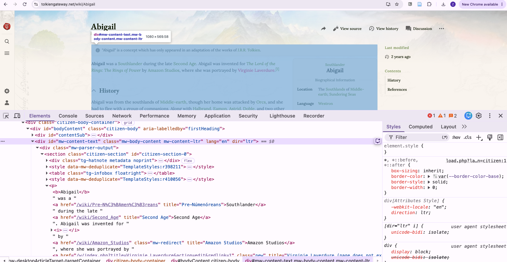

Notice the `div` with the id `mw-content-text` and the class `mw-parser-output`. This is where the main content of the character page is located. We can use this information to calculate word count, character count, and link counts only from this `div`. This logic will help us avoid counting text and links from the sidebar, header, footer, or other parts of the page that are not relevant to our analysis.

#### Setting Up the Script

First, we will create a new file named `tolkien_gateway_scraper.py`. We start with the modules we need, the website addresses that remain constant, an honest `User-Agent`, and one shared Rich console:

```python
import csv
import time

import requests
from bs4 import BeautifulSoup
from rich.console import Console
from rich.table import Table


BASE_URL = "https://tolkiengateway.net"
LITERARY_CATEGORY_URL = f"{BASE_URL}/wiki/Category:Characters_in_The_Lord_of_the_Rings"
ADAPTATION_CATEGORY_URL = f"{BASE_URL}/wiki/Category:The_Rings_of_Power_(TV_series)_characters"
RINGS_OF_POWER_PATH = "/wiki/The_Lord_of_the_Rings:_The_Rings_of_Power"
HEADERS = {
	"User-Agent": "is310-course-scraper/1.0 (student project; netid@illinois.edu)"
}
REQUEST_DELAY = 1.0
RESULTS_OUTPUT = "tolkien_gateway_characters.csv"

console = Console()
```

The use of uppercase variable names is a common Python convention for **constants**. Constants are values that do not change throughout the execution of the program. In this case, the URLs, headers, request delay, and output file name are all constants because they remain the same regardless of which character page we are scraping. By contrast, values that change with each function call will be passed into functions as parameters.

#### Downloading and Parsing Pages

Since, we will be downloading multiple pages, we want to create a function that handles the downloading and parsing of pages. This function will take a URL as a parameter, download the page, and return a BeautifulSoup object. If the page cannot be downloaded, it will return `None`.

```python
def fetch_soup(url):
	if not url:
		console.print("[yellow]No URL was found for this page.[/yellow]")
		return None

	response = requests.get(url, headers=HEADERS, timeout=30)
	time.sleep(REQUEST_DELAY)

	if response.status_code != 200:
		console.print(f"[red]Could not download {url}: HTTP {response.status_code}[/red]")
		return None

	return BeautifulSoup(response.text, "html.parser")
```

Because the `url` changes each time, we make it a parameter. Whereas the headers and request delay remain fixed on each loop, so the function reads those constants defined outside the function (remember the global scope!). Returning a Beautiful Soup object also means that the other functions can focus on searching HTML rather than repeating request code. Generally, we want to isolate one task per function, which makes it easier to read and test the code. We also want to avoid overloading the server with requests, so we add a `time.sleep()` after each request. That keeps our scraper slow and predictable instead of sending another request immediately when the site is already having trouble, and also prevents us from being blocked by the server for sending too many requests in a short period of time.

#### Collecting Character Pages

Since we have identified the structure of the category pages, we can now create a function to collect the character information. MediaWiki places category members inside the element with the id `mw-pages`. Instead of writing one long CSS selector, we can search the HTML in stages: find the character section, find its list items, and then find the link inside each item.

```python
def scrape_characters(category_page, source_url):
	characters = []
	if category_page is None:
		return characters

	characters_section = category_page.find(id="mw-pages")
	if characters_section is None:
		return characters

	if source_url == LITERARY_CATEGORY_URL:
		character_type = "literary"
	else:
		character_type = "adaptation"

	character_items = characters_section.find_all("li")
	for item in character_items:
		link = item.find("a", href=True)
		if link is None:
			continue

		characters.append({
			"character": link.get_text(" ", strip=True),
			"character_type": character_type,
			"source_url": source_url,
			"character_url": f"{BASE_URL}{link['href']}",
		})

	return characters
```

Breaking the search into named steps makes the page structure easier to inspect and debug. `find()` returns the first matching element, which is the main section of the page. Then we define the character type, by checking which category page we are scraping, and assigning the appropriate value. Finally, we use `find_all()` to get every list item in that section, and then `find()` again to get the link inside each item. We use `get_text(" ", strip=True)` to extract the visible text from the link, and `strip=True` to remove any leading or trailing whitespace. We also construct the full URL for the character page by concatenating the base URL with the relative link.

We return a list of dictionaries, each containing the character's name, type, source URL, and character URL. This structure allows us to easily iterate over the characters and analyze their pages in the next step.

#### Collecting Internal Links

We want to collect every qualifying link first so that we can later compare all link occurrences with unique destinations. We want only relative links to other wiki pages, not links to fragments within a page:

```python
def get_internal_links(content):
	if content is None:
		return []

	links = []
	for link in content.find_all("a", href=True):
		href = link["href"]
		if href.startswith("/wiki/") and "#" not in href:
			links.append(href)

	return links
```

Here we first find every link that has an `href`, then use a regular Python `if` statement to retain relative URLs beginning with `/wiki/`. The condition `"#" not in href` excludes fragment links that point to a section within a page. The function returns every qualifying occurrence, including repeated links, which lets us calculate both total and unique counts for the links.

We deliberately retain all internal wiki-link occurrences even though some links may point to categories, files, templates, or help pages. In the future, we might refine our logic to exclude those, but for now we are simply counting every link that points to another wiki page. Such a choice is part of how we start thinking about how we operationalize our research question but also the assumptions we make about what counts as attention. 

#### Analyzing Each Character Page

For every character, we isolate the main article content and calculate our text and link measurements:

```python
def analyze_character(character):
	soup = fetch_soup(character["character_url"])
	record = character.copy()
	record["word_count"] = 0
	record["character_count"] = 0
	record["internal_link_count"] = 0
	record["unique_internal_link_count"] = 0
	record["rings_of_power_link"] = False

	if soup is None:
		return record

	content = soup.select_one("#mw-content-text .mw-parser-output")
	if content is None:
		return record

	article_text = content.get_text(" ", strip=True)
	word_count = len(article_text.split())
	character_count = len(article_text)
	internal_links = get_internal_links(content)
	unique_internal_links = []
	for href in internal_links:
		if href not in unique_internal_links:
			unique_internal_links.append(href)

	record["word_count"] = word_count
	record["character_count"] = character_count
	record["internal_link_count"] = len(internal_links)
	record["unique_internal_link_count"] = len(unique_internal_links)
	if record["character_type"] == "literary":
		record["rings_of_power_link"] = RINGS_OF_POWER_PATH in internal_links
	return record
```

`character.copy()` preserves the discovery data while allowing us to add measurements to a new dictionary. We save the extracted text once as `article_text`. `len(article_text)` counts every character, including spaces and punctuation, while `len(article_text.split())` counts whitespace-separated pieces as words. Both approaches are valid ways to measure text, but neither is a complete representation of the text's content. For instance, they may include captions, tables, citations, or interface text contained inside the selected article element. Again, we are not striving for perfection but more reproducible and consistent measurements across pages.

The full `internal_links` list preserves repeated links. We then build `unique_internal_links` by appending a destination only when it is not already present. The difference between these counts is potentially meaningful: one measures how often the article links internally, while the other measures the range of distinct pages it connects to.

The same logic applies to text length. Word and character counts will usually rise together, but they are not interchangeable. Pages containing long names, dates, citations, or different writing styles may have similar word counts but different character counts. Keeping both lets us inspect whether a pattern appears across measurements rather than treating one convenient number as the page's definitive size.

As you review the output, consider:

- Do the same character pages rank highly across word, character, total-link, and unique-link counts?
- Which pages have many repeated links but relatively few unique destinations?
- Are differences between literary and adaptation pages consistent across all four measurements?
- What parts of wiki writing or formatting might produce those differences besides fan attention?

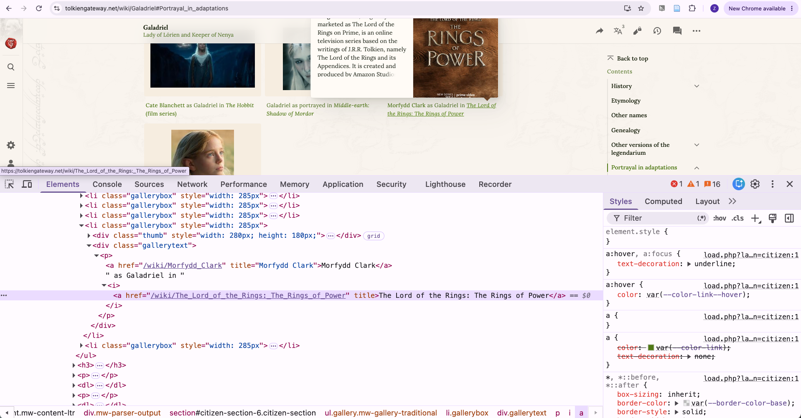

The screenshot above shows that Galadriel's page links to `/wiki/The_Lord_of_the_Rings:_The_Rings_of_Power` in its adaptation section. For literary characters, `rings_of_power_link` becomes `True` when that exact path appears and remains `False` when it does not. This gives us a simple overlap field for literary characters who appear in the show.

We do not perform this overlap check for adaptation characters. They already come from a category defined as characters created for the television series, so they are not literary characters appearing in the show. A `False` value also remains an inference from editorial markup: it could mean the literary character does not appear in the show, or simply that editors have not added the expected link to the page.

#### Saving and Previewing the Results

The complete script includes one function that writes our list of dictionaries to a CSV and another that previews the same records as a Rich table sorted by word count:

```python
def save_csv(records, output_path):
	if not records:
		console.print(f"[yellow]No records to save to {output_path}[/yellow]")
		return

	with open(output_path, "w", newline="", encoding="utf-8") as file:
		writer = csv.DictWriter(file, fieldnames=records[0].keys())
		writer.writeheader()
		writer.writerows(records)


def print_results_table(records):
	table = Table(title="Literary and Adaptation Character Pages")
	table.add_column("Character", style="cyan")
	table.add_column("Type", style="green")
	table.add_column("Literary Character in Rings of Power", style="magenta")
	table.add_column("Words", justify="right")
	table.add_column("Characters", justify="right")
	table.add_column("All Links", justify="right")
	table.add_column("Unique Links", justify="right")

	for record in sorted(records, key=lambda record: record["word_count"], reverse=True):
		table.add_row(
			record["character"],
			record["character_type"],
			str(record["rings_of_power_link"]),
			str(record["word_count"]),
			str(record["character_count"]),
			str(record["internal_link_count"]),
			str(record["unique_internal_link_count"]),
		)

	console.print(table)
```

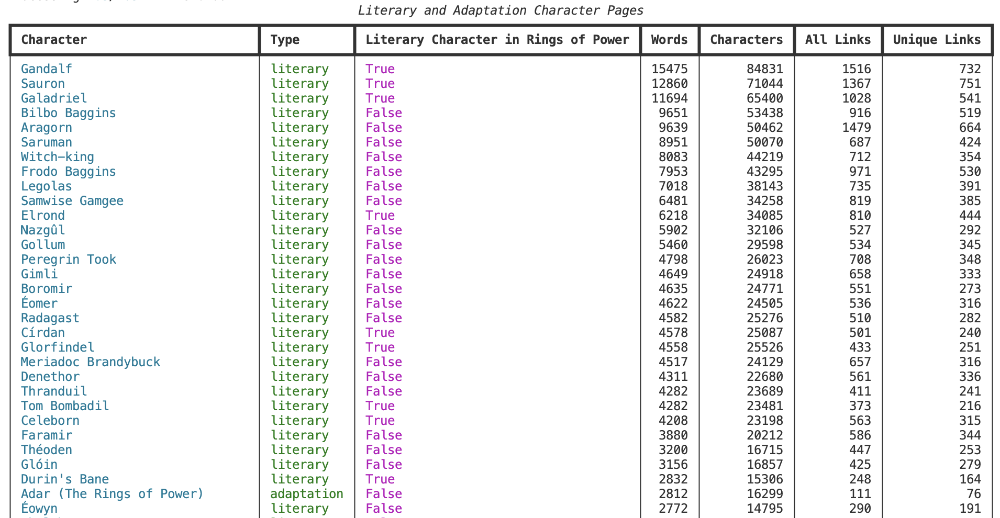

The CSV preserves all records for later analysis. Sorting only happens in the terminal preview, so display order does not silently change the saved dataset. The `newline=""` argument follows the `csv` documentation's recommendation and avoids extra blank rows on Windows, while UTF-8 preserves accented characters.

#### Organizing the Workflow with `main()`

Our functions each perform one task. At the end of the script, we call the `main()` function to organize those tasks into the full research workflow:

```python
def main():
	console.print("[cyan]Finding The Lord of the Rings characters...[/cyan]")
	literary_page = fetch_soup(LITERARY_CATEGORY_URL)
	literary_characters = scrape_characters(
		literary_page,
		LITERARY_CATEGORY_URL,
	)

	console.print("[cyan]Finding The Rings of Power characters...[/cyan]")
	adaptation_character_page = fetch_soup(ADAPTATION_CATEGORY_URL)
	adaptation_characters = scrape_characters(
		adaptation_character_page,
		ADAPTATION_CATEGORY_URL,
	)

	all_characters = literary_characters + adaptation_characters
	console.print(f"[green]Found {len(all_characters)} character pages.[/green]")

	results = []
	for number, character in enumerate(all_characters, start=1):
		console.print(f"Processing {number}/{len(all_characters)}: {character['character']}")
		results.append(analyze_character(character))

	print_results_table(results)
	save_csv(results, RESULTS_OUTPUT)
	console.print(f"[green]Saved {len(results)} analyzed character pages to {RESULTS_OUTPUT}[/green]")


if __name__ == "__main__":
	main()
```

The category URLs are constants because they are the fixed sources for this comparison. Passing each URL into `scrape_characters()` records where every character link was discovered. The two groups are collected separately and then combined after their provenance has been preserved.

The final pattern is common in Python scripts. Python sets `__name__` to `"__main__"` when we run this file directly, so the condition calls `main()`. If we later import one of these functions into another Python file, the scraper will not automatically begin making requests.

::: {.callout-warning}
## What Does This Comparison Actually Measure?

The script compares categories built by Tolkien Gateway editors. Those categories are part of the evidence, not neutral containers. The two groups may differ in age, source material, editorial interest, and category rules. Word counts and links may suggest where documentation is concentrated, but they cannot independently establish popularity, cultural importance, adaptation quality, or fidelity to Tolkien.

When interpreting the output, ask:

- Which characters receive the longest pages and the most internal links?
- Do literary and adaptation characters appear to receive different kinds of documentation?
- What editorial or historical processes might explain those differences?
- Which parts of the page did our selectors include that we might not have intended to measure?
- What additional evidence would we need before making an argument about fandom attention?
:::

The complete, commented script is available here: <a target="_blank" href="../../assets/files/tolkien_gateway_scraper.py" download>`tolkien_gateway_scraper.py`</a>. **It will take several minutes to run** because it visits every discovered character page and pauses after every request. That slowness is part of responsible scraping, not a bug.

We now have a scraper that begins with a cultural question, follows links from category pages to individual character pages, records the provenance of the categories it uses, and produces both a readable table and reusable CSV. Just as importantly, we have documented why the resulting measurements remain partial and interpretive.

## Beyond BeautifulSoup and Requests

While `BeautifulSoup` and `requests` work well for most web scraping tasks, you may encounter websites that require more sophisticated tools. Two important libraries to be aware of are:

**Selenium** ([https://selenium-python.readthedocs.io/](https://selenium-python.readthedocs.io/){target="_blank"}) is a browser automation tool that controls a real web browser programmatically. Use Selenium when you need to scrape websites that render content dynamically with JavaScript, since BeautifulSoup only parses static HTML.

**Scrapy** ([https://scrapy.org/](https://scrapy.org/){target="_blank"}) is a full-featured web scraping framework designed for large-scale, production-grade projects. It includes built-in support for managing requests, following links, storing data, and more. Use Scrapy when you're building a sophisticated scraping pipeline that needs to handle many pages efficiently.

**When to use each:**

- **BeautifulSoup + requests**: Static websites, quick scripts, learning web scraping (what we've done here)
- **Selenium**: Websites requiring JavaScript execution or complex user interactions
- **Scrapy**: Large-scale scraping projects with complex requirements
- **The site's API, if it has one**: almost always the best option, and the subject of [our next lesson](06-getting-data-apis.qmd){target="_blank"}

Each approach has tradeoffs in complexity, speed, and resource use. For the tasks you'll encounter in this course, BeautifulSoup with error handling is typically the right choice.

One caution worth repeating: Selenium drives a real browser, which means it *can* get past some bot protection. That does not mean it should. The ethical question — has this site told me not to do this? — is separate from the technical question of whether you are able to, and reaching for a heavier tool because a lighter one got blocked is usually a sign you should be looking for a different source instead.

## Community Wikis and Web Scraping Homework

Now that you have learned the basics of web scraping, it's time to try it out for your next homework assignment. In your `is310-coding-assignments`, you should have already created a new directory called `web-scraping` and a new file called `first_web_scraping.py`. You should now create a new file called `wiki_scraping.py` in the `web-scraping` directory.

In this assignment, you will select a **community-run wiki** that interests you and scrape it to answer a question of your own. Because Fandom.com wikis are now behind Cloudflare, we will be working with independent wikis instead. You are welcome to choose whatever wiki you like, but you must check that it is reachable and that it allows scraping. You should also check the `robots.txt` file and any terms of service or community policies to ensure that you are not violating any rules.

I highly recommend that you start trying out the following code snippet in your `wiki_scraping.py` file to check if the wiki you have chosen is reachable and that it allows scraping. You should replace `YOUR_URL_HERE` with the URL of the wiki you have chosen.

```python
import requests

HEADERS = {"User-Agent": "is310-course-scraper/1.0 (student project; YOUR_NETID@illinois.edu)"}
response = requests.get("YOUR_URL_HERE", headers=HEADERS, timeout=10)

print(response.status_code)
print(response.text[:300])
```

You want a `200`, and you want the preview to look like the actual page. If you see `403`, or the text contains `Just a moment...` or `Enable JavaScript and cookies`, that site is blocking you, so **pick a different one rather than trying to get around it.**

These wikis were all reachable when this lesson was written, and you are welcome to use any of them for your assignment. You can also find your own, but make sure to check that it is reachable and that it allows scraping.

| Wiki | URL |
|---|---|
| Tolkien Gateway | [tolkiengateway.net](https://tolkiengateway.net){target="_blank"} |
| Bulbapedia (Pokémon) | [bulbapedia.bulbagarden.net](https://bulbapedia.bulbagarden.net){target="_blank"} |
| Terraria Wiki | [terraria.wiki.gg](https://terraria.wiki.gg){target="_blank"} |
| Minecraft Wiki | [minecraft.wiki](https://minecraft.wiki){target="_blank"} |
| Fallout Wiki | [fallout.wiki](https://fallout.wiki){target="_blank"} |
| Baldur's Gate 3 Wiki | [bg3.wiki](https://bg3.wiki){target="_blank"} |
| Old School RuneScape Wiki | [oldschool.runescape.wiki](https://oldschool.runescape.wiki){target="_blank"} |

To help you find alternatives, you can use the following resources:
- [wiki.gg](https://www.wiki.gg/wikis){target="_blank"} - A directory of wikis
- [Miraheze](https://miraheze.org/){target="_blank"} - A platform for hosting independent wikis

Please be sure to explain your choice of wiki and your question in your `README.md`. 

### Assignment Requirements

- [ ] **Check the site's `robots.txt` file** and any terms of service or community policies. Include a link to the `robots.txt` in your `README.md`, and briefly note what it permits and forbids. 
- [ ] **Explain your choice of wiki and your question** in your `README.md`. What are you scraping, and **why might this data be of interest or useful to researchers?** 
- [ ] **Write your scraper** in `wiki_scraping.py` using `requests` and `BeautifulSoup`. Your script must:
	- send an honest `User-Agent` header that identifies you
	- include a `time.sleep()` between requests
	- check `response.status_code` and avoid parsing non-200 responses
	- scrape at least two levels or types of pages 
- [ ] **Save your data** in an interoperable format (CSV or JSON) in your `web-scraping` directory.
- [ ] **Reflect on what you actually measured**, in a short paragraph in your `README.md`. As we saw with word, character, total-link, and unique-link counts on Tolkien Gateway, the numbers you collect are usually proxies for the thing you care about, not the thing itself. What is the gap between them in your case? What would someone be wrong to conclude from your data?

Once you have completed the assignment, you should **post a link to your folder** in our GitHub discussion [https://github.com/CultureAsData-UIUC/is310-fall-2026/discussions/6](https://github.com/CultureAsData-UIUC/is310-fall-2026/discussions/6){target="_blank"}.

---

[^1]: *hiQ Labs, Inc. v. LinkedIn Corp.*, 31 F.4th 1180 (9th Cir. 2022). [https://cdn.ca9.uscourts.gov/datastore/opinions/2022/04/18/17-16783.pdf](https://cdn.ca9.uscourts.gov/datastore/opinions/2022/04/18/17-16783.pdf){target="_blank"}.
