So far in class we have briefly mentioned APIs (for example, the Spotify API), but haven't yet discussed what they are or how to use them. This week we will start to work through the basics of using APIs to get data from the web.

## What is an API?

API stands for **Application Programming Interface**, but what does that mean exactly?

While according to [Wikipedia](https://en.wikipedia.org/wiki/API){target="_blank"},

> An application programming interface is a connection between computers or between computer programs. It is a type of software interface, offering a service to other pieces of software. A document or standard that describes how to build or use such a connection or interface is called an API specification.

But while that is technically correct, it probably leaves you with more questions than answers.


In this figure, you'll notice that we have a web browser that is using the "internet cloud" to make requests and get responses from an API that is connected to a web server and a database. This might seem complex, but we've seen a similar relationship when we talked about how the web works. We learned previously about how web browsers use HTTP to make requests and get responses from web servers, this is essentially the same concept. APIs are just a way to get data from a server, similar to how we get web pages from a server, but instead of storing the data in a webpage (aka an HTML document), the data is stored in a database. For example, when you use a weather app, or really any app on your phone, that app is using an API to get the weather data from a server.

Databases might also sound intimidating, but they are just a way to store and organize data, similar in some respects to `.csv` or `.json` files. The difference is that database systems are designed to manage large amounts of related data and allow many people or programs to retrieve and update it efficiently. Many databases organize information into tables connected through shared identifiers and are accessed using SQL, or **Structured Query Language**.

::: {.callout-tip}
## What is SQL?

Recall our earlier discussion of **tabulating machines**. Hollerith's punched-card machines helped the 1890 U.S. Census sort and count information about millions of people. These machines made tabulation faster, but people still had to decide which categories to record and punch onto the cards.

By the 1970s, computers were being used to store much larger collections of information. In 1970, IBM researcher Edgar F. Codd proposed the **relational database model**, which organized related data into tables. Donald Chamberlin and Raymond Boyce then developed a language called **SEQUEL**, later renamed SQL, for asking questions of those tables. Instead of manually searching every record, someone could request particular rows, combine related tables, or calculate a result. You can read more through IBM's histories of [Edgar Codd](https://www.ibm.com/history/edgar-codd){target="_blank"} and the [relational database](https://www.ibm.com/history/relational-database){target="_blank"}.

Spreadsheets developed alongside databases but served a somewhat different purpose. VisiCalc, released in 1979, let people directly edit information and formulas in a visible grid on a personal computer. A spreadsheet is useful for working directly with a table, while a database is better suited to managing and searching larger sets of related tables. Both continue the history of organizing information into rows, columns, and categories.
:::

Today, many websites and applications store information in databases. An API provides a controlled way to request some of that information without giving us direct access to the underlying database. We may not write SQL ourselves, but API endpoints and parameters similarly determine which questions we are allowed to ask of the data.

Rather than going to a URL in your browser, an API lets us send a similar request to a server. To help us understand APIs, let's explore a bit of their origins and development.

While HTTP and HTML became popular in the late 1980s and 1990s, web APIs became especially prominent in the early 2000s. Kin Lane, [the API Evangelist](https://apievangelist.com/){target="_blank"}, has a blog post titled “The History of APIs” [https://web.archive.org/web/20190722130022/https://history.apievangelist.com/](https://web.archive.org/web/20190722130022/https://history.apievangelist.com/){target="_blank"}, which explores this history.[^1]

According to Lane, one of the first APIs was developed by Salesforce in 2000, which allowed developers to access data from their databases and to build applications for customer relationship management. This initial API provided access to XML data, which is a type of markup language similar to HTML (remember TEI?). This was followed by eBay, which also developed an API in 2000.

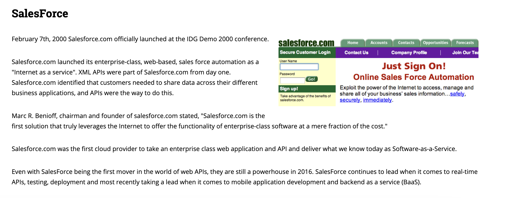

While a lot of the infrastructure and standards for APIs were developed during the same period as the earlier web history, what really made APIs start to take off in the mid-2000s was the emergence of **Web 2.0**.


Web 2.0 was a term coined by Tim O'Reilly in 2004 to describe a new era of the web that was more interactive and user-driven. This era saw the rise of social media platforms like Facebook, YouTube, and Twitter, which allowed users to create and share content online. These platforms started to have massive databases of user-generated content, and so to access this data, they needed to develop APIs.

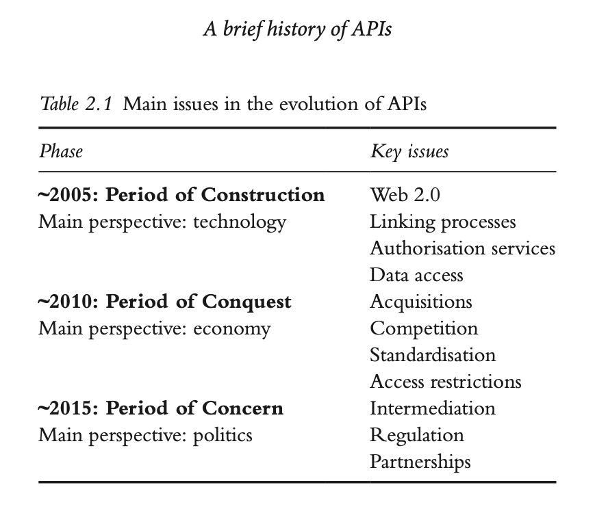

The figure above comes from the chapter “A Brief History of APIs" by Jakob Jünger. Jünger argues that while the early 2000s were important for popularizing the idea of "mashups" (combining data from multiple sources), the mid-2000s saw the rise of social media APIs. Facebook, YouTube, and Twitter all introduced APIs that allowed developers to build applications that integrated social media data. For example, YouTube's API allowed developers to upload videos and access analytics data, while Facebook's API allowed developers to build applications that integrated with the Facebook platform, specifically their Social Graph API, which allowed developers to access data about users and their connections.[^2]


The growth in these platforms led to third-party applications built on their APIs. For example, [TweetDeck](https://en.wikipedia.org/wiki/TweetDeck){target="_blank"} used Twitter's API to let people manage multiple accounts and schedule posts before Twitter purchased it in 2011. This era was characterized by proliferation of third-party applications and a push for standardization. Google and others attempted to standardize API interactions through initiatives such as OpenSocial, but most platforms retained unique APIs and increasingly strict control over data access. Part of this shift followed growing privacy concerns, especially the 2018 revelations that Cambridge Analytica had harvested data from millions of Facebook users without their consent and used it to target political advertisements during the 2016 US presidential election. In the aftermath, many platforms restricted their APIs, leading computational social scientist Deen Freelon to describe a "post-API age."[^3]

Understanding this history is helpful because it gives us a sense of the many users of APIs, as summarized in the table below:

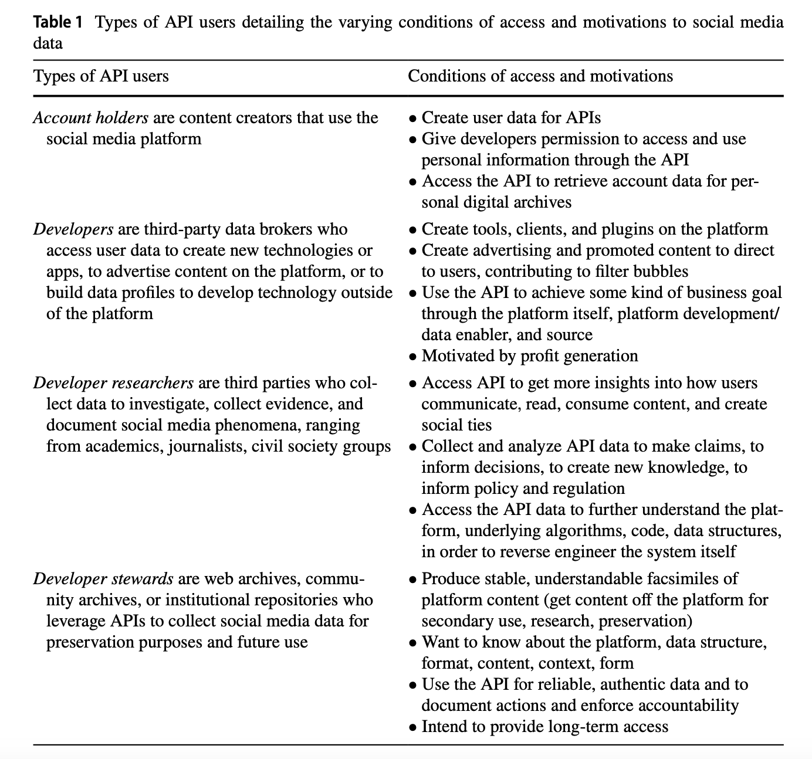

This table comes from Amelia Acker and Adam Kreisberg's article “Social Media Data Archives in an API-Driven World” which explores how APIs are limiting access to social media data and the implications of this for archiving and research; a topic we've discussed in class.[^4] You'll notice in this table they identify a number of different users of APIs, including **individual account holders** on a platform (so if you've ever tried to export your social media data for example), **developers** who build applications that use APIs, **developer researchers** who use APIs to study these platforms, and lastly, **developer stewards** who are often archivists and preservation specialists who use APIs to collect and preserve data. While these groupings are not definitive or exhaustive, they give us a sense of the many different users of APIs and the many different ways APIs are used. However, it is critical to understand that very few APIs are designed to be used by this many different groups of users, and that instead the majority of APIs are designed to be used by a single group of users, often developers building applications since that is the most profitable use of APIs.

## From Web Scraping to MediaWiki APIs

We will begin with the same `requests` library we used for web scraping. The difference is what the server returns and how we work with it:

| Workflow | Request | Response | How we select data |
|---|---|---|---|
| Web scraping | Webpage URL | HTML text | BeautifulSoup and HTML elements |
| API request | API endpoint and parameters | Usually JSON | Dictionary keys and list indexes |

In your `is310-coding-assignments` repository, create a folder called `api-getting-data`, then create a script inside it called `first_api_script.py`. We will use this script as we move across several APIs and Python libraries.

For this example, we are going to work with the *Lord of the Rings* Fandom wiki [https://lotr.fandom.com/wiki/Main_Page](https://lotr.fandom.com/wiki/Main_Page){target="_blank"}. Fandom wikis are fan-created knowledge bases devoted to popular culture. Many grew rapidly beginning in the mid-2000s, turning the interpretive and organizational labor of fan communities into large collections of structured cultural information. *Wookieepedia*, the *Star Wars* wiki, began in 2005 and became one of the best-known examples [https://en.wikipedia.org/wiki/Wookieepedia](https://en.wikipedia.org/wiki/Wookieepedia){target="_blank"}.


These sites are useful for thinking about APIs because the information visible on a wiki page is already highly structured: pages have titles, categories, links, revision histories, and identifiers. Rather than extracting those elements from rendered HTML, we can ask the wiki software to return them directly.

There is also a practical reason to use the API. A request for the rendered Fandom page may receive a `403 Forbidden` because the website uses automated bot protection. Because Fandom wikis run MediaWiki software, the *Lord of the Rings* wiki offers a MediaWiki **API**:

```python
import requests

HEADERS = {
	"User-Agent": "is310-course/1.0 (https://YOUR-USERNAME.github.io; YOUR_NETID@illinois.edu)"
}

response = requests.get("https://lotr.fandom.com/api.php", params={
	"action": "query",
	"list": "categorymembers",
	"cmtitle": "Category:Canon_characters_in_The_Rings_of_Power",
	"cmtype": "page",
	"cmlimit": "max",
	"format": "json",
}, headers=HEADERS, timeout=15)

print(response.status_code)
```

In this code block, we first import the requests library. We then define a set of headers including a `User-Agent` header to identify our script and provide contact information. This pattern is a common requirement for APIs, as it allows the server to track usage and contact developers if necessary. We then make a GET request to the Fandom API endpoint. We have the following parameters:

- `action=query`: This specifies that we want to perform a query action.
- `list=categorymembers`: This specifies that we want to retrieve a list of members of a category.
- `cmtitle=Category:Canon_characters_in_The_Rings_of_Power`: This specifies the title of the category we want to query.
- `cmtype=page`: This specifies that we want to retrieve pages, not subcategories.
- `cmlimit=max`: This specifies that we want to retrieve all members of the category.
- `format=json`: This specifies that we want the response in JSON format.

When this lesson was checked in October 2026, this returned `200`. The same platform that blocked an automated request for the rendered `/wiki/Main_Page` made structured wiki content available through `/api.php`.

### The MediaWiki Action API

To understand the MediaWiki Action API, we need to understand the history of Wikipedia and its underlying software.

[](https://en.wikipedia.org/wiki/History_of_Wikipedia){target="_blank"}

Wikipedia launched in January 2001 as an experiment connected to **Nupedia**, an earlier free encyclopedia whose articles went through a slower expert-review process. The first Wikipedia ran on **UseModWiki**, existing open-source wiki software written in Perl. Rather than using a database, UseModWiki stored pages as individual text files on the server. That was sufficient for an experimental website, but Wikipedia quickly accumulated more articles, revisions, contributors, and readers than the original software had been designed to manage.

In response, Wikipedia contributors developed a new CMS specifically for the project. This software was written in **PHP** and used a **MySQL database**, allowing the site to manage its growing collection of pages and introduce Wikipedia-specific features such as namespaces, talk pages, contribution histories, and watchlists. The English-language Wikipedia adopted this database-backed software in 2002, and it was officially named **MediaWiki** in 2003. That same year, the nonprofit **Wikimedia Foundation** was created to support Wikipedia and the growing family of related projects. You can read more about the history of MediaWiki at [https://www.mediawiki.org/wiki/MediaWiki_history](https://www.mediawiki.org/wiki/MediaWiki_history){target="_blank"}.

Today, **MediaWiki** is the open-source software that runs Wikipedia, Wiktionary, Wikisource, Wikidata, Fandom wikis, and many independent wikis. **Wikimedia** refers to the nonprofit movement and foundation that operates Wikipedia and related projects; it is not the name of the software.

The Action API provides a documented interface through which programs can ask MediaWiki for selected parts of that underlying structure.

[](https://www.mediawiki.org/wiki/API){target="_blank"}

Most publicly accessible MediaWiki sites expose an Action API at a predictable location — `/w/api.php` on Wikimedia's own sites and `/api.php` on many others:

- English Wikipedia: [https://en.wikipedia.org/w/api.php](https://en.wikipedia.org/w/api.php){target="_blank"}
- Wikisource: [https://en.wikisource.org/w/api.php](https://en.wikisource.org/w/api.php){target="_blank"}
- LOTR Fandom wiki: [https://lotr.fandom.com/api.php](https://lotr.fandom.com/api.php){target="_blank"}

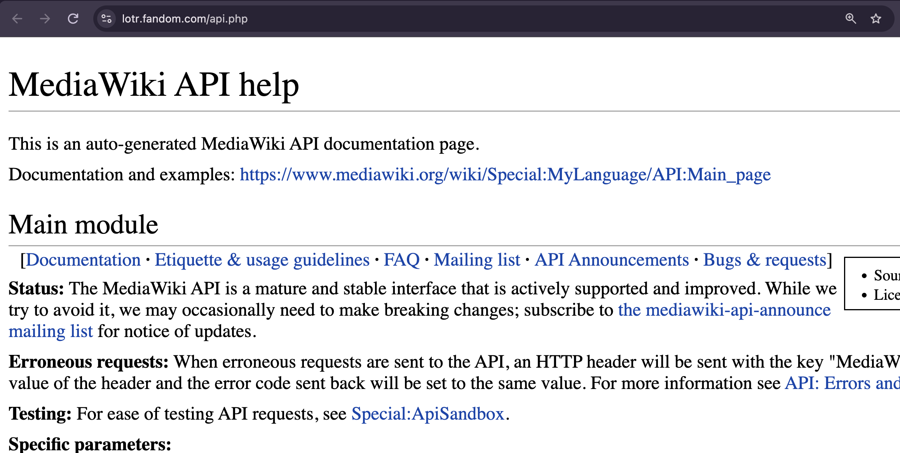

If you open any of those in a browser, you'll get an interactive sandbox where you can build and test queries without writing any Python, which is a very good way to explore before you commit to code. The full reference lives at [https://www.mediawiki.org/wiki/API:Main_page](https://www.mediawiki.org/wiki/API:Main_page){target="_blank"}.

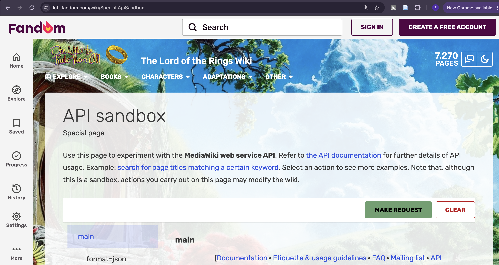

Wikimedia's public APIs do not require an API key for these examples. They do require clients to follow access policies, including sending a descriptive `User-Agent` that identifies the tool and provides contact information [https://foundation.wikimedia.org/wiki/Policy:User-Agent_policy](https://foundation.wikimedia.org/wiki/Policy:User-Agent_policy){target="_blank"}. Other MediaWiki hosts may have different requirements, so always check the host's documentation and policies.

```python
import requests

API_URL = "https://en.wikipedia.org/w/api.php"
HEADERS = {"User-Agent": "is310-course/1.0 (https://YOUR-USERNAME.github.io; YOUR_NETID@illinois.edu)"}
```

Notice this is the *same* practice we adopted for scraping Tolkien Gateway — identify yourself honestly and give someone a way to contact you. Here it isn't just good manners; it's the documented condition of use.

### Structuring an API Query

Nearly everything in the action API goes through `action=query`, with additional parameters describing what you want. Let's ask for the members of a category:

```python
params = {
	"action": "query",
	"list": "categorymembers",
	"cmtitle": "Category:The Lord of the Rings: The Rings of Power",
	"cmtype": "page",
	"cmlimit": "max",
	"format": "json",
}

response = requests.get(API_URL, params=params, headers=HEADERS, timeout=15)
if response.status_code != 200:
	raise RuntimeError(f"API request failed: {response.status_code}")
data = response.json()

for page in data["query"]["categorymembers"]:
	print(page["title"])
```

```bash
The Lord of the Rings: The Rings of Power
List of The Lord of the Rings: The Rings of Power characters
List of The Lord of the Rings: The Rings of Power features
Music of The Lord of the Rings: The Rings of Power
...
```

A few things to notice here, because they generalize to most APIs you'll meet:

- We're passing parameters as a **dictionary** to `params=` rather than gluing them onto the URL with `?` and `&` by hand. `requests` builds the URL and correctly encodes spaces, punctuation, and other characters used inside query values.
- The prefixed parameters (`cmtitle`, `cmtype`, `cmlimit`) belong to the `categorymembers` module. MediaWiki uses short prefixes to keep modules from colliding, so when you read documentation for `list=langlinks` you'll see `ll`-prefixed parameters instead.
- `format=json` explicitly requests machine-readable JSON rather than a browser-oriented representation.

### Answering Our Original Question

Our question is: **how many languages has each character's page been translated into?** Tolkien Gateway is English-only, but on Wikipedia we can investigate this using `prop=langlinks`:

```python
def get_language_count(title):
	response = requests.get(API_URL, params={
		"action": "query",
		"titles": title,
		"prop": "langlinks",
		"lllimit": "max",
		"redirects": 1,
		"format": "json",
	}, headers=HEADERS, timeout=15)
	if response.status_code != 200:
		print(f"Could not retrieve {title}: {response.status_code}")
		return None

	pages = response.json()["query"]["pages"]
	page = next(iter(pages.values()))
	if "missing" in page:
		return None
	return len(page.get("langlinks", []))

for character in ["Sauron", "Galadriel", "Elrond", "Gil-galad", "Celebrimbor"]:
	print(f"{character:14} {get_language_count(character)}")
```

```bash
Sauron         57
Galadriel      45
Elrond         42
Gil-galad      28
Celebrimbor    20
```

That `next(iter(pages.values()))` is a little awkward, and it's worth explaining. The API returns pages keyed by their internal page ID — `{"query": {"pages": {"23140073": {...}}}}` — and we don't know the ID in advance. So we take the first (and here, only) value from the dictionary rather than trying to look it up by key.

Now try the same function on the characters invented for the show:

```python
for character in ["Arondir", "Halbrand", "Disa"]:
	print(f"{character:14} {get_language_count(character)}")
```

```bash
Arondir        2
Halbrand       2
Disa           5
```

Every one of these numbers is wrong, and **not one of them raised an error.** Let's find out why, because the two failure modes here are ones you will meet constantly.

First, `Arondir` and `Halbrand`. Ask the API to report what it did with the titles you gave it:

```python
response = requests.get(API_URL, params={
	"action": "query", "titles": "Arondir|Halbrand|Galadriel",
	"prop": "langlinks", "lllimit": "max", "redirects": 1, "format": "json",
}, headers=HEADERS, timeout=15)
if response.status_code != 200:
	raise RuntimeError(f"API request failed: {response.status_code}")
print(response.json()["query"]["redirects"])
```

```python
[{'from': 'Halbrand', 'to': 'List of The Lord of the Rings: The Rings of Power characters', 'tofragment': 'Halbrand'},
 {'from': 'Arondir', 'to': 'List of The Lord of the Rings: The Rings of Power characters', 'tofragment': 'Arondir'}]
```

**The invented characters do not have Wikipedia articles at all.** They are redirects into a section of a single shared "List of characters" page. Our function faithfully reported the language count of that list page — the `2` was real, it just wasn't about Arondir.

`Disa` fails differently, and worse. It isn't a redirect; there is a genuine English Wikipedia article at that exact title. When this lesson was checked in September 2026, that article concerned **a heroine from a Swedish legendary saga**, not the television character. Our function looked up a real page, found five language links, and returned a perfectly plausible number about the wrong subject. The page attached to an ambiguous name may change again, which is precisely why the lookup must be validated.

These are the two ways a title-based lookup goes wrong:

- **The right subject at the wrong granularity** — a redirect sends you to a broader page that contains your topic as a section.
- **The wrong subject entirely** — a name is ambiguous, and you silently get somebody else's article.

Neither produced an exception. Both produced small integers that would have slotted straight into a spreadsheet next to Galadriel's `45` and looked entirely reasonable. If you had run this over fifty characters and gone straight to a bar chart, you would never have known.

The first defense is to make the API tell you what it actually resolved. Ask for redirects, resolved titles, and a short article extract alongside the language data:

```python
response = requests.get(API_URL, params={
	"action": "query", "titles": "Arondir|Disa|Galadriel",
	"prop": "langlinks|extracts", "lllimit": "max", "redirects": 1,
	"exintro": 1, "explaintext": 1, "format": "json",
}, headers=HEADERS, timeout=15)
if response.status_code != 200:
	raise RuntimeError(f"API request failed: {response.status_code}")

data = response.json()["query"]
print("Redirects:", data.get("redirects", []))
for page in data["pages"].values():
	print("\nResolved title:", page["title"])
	print("Language links:", len(page.get("langlinks", [])))
	print("Article preview:", page.get("extract", "")[:160])
```

If the title that comes back is different from the title you requested, you have a matching problem. But matching titles are not sufficient: `Disa` still resolves to `Disa`, so only the article preview reveals that the page concerns a legendary Swedish figure. For a larger project, you would save the requested title, resolved title, redirect target, article preview, and ideally a Wikidata identifier for manual or computational validation. **No title-matching rule can establish subject identity on its own.**

After resolving these errors, we can compare the pattern with the Tolkien Gateway scrape. The selected Tolkien-derived characters have extensively referenced Tolkien Gateway pages and independent Wikipedia articles in many languages, while several show-created characters appear only within a shared Wikipedia list. The convergence is interesting, but it is not fully independent corroboration: both sources are community-edited wikis, and both may reproduce the same differences in fan attention, notability rules, and available source material. Comparing sources is useful partly because it lets us ask whether they share the same infrastructure and biases.

### A Different Shape: The Pageviews API

Wikimedia also publishes a completely separate API for **traffic data**, and it's a good illustration that one organization can offer several APIs in different styles. Where the action API uses query parameters, the Pageviews API is a **REST API** that encodes everything in the URL path:

```
https://wikimedia.org/api/rest_v1/metrics/pageviews/per-article/{project}/{access}/{agent}/{article}/{granularity}/{start}/{end}
```

Let's ask how many people read the Galadriel article each month across 2022 — the year *The Rings of Power* premiered:

```python
url = ("https://wikimedia.org/api/rest_v1/metrics/pageviews/per-article/"
       "en.wikipedia/all-access/user/Galadriel/monthly/2022010100/2023060100")

response = requests.get(url, headers=HEADERS, timeout=15)
if response.status_code != 200:
	raise RuntimeError(f"Pageviews request failed: {response.status_code}")

# We deliberately requested one extra, partial month; see the warning below.
for item in response.json()["items"][:-1]:
	print(item["timestamp"], f'{item["views"]:>9,}')
```

```bash
2022010100    54,316
2022020100    66,108
2022030100    28,559
2022040100    23,323
2022050100    19,691
2022060100    18,763
2022070100    51,683
2022080100    77,249
2022090100   761,399
2022100100   393,275
2022110100    85,923
2022120100    59,012
2023010100    51,692
2023020100    38,565
2023030100    38,016
2023040100    31,706
2023050100    27,206
```

Look at September 2022. The show premiered on September 1st, and readership of the Galadriel article rose from **77,249 in August to 761,399 in September**, nearly a tenfold month-to-month increase. September was roughly forty times the approximately 19,000 views recorded in June. Readership then declined over the following months while remaining above that June baseline in the period shown.

This is cultural data of a kind that is genuinely hard to get any other way. It is a record of collective attention: hundreds of thousands of people, having watched something, going to look it up. It connects directly to the readings on bestseller lists and algorithmic popularity from our scraping week, and it lets you ask questions with real historical shape — when did people become interested in this, what made them, and did the interest last?

::: {.callout-warning}
## Watch the Last Bucket

You may have noticed the `[:-1]` in that loop. It is there for a reason worth knowing about.

With this request, the Pageviews API returns a final bucket that runs from the start of June **up to our June 1 end timestamp**, so it reports only about one day's traffic: roughly 800 views rather than the complete month's total.

Run this particular example without the slice and the series appears to fall off a cliff in June. That drop is a boundary artifact, not a real collapse in attention. A final bucket is not inherently incomplete; it becomes incomplete when the requested end timestamp falls before the period has finished.

For this workflow, **request one additional period, inspect it, and discard it only when you know it is partial.** Do not automatically delete the last observation from every API response. Boundary behavior is common in time-series APIs, so read the endpoint documentation, print or plot the result before analysis, and investigate dramatic changes at either end of the range.
:::

The date format is also unforgiving (`YYYYMMDDHH`, so `2022010100` is January 1, 2022 at hour 00), and the article title must be exactly right, underscores and all. But note what this API does *not* require: no key, no account, no application form. Wikimedia publishes this because the Wikimedia Foundation is a nonprofit whose mission includes making its data available — a very different institutional posture from the platforms in the "post-API age" we discussed earlier, and one worth noticing when you choose what to build research on.

## Authentication and Parameters With The One API

Wikimedia allowed us to make successful requests without creating an account. Not every API is designed that way. We will next use *The One API* [https://the-one-api.dev/](https://the-one-api.dev/){target="_blank"} to examine public and restricted endpoints, authentication, filtering, and relationships among records. For those unfamiliar, the one in the name is a reference to the *Lord of the Rings* series, where the One Ring is the most powerful of the Rings of Power and is the central plot device of the series.


According to the documentation, "*The One API* to rule them all is a non-commercial, open-source project" and provides access to data from the *Lord of the Rings* books and movies, including characters, quotes, and books.

If we go to the about page [https://the-one-api.dev/about](https://the-one-api.dev/about){target="_blank"}, we can learn that the project was created in 2019 by Ulrike Exner and Mateusz Kikmunter, who are both developers. We can also visit the GitHub repository for the project [https://github.com/gitfrosh/lotr-api/graphs/contributors](https://github.com/gitfrosh/lotr-api/graphs/contributors){target="_blank"} to see the history of the project.

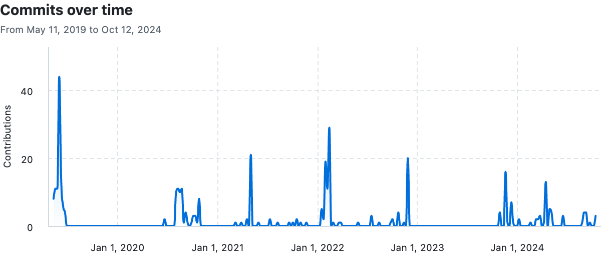

So let's try this out!

### Making an API Request

Return to `first_api_script.py`. We already imported `requests` for Wikimedia, so now create a variable containing the books endpoint from *The One API*:

```python
import requests

url = 'https://the-one-api.dev/v2/book'
```

**If Python says that `requests` is not installed, remember to activate your virtual environment and install the packages from the lesson requirements.**

Now how could we use this URL to get data from the API? We could use the `requests.get` method we used in the web scraping lesson. Let's try that out.

```python
response = requests.get(url)
```

How could we see that this request worked? We can print the status code of the response.

```python
print(response.status_code)
```

Hopefully we are all seeing `200` responses, but if you are seeing a `404` or `403` response, you might need to authenticate with the API. We will discuss this more in the next section, but for now, let's try to print out the response.

In our web scraping lesson, we used the `.text` method to print out the response, but for APIs, we often use the `.json()` method. Let's try that out.

```python
print(response.json())
```

You should see something like the following:

```json
{
	'docs':
		[
			{
				'_id': '5cf5805fb53e011a64671582',
				'name': 'The Fellowship Of The Ring'
			},
			{
				'_id': '5cf58077b53e011a64671583',
				'name': 'The Two Towers'
			},
			{
				'_id': '5cf58080b53e011a64671584',
				'name': 'The Return Of The King'
			}
		],
 	'total': 3,
 	'limit': 1000,
 	'offset': 0,
 	'page': 1,
 	'pages': 1
}
```

This is the data that *The One API* returned to us. It's in a format called `JSON`, which stands for JavaScript Object Notation and was originally designed to allow websites to pass data back and forth between the browser and the server. But it's become a really popular generic format for all sorts of things and all sorts of languages. You'll notice that `JSON` looks very similar to a Python dictionary, and in fact, it's a way to store data that is similar to a Python dictionary.

Based on this data, we can see that *The One API* has returned data about the three books in the *Lord of the Rings* series. Each book has an `_id` and a `name`. The books themselves are returned in a list for the key `docs`, and then there are some other keys that provide information about the data that was returned, including `total`, `limit`, `offset`, `page`, and `pages`. `Total` tells us how many items were returned, `limit` tells us how many items *could be* returned per page, `offset` tells us where in the data we are (similar to indexing), `page` tells us what page we are on, and `pages` tells us how many pages of data there are.

While this is a pretty minimal amount of data, it does give us a sense of how APIs work. Just as if we were going to a web browser, we can make requests to an API and get data back. This data will be structured in some way and we can use that structure to understand the data and to work with it. It is important to note that there is no one way that APIs are structured, and each API will have its own structure and its own way of working. This is why it's important to read the documentation for an API before you start working with it.

### Authentication & Endpoints

So far we have just been able to send a request to *The One API* and get data back, but what if we wanted to get more specific data? For example, what if we wanted to get data about a specific character or quote from the *Lord of the Rings* series? To do this, we need to use something called an **endpoint**.

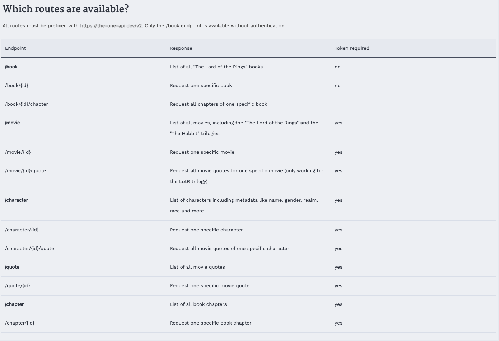

If we go to *The One API* documentation [https://the-one-api.dev/documentation#4](https://the-one-api.dev/documentation#4){target="_blank"}, we see the following table that outlines what `endpoints` exist.

An endpoint might sound like a very technical term, but it is essentially just a specific URL that is used to access a specific piece of data from an API. For example, if we wanted to get data about a specific character, we would use the `/character` endpoint. If we wanted to get data about a specific quote, we would use the `/quote` endpoint.

We can even try out that initial book endpoint in the browser which should give us the following:

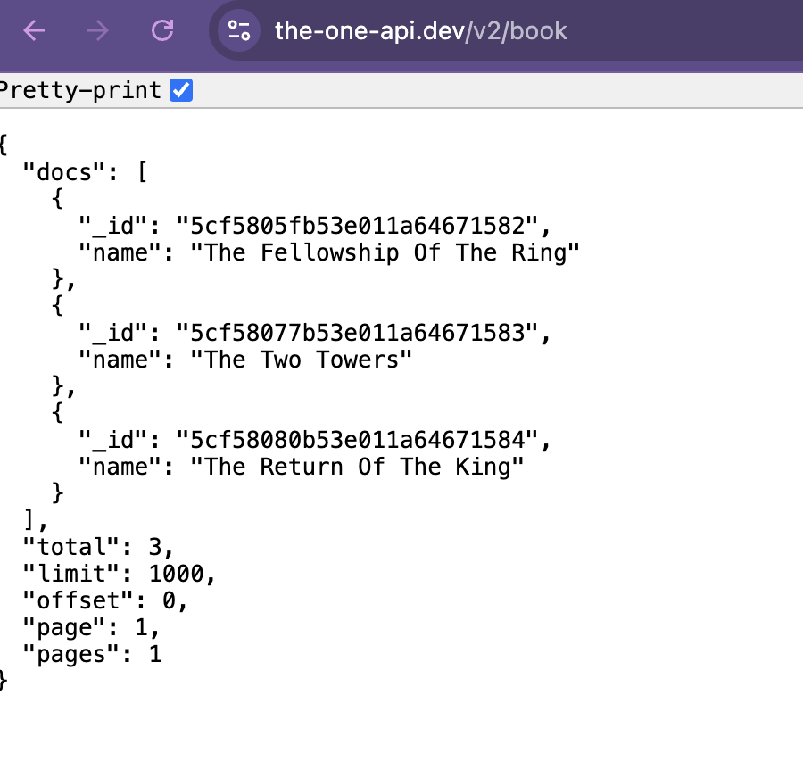

However, if we try to get characters or quotes in the browser, we will see the following:

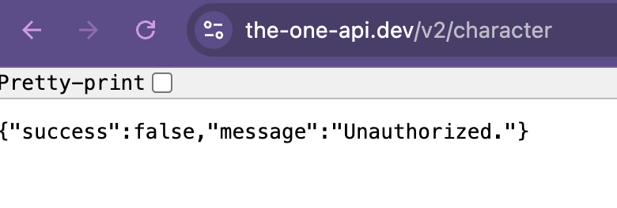

Indeed, if we update our python code we can see the exact same thing.

```python
url = 'https://the-one-api.dev/v2/character'
response = requests.get(url)
print(response.status_code)
```

This should return a `401` status code, which means that we are not **authorized** to access this data. This is because the LOTR API requires us to authenticate before we can access data about characters or quotes. This is a common feature of APIs, as it allows the API to track who is accessing their data and to limit access to certain users.

Authentication can sound intimidating but you actually do it all the time already. For example, when you login to your email, you are authenticating with a server to access your email. When you login to DUO, you are authenticating with a server to access your account. When you login to social media, you are authenticating with a server to access your account. The difference is that when you use a web browser, this is all handled automatically for you, but when you use an API, you have to do this explicitly.

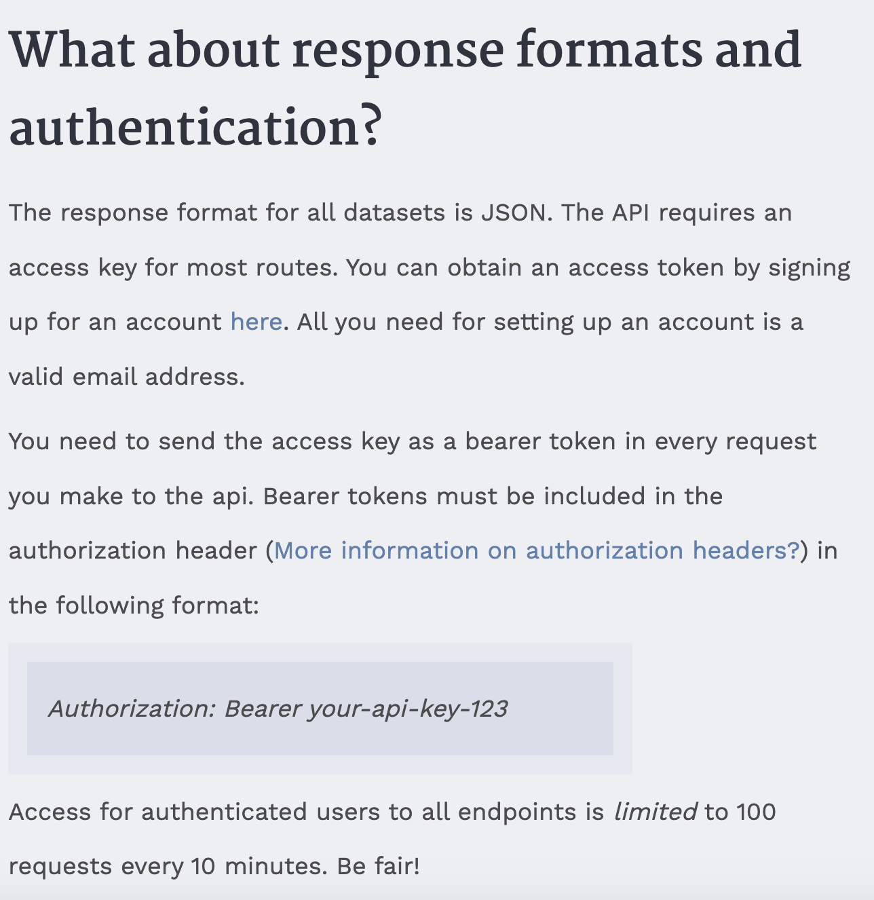

If we return to *The One API* documentation [https://the-one-api.dev/documentation#3](https://the-one-api.dev/documentation#3){target="_blank"}, we can see that we need to sign up for an account to use the API at this link [https://the-one-api.dev/sign-up](https://the-one-api.dev/sign-up){target="_blank"}.

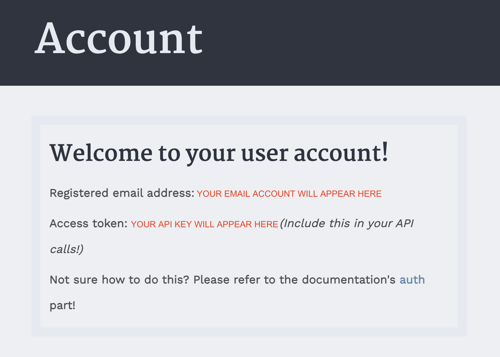

Once you have signed up and logged in, you should see the above page for your account, which will include your `API key`. This key is unique to you and is used to identify you when you make requests to the API. It's like a password, so you should keep it secret and not share it with anyone.

You should copy the key into your `first_api_script.py` and then try to get data about characters or quotes.

```python
api_key = "API KEY HERE"
url = 'https://the-one-api.dev/v2/character'
authorization_headers = {
	'Authorization': 'Bearer ' + api_key
}
```

You'll notice that we are using a new variable called `authorization_headers` that is a dictionary with a key of `'Authorization'` and a value of `'Bearer ' + api_key`. This is how we pass our key to *The One API* so that it knows who we are and that we are allowed to use their API.

Now let's update our `requests.get` method to include these headers.

```python
response = requests.get(url, headers=authorization_headers)
print(response.status_code)
```

Now we should see a `200` status code, which means that we are authorized to access this data. Before we explore this new data, we need to first understand how to store our API keys securely.

Currently, we just have our api key in a string in a variable, which is easy to use but it's not the most secure. For example, if you pushed this up to GitHub, then everyone would be able to see and use your API key. You'll notice that *The One API* says that you should limit your requests "to 100 requests every 10 minutes". However, if you shared your key, someone could easily use it and you would be locked out of the API. Even worse, if they did something illegal with your key, you could be held responsible. So rule of thumb is don't share your API key!

#### Storing API Keys

There are a number of ways to more securely store your API keys.

One option is just copying our API keys to a text file and save them there (especially because they are rarely something you can memorize), but there's also more programmatic ways to do this.

Another option is that you could store your API keys as an environment variable. Environment variables are a way to store data that is accessible to all programs running on your computer.

To create an environment variable, you open your terminal and type the following, replacing `api_key` with your API key.

For Macs/WSL:

```sh
export THE_ONE_API_KEY="YOUR_API_KEY_HERE"
```

For Windows/PowerShell:

```powershell
$env:THE_ONE_API_KEY = "YOUR_API_KEY_HERE"
```

Now you can access these environment variables in your Python script by using the `os` library.

```python
import os
the_one_api_key = os.environ['THE_ONE_API_KEY']
```

These commands set the variable only for the current terminal session, so you would need to run the appropriate command again after opening a new terminal. Persistent environment variables require editing your shell profile, but a credential-storage library is simpler for this course. Do not print API keys while testing because terminal output can be copied into screenshots, logs, or shared debugging messages.

This is a bit more work though, and one easier option is to use a Python library for storing API keys, called `apikey` [https://github.com/ulf1/apikey](https://github.com/ulf1/apikey){target="_blank"}.

In your terminal, type `python -m pip install "apikey>=0.2.4"` to install the library. Then import it into your script and write:

```python
import apikey

apikey.save("THE_ONE_API_KEY", "YOUR_API_KEY_HERE")

the_one_api_key = apikey.load("THE_ONE_API_KEY")
```

While you can use any of these options, I would recommend using the `apikey` library, as it's the most secure and the easiest to use. If you continue with programming, you will likely end up using the `.zshrc` or `.bashrc` method, but for now, the `apikey` library is the best option.

### Making API Requests

Now that we have our api key stored securely, let's try to get data about characters from *The One API*. We can do this by updating our `url` variable to include the `/character` endpoint.

```python
the_one_api_key = apikey.load("THE_ONE_API_KEY")
authorization_headers = {
	'Authorization': 'Bearer ' + the_one_api_key
}
url = 'https://the-one-api.dev/v2/character'
response = requests.get(url, headers=authorization_headers)
if response.status_code == 200:
	print(response.json())
else:
	print(response.status_code)
```

This should show a much larger amount of data, including information about all the characters from the *Lord of the Rings* series in this database. You'll notice that the data is structured in a similar way to the data about books, with a list of characters and some other information about the data that was returned.

```json
{'docs': [{'_id': '5cd99d4bde30eff6ebccfbbe',
   'name': 'Adanel',
   'wikiUrl': 'http://lotr.wikia.com//wiki/Adanel',
   'race': 'Human',
   'birth': None,
   'gender': 'Female',
   'death': None,
   'hair': None,
   'height': None,
   'realm': None,
   'spouse': 'Belemir'},
  {'_id': '5cd99d4bde30eff6ebccfbbf',
   'name': 'Adrahil I',
   'wikiUrl': 'http://lotr.wikia.com//wiki/Adrahil_I',
   'race': 'Human',
   'birth': 'Before ,TA 1944',
   'gender': 'Male',
   'death': 'Late ,Third Age',
   'hair': None,
   'height': None,
   'realm': None,
   'spouse': None},
  {'_id': '5cd99d4bde30eff6ebccfbc0',
   'name': 'Adrahil II',
   'wikiUrl': 'http://lotr.wikia.com//wiki/Adrahil_II',
...
 'total': 933,
 'limit': 1000,
 'offset': 0,
 'page': 1,
 'pages': 1}
 ```

Since the api response is in json format, we can work with it similar to working with a dictionary. For example, we can see all the keys in the response by using the `.keys()` method.

```python
response.json().keys()
```

This should show the following:

```python
dict_keys(['docs', 'total', 'limit', 'offset', 'page', 'pages'])
```

We can access the `total` key to see how many characters are in the database.

```python
response.json()['total']
```

This should return `933`, which means that there are 933 characters in the database. We can also loop through the `docs` key to see each character.

```python
for character in response.json()['docs']:
	print(character)
```

This should show a list of dictionaries, each of which contains information about a character from the *Lord of the Rings* series. You'll notice that each character has an `_id`, a `name`, a `wikiUrl`, a `race`, a `birth`, a `gender`, a `death`, a `hair`, a `height`, a `realm`, and a `spouse`.

So if we only wanted to see the data about a certain character, like Galadriel, we could loop through the characters and print out the data for Galadriel.

```python
for character in response.json()['docs']:
	if character['name'] == 'Galadriel':
		print(character)
```

Which would return the following data:

```json
{'_id': '5cd99d4bde30eff6ebccfd06', 'name': 'Galadriel', 'wikiUrl': 'http://lotr.wikia.com//wiki/Galadriel', 'race': 'Elf', 'birth': 'YT 1362', 'gender': 'Female', 'death': 'Still alive: Departed over the sea on ,September 29 ,3021', 'hair': 'Golden', 'height': 'Tall', 'realm': 'Eregion,Lothlórien,Caras Galadhon', 'spouse': 'Celeborn'}
```

While we can do this using Python, we could also change our URL to only get data about Galadriel. We can do this by adding a query parameter to our URL.

```python
url = 'https://the-one-api.dev/v2/character?name=Galadriel'
response = requests.get(url, headers=authorization_headers)
print(response.json())
```

Query parameters are a way to pass data to an API to get specific data back. In this case, we are passing the query parameter `name=Galadriel` to *The One API* to get data about the character Galadriel. You'll notice that the URL has a `?` at the end of it, followed by the query parameter `name=Galadriel`. Returning to the API's documentation [https://the-one-api.dev/documentation#5](https://the-one-api.dev/documentation#5){target="_blank"}, we can see that we can use query parameters for sorting, filtering, and pagination data from *The One API*.


As you can see in the figure above, you can also add multiple query parameters by separating them with an `&`. For example, if we wanted to get all other elves besides Galadriel, we could use the does not match query parameter `name!=Galadriel` and chain that with the race query parameter `race=Elf`.

```python
url = 'https://the-one-api.dev/v2/character?name!=Galadriel&race=Elf'
response = requests.get(url, headers=authorization_headers)
print(f"Total number of elves besides Galadriel: {response.json()['total']}")
```

Finally, we can also use the `id` in each data returned from the API to get more specific data. For example, if we wanted to get data about all the movie quotes of Galadriel, we could first get the id of Galadriel and then use that id to get data about her quotes.

```python
url = 'https://the-one-api.dev/v2/character?name=Galadriel'
response = requests.get(url, headers=authorization_headers)
galadriel_id = response.json()['docs'][0]['_id']
quote_url = f'https://the-one-api.dev/v2/character/{galadriel_id}/quote'
response = requests.get(quote_url, headers=authorization_headers)
print(response.json())
```

Finally, let's use the `time` library in Python so that we don't exceed the 100 requests every 10 minutes limit.

```python
import time

url = 'https://the-one-api.dev/v2/character?name=Galadriel'
response = requests.get(url, headers=authorization_headers)
galadriel_id = response.json()['docs'][0]['_id']
quote_url = f'https://the-one-api.dev/v2/character/{galadriel_id}/quote'
response = requests.get(quote_url, headers=authorization_headers)
print(response.json())
time.sleep(10)
```

Understanding how to use query parameters and how to use the `id` of data returned from an API is critical to working with APIs, as it allows you to get specific data from an API. This is especially important when working with large datasets, as it allows you to filter and sort data to get the data you need. Remember collecting all the data is not always the best option, and can actually lead to more work depending on your research question.

## From Direct Requests to API Wrappers

So far we have been using the `requests` library to make our API calls, which is usually how you should work with APIs. However, occasionally, developers will create Python libraries to work with APIs, which can make working with APIs easier. These libraries are called API wrappers, and they are essentially Python libraries that provide a set of functions to work with an API.

You can imagine if instead having to write a `requests.get` method every time you wanted to get a character and their number of quotes from *The One API*, we could instead write a Python Class that would make the request and store the data for us. This is what an API wrapper does, it abstracts the process of making requests to an API and allows you to work with the data more easily.

Indeed, a developer named Nathanial Hapeman has created one for *The One API*, which you can see here [https://pypi.org/project/nrh-lotr/0.0.3/](https://pypi.org/project/nrh-lotr/0.0.3/){target="_blank"}. If you want to try out this library, install it in your active virtual environment:

```sh
python -m pip install nrh-lotr==0.0.3
```

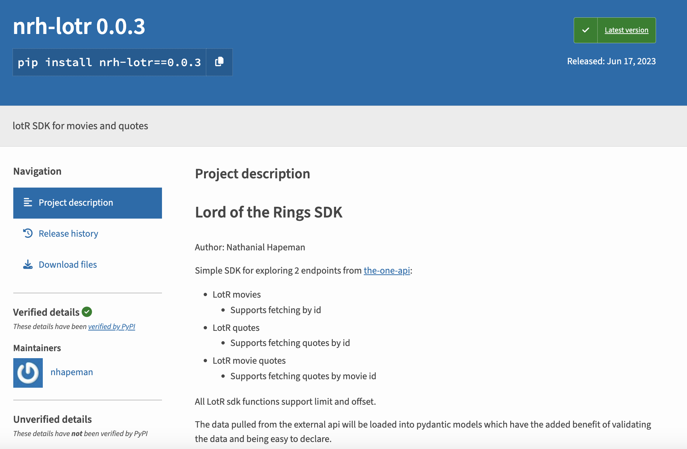

If you scroll down to `Usage` section, you can see how the developer has created a class called `LOTR` that takes your api key and then makes requests for you.

```python
import apikey
from lotr import LOTR

the_one_api_key = apikey.load("THE_ONE_API_KEY")
lotr = LOTR(the_one_api_key)
movies = lotr.movies(limit=5)
print(movies)
```

We can also see how the library is organized if we inspect it after installing it:

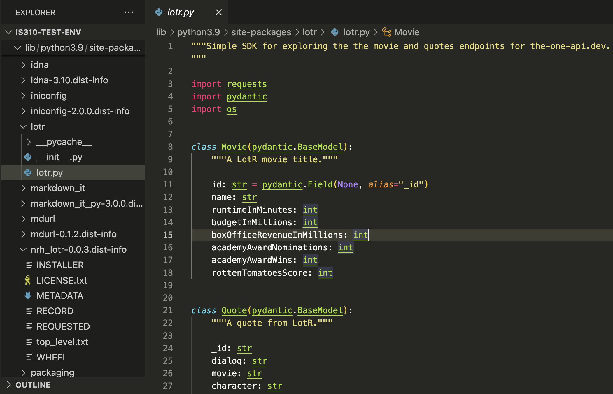

::: {.callout-important}
## Fixing Pydantic Types For NRH-LOTR

In our class on Thursday, we ran into an issue with installing and using the `nrh-lotr` library, with this issue appearing in the terminal:

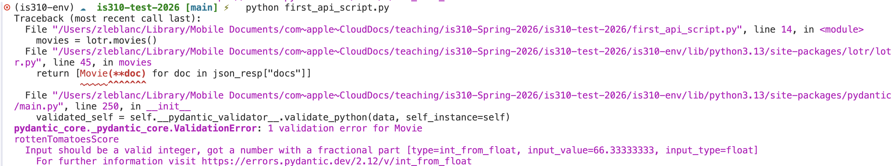

### What Went Wrong?

**Pydantic** is a data validation library that checks whether the data you receive from an API matches the types you declared in your model. When the API returned a value for `rottenTomatoesScore` of `66.33333333` (a decimal), but the model was expecting an `int` (whole number), Pydantic rejected it. You can't fit a float into an integer without losing information, so Pydantic threw a validation error.

### The Fix

The library developer assumed Rotten Tomatoes scores would be integers, but the actual API returns percentage scores with decimal values. The solution was simple: change the type annotation from `int` to `float` to allow decimal numbers:

```python
class Movie(pydantic.BaseModel):
    """A LotR movie title."""

    id: str = pydantic.Field(None, alias="_id")
    name: str
    runtimeInMinutes: int
    budgetInMillions: int
    boxOfficeRevenueInMillions: float # Changed from int to float
    academyAwardNominations: int
    academyAwardWins: int
    rottenTomatoesScore: float  # Changed from int to float
```

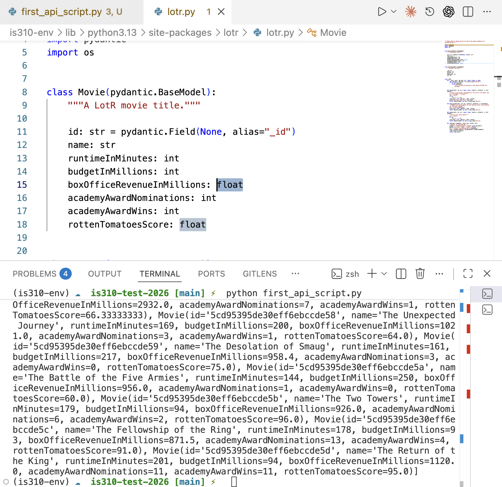

### Why This Matters

This is a great example of why **API wrappers are imperfect**. The person who wrote `nrh-lotr` made assumptions about the data that didn't match reality. This teaches us to:

- Always read the actual API documentation carefully
- Test wrapper code against real data
- Be aware that library developers may have made incorrect assumptions about data types
- Know that Pydantic validates your data to catch these mismatches early
:::

And you can see how's it making requests to the API by looking at the source code.

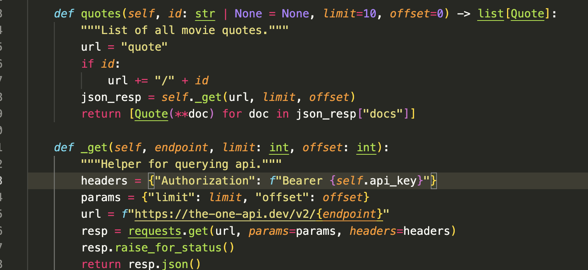

However, if you scroll down further in the documentation, you'll notice that this library only makes requests for the following endpoints:

```bash
/movie
/movie/{id}
/movie/{id}/{quote}
/quote
/quote/{id}
```

Such limited functionality means that we couldn't use this library to get data about characters or books, which is a major limitation. These types of limitations are common when working with API wrappers, as they are often created by developers who are not affiliated with the API itself and who may not have the time or resources to create a full-featured library. However, they can be a good way to get started with an API, especially if you are new to working with APIs.

## From an API Wrapper to a Collection Library

The `nrh-lotr` package is a small wrapper created by an independent developer for selected endpoints from *The One API*. Other Python libraries support a much larger set of activities around an entire platform. To see the difference, we are going to work with the [Internet Archive](https://archive.org/){target="_blank"} and its [`internetarchive` Python library](https://archive.org/developers/internetarchive/){target="_blank"}.

We have already discussed the Internet Archive as a digital library, preservation institution, and argument about universal access. Its Python library gives us another perspective on that institution: what does the Archive make computationally accessible, and how does its software define an archival item?

Install the library inside your active virtual environment:

```sh
python -m pip install internetarchive
```

The package provides both a Python library and an `ia` command-line program. This is a useful reminder that a library is not necessarily only an API wrapper. It can combine multiple endpoints and workflows into a broader interface for searching, inspecting, downloading, and contributing material.

### Searching the Internet Archive

We can begin with a search:

```python
import internetarchive

search = internetarchive.search_items(
	'title:"Lord of the Rings" AND mediatype:texts',
	fields=["identifier", "title", "date"],
)

for result in search:
	print(result.get("identifier"))
	print(result.get("title"))
	print(result.get("date"))
	print()
```

The query combines a phrase search with a fielded search. `title:"Lord of the Rings"` asks for that phrase in the title field, while `mediatype:texts` limits the results to records that the Internet Archive classifies as texts. The `fields` argument tells the library which metadata to include in each compact search result. Just as with the parameters used by Wikimedia and *The One API*, the available fields shape both what we can ask and what the service returns.

::: {.callout-tip}
## Start Small

An Internet Archive search can contain thousands of results. While testing, use a narrow query and stop after a small number of records:

```python
for index, result in enumerate(search):
	print(result.get("identifier"), result.get("title"))
	if index == 9:
		break
```

Later, you can decide whether your research question requires more records.
:::

### From Search Results to Archival Items

The search results contain enough metadata to identify possible items, but they are not necessarily the complete record. We can use an item's identifier to request the item itself:

```python
identifier = "YOUR_ITEM_IDENTIFIER"
item = internetarchive.get_item(identifier)

print(item.metadata)
```

An Internet Archive **item** is a container that can include descriptive metadata, one or more files, reviews, usage information, and relationships to collections. It might represent a book, a recording, a software program, a film, a collection of images, or a captured website. The shared item model makes these materials computationally accessible, but it also places very different cultural objects inside one common structure.

We can inspect selected metadata rather than printing the entire record:

```python
metadata = item.metadata

print("Title:", metadata.get("title"))
print("Creator:", metadata.get("creator"))
print("Date:", metadata.get("date"))
print("Media type:", metadata.get("mediatype"))
print("Collection:", metadata.get("collection"))
print("License:", metadata.get("licenseurl"))
```

Notice the use of `.get()`. Records contributed by different people and institutions do not always contain the same fields. A missing creator or rights statement does not necessarily mean that no creator or rights holder exists; it means that the information is not represented in that field in this record.

### Files Are Not the Same as Items

An item can contain many files: the original upload, derivatives created by the Internet Archive, OCR text, metadata files, thumbnails, or multiple media formats.

```python
for file in item.files:
	print(file.name, file.metadata.get("format"))
```

This distinction matters for research. Searching item metadata tells us about catalogued objects. Counting files tells us about digital representations and derivatives. Neither count automatically tells us how many distinct cultural works exist.

Questions to consider:

- Who created the original cultural object?
- Who digitized or uploaded it?
- Who created its metadata?
- Which files are original, and which were generated by the platform?
- What rights information is available?
- What does the library make easier than direct API requests, and what infrastructure does it hide?

## Moving Across Cultural Heritage APIs: Europeana

The Internet Archive maintains items and files within its own platform. [Europeana](https://www.europeana.eu/en){target="_blank"}, by contrast, aggregates cultural heritage metadata from museums, galleries, libraries, and archives across Europe.

Europeana was proposed in 2005 by six European heads of state as a European digital library and launched in 2008.[^5] Its early work focused on encouraging heritage institutions to contribute digital material. Later versions placed greater emphasis on reuse, curated exhibitions, and access across institutional collections.


This structure creates an important distinction:

- The cultural object may be held by one institution.
- Its digital representation may have been created by that institution or another partner.
- Its metadata may be mapped into the Europeana Data Model.
- Europeana provides another record and interface through which that material can be discovered.

The API therefore gives us access not only to objects, but to the results of institutional aggregation and metadata standardization.

### Authenticating With Europeana

Europeana requires an API key for most of its public APIs. You can request one from the [Europeana API registration page](https://pro.europeana.eu/page/get-api){target="_blank"}. Store it with the same `apikey` library we used for *The One API*:

```python
import apikey

europeana_api_key = apikey.load("EUROPEANA_API_KEY")
```

Europeana recommends sending the key in an `X-Api-Key` header rather than placing it in the URL. This reduces the chance that a key will be exposed through copied URLs, browser histories, or logs.

```python
import requests

url = "https://api.europeana.eu/record/v2/search.json"
headers = {
	"X-Api-Key": europeana_api_key,
	"User-Agent": "is310-course/1.0 (YOUR_NETID@illinois.edu)",
}
params = {
	"query": "Tolkien",
	"rows": 10,
	"profile": "rich",
}

response = requests.get(url, headers=headers, params=params, timeout=15)

if response.status_code == 200:
	data = response.json()
	print("Total results:", data["totalResults"])
else:
	print("Request failed:", response.status_code)
```

This request returns only ten records, but `totalResults` tells us how many records matched the query across Europeana. The `items` key contains the records returned on this page.

### Reading Aggregated Metadata

Let's inspect some of the metadata fields that made the earlier `pyeuropeana` example useful:

```python
for item in data["items"]:
	print("Title:", item.get("title"))
	print("Creator:", item.get("dcCreator"))
	print("Provider:", item.get("dataProvider"))
	print("Country:", item.get("country"))
	print("Rights:", item.get("rights"))
	print("Europeana page:", item.get("guid"))
	print()
```

These values are frequently lists, multilingual dictionaries, or absent altogether. That variation is not merely a programming inconvenience. It reflects different cataloguing traditions, languages, institutional systems, source records, and decisions made while mapping metadata into a shared model.

### Asking Different Questions With Search Parameters

Europeana's Search API supports more than keyword searching. We can use parameters to narrow records by type, rights, media availability, theme, provider, or other indexed fields:

```python
params = {
	"query": '"Alfred Book"',
	"qf": ["TYPE:IMAGE"],
	"reusability": "open AND permission",
	"media": True,
	"thumbnail": True,
	"profile": "rich",
	"rows": 25,
}

response = requests.get(url, headers=headers, params=params, timeout=15)

if response.status_code == 200:
	data = response.json()
	print("Total results:", data["totalResults"])
```

The parameters encode research choices:

- `query` specifies the main search; quotation marks ask for the phrase `Alfred Book`.
- `qf` adds fielded filters.
- `TYPE:IMAGE` includes records categorized as images.
- `reusability` filters by rights information supplied to Europeana.
- `media` and `thumbnail` ask for records with digital media representations.
- `profile` controls how much metadata the API returns.
- `rows` controls the size of this page of results.

A query for openly reusable images is not simply finding images that exist. It is finding records whose institutions supplied enough standardized rights and media information for Europeana to identify them that way.

### Why Not Use `pyeuropeana`?

[`pyeuropeana`](https://pypi.org/project/pyeuropeana/){target="_blank"} wraps Europeana's Search, Record, Entity, and IIIF APIs and can convert search results into a Pandas DataFrame. Those conveniences are useful, but its current release depends on `pandas<2.0` and does not install cleanly in our current Python environment. Rather than downgrade the course environment, we are using the maintained web API directly.

This is itself a lesson about wrappers: the Europeana API still works even when a particular Python interface has fallen behind current dependencies. Working with `requests` gives us a stable fallback and helps us see the actual parameters and response structure.

### Records, Entities, and Search Results

Europeana also provides APIs for individual records and contextual entities such as people, concepts, places, and time periods. This distinction matters:

- A **search result** is a selected summary of a matching record.
- A **record** contains fuller metadata about a cultural heritage object.
- An **entity** represents a person, place, concept, or period that may connect multiple records.

For example, searching for `Tolkien` might find objects that mention that name, while an entity lookup attempts to identify a particular person. Neither operation guarantees that every use of the name refers to the same person. The title-resolution problems we found in Wikipedia therefore reappear in a new institutional context.

Across the APIs and libraries in this lesson, notice what each system treats as its central object:

| System | Central objects | Primary access model |
|---|---|---|
| Wikimedia | Pages, revisions, categories, views | Public APIs with a descriptive User-Agent |
| The One API | Books, characters, movies, quotes | Public and authenticated endpoints |
| `nrh-lotr` | Selected Python models of LOTR API records | Third-party wrapper |
| Internet Archive | Items, files, and collections | Maintained Python library and APIs |
| Europeana | Aggregated records and entities | Authenticated cultural-heritage APIs |

The technical differences matter, but so do the institutional ones. Each interface reflects who maintains the data, who is expected to use it, and which forms of culture have been made retrievable.

## GETting Culture Across APIs Homework

Now that you understand how to work with APIs, it's time to experiment with some on your own. In your `api-getting-data` folder in your `is310-coding-assignments` repository, create a new script called `getting_culture.py`.

For this assignment you will work with **two APIs**: the **Wikimedia API**, which we used above, and a **second API of your own choosing**. The goal is not just to make both work, but to **compare them** — to notice that two APIs answering questions about culture can be built on very different assumptions about who is asking and why.

### Choosing Your Second API

Pick something you're actually curious about. If you need inspiration:

- [https://github.com/public-apis/public-apis](https://github.com/public-apis/public-apis){target="_blank"}
- [https://github.com/chanonroy/cool-apis](https://github.com/chanonroy/cool-apis){target="_blank"}
- [https://apilist.fun/](https://apilist.fun/){target="_blank"}
- Cultural heritage collections often have excellent APIs — the [Metropolitan Museum of Art](https://metmuseum.github.io/){target="_blank"}, the [Smithsonian](https://www.si.edu/openaccess){target="_blank"}, [Open Library](https://openlibrary.org/developers/api){target="_blank"}, the [Digital Public Library of America](https://pro.dp.la/developers){target="_blank"}, and of course **Europeana**, which we worked through in class
- Or something purely for fun — SWAPI (the Star Wars API), the Pokémon API, a museum of one specific thing

You may use `requests` or a wrapper library, and your API may or may not require a key. **If it requires a key, store it using one of the methods from this lesson — never paste it into a file you push to GitHub.**

### Requirements

- [ ] **Query the Wikimedia API** for something that interests you. This could be category members, langlinks, pageviews, article extracts, Wikidata entities, or anything else you find in the documentation. Print the response.
- [ ] **Query your second API** and print the response.
- [ ] **Connect the two.** Take a specific item from one API and look it up in the other — an artist from a museum collection and their Wikipedia article, a book from Open Library and its pageview history, a Star Wars character and their language count. The connection does not have to be perfect. **If it fails or the match is ambiguous, that is a finding — write about it.**
- [ ] **Save your data** as JSON or CSV, with a filename that includes the API you chose. Save **only the item data**, not the full raw response. Inspect saved responses before committing them because some services include request details or credentials in returned metadata.
- [ ] **Handle errors.** Check `status_code` before parsing, and don't let one bad lookup crash the script. You are welcome to use `Rich` for nicely formatted output.

### The Comparison (the important part)

In your `README.md`, write a few paragraphs comparing the two APIs. Don't just describe them — **make an argument about what they are for**. Some questions worth answering:

- **What did each require of you?** A key? An account? An application explaining your purpose? A descriptive User-Agent? Nothing at all? What does that tell you about who each API expects to be talking to?
- **What are the rate limits, and what do they imply** about the scale of use the designers anticipated?
- **How is the data shaped?** Did you get clean structured JSON, or HTML you had to parse? Was it easy to get *one* thing and hard to get *many*, or the reverse? What questions does the structure make easy, and which does it quietly make hard?
- **Who runs it, and how is it funded?** A nonprofit foundation, a national government, a museum, a company, one volunteer developer? What happens to your research if it shuts down or starts charging?
- **What's missing?** Every collection reflects choices about what was worth digitizing, cataloguing, or writing about. Whose culture is well represented in each of these datasets, and whose isn't?

That last question connects back to Acker and Kreisberg on API-driven archives and to Freelon's "post-API age" — you are the fourth kind of user in their table, the researcher, using infrastructure built mostly for developers. **Notice where that fit is uncomfortable.**

Finally, push both your script and the data to your GitHub repository. **Please remember to NOT include any private API keys, virtual environments, or other sensitive information!**

Once you have completed the assignment, please post a link to your `api-getting-data` folder in this GitHub discussion [https://github.com/CultureAsData-UIUC/is310-fall-2026/discussions/7](https://github.com/CultureAsData-UIUC/is310-fall-2026/discussions/7){target="_blank"}, along with a brief note about which second API you chose and why.

## Additional Resources

- Snodgrass, Eric, and Winnie Soon. “API Practices and Paradigms: Exploring the Protocological Parameters of APIs as Key Facilitators of Sociotechnical Forms of Exchange.” *First Monday*, February 1, 2019. [https://doi.org/10.5210/fm.v24i2.9553](https://doi.org/10.5210/fm.v24i2.9553){target="_blank"}.
- Kazemi, Darius. “The Land before Modern APIs – Increment: APIs.” *Increment*, August 2020. [https://qa.increment.com/apis/land-before-modern-apis/](https://qa.increment.com/apis/land-before-modern-apis/){target="_blank"}.
- Loukissas, Yanni Alexander. *All Data Are Local: Thinking Critically in a Data-Driven Society*. MIT Press, 2019.
- Go Sugimoto, "Introduction to Populating a Website with API Data," *Programming Historian* 8 (2019), [https://doi.org/10.46430/phen0086](https://doi.org/10.46430/phen0086){target="_blank"}.
- Patrick Smyth, "Creating Web APIs with Python and Flask," *Programming Historian* 7 (2018), [https://doi.org/10.46430/phen0072](https://doi.org/10.46430/phen0072){target="_blank"}.
- Jeri Wieringa, "Getting Data," *DH Bridge*, [http://curriculum.dhbridge.org/modules/module03.html](http://curriculum.dhbridge.org/modules/module03.html){target="_blank"}.
- Lauren Klein and Dan Sinykin, "Intro to APIs," *QTM340-Fall21*, [https://github.com/laurenfklein/QTM340-Fall21/blob/main/notebooks/class7-accessing-apis.ipynb](https://github.com/laurenfklein/QTM340-Fall21/blob/main/notebooks/class7-accessing-apis.ipynb){target="_blank"}.
- Melanie Walsh, "Intro to APIs," *Intro to Cultural Analytics*, [https://melaniewalsh.github.io/Intro-Cultural-Analytics/04-Data-Collection/05-What-Is-API.html](https://melaniewalsh.github.io/Intro-Cultural-Analytics/04-Data-Collection/05-What-Is-API.html){target="_blank"}.

[^1]: Lane, Kin. “The History of APIs,” *API Evangelist*, [https://history.apievangelist.com/](https://history.apievangelist.com/){target="_blank"}.
[^2]: Jakob Jünger, “A Brief History of APIs,” in *Handbook of Computational Social Science*, Volume 2, by Uwe Engel, Anabel Quan-Haase, Sunny Xun Liu, and Lars Lyberg (Taylor & Francis, 2021), [https://doi.org/10.4324/9781003025245-3](https://doi.org/10.4324/9781003025245-3){target="_blank"}.
[^3]: Freelon, Deen. “Computational Research in the Post-API Age.” *Political Communication* 35, no. 4 (October 2, 2018): 665–68. [https://doi.org/10.1080/10584609.2018.1477506](https://doi.org/10.1080/10584609.2018.1477506){target="_blank"}.
[^4]: Acker, Amelia, and Adam Kreisberg. “Social Media Data Archives in an API-Driven World.” *Archival Science* 20, no. 2 (June 1, 2020): 105–23. [https://doi.org/10.1007/s10502-019-09325-9](https://doi.org/10.1007/s10502-019-09325-9){target="_blank"}.
[^5]: "Europeana," *Wikipedia*, [https://en.wikipedia.org/wiki/Europeana](https://en.wikipedia.org/wiki/Europeana){target="_blank"} and Roued, Henriette. "Europeana API Explained." [https://roued.com/portfolio/europeanas-api-explained/](https://roued.com/portfolio/europeanas-api-explained/){target="_blank"}.
