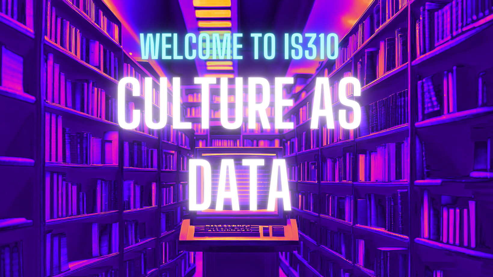
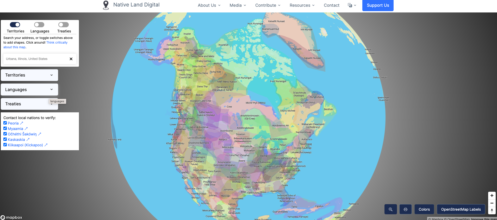
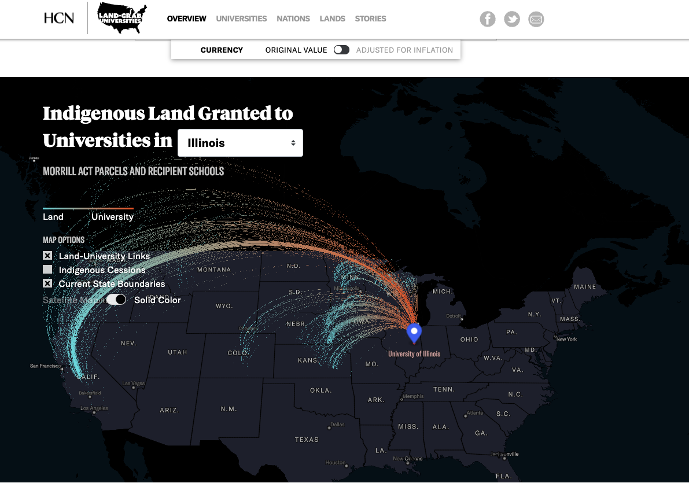

# 

{fig-alt="Welcome to IS310"}

## Who are your instructors?

Lead Instructor: Dr. Zoe LeBlanc (You can call me Prof. LeBlanc or Prof. Zoe)

Pronouns: She/Her

Email: zleblanc@illinois.edu

Website: [zoeleblanc.com](https://zoeleblanc.com){target="_blank"}

*Contact me via Slack please* I will try to learn your names starting next week. Please correct me if I get it wrong. Thank you!!

## Who are your instructors?

*Only for section B*

Teaching Assistant: Jessica Frye (Prefers Jess)

Pronouns: She/Her

Email: jrfrye2@illinois.edu

## Who are your instructors?

*You might also occasionally see my boss, Nenya.*

## Please Introduce Yourself

In the Zoom chat, please share the following:

- Your name and pronouns, if you would like
- Your major, year, and any relevant experience
- What you hope to learn in this course

*Bonus: feel free to share adorable pet pics!*

## Today's Plan

- Review the syllabus and course website
- Complete the first-day survey
- Start setting up course tools
- Identify setup questions for Thursday

## Course Description

Currently the iSchool catalogue lists this following course description:

> Explores use and application of technology to scholarly activity in the humanities, including projects that put classic texts on the web or create multimedia applications on humanities topics.

This isn't necessarily wrong, but not quite descriptive enough for this version of the course.

## What is "Culture as Data"?

Our goal is to understand how **culture** can be represented as data and studied with computation.

. . .

By culture, we mean what's usually associated with the Humanities:

- Popular fiction & literature
- Newspapers & government documents
- Online communities (Reddit, TikTok subcultures)

## Culture is Increasingly Digital

Culture is an intrinsic part of being human.

. . .

Today, that culture is increasingly both **digital** and **datafied**.

. . .

But representing our cultural heritage is rarely straightforward or without tradeoffs.

## Humanities Can Change Computing

We will explore how humanities can change how we think about computing.

. . .

- Histories of data collection and computation are **fundamentally political**
- Interpretation becomes "baked" into technologies
- These forces shape both scholarship and society

## What We'll Do

We will investigate these topics through:

. . .

- Weekly readings and assignments

. . .

- A semester-long project

. . .

- Experiencing the full process: from cultural topic → creating data → auditing data → documenting and sharing findings

## Some of Our Bigger Questions

::: {.r-fit-text}
Across readings, datasets, coding assignments, and projects, we will ask:

- What happens when culture becomes data?
- Who decides what gets collected, categorized, preserved, or ignored?
- How do data structures shape cultural interpretation?
- What can computation help us see, and what does it flatten or miss?
- How can we document cultural data so others can understand, reuse, and question it?
:::

## What Comes After This Course?

Much depends on your interests, but you will be well equipped to continue undertaking **substantive and innovative research** on culture using computation and data. These skills are useful whether you aim to be a:

- Data scientist or developer
- Computational or Data Journalist
- Data or DH Librarian
- HCI or UX researcher

Or just someone who understands how technology and information shape our world

## Ideally...

I hope each of you continues to work on your final project and share your research **long after the course ends**.

# Prerequisites

## Pre- and Co-Requisites

There is **no required prerequisite**.

. . .

However, students should have some previous experience equivalent to a semester of programming, ideally in Python.

. . .

Relevant courses include **IS205** and **IS107**.

## How much coding experience?

I get this question every semester and there is no one answer. Part of the reason it depends is because AI is revolutionizing how we code. So even if you have limited experience, you might actually get further than you expect.

. . .

However, I would say that if you have limited interest in coding, please talk with the instructors early so we can help you understand the workload and decide what support makes sense.

## Questions?

Interested students should contact the instructor if they have any questions.

. . .

**Let's get started!**

. . .

By exploring our [course website ✨](../schedule/index.qmd){target="_blank"}

# Assessments

In this course, we have two main categories of assessments: weekly ones and ones associated with the semester long project. Both types are intended to introduce you to new materials, help you synthesize this content, and engage in research that is meaningful to you. Your final grade will be evenly divided between these two categories.

# Weekly Assessments {.smaller}

Your performance in weekly assessments constitutes **half of your final grade**.

Full details: [Weekly Assessments](../assessments/02-weekly-assessments.qmd){target="_blank"}

. . .

| Component | Weight |
|-----------|--------|
| Weekly Participation | 25% |
| Weekly Coding Assignments | 25% |
| **Total** | **50%** |

::: {.notes}
Weekly assessments are meant to keep students engaged with the readings, practicing technical skills, and connecting weekly work to the semester project. The important framing is that this is not busy work: the weekly structure gives them regular chances to prepare, contribute, experiment, and show progress.
:::

## Weekly Rhythm {.smaller}

- **Before Tuesday:** read and explore assigned materials
- **Tuesday:** discuss readings and cultural data examples
- **Before Thursday:** work through the technical lesson and submit coding assignments
- **Thursday:** review, troubleshoot, and work in breakout groups

. . .

Not every week will follow this plan exactly, but the goal is try to have a combination of critical thinking and building each week.

::: {.notes}
Emphasize that Tuesdays and Thursdays work differently. Tuesdays are primarily about shared interpretation: readings, datasets, cultural examples, and discussion. Thursdays are primarily technical: students should read or try the lesson ahead of time, and class time is for review, troubleshooting, and collaborative work.
:::

## Weekly Participation (25%) {.smaller}

Each class meeting gives you a chance to earn participation credit.

. . .

| Score | Requirement |
|-----------|--------|
| 2 | Prepared + contributed |
| 1 | Prepared or contributed |
| 0 | No visible participation |

[Participation guide](../assessments/02-weekly-assessments.qmd#weekly-participation-25){target="_blank"}

::: {.notes}
The main rule is simple: full credit requires both preparation and contribution. Preparation alone can earn partial credit. Contribution alone can earn partial credit. Attendance alone is not participation.
:::

## What Counts as Prepared? {.smaller}

For more seminar discussion days:

- Complete the assigned materials
- Add short Hypothesis annotations before class
- Bring a question, connection, or concern

. . .

For more technical instruction days:

- Read or try the assigned lesson before class
- Use Hypothesis to flag questions, bugs, or confusing steps
- Bring a code question, GitHub commit, bug report, or demo

. . .

Generally, the goal is to reserve class time for discussing either interpretative problems or technical challenges.

::: {.notes}
On assigned reading days, preparation is usually visible through Hypothesis. They do not need polished mini-essays. They need specific engagement with the materials. For technical days, preparation might look different: an annotation on a confusing step, a commit, an error message, or a specific question.
:::

## What Counts as Contributed? {.smaller}

Contribution means helping the class think, troubleshoot, or collaborate.

- Speaking during seminar
- Using Zoom chat substantively
- Responding to classmates
- Helping your group make sense of a reading, dataset, or activity

. . .

Strong participation can look different for different students.

[Participation examples](../assessments/02-weekly-assessments.qmd#participation-examples){target="_blank"}

::: {.notes}
This slide is where I would underline that the chat counts, but it has to be substantive. A link, question, example, or response to a peer can all count. The point is visible engagement, not just talking as much as possible.
:::

## Technical Participation Counts Too {.smaller}

Technical work is also part of your weekly participation opportunities. What counts?

- Asking a question during technical review
- Demoing your code, bug, output, or workflow
- Helping a peer troubleshoot during work time
- Connecting the technical lesson to your project

. . .

Key point: Attendance alone is **not** full participation.

::: {.notes}
This is important because participation is not only seminar discussion. Thursday work time counts too. If students show a bug, ask a question, help a peer, or explain a workflow, that is participation.
:::

## Group Labs and Collaboration {.smaller}

Groups will be assigned within the first two weeks of class after an initial survey of student interests and backgrounds. This group will work together to complete active in-class activities and occasional out-of-class assignments, which will be documented and submitted via GitHub, as well as collaborate on the semester-long project.

. . .

On group lab days, your lab work counts as the **contributed** part of participation. To receive full participation credit for the day, you still need both preparation and a visible contribution to the group lab, live discussion, or Zoom chat.

## Structure and Expectations {.smaller}

What does this look like in practice? Across the semester, your group will be expected to do a combination of the following:

- Weekly prompts and activities
- In-class synthesis
- Documentation and submission to GitHub
- Working on your semester-long project

. . .

Grading will be based on your active participation in presentations, the quality of your contributions, and the effectiveness of your collaboration. Weekly group work must be **submitted to GitHub by midnight prior to the class when it is due**. This ensures that the work is available for review and that all group members are accountable for their contributions.

::: {.notes}
- Each week, your group may be assigned a prompt or task that builds on the week's materials. This could involve finding digital objects, exploring datasets, testing a tool, or applying a concept from the readings.
- Some weeks, your group will briefly present your findings to the class. Not every group will present every week, but even when your group is not presenting, you are still expected to submit your work to GitHub and be prepared to discuss it if called upon. Presentations should be clear, concise, and demonstrate your group's understanding and application of the week's materials.
- All group work, whether presented in class or not, must be documented and submitted to your group's GitHub repository. This documentation should include a summary of your group's activities, details on how the labor was divided, and any relevant reflections on the process. Clear and detailed documentation is crucial for both grading and for your group's progress on the semester-long project.
- Your grade for weekly group work will be based on your active participation in presentations, the quality of your contributions, and the effectiveness of your collaboration. This includes both in-class activities and the quality of the work submitted on GitHub. This grade will not be impacted if a member of your group is absent or does not participate, though the group will be required to pivot their schedule and plan in that event.

 **Late submissions will receive half credit, as long as they are accompanied by an explanation for the delay. Repeated late submissions will result in the group meeting with the Instructor.**
:::

## Weekly Coding Assignments (25%)

Weekly coding assignments help you practice technical material and connect it to your project.

- Submit through GitHub
- Pair programming is encouraged
- You are responsible for understanding your own submission

. . .

[Weekly coding assignments](../assessments/02-weekly-assessments.qmd#weekly-coding-assignments-25){target="_blank"}

## Coding Assignment Scale {.smaller}

| Score | Requirement |
|-----------|--------|
| 2 | Complete assignment |
| 1 | Partial completion |
| 0 | Missing or insufficient assignment |

. . .

The goal is practice, process, and understanding.

::: {.notes}
These are graded on a simple 0-2 scale. A 2 means the required files are submitted through GitHub and show a serious attempt. A 1 means something relevant is there, but it is incomplete, missing pieces, unclear in GitHub, or does not yet show enough evidence of process. A 0 means missing or too disconnected from the assignment to count.
:::

## AI Workflow Note {.smaller}

Some coding assignments will ask for `ai-workflow.md`.

. . .

If you used AI, document:

- What you asked for help with
- Relevant prompts and chatbot responses
- What you accepted, rejected, revised, tested, or checked
- What you still do not understand

. . .

Do **not** include private data, passwords, API keys, or unrelated chatbot conversation.

[AI workflow notes](../assessments/05-github-style-guide.qmd#ai-workflow-notes){target="_blank"}

::: {.notes}
This detailed template now lives in the GitHub Style Guide rather than the weekly assessments page. The important thing is that they include a record of the relevant chatbot exchange, not just a polished summary after the fact.
:::

## Required Texts & Resources

**Good news:** Almost all materials available free online!

- Course website
- Canvas

. . .

No required purchases for software or books.

## Computer Access

You will need access to a computer.

. . .

If this is an issue, **let me know early** — we'll find solutions!

## Summary

| Component | Weight |
|-----------|--------|
| Weekly Participation | 25% |
| Weekly Coding Assignments | 25% |
| **Total** | **50%** |

## Questions?

Remember:

- Engage thoughtfully
- Collaborate with peers
- Ask questions early and often!

# Semester Long Project

The goal of this project is to expose you to how we **create, uncover, document, and share culture as data**.

. . .

You will be assessed on both your **individual data work** and your **group's collective website and repository**.

Full details: [Semester Long Project](../assessments/03-semester-project.qmd){target="_blank"}

## Inspired by RDC Project

The project is modeled on the *Responsible Datasets in Context* Project:

[responsible-datasets-in-context.com](https://www.responsible-datasets-in-context.com/){target="_blank"}

. . .

Created to help students "work with data responsibly."

## Why Context Matters

> "Data cannot be analyzed responsibly without deep knowledge of its social and historical context, provenance, and limitations."

. . .

> "In classes, it is very common for students to use datasets that they find on websites like Kaggle, datasets that are poorly documented and that students thus don't fully understand. This is a recipe for irresponsible data work."

## Your Goal

You will work with culture as data through **two connected approaches**.

. . .

1. **Creating culture as data**
2. **Auditing existing culture as data**

::: {.notes}
This is the core framing. The project is not just "make a dataset." It asks them to experience two common approaches to cultural data work: creating structured data from cultural materials and auditing or comparing data that already exists. The final documentation and reflection can still tell the story of how both approaches unfolded.
:::

## The Evidence {.smaller}

Both approaches must be grounded in evidence:

- The dataset itself
- Computational process
- Documentation
- GitHub history
- Scholarly citations

. . .

AI can help, but it cannot replace the friction of making decisions, checking sources, testing code, documenting uncertainty, and explaining how the dataset came to be.

## Required Transformations {.smaller}

For your custom dataset, make visible at least two steps:

. . .

1. **Cultural materials → working representation**

. . .

2. **Working representation → structured data**

::: {.notes}
Scanning a book, photographing an object, saving screenshots, clipping posts, transcribing audio, exporting metadata, and selecting links can all count as making a working representation. The next step is explaining how that representation becomes fields, categories, values, labels, or records.
:::

# Project Milestones

## Timeline Overview {.smaller}

| Milestone | Due | Extension | Weight |
|-----------|-----|-----------|--------|
| Proposal: Collective Focus + Individual Plan | Sep 15 | Sep 22 | Pass/Fail |
| Initial Custom Dataset and Audit Plan | Oct 20 | Oct 27 | 15% |
| Final Group Presentation | Dec 8 | None | 5% |
| Final Project Submission | Dec 11 | Dec 18 | 30% |

# Milestone 1: Collective & Individual Topic Selection

**DUE TUESDAY, SEPTEMBER 15, 2026**

(Automatic extension available until September 22)

## Group Formation

In the first two weeks, you will be assigned to a group based on:

- Shared interests
- Complementary skill sets

## Planning Document {.smaller}

Your first task is to collaboratively determine:

. . .

- **Group Theme:** shared area of interest and scope

. . .

- **Individual Ideas:** possible datasets for each member

. . .

- **Scholarly Context:** scholarship that helps explain the topic

. . .

- **Collaboration Plan:** communication, GitHub, and website organization

## Format & Submission

- Markdown file, such as `planning.md`, in your group GitHub repository
- 500–750 words
- Use headings, bullet points, links, images, or tables
- Include scholarly citations

# Milestone 2: Initial Custom Dataset and Audit Plan

**DUE TUESDAY, OCTOBER 20, 2026**

(Automatic extension available until October 27)

**15% of Final Grade**

Details available here: [Milestone 2](../assessments/03-semester-project.qmd#milestone-2-initial-custom-dataset-and-audit-plan){target="_blank"}

## Why Start Small?

Create an initial custom dataset of roughly **50–100 items**.

. . .

The goal is to experience what it means to make data carefully:

. . .

- item by item
- decision by decision
- category by category

## Computation Required

You are required to use computational tools to assist your custom dataset.

. . .

This is not only about automation.

. . .

It is about understanding how computation can **structure, check, compare, visualize, question, or document** cultural data.

## Submission Components

1. **Initial Custom Dataset**

. . .

2. **Initial Documentation**

. . .

3. **Computational Process**

. . .

4. **Audit and Connection Plan**

. . .

5. **Reflection + Scholarly Citations**

::: {.notes}

You do **not** need to submit a completed audit yet.

. . .

You do need a plan for auditing existing culture as data:

- Existing dataset, archive, platform, API, collection, or source
- What you need to investigate about it
- How it might connect to your custom dataset
- What computation might help you audit or compare
:::

# Milestone 3: Final Group Presentation

**TUESDAY, DECEMBER 8, 2026**

**5% of Final Grade**

## Presentation Focus {.smaller}

Each group briefly presents its website and collective principles.

. . .

Focus on:

- What your group learned about its shared cultural data type
- How the website organizes the individual projects
- What principles emerged from the work
- What future researchers should know before reusing the datasets

. . .

You do **not** need to present every individual dataset in detail.

## Making Labor Visible

The final presentation should also explain:

- How your group worked together
- How the website and repository are organized
- What GitHub history, contribution logs, or process documentation show
- What forms of labor were harder to capture

# Milestone 4: Final Submission

**DUE FRIDAY, DECEMBER 11, 2026**

(Optional extension available until December 18)

**30% of Final Grade**

More details available here: [Milestone 4](../assessments/03-semester-project.qmd#milestone-4-final-submission){target="_blank"}

## Final Submission Priorities {.smaller}

| Component | Who? | Weight |
|-----------|------|--------|
| Culture As Documentation & Reflection | Individual | 12% |
| Culture As Custom & Audited Data | Individual | 12% |
| Collective Website and GitHub Repository | Collective | 6% |

## Final Submission: Individual {.smaller}

Each student submits:

- Final structured dataset
- Computational audit, comparison, cleaning, or transformation
- GitHub documentation for reuse
- Process reflection
- Process page for the group website
- Scholarly citations

::: {.notes}

Your final individual work should explain:

- What cultural materials your dataset represents
- How you created, collected, audited, cleaned, or transformed the data
- How the custom dataset and audit/comparison shaped each other
- What the dataset helps us see
- What it hides, distorts, excludes, or leaves uncertain
:::

## GitHub vs. Website {.smaller}

They do different work.

| GitHub Repository | Group Static Site Website |
|-------------------|---------------------------|
| Documentation for reuse and preservation | Story of how the datasets came to be |
| Data, code, schemas, licenses | Process, choices, uncertainty, labor |
| Stable place to cite and download | Public explanation of group learning |

## Final Submission: Group {.smaller}

Each group submits:

- Minimal-computing static site website
- Group overview
- Collective principles document
- Links to repository and individual datasets
- Individual dataset folders
- `CONTRIBUTIONS.md` or contribution section in `README.md`

## Contribution Log {.smaller}

Your contribution log should show:

- Named responsibility for pages, documentation, review, or technical work
- Contributions to collective principles/documentation
- Peer review, editing, testing, or troubleshooting
- GitHub commits, issues, pull requests, or file history

. . .

Treat GitHub history as **data about collaborative labor**: what does it reveal, and what does it miss?

## Think of It As...

Writing the documentation you wish had existed when you started.

. . .

- What should someone know before representing music as data? Or social media? Or gaming culture?

. . .

- What principles emerged from your group's diverse approaches?

# Summary

## Grade Breakdown

| Component | Weight |
|-----------|--------|
| Proposal: Collective Focus + Individual Plan | Pass/Fail |
| Initial Custom Dataset and Audit Plan | 15% |
| Final Group Presentation | 5% |
| Final Project Submission | 30% |
| **Total** | **50%** |

## Questions?

Remember:

- Create culture as data
- Audit existing culture as data
- Use computation to support, not replace
- Document decisions, labor, uncertainty, and limits
- Situate the work in scholarship

. . .

**More details throughout the semester.** Requirements may shift depending on the pace of the course and the needs of the projects.

## General Note on Grading

I tend to use GitHub to have as much transparency when it comes to grading and feedback. 

. . .

Generally, as far as I'm concerned you are all A+ humans. It's just about ensuring that effort, creativity, labor, and other core principles are correctly evaluated. If you have concerns over grades, I am always happy to discuss them. 

# Course Policies

Also available on the [course website](../policies.qmd){target="_blank"}

# Attendance

The iSchool expects students to attend all classes except in cases of emergency. Student Code on Attendance: [http://studentcode.illinois.edu/article1/part5/1-501/](http://studentcode.illinois.edu/article1/part5/1-501/){target="_blank"}

. . .

This course meets on **Zoom**, and synchronous attendance matters for discussion, technical practice, group collaboration, and shared troubleshooting.

. . .

Attendance is not a separate grade category, but each class meeting is an opportunity to earn **Weekly Participation** credit.

## Zoom Participation {.smaller}

You are not required to turn your camera on, but it is appreciated.

. . .

You are expected to stay respectfully engaged through some combination of:

- video or audio
- Zoom chat
- collaborative documents
- group work
- screen sharing during technical work

## Zoom Recordings {.smaller}

Class meetings on Zoom will be recorded.

. . .

Access to recordings is **not automatic** and is **not meant to replace synchronous participation**.

. . .

Recordings will only be made available to students with **Instructor approval** and a **reason for missing class**.

## If You Need to Miss Class

If you are feeling unwell, have an emergency, or have a serious conflict, **please prioritize your health and responsibilities.**

. . .

I do not require doctor's notes for absences.

. . .

However, please keep in mind that if you miss a substantial portion of class meetings, it will be difficult to make up missed content and that you need to coordinate with your group members who depend on your contributions.

## When You Miss Class {.smaller}

. . .

- Message me on **Slack** as soon as possible
  
. . .

- Inform your **group members** so they can plan accordingly
  
. . .

- Check in with me about **making up** missed content

. . .

- Review materials on the **course website**

. . .

Missing class without communicating usually means `0` participation for that meeting.

## Information Overload Days

Sometimes you need a break from the workload.

. . .

Instead of missing class outright, let me know you need an **information overload day**.

## How Information Overload Days Work {.smaller}

. . .

- You are excused from assigned materials and discussion

. . .

- You **actively listen** during class

. . .

- Consult with instructor about make-up assignments later

. . .

- Inform your group and help them adjust

. . .

**Two free, no questions asked** — after that, let's talk!

## Worst Case Scenarios

If you or someone close to you becomes ill:

- Final grade based on existing work
- Option to move course to pass/fail

. . .

**When you can, please get in touch.** Your wellbeing comes first.

# Communication & Respect {.smaller}

We use **Slack** for communication beyond class meetings.

. . .

- Join the **DH@UIUC Slack** (link in Canvas)

. . .

- Join the `#is310-fall-2026` channel

. . .

You can also use [Calendly](https://calendly.com/zleblanc/chat-with-prof-zoe) or email [zleblanc@illinois.edu](mailto:zleblanc@illinois.edu).

## Respect in All Communication {.smaller}

. . .

- Zoom and breakout room interactions

. . .

- Slack messages

. . .

- Emails

. . .

This course is experimental with students from varied backgrounds. Every opinion, question, and idea deserves a **respectful response**.

## Rule of Thumb

**When in doubt, ask questions and over-communicate — but do so respectfully!**

# Academic and Self Integrity

The iSchool maintains academic integrity to protect the quality of education.

. . .

Consequences range from written warnings to **failing grades or dismissal**.

## The Short Version

**Don't cheat.**

. . .

If you need help, see the instructor.

. . .

I would rather you turn in work **late** than have to report you for plagiarism.

---

## Citation as Practice

We'll discuss what constitutes plagiarism (it gets thorny with code).

. . .

**Rule of thumb:** Cite as much as possible.

. . .

All scholarship is a collective endeavor.

---

## Why Citation Matters

> "Citation is how we acknowledge our debt to those who came before; those who helped us find our way when the way was obscured because we deviated from the paths we were told to follow."
>
> — Sara Ahmed, *Living a Feminist Life*

. . .

> "Acknowledging and establishing feminist genealogies is part of the work of producing more just forms of knowledge and intellectual practice."
>
> — Beverly Weber, [Digital Feminist Collective](https://digitalfeministcollective.net/index.php/2018/01/13/the-politics-of-citation/)

## Why Citation Matters

Acknowledging sources is both **intellectually and politically imperative**.

# AI Policy

This course **explicitly allows** AI tools.

. . .

We will experiment with **GitHub Copilot**, ChatGPT, and other tools.

. . .

AI is not going away, so we need to engage with it **critically** and **document how it shapes our work**.

## Your AI Workflow

In the first two weeks, submit an initial file explaining your preferred workflow for the course.

- **Using AI?** Which tools? For what purposes?
- **Not using AI?** What's your alternative workflow?
- **Using local models?** Consult with instructor for setup.

## Assignment AI Workflow Notes {.smaller}

Some coding assignments may ask you to include an `ai-workflow.md` file in the assignment folder. Details are available in the [AI workflow expectations](../assessments/05-github-style-guide.qmd#ai-workflow-notes){target="_blank"}.

. . .

When required, include a record of the **relevant chatbot conversation**:

- Prompts you wrote
- AI responses that shaped your work
- Exchanges where you asked for help, debugged, revised, tested, or learned something

. . .

The file should be more than a summary, but it does not need unrelated chatter or every failed detour.

## If Your Workflow Changes

AI use is **iterative and experimental**.

. . .

If your approach changes during the semester, simply update your `Init IS310` file (more details discussed later in the semester).

. . .

**No judgment**: experimentation is encouraged.

## AI Access & Equity

I encourage the use of **free tools**:

- GitHub Copilot (free with GitHub Student Developer Pack)
- Open-source local models

. . .

If using paid tools, **disclose** and please check for education discounts.

## AI for Coding

You may use AI to help write, debug, and understand code.

. . .

**But make sure you understand what the code does.**

. . .

If code breaks, **you** need to fix it.

::: {.notes}
The key point is responsibility. You can use AI for coding, but they need to be able to explain what the code does, why it works, and how they fixed problems when things broke.
:::

## AI for Written Work

You may use AI for brainstorming, outlining, drafting, or editing.

. . .

**Your ideas, arguments, and voice should be yours.**

. . .

If writing reads like it was primarily AI-generated or if you cannot answer questions about your submissions, you will be dinged points.

## AI for Data Work

You may use AI for data collection, cleaning, analysis, or documentation.

. . .

**You** make the interpretive decisions.

. . .

Your work must demonstrate you understand your methodology deeply.

## AI Academic Integrity {.smaller}

Using AI is **not cheating** in this course.

. . .

However, plagiarism is still plagiarism.

. . .

Do not submit work generated by others, human or AI, as if it is entirely your own intellectual contribution.

. . .

If AI generates incorrect information or problematic code, **you are responsible for catching and fixing it**.

## The Bottom Line

AI should make you **more capable**, not less thoughtful.

. . .

It should **amplify** your learning, not replace it.

. . .

If you can't explain what your code does or why your writing makes certain arguments, **stop and reassess**.

## Questions?

If you have concerns, questions about what is allowed, or uncertainty about whether your approach is appropriate, please ask.

. . .

Office hours, email, and Slack are all good venues.

. . .

[Full AI Policy](../policies.qmd#ai-policy){target="_blank"}

## Example Citation?

When using AI tools like Codex, cite them as you would software:

> OpenAI. (2026). Codex [AI coding assistant].
> https://openai.com/codex

Or in prose: "These slides were created with assistance from Codex
(OpenAI, 2026), an AI coding assistant used for formatting Quarto/Reveal.js syntax."

## Questions?

Remember:

- Communicate early and often
- Engage thoughtfully with AI
- Respect the land and each other

. . .

**Full policies available on the course website.**

# Land Acknowledgement Statement

*Adopted by the University of Illinois in 2018*

I would like to begin today by recognizing and acknowledging that we are on the lands of the Peoria, Kaskaskia, Piankashaw, Wea, Miami, Mascoutin, Odawa, Sauk, Mesquaki, Kickapoo, Potawatomi, Ojibwe, and Chickasaw Nations. 

## Traditional Territory

These lands were the traditional territory of these Native Nations **prior to their forced removal**; 

. . .

These lands continue to carry the stories of these Nations and their struggles for survival and identity. 

## Our Responsibility

As a **land-grant institution**, the University of Illinois has a particular responsibility to acknowledge the peoples of these lands, as well as the histories of dispossession that have allowed for the growth of this institution for the past 150 years. We are also obligated to reflect on and actively address these histories and the role that this university has played in shaping them. This acknowledgement and the centering of Native peoples is a start as we move forward for the next 150 years.

## Beyond Platitudes: What does this mean?

While this acknowledgement is important, I find that these words can be difficult to understand or visualize.

. . .

Let's look at two cultural data projects that help us understand.

## *Native Land Digital*

Visualizes indigenous lands worldwide, built by a Canadian non-for-profit, that helps us see how this dispossession has shaped our very understanding of geography and political identity. 

## *Native Land Digital*

{target="_blank"}

## *Land Grab Universities*

How the Morrill Act dispossessed tribal lands, signed in 1862, dispossessed tribal lands to fund the creation of public state universities. The project was built by Robert Lee, Tristane Ahtone, Margaret Pearce, Kalen Goodluck, Geoff McGhee, and Cody Leff and published by *High Country News*

## *Land Grab Universities*

{target="_blank"}

## First-Day Survey

Please complete the first-day survey linked in Canvas.

. . .

This helps me:

- Form groups around shared interests
- Understand coding and data experience
- Identify access or setup concerns
- Learn what you hope to get from the course

*Please contact me if you cannot access the survey.*

## Course Tools

If we have time today, we will start the first course tools lesson.

. . .

[Software & Tools for Culture as Data](../materials/introducing-defining-cad/01-CAD-tools.qmd){target="_blank"}

## Tool Setup Priorities

Focus first on:

- Slack
- Hypothesis
- GitHub
- AI tool of your choice (Recommend Copilot via GitHub Education Benefits) 
- VS Code

. . .

Bring setup problems to Thursday.

## Before Thursday

- Finish the first-day survey
- Join Slack and Hypothesis
- Create or update your GitHub account
- Start the course tools lesson
- Note where you get stuck
