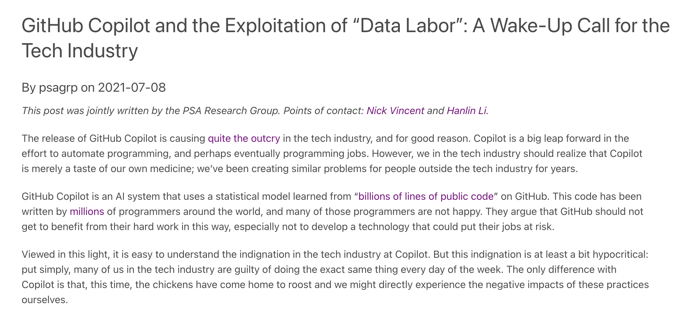
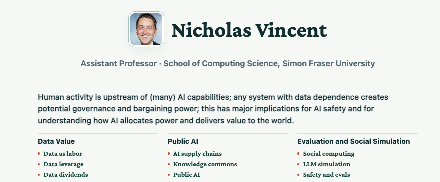
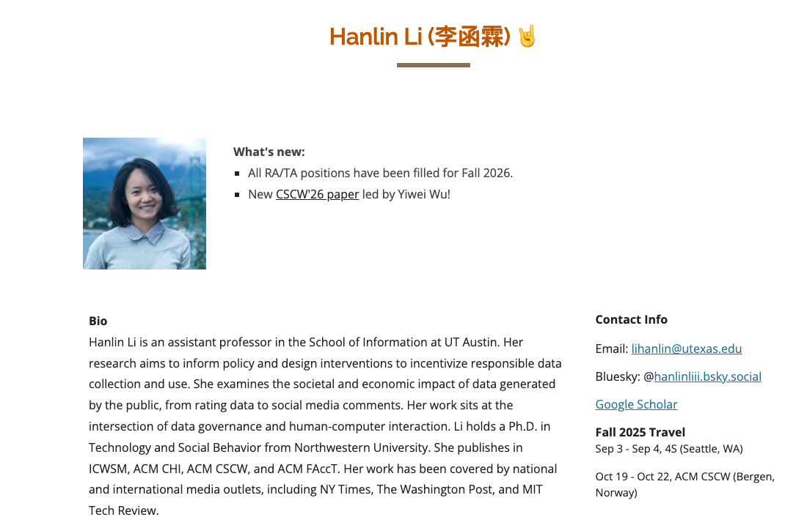
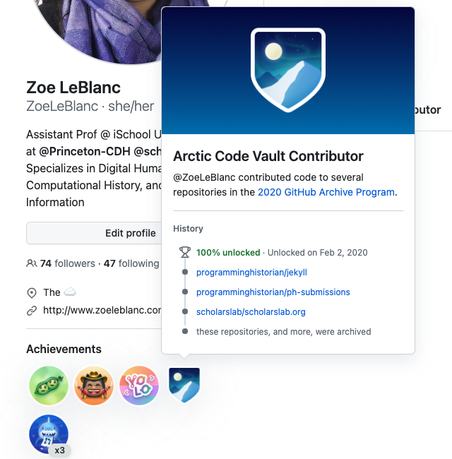
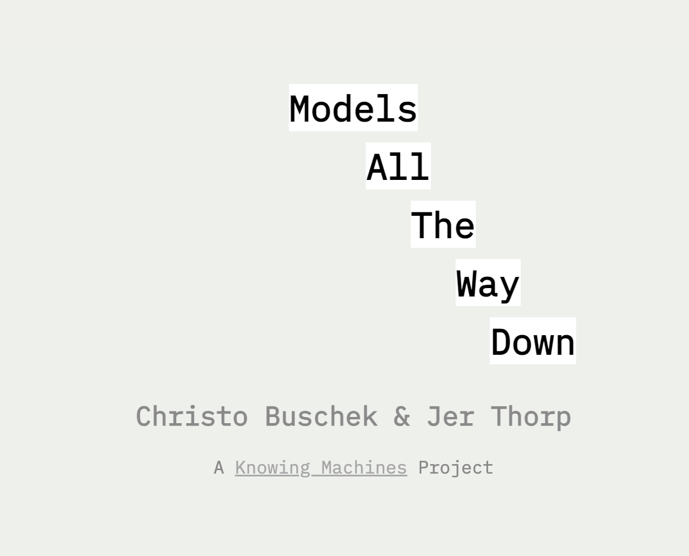
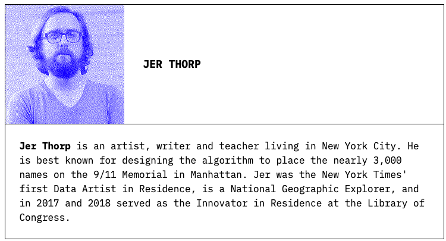
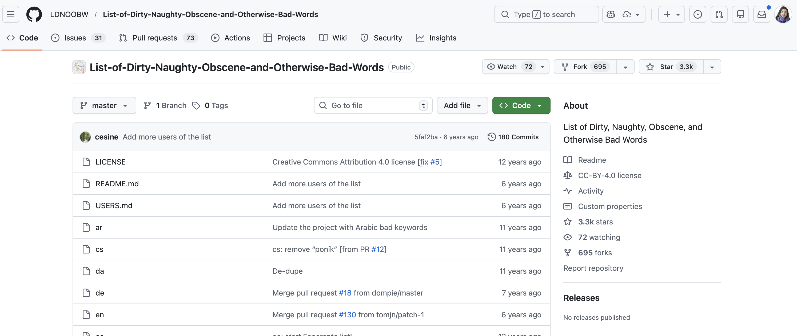
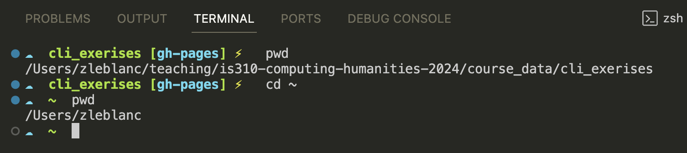
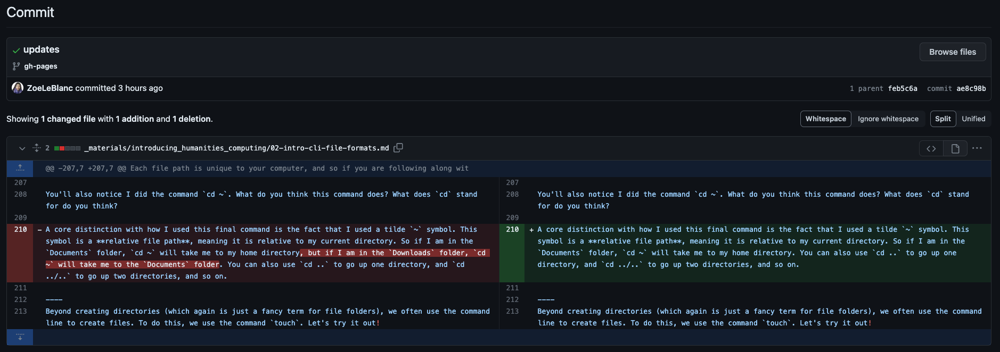
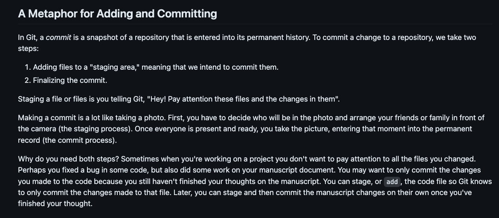

# Any Questions About Course Tools?

[https://cultureasdata-uiuc.github.io/is310-fall-2026/materials/introducing-defining-cad/01-CAD-tools.html](https://cultureasdata-uiuc.github.io/is310-fall-2026/materials/introducing-defining-cad/01-CAD-tools.html){target="_blank"}


## Initial Interest Survey Check

As of this morning:

| Section | Completed | Current Students |
|---|---:|---:|
| A | 12 | 23 |
| B | 9 | 26 |
| **Total** | **21** | **49** |

**28 current students still need to complete the survey.** Please complete this ASAP so I can start forming groups for Tuesday's class. Link is on Canvas and please reach out if you have any issues accessing it.


## Reminder: These Are Required

- [ ] Slack Account with DH@UIUC Server. 
- [ ] GitHub Account.
- [ ] Local Python 3 Installation.
- [ ] Git.
- [ ] Local Text Editor (VS Code Recommended).

## Reminder: These Are Optional

- [ ] AI Tooling of Your Choice:
  - [ ] Recommend GitHub Co-Pilot and using GitHub Education Benefits to get access to Co-Pilot.
- [ ] IDE of Your Choice:
  - [ ] Recommend Visual Studio Code and Visual Studio Code Extensions.
- [ ] Oh-My-Zsh.

## Any Python Issues?


## Reminder: Modern Software Is A Problem

The best representation of what I'm talking about is this [xkcd comic, entitled Dependency](https://xkcd.com/2347/){target="_blank"}.


# Hypothesis Demo

## Let's Annotate the Data Labor Reading

[Vincent and Li, "GitHub Copilot and the Exploitation of 'Data Labor'"](https://www.psagroup.org/blogposts/101){target="_blank"}

. . .

Today we are practicing how to:

- Open Hypothesis on a reading
- Make sure we are posting to our course group
- Highlight a passage that matters
- Add a question, connection, or concern


## Turn On Hypothesis

:::: {.columns}
::: {.column width="50%"}

:::
::: {.column width="50%"}

:::
::::

*If you have yet to install or sign up for Hypothesis, please follow the quick start guide that is linked in our course materials [https://cultureasdata-uiuc.github.io/is310-fall-2026/materials/introducing-defining-cad/01-CAD-tools.html#hypothesis](https://cultureasdata-uiuc.github.io/is310-fall-2026/materials/introducing-defining-cad/01-CAD-tools.html#hypothesis){target="_blank"}.*


## Open the Sidebar

{height="450"}


## Annotate From Our Group

{height="430"}


## What Should You Annotate?

For assigned readings, add **two annotations by midnight before class**:

1. One passage you think matters.
2. One question, connection, or concern.

. . .

Your annotations should help us start discussion, not summarize everything.


## What about PDFs? Let's Try Annotating Next Week's Reading

Open next week's Manovich reading from Canvas:

**Lev Manovich, "Types of Cultural Data"**

Please follow the instructions here [https://cultureasdata-uiuc.github.io/is310-fall-2026/materials/introducing-defining-cad/01-CAD-tools.html#using-hypothesis-on-local-pdfs](https://cultureasdata-uiuc.github.io/is310-fall-2026/materials/introducing-defining-cad/01-CAD-tools.html#using-hypothesis-on-local-pdfs){target="_blank"} to annotate a local PDF.


## Hypothesis Annotations Moving Forward

- As a reminder, you need to make **two annotations per reading** by midnight before class for full credit.
- If your annotations are late, you will receive **half credit** unless you get approval from the instructor. 
- You may be asked about your annotations in class, so please use them as a chance to highlight questions or connections you want to discuss.

# Let's Discuss Our Readings

Two readings assigned for today:

- Vincent, Nick, and Hanlin Li. “GitHub Copilot and the Exploitation of ‘Data Labor’: A Wake-Up Call for the Tech Industry.” *PSA Group* (blog), July 8, 2021. [https://www.psagroup.org/blogposts/101](https://www.psagroup.org/blogposts/101).
- Buschek, Christo, and Jer Thorp. “Models All The Way Down.” *Knowing Machines*. Accessed January 14, 2026. [https://knowingmachines.org/models-all-the-way](https://knowingmachines.org/models-all-the-way).

## Let's Start with GitHub Copilot and Data Labor

[](https://www.psagroup.org/blogposts/101){target="_blank"}


## Who are the authors & is this scholarship? 

:::: {.columns}
::: {.column width="50%"}
[](https://nickmvincent.com/){target="_blank"}
:::
::: {.column width="50%"}
[](https://www.hanlinli.com/){target="_blank"}
:::
::::


## What are their critiques of GitHub? What is Data Labor? 

:::: {.columns}
::: {.column width="50%"}

:::
::: {.column width="50%"}

:::
::::


## Should we not use GitHub? Alternatives to GitHub


# Let's Connect to Models All the Way Down

Jer Thorp & Christo Buschek, *Knowing Machines* (2024)

[](https://knowingmachines.org/models-all-the-way){target="_blank"}


## Who are the authors & is this scholarship?

:::: {.columns}
::: {.column width="50%"}
[](https://www.jerthorp.me/){target="_blank"}
:::
::: {.column width="50%"}
[](https://christobuschek.net/){target="_blank"}	
:::
::::


## What is LAION-5B?


## How was LAION-5B Built?

[](https://commoncrawl.org/){target="_blank"}


## What is in Common Crawl?

Schaul, Kevin, Szu Yu Chen, and Nitasha Tiku. "Inside the Secret List of Websites That Make AI like ChatGPT Sound Smart." *Washington Post*, April 19, 2023.

[](https://www.washingtonpost.com/technology/interactive/2023/ai-chatbot-learning/){target="_blank"}

## About Me

Lucy, Li, Suchin Gururangan, Luca Soldaini, et al. “AboutMe: Using Self-Descriptions in Webpages to Document the Effects of English Pretraining Data Filters.” arXiv:2401.06408. Preprint, arXiv, January 12, 2024. [https://doi.org/10.48550/arXiv.2401.06408](https://doi.org/10.48550/arXiv.2401.06408){target="_blank"}.


## About Me


## What is seeing like an algorithm?


## Excavating AI

*The Politics of Images in Machine Learning Training Sets *

By Kate Crawford and Trevor Paglen 

[](https://excavating.ai/){target="_blank"}

## Why Models All the Way Down? What is the Circularity Problem?

> "There are models on top of models, and training sets on top of training sets."

. . .

> "Omissions and biases and blind spots from these stacked-up models and training sets shape all of the resulting new models and new training sets."


## What are the problems with this data?

. . .

Why is scale a problem?

. . .

**The Problem:** In December 2023, researchers found over 1,000 images of Child Sexual Abuse Material (CSAM) in the dataset


## How are these datsets "curated"?

[](https://github.com/LDNOOBW/List-of-Dirty-Naughty-Obscene-and-Otherwise-Bad-Words){target="_blank"}

## Curation by Statistics

> "The tiniest of shifts in LAION's thresholds could have excluded or included **hundreds of millions of images**"

. . .

- 16% of images are within 0.01 of the lower threshold
- Raising the threshold by just 0.01 would remove **937 million** image pairs


## Whose Images?

For every **English speaker**: 1.6 image captions

For every **French speaker**: 0.5 image captions

For every **Swahili speaker**: 0.03 image captions

. . .

> "For models trained on LAION-5B, English (and English-speaking culture) is valued more than the other 107 languages combined."


## Whose Aesthetics?

> "The concepts of what is and isn't visually appealing can be influenced in outsized ways by the tastes of **a very small group of individuals**"

. . .

Midjourney's aesthetic fine-tuning: shaped by a handful of Discord users and a 65-year-old mechanical engineer from Wisconsin


## What does this mean for how we use AI?

- What sorts of use cases are appropriate for AI?
- What dangers exist because of the reliance on training data?
- Do we understand the difference between and LLM and a chatbot? *hint: models all the way down!*

# Time To Prompt: The Command Line

## What is a Terminal?

A **terminal** is a way to interact with your computer via **text** commands.

. . .

Instead of clicking on icons (GUI), we type explicit commands.

. . .

You've already used it!

```sh
python3 --version
```


## A Brief History of Computing

{height="400"}


## Punch Cards

{height="400"}


## Punch Cards

- One of the first Computing in the Humanities projects started in the 1940s to digitize the writings of Thomas Aquinas. More information available here [https://theoreti.ca/?p=6096](https://theoreti.ca/?p=6096){target="_blank"}
- For more on this history, I would highly recommend watching "Computer History: Punch Cards Historical Overview -IBM Remington Rand UNIVAC - History 1900’s-1960’s", 2016. [https://www.youtube.com/watch?v=kKJxzay85Vk](https://www.youtube.com/watch?v=kKJxzay85Vk){target="_blank"}.


## The First GUI


Reimer, Jeremy. “A History of the GUI.” *Ars Technica*, May 5, 2005. [https://arstechnica.com/features/2005/05/gui/](https://arstechnica.com/features/2005/05/gui/){target="_blank"}.


## Shells?


## Key Terminology

| Term | Definition |
|------|------------|
| **Terminal** | The device/program that allows you to interact with the computer |
| **Shell** | A program that interprets your commands (bash, zsh, PowerShell) |
| **Command Line** | The text-based interface where you type commands |


## GUI vs CLI

::: {.columns}
::: {.column width="50%"}
**GUI (Graphical)**
{height="300"}
:::
::: {.column width="50%"}
**CLI (Command Line)**
{height="300"}
:::
:::


# Working With The Command Line

## Creating a Directory

Open your terminal in VS Code: **Terminal > New Terminal**

. . .

```sh
mkdir Intro-CA-Notes
```

. . .

But how do we know it worked?


## Writing Vs. Prompting

We have two options: 
- look at the [Command Line cheatsheet](../materials/introducing-defining-cad/04-command-line-cheatsheet.qmd){target="_blank"} that contains a number of these commands and see what would be the best option to help us check if this worked.

## Writing Vs. Prompting

Our other option is to try and start testing out these AI Chatbots, and specifically GitHub Co-Pilot (though again you are welcome to use any AI tool that is free and helps you understand these materials).

# Prompt Engineering

## What is a Prompt?

In the terminal: the symbol that indicates where you type

- `$` (bash)
- `%` (zsh)
- `>` (PowerShell)

. . .

In AI: the text input you give to a chatbot


## The AI Explosion

{height="450"}


## Terminal vs AI Prompting

| Terminal Commands | AI Prompts |
|-------------------|------------|
| Fixed, specific syntax | Natural language |
| Predictable outputs | Variable outputs |
| Must use exact commands | Flexible phrasing |
| Reproducible | Rarely reproducible |


## Prompting Guidelines?


## The 4S of Prompt Engineering

Microsoft's guidelines for GitHub Copilot:

. . .

- **Single** - One task or question at a time

. . .

- **Specific** - Detailed requests and specifications

. . .

- **Short** - Be concise

. . .

- **Surround** - Keep relevant files open for context


## How Copilot Processes Prompts

{height="400"}


## Important Warning

**Never share sensitive information in prompts!**

. . .

- Personal data can be leaked
- Copilot scrapes GitHub repositories
- The legality and ethics remain hazy

. . .

Use AI tools with a **critical lens**


## Example Prompts for the CLI

::: {.callout-note}
## Try these prompts!

```
How can I check if my directory was created in my terminal?
```

```
Should I use the command ls or pwd to check if my directory
was created? And what is the difference between these two?
```

```
How can I create a directory named is310-culture-as-data
in my terminal?
```
:::


# Directories & File Paths

So returning to our original question, hopefully by now we have discovered some of the commands we can use to check if our directory was created. Any thoughts?

## Essential Commands

| Command | What it does |
|---------|--------------|
| `pwd` | Print working directory (where am I?) |
| `ls` | List directory contents |
| `cd` | Change directory |
| `mkdir` | Make a new directory |
| `touch` | Create a new file |
| `mv` | Move or rename files |
| `rmdir` | Remove an empty directory |


## Making Directories?

```sh
mkdir is310-culture-as-data
```


## Understanding File Paths

{height="400"}


## Working Directories




## Absolute vs Relative Paths

**Absolute path:** Full path from root

```sh
/Users/zleblanc/Documents/is310
```

. . .

**Relative path:** Path from current location

```sh
cd ~        # Go to home directory
cd ..       # Go up one directory
cd ../..    # Go up two directories
```


## Putting It Together

```sh
# Create a file
touch is310-culture-as-data.txt

# Move it into a folder
mv is310-culture-as-data.txt is310-culture-as-data

# Change into the folder
cd is310-culture-as-data

# List contents to verify
ls

# Go back up and remove the folder
cd ..
rmdir is310-culture-as-data
```


# In-Class Exercise

## Your Tasks

Using the cheatsheet and/or your preferred AI chatbot:

1. Create `is310-culture-as-data` directory in your `Desktop` folder
2. Inside it, create `is310-culture-as-data.txt`
3. Add text to your file using the command line *(new command!)*
4. Display the file contents *(new command!)*
5. Return to your home directory

. . .

**Bonus:** Copy your folder, then delete the copy


## Additional Resources

1. [Introduction to the Bash Command Line](https://programminghistorian.org/en/lessons/intro-to-bash) - *Programming Historian*
2. [Bash Basics Part 1](https://youtu.be/eH8Z9zeywq0?t=885) - Video tutorial
3. [Beginner's Guide to the Bash Terminal](https://www.youtube.com/watch?v=oxuRxtrO2Ag)
4. [CodeAcademy Command Line Course](https://www.codecademy.com/learn/learn-the-command-line)


## Questions?

Remember:

- The **terminal** is the interface
- The **shell** interprets commands
- The **command line** is where you type
- **Prompts** work for both CLI and AI!

. . .

See also: [Command Line Cheatsheet](../materials/introducing-defining-cad/04-command-line-cheatsheet.qmd){target="_blank"}

# What is Version Control?

## The Problem

Have you ever had files like this?

. . .

- `essay_final.docx`
- `essay_final_v2.docx`
- `essay_FINAL_FINAL.docx`
- `essay_FINAL_FINAL_actually_final.docx`

. . .

Version control solves this problem!


## What is Git?

**Git** is software for version control - tracking changes in files over time.

. . .

- Created in 2005 by Linus Torvalds (creator of Linux)
- Most popular version control system in the world
- Used by millions of developers and researchers


## Git vs GitHub

|     | Git | GitHub |
|-----|-----|--------|
| **What** | Version control system | Platform for hosting git repositories |
| **Where** | Local (on your computer) | Remote (website) |
| **Install?** | Yes | No (it's a website) |

. . .

They are **two separate technologies** often used together!


## Git + GitHub Together

{height="450"}


## Why Git for Culture as Data?

Git allows you to:

- Keep track of changes in plain text files
- Collaborate in real-time with other researchers
- Easily revert to earlier versions
- Create different branches to explore new ideas
- See who added what to the project


## What Version Tracking Looks Like

{height="400"}


# Working with Git

## Check Your Installation

First, verify git is installed:

```sh
git --version
```

. . .

You should see something like:

```sh
git version 2.39.0
```


## Create a Project Folder

```sh
# Create a new folder
mkdir is310-first-repo

# Navigate into it
cd is310-first-repo

# Create a file
touch first_file.txt # For Unix/Linux
New-Item -ItemType File -Path . -Name first_file.txt # For PowerShell
```

. . .

Add some text to the file:

```sh
echo "This is my first file" > first_file.txt # For Unix/Linux

"This is my first file" | Out-File -FilePath first_file.txt #For PowerShell
```


## Initialize a Git Repository

```sh
git init
```

. . .

Output:

```sh
Initialized empty Git repository in /Users/YOU/is310-first-repo/.git/
```

. . .

A hidden `.git` folder is created. We can use `ls -a` for Unix/Linux or `Get-ChildItem -Force` for PowerShell to see it.


## The Git Workflow

{height="400"}

*Think of git as a camera taking snapshots of your project*


## Step 1: Add to Staging Area

Git doesn't track automatically - you must tell it what to track:

```sh
git add first_file.txt
```

. . .

Check the status:

```sh
git status
```

```sh
On branch main

No commits yet

Changes to be committed:
    new file:   first_file.txt
```


## Step 2: Commit Changes

Finalize your snapshot with a descriptive message:

```sh
git commit -m "Added first file to our repository"
```

. . .

Check status again:

```sh
git status
```

```sh
On branch main
nothing to commit, working tree clean
```


## If You Forget the -m Flag...

You'll see Vim (a text editor):

{height="350"}


## If You Forget the -m Flag...

- Press `i` to type, then `esc`, then `:wq` to save and exit
- Or press `esc`, then `:q!` to exit without saving

```sh
Aborting commit due to empty commit message.
```


## Quotes

```sh
quote>
```


## Step 3: View History

See your commit history:

```sh
git log
```

```sh
commit 8bb8306c1392eed52d4407eb16867a49b49a46ac (HEAD -> main)
Author: Your Name <your-email@gmail.com>
Date:   Tue Jan 22 16:03:39 2024 -0400

    Added first file to our repository
```


## Git Commands Summary

| Command | What it does |
|---------|--------------|
| `git init` | Initialize a repository |
| `git add <file>` | Add file to staging area |
| `git commit -m "msg"` | Commit with message |
| `git status` | Check current status |
| `git log` | View commit history |


# Working with GitHub

By now you should have your git configuration setup and have a GitHub account, but feel free to look back at our [course tools lesson](../materials/introducing-defining-cad/01-CAD-tools.qmd#git){target="_blank"} if you're having any issues.

## Creating a Repository on GitHub

1. Go to [github.com](https://github.com/){target="_blank"}
2. Click the **New** button

{height="300"}


## Repository Settings

{height="400"}

## Repository Settings

- Name it `is310-first-repo`
- Choose **Public** so we can see each other's work
- Leave README unchecked for now


## Repository Settings


## Repository Settings


To understand what each button does feel free to browse through our [advanced git and GitHub resource](../materials/introducing-defining-cad/05-advanced-git-github.qmd){target="_blank"}, but first let's try to get our local repository onto GitHub.

## Connect Local to Remote

Add your GitHub repo as a "remote":

```sh
git remote add origin https://github.com/USERNAME/is310-first-repo.git
```


## Connect Local to Remote

Verify it worked:

```sh
git remote -v
```

```sh
origin  https://github.com/username/repository.git (fetch)
origin  https://github.com/username/repository.git (push)
```


## Push to GitHub

```sh
git push [remote repository] [flags] [local repository]
```


## Push to GitHub

Send your local commits to GitHub:

```sh
git push origin main
```

```sh
Enumerating objects: 3, done.
Counting objects: 100% (3/3), done.
Writing objects: 100% (3/3), 226 bytes | 226.00 KiB/s, done.
To github.com:username/is310-first-repo.git
 * [new branch]      main -> main
```


### Fatal Errors?


If you see a `fatal` error that looks like this:

```sh
fatal: 'origin' does not appear to be a git repository
fatal: Could not read from remote repository.

Please make sure you have the correct access rights
and the repository exists.
```


## SSH Keys (Optional but Recommended)

Tired of entering your username/password?

. . .

SSH keys let you connect securely without credentials.

. . .

You can find instructions on how to do it [here](../materials/introducing-defining-cad/03-intro-versioning.qmd#configuring-ssh-keys-optional-but-recommended){target="_blank"}

# Editing on GitHub

## Create Files in the Browser

Click **Add file > Create new file**

{height="300"}


## Create a README.md


## Create a README.md

Name your file `README.md` and add:

```md
# IS 310 Test Repository

This is my first repository.
```

## Create a README.md


- Click **Preview** to see formatted output
- Click **Commit changes**
- Add a commit message
- Select **main** branch


## GitHub Dev (Bonus Feature)

Change `github.com` to `github.dev` in your URL. So for us, we would change `https://github.com/[USER NAME]/is310-first-repo` to `https://github.dev/[USER NAME]/is310-first-repo`.


## GitHub Dev (Bonus Feature)

Or press `.` on any repository

. . .

{height="300"}

*It's VS Code in your browser!* You can read more about it [https://docs.github.com/en/codespaces/the-githubdev-web-based-editor](https://docs.github.com/en/codespaces/the-githubdev-web-based-editor).


# Pulling Changes

## The Problem

Now we have **two versions**:

- Local repository (on your computer)
- Remote repository (on GitHub)

. . .

They have different files! How do we sync them?


## Pull from GitHub

```sh
git pull origin main
```

```sh
remote: Enumerating objects: 4, done.
remote: Counting objects: 100% (4/4), done.
remote: Compressing objects: 100% (2/2), done.
remote: Total 3 (delta 0), reused 0 (delta 0), pack-reused 0
Unpacking objects: 100% (3/3), 935 bytes | 233.00 KiB/s, done.
From github.com:ZoeLeBlanc/is310-first-repo
 * branch            main       -> FETCH_HEAD
   d8dad7b..832b673  main       -> origin/main
Updating d8dad7b..832b673
Fast-forward
 README.md | 1 +
 1 file changed, 1 insertion(+)
 create mode 100644 README.md
```

. . .

Now `ls` shows the README.md file locally!


## The Complete Workflow

{height="400"}


## Core Workflow Summary

1. **Edit** files locally
2. **Add** to staging: `git add <file>`
3. **Commit** snapshot: `git commit -m "message"`
4. **Push** to GitHub: `git push origin main`
5. **Pull** from GitHub: `git pull origin main`


# Homework: Init IS310

## Your Assignment

- Create a new GitHub repository called `is310-coding-assignments`.
- Create a new directory in your local computer called `is310-coding-assignments` and enable it as a git repository.
- Create a Markdown file called `README.md` within `is310-coding-assignments`.
- Create a folder called `images` within `is310-coding-assignments`.


## README Template

```md
# Init IS310 Homework

## Proof of Installation

1. Python


2. Git


3. VS Code


```


## Pushing Your Homework

```sh
git add .
git commit -m "Init IS310 Homework"
git push origin main
```

. . .

Remember to connect local to remote first:

```sh
git remote add origin https://github.com/USERNAME/is310-coding-assignments.git
```

. . .

Post your repo link in the [discussion forum](https://github.com/cultureasdata-uiuc/is310-spring-2026/discussions/1){target="_blank"}!


## Resources

- [Advanced Git & GitHub Resource](../materials/introducing-defining-cad/05-advanced-git-github.qmd)
- [Git Commands Cheat Sheet](../materials/introducing-defining-cad/05-advanced-git-github.qmd#git-commands-cheat-sheet)
- [GitHub Docs: Managing Remote Repositories](https://docs.github.com/en/get-started/getting-started-with-git/managing-remote-repositories)
- [GitHub Docs: SSH Keys](https://docs.github.com/en/authentication/connecting-to-github-with-ssh)

## Questions?

Key takeaways:

- **Git** = local version control
- **GitHub** = remote hosting platform
- **Workflow**: edit → add → commit → push/pull
- Commit messages should be descriptive!

. . .

See also: [Advanced Git & GitHub](../materials/introducing-defining-cad/05-advanced-git-github.qmd){target="_blank"}
