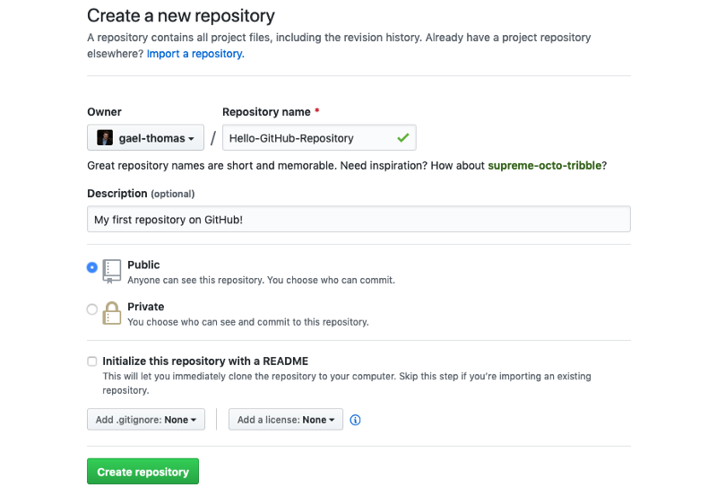
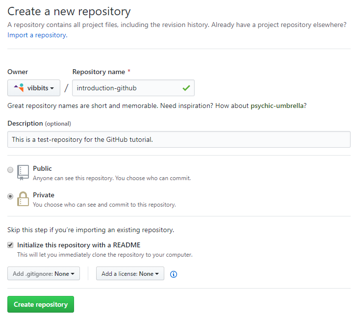
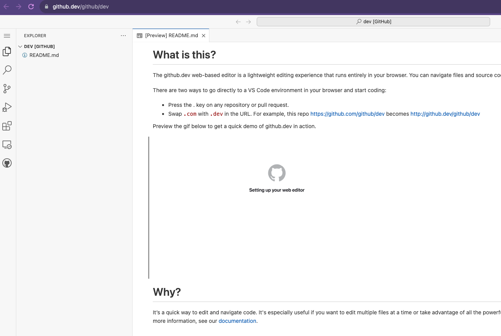
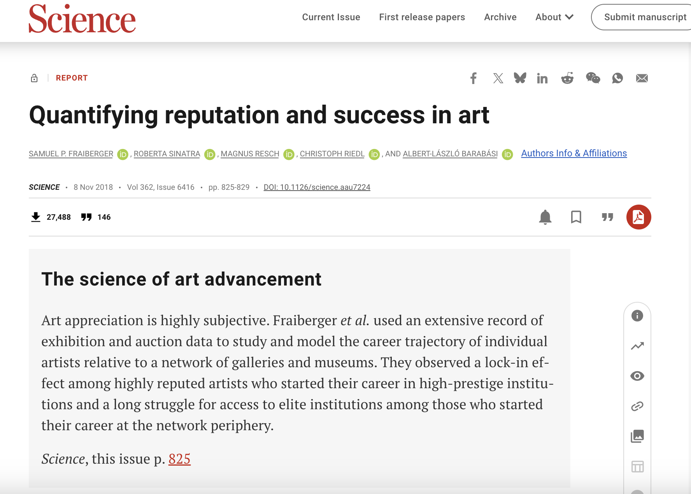
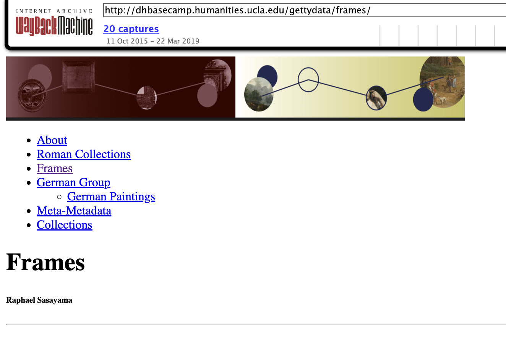
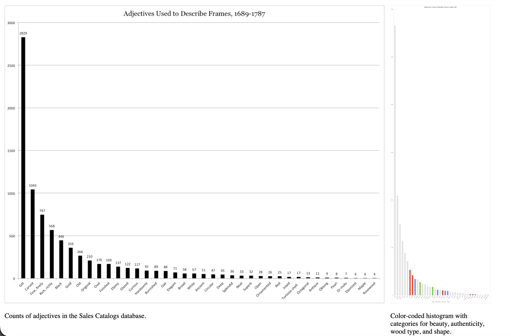
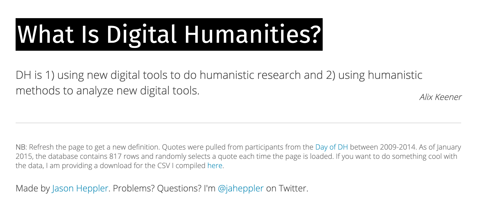

# Definitions & Disciplines

**Today's Agenda**

- Complete remainder of Introduction to Version Control and GitHub.
- Discuss assigned readings and annotations.
- Discuss the semester project and group formation.

. . .

Any questions before we start?

## PLEASE COMPLETE THE SURVEY!

As of this morning:

| Section | Completed | Current Students | Missing |
|---|---:|---:|---:|
| A | 14 | 22 | 8 |
| B | 25 | 27 | 2 |
| **Total** | **39** | **49** | **10** |

**10 current students still need to complete the survey.** Please complete this ASAP so I can finalize groups for Thursday's class. Link is on Canvas, and please reach out if you have any issues accessing it.

# Working with GitHub

By now you should have your git configuration setup and have a GitHub account, but feel free to look back at our [course tools lesson](../materials/introducing-defining-cad/01-CAD-tools.qmd#git){target="_blank"} if you're having any issues.

## Quick Git Workflow Review

Before we move to GitHub:

- What does `git status` tell us?
- What is the difference between `git add` and `git commit`?
- Where do commits live before we push them?
- What does GitHub add to our local git workflow?

::: {.notes}
I want this to be quick and diagnostic. The goal is not to quiz them formally, but to surface where they are confused before we add the remote/GitHub layer. If needed, I can sketch the sequence again: edit files, check status, stage changes, commit locally, then push to GitHub.
:::

## Creating a Repository on GitHub

1. Go to [github.com](https://github.com/){target="_blank"}
2. Click the **New** button

{height="300"}

::: {.notes}
To get our local git repository onto GitHub, we first need to create a new repository on the website. Click the New button in the top right corner of GitHub.
:::

## Repository Settings

{height="400"}

## Repository Settings

- Name it `is310-first-repo`
- Choose **Public** so we can see each other's work
- Leave README unchecked for now

::: {.notes}
Give your repository a name, add a description if you want, and choose whether it's public or private. For class purposes, choose public so we can see each other's repositories. Leave the README option unchecked since we'll push our existing local repo.

You also have the option to `initialize the repository with a README`, which is a file that provides information about the project. We will be discussing this more later so for now leave this option unchecked. You can also add a `.gitignore` file, which is a file that tells Git to ignore certain files in the repository. Again, something we'll discuss more in-depth in the coming weeks.
:::

## Repository Settings


::: {.notes}
Once you create your repository it should like the photo above. If you selected the `Initialize this repository with a README` option, you will see a blank repository that looks like the photo below.
:::

## Repository Settings



To understand what each button does feel free to browse through our [advanced git and GitHub resource](../materials/introducing-defining-cad/05-advanced-git-github.qmd){target="_blank"}, but first let's try to get our local repository onto GitHub.

## Connect Local to Remote

Add your GitHub repo as a "remote":

```sh
git remote add origin https://github.com/USERNAME/is310-first-repo.git
```

::: {.notes}
Now that we have created a new repository on GitHub, we need to connect it to our local repository. To do this, we need to add a remote repository. We can do this by using the `git remote add` command and then the name of the remote repository and the URL of the remote repository. Let's call our remote repository `origin` and use the URL of our GitHub repository.
:::

## Connect Local to Remote

Verify it worked:

```sh
git remote -v
```

```sh
origin  https://github.com/username/repository.git (fetch)
origin  https://github.com/username/repository.git (push)
```

::: {.notes}
In this case, we would replace `OWNER` with our GitHub username and `REPOSITORY` with the name of our repository. So for me, it would be `ZoeLeBlanc/is310-first-repo`.

We can check this by using the `git remote -v` command. This will show us the remote repositories we have added to our local repository.
:::

## Push to GitHub

```sh
git push [remote repository] [flags] [local repository]
```

::: {.notes}
So all we need to do is specify the name of our remote repository and the name of our local repository. What's a bit confusing is that we don't need to write our GitHub URL here but instead can just write `origin`. If you look at the output from `git remote -v` again, you'll notice it says `origin` next to our GitHub URL. This is because `origin` is the default name for our remote repository. We can change this, but for now we'll just use `origin`.

Then for our local repository, we don't need to say our directory name but instead need to specify the name of the branch we want to push. We'll discuss branches more later, but for now we can just use `main`. So our command will look like this:
::: 

## Push to GitHub

Send your local commits to GitHub:

```sh
git push origin main
```

```sh
Enumerating objects: 3, done.
Counting objects: 100% (3/3), done.
Writing objects: 100% (3/3), 226 bytes | 226.00 KiB/s, done.
To github.com:username/is310-first-repo.git
 * [new branch]      main -> main
```

::: {.notes}
The push command sends your local commits to the remote repository. "origin" is the name we gave our remote, and "main" is the branch we're pushing. After this, you'll see your files on GitHub!
:::

### Fatal Errors?


If you see a `fatal` error that looks like this:

```sh
fatal: 'origin' does not appear to be a git repository
fatal: Could not read from remote repository.

Please make sure you have the correct access rights
and the repository exists.
```

::: {.notes}

That just means you forgot to add your remote repository. If you fix that and try again, it should work.

Now if we go to our GitHub repository, we will see that our local repository has been pushed to our remote repository.
:::

## SSH Keys (Optional but Recommended)

Tired of entering your username/password?

. . .

SSH keys let you connect securely without credentials.

. . .

You can find instructions on how to do it [here](../materials/introducing-defining-cad/03-intro-versioning.qmd#configuring-ssh-keys-optional-but-recommended){target="_blank"}

# Editing on GitHub

## Create Files in the Browser

Click **Add file > Create new file**

{height="300"}

::: {.notes}
So far, we have been editing our files locally and *pushing* them up to GitHub. However, we can also edit files in GitHub. This is a great way to make quick changes to a file or add a new file to a repository. Let's try adding using the GitHub interface in the browser and add a special type of file called a `README.md` file.
:::

## Create a README.md


## Create a README.md

Name your file `README.md` and add:

```md
# IS 310 Test Repository

This is my first repository.
```
::: {.notes}
Let's create a README file - the .md extension means Markdown, which is a way to format text. README files are special - GitHub displays them automatically on your repository's main page. They typically describe what the project is about.
:::

## Create a README.md


- Click **Preview** to see formatted output
- Click **Commit changes**
- Add a commit message
- Select **main** branch

::: {.notes}
Now we need to commit our changes and file by clicking the green `Commit changes` box. This will prompt us for a commit message. Let's add the following message
Finally, we need to tell GitHub whether to create a new branch or commit to the `main` branch. Click `main` for now and then click `Commit changes`. Now we have added a new file to our repository and you should see it when you navigate to your repository.
:::

## GitHub Dev (Bonus Feature)

Change `github.com` to `github.dev` in your URL. So for us, we would change `https://github.com/[USER NAME]/is310-first-repo` to `https://github.dev/[USER NAME]/is310-first-repo`.


## GitHub Dev (Bonus Feature)

Or press `.` on any repository

. . .

{height="300"}

*It's VS Code in your browser!* You can read more about it [https://docs.github.com/en/codespaces/the-githubdev-web-based-editor](https://docs.github.com/en/codespaces/the-githubdev-web-based-editor).

::: {.notes}
GitHub Dev is a new feature that gives you a VS Code-like editor right in the browser. Just change .com to .dev in the URL or press the period key. You can edit files and commit changes through this interface.
:::

# Pulling Changes

## The Problem

Now we have **two versions**:

- Local repository (on your computer)
- Remote repository (on GitHub)

. . .

They have different files! How do we sync them?

::: {.notes}
After creating a file on GitHub, our local and remote repositories are out of sync. The remote has a README that our local doesn't have. We need to pull those changes down.
:::

## Pull from GitHub

```sh
git pull origin main
```

```sh
remote: Enumerating objects: 4, done.
remote: Counting objects: 100% (4/4), done.
remote: Compressing objects: 100% (2/2), done.
remote: Total 3 (delta 0), reused 0 (delta 0), pack-reused 0
Unpacking objects: 100% (3/3), 935 bytes | 233.00 KiB/s, done.
From github.com:ZoeLeBlanc/is310-first-repo
 * branch            main       -> FETCH_HEAD
   d8dad7b..832b673  main       -> origin/main
Updating d8dad7b..832b673
Fast-forward
 README.md | 1 +
 1 file changed, 1 insertion(+)
 create mode 100644 README.md
```

. . .

Now `ls` shows the README.md file locally!

::: {.notes}
The git pull command downloads changes from GitHub to your local repository. After pulling, you'll see the README.md file that was created on GitHub is now on your local computer. We've closed the loop!
:::

## The Complete Workflow

{height="400"}

::: {.notes}
This diagram shows the complete workflow. Your working directory is where you edit files. You add changes to the staging area, commit them to your local repository, then push to the remote (GitHub). And you pull from GitHub to get others' changes.
:::

## Core Workflow Summary

1. **Edit** files locally
2. **Add** to staging: `git add <file>`
3. **Commit** snapshot: `git commit -m "message"`
4. **Push** to GitHub: `git push origin main`
5. **Pull** from GitHub: `git pull origin main`

::: {.notes}
This is the core git/GitHub workflow you'll use constantly. Edit locally, add, commit, push. When working with others or after editing on GitHub, pull first to get the latest changes.
:::

# Homework: Init IS310

## Your Assignment

- Create a new GitHub repository called `is310-coding-assignments`.
- Create a new directory in your local computer called `is310-coding-assignments` and enable it as a git repository.
- Create a Markdown file called `README.md` within `is310-coding-assignments`.
- Create a Markdown file called `ai-chat-log.md` if you use AI for the assignment.
- Create a folder called `images` within `is310-coding-assignments`.

::: {.notes}
For homework, they'll practice this entire workflow. Create a repository for coding assignments, add proof that they've installed all required course tools, document their Hypothesis username and AI tool plan, and push it to GitHub. If they use AI, they should include their prompts or conversation in ai-chat-log.md. Then they submit the repository link in the first GitHub discussion.
:::

## README Template

```md
# Init IS310 Homework

## Proof of Installation

1. Python


2. Git


3. VS Code


4. Hypothesis Username

5. AI Tool/Workflow

Detail what AI tool, if any, you plan to use this semester.
```

::: {.notes}
Use this template for the README. They should take screenshots of each required tool running on their computer, save them in the images folder, and reference them in the markdown file. If they use their own setup instead of the recommended setup, they should show proof of the equivalent tool.
:::

## AI Chat Log

If you use AI to help complete this assignment, include:

```md
# AI Chat Log

## Init IS310 Homework

- Tool used:
- Prompts/conversation:
- What changed because of the AI help:
```

::: {.notes}
This is not meant to be a polished essay. It is a simple record of their AI process for the assignment. If they do not use AI, they do not need to include the file.
:::

## Pushing Your Homework

```sh
git add .
git commit -m "Init IS310 Homework"
git push origin main
```

. . .

Remember to connect local to remote first:

```sh
git remote add origin https://github.com/USERNAME/is310-coding-assignments.git
```

. . .

Post your repo link in the [first GitHub discussion](https://github.com/CultureAsData-UIUC/is310-fall-2026/discussions/1){target="_blank"}!

::: {.notes}
Use git add . (with the period) to add all files at once. Commit with a descriptive message, then push. Make sure they've connected their local and remote repositories first. When done, they share the repository link in the first GitHub discussion.
:::

## Resources

- [Advanced Git & GitHub Resource](../materials/introducing-defining-cad/05-advanced-git-github.qmd)
- [Git Commands Cheat Sheet](../materials/introducing-defining-cad/05-advanced-git-github.qmd#git-commands-cheat-sheet)
- [GitHub Docs: Managing Remote Repositories](https://docs.github.com/en/get-started/getting-started-with-git/managing-remote-repositories)
- [GitHub Docs: SSH Keys](https://docs.github.com/en/authentication/connecting-to-github-with-ssh)

## Questions?

Key takeaways:

- **Git** = local version control
- **GitHub** = remote hosting platform
- **Workflow**: edit → add → commit → push/pull
- Commit messages should be descriptive!

. . .

See also: [Advanced Git & GitHub](../materials/introducing-defining-cad/05-advanced-git-github.qmd){target="_blank"}


# Today's Seminar Focus

We are thinking about two connected problems:

1. How culture gets translated into data.
2. Which disciplines claim authority over that translation.

. . .

**Working question:** What changes when we call this course *Culture As Data*?

::: {.notes}
This is where the title change matters. We are not only learning tools. We are asking what happens when cultural materials, practices, experiences, and communities are represented as data.
:::


## First Reading: Types of Cultural Data

::: {.r-fit-text}
*What is Cultural Analytics and who is Lev Manovich?*

:::: {.columns}
::: {.column width="50%"}

:::
::: {.column width="50%"}
[](https://manovich.net/){target="_blank"}
:::
::::
:::

::: {.notes}
What did you make of this first reading? Had anyone heard of Cultural Analytics before? 

Lev Manovich is a professor who works on software studies, media theory, and cultural analytics. He has written several books and articles on these topics, and he is a leading voice in the field of cultural analytics.

Dr. Lev Manovich is a Presidential Professor at The Graduate Center, City University of New York (CUNY). He is recognized as one of the most influential thinkers in digital art, digital culture, media theory, and digital humanities. Manovich's publications include 227 articles, reprinted over 460 times in 40 languages and 17 books which include Artificial Aesthetics, Cultural Analytics, Instagram and Contemporary Image, Software Takes Command, and The Language of New Media, called "the most provocative and comprehensive media history since Marshall McLuhan." Manovich's art projects have been exhibited in 140 international exhibitions at leading cultural institutions, including the Institute of Contemporary Art (London), the Centre Pompidou, and the Shanghai Biennale.
:::

## Example of Cultural Analytics: SelfieCity

[](https://selfiecity.net/){target="_blank"}

::: {.notes}
I like SelfieCity here because it makes cultural analytics concrete. It is not just "analyzing culture with computers" in the abstract. It turns selfies into comparable cultural data: face angle, pose, expression, age, gender presentation, city, and so on. That also gives us an immediate question: what does this project capture well, and what does it have to simplify?

Note that Manovich did not code this project himself. He worked with a team of researchers and programmers to make it happen. This is a good moment to ask: what kinds of expertise are needed to do cultural analytics? [https://selfiecity.net/#credits](https://selfiecity.net/#credits){target="_blank"}
:::

## Second Reading: Humanities Data

::: {.r-fit-text}
*What is humanities data and who is Miriam Posner?*

:::: {.columns}
::: {.column width="50%"}
[](https://miriamposner.com/blog/humanities-data-a-necessary-contradiction/){target="_blank"}
:::
::: {.column width="50%"}
[](https://miriamposner.com/blog/humanities-data-a-necessary-contradiction/){target="_blank"}
:::
::::
:::

::: {.notes}
Posner is a professor and digital humanist who has written about the challenges of working with humanities data. She is a leading voice in the field of digital humanities, and her work focuses on the intersection of technology and the humanities.
Dr. Miriam Posner is an Associate Professor of Film and Media Studies at UCLA. She is recognized for her work in digital humanities, media studies, and the history of technology. 

I’m interested in the way that data and technology shape people’s lives (and vice versa). To understand this, I use methods from fields like history, media studies, science and technology studies, software studies, and digital humanities. My book, Seeing Like a Supply Chain (forthcoming from Yale University Press), is a blow-by-blow account of the technology of supply-chain management (SCM), from punch-cards to neural nets. I argue that SCM is what you get when you treat the world like a computer. I’m always interested in “boring things,” like infrastructure, outmoded databases, and obsolete software, because they’re often enormously consequential to the way we live our lives. I’m also very involved in the broad field of digital humanities, which uses digital tools to explore humanities questions, and I often think and write about the combination of technology and humanities scholarship. If you’re curious about that, you might be interested in the tutorials I’ve written for my students.

Aurora's Annotation: - **Annotation:** I will be replacing "collage" with "image quilts" in my vocabulary from now on. I love this term <3
- **Annotation:** I think it's actually positive towards the ethos side of things as it shows willingness to be honest about her abilities and experience. Also, it is useful to know that we should be thinking about her as specifically a humanist and not a humanist specialized in data curation.
- - **Annotation:** It also specifies that she's sharing the perspective of a humanist specifically *not* super involved with data curation, and she might have unique insight that differs from a humanist who *is* super involved in data curation. I know that might sound odd, but I feel like a novice can always offer insights that an expert cannot, even if it is just insights into *how* a novice understands things.
Katie's annotation:

- **Annotation:** I also think that it's strange to have a critique of yourself right at the beginning of you paper. However, I think that it's an important thing to add because the author wants to the reader to know to take their work with a grain of salt while directing them to others who have more expertise in the topic.
:::

## How can we connect these two readings?

*What do both say about art history?*

## Manovich: Quantifying reputation and success in art {.r-fit-text}

:::: {.columns}
::: {.column width="50%"}
[](https://www.science.org/doi/10.1126/science.aau7224){target="_blank"}
:::
::: {.column width="50%"}

:::

::::

::: {.notes}
What is this article that Manovich talks about?

The article is "Quantifying Reputation and Success in Art" by researchers who used network analysis to study the art world.

These four categories are not meant to include every phenomenon in digital culture. As an example of other equally important phenomena, consider networks. There is an academic field called network science devoted to the study of complex networks and development of theories and ways to measure networks. The network paradigm—that is, seeing a phenomenon as a network—also has been central to other fields since the 1990s. This paradigm assumes that the structure and characteristics of the networks are more important than any individual nodes and links. Adopting this paradigm for the study of digital culture means focusing on a network and the movement of media objects, topics, people, and other objects and actions within it—away from singular media artifacts, behaviors, or events. For example, the authors of the 2018 paper “Quantifying Reputation and Success in Art” performed network analysis of the art world. The authors analyzed data on “497,796 exhibitions in 16,002 galleries, 289,677 exhibitions in 7568 museums, and 127,208 auctions in 1239 auction houses, spanning 143 countries and 36 years (1980 to 2016).”<sup id="ref-1">1</sup> The analysis reveals important patterns in how artists move over time through the network of all these galleries and museums; for example, the artists that had their first five exhibitions in high-prestige institutions were likely to continue exhibiting in such institutions. In contrast, among artists who had their first five exhibitions in institutions ranked in the bottom 40 percent, only 14 percent continued to be active ten years later. The initial exhibition history of an artist was also predictive of other measures of success: “High–initial reputation artists had twice as many exhibitions as low–initial reputation artists; 49% of the exhibitions of high–initial reputation artists occurred outside of their home country, compared to 37% for low–initial reputation artists, and high–initial reputation artists showed more stability in institutional prestige.” These and other patterns were revealed by considering the art world as a big network, with artists and artworks moving in it—without having to take into account the styles and content of the artworks themselves or biographic details of the artists.
:::

## Posner: Getty Frames {.r-fit-text}

:::: {.columns}
::: {.column width="50%"}
[](https://web.archive.org/web/20170328193532/http://dhbasecamp.humanities.ucla.edu/gettydata/frames/){target="_blank"}
:::
::: {.column width="50%"}

:::
::::

::: {.notes}
Just to give you a sense of the kinds of things humanists might do with structured data, I’ll show you a project that my students just completed, as part of a collaboration with the Getty Research Institute. The GRI maintains what seems to me really big data — about 1.5 million records relating to the transmission and sale of works of art, which they call the provenance index. It’s a really complex and baffling database — a really great case study in humanities data, actually — because all of its records are derived from historical documents themselves, and so are eccentric, disparate, and historically and geographically uneven. But because it’s so big, you can do interesting, unexpected things with it.

For example, one of my students got really interested not in the paintings but the frames themselves, which are fairly understudied within art history. He gathered sales data for paintings sold between 1689 and 1787, and through a combination of text analysis and secondary reading, determined that two major factors made a frame valuable during this period: its beauty or its authenticity. With that information, he was able to show that there was indeed a market for frames described as “authentic” during this 100-year period.
:::

## Contrast & Compare

- What do these two examples have in common?
- How does each approach culture as data?
- What is Art History in each example?

::: {.notes}

Both examples turn art history into data.

But they do it differently:

- Manovich emphasizes **relationships**, **scale**, and **patterns**.
- Posner emphasizes **transformation**, **context**, and **interpretation**.

So what changes when we see art history as a network?
Manovich's art-history example is about museums, galleries, auctions, artists, and movement through institutions. Posner's Getty Frames example is about transforming historical records into structured evidence, but she keeps asking what interpretive work gives that evidence meaning.
:::

# What Are Networks & Disciplines?

## What Is Network Science?

:::: {.columns}
::: {.column width="50%"}
[](https://networksciencebook.com/){target="_blank"}
:::
::: {.column width="50%"}
[](https://www.cambridge.org/core/elements/network-turn/CC38F2EA9F51A6D1AFCB7E005218BBE5){target="_blank"}
:::
::::

*How does this differ from social networks? Is everything a network?*

::: {.notes}
Network science studies **relationships** among things.

It asks what we can learn from:
- nodes
- edges
- clusters
- centrality
- paths
- flows
In network science, "network" is not just Facebook, Instagram, or LinkedIn. It is a way of modeling relationships. For art history, nodes might be artists, artworks, exhibitions, museums, critics, patrons, or movements. Edges might be influence, collaboration, collection history, exhibition history, citation, sale, or proximity.
:::

## Network Science vs. Social Networks

| Term | What It Means Here |
|---|---|
| Network science | A method for studying relationships among nodes. |
| Social networks | Platforms or communities where people connect and leave traces. |
| Network as metaphor | A way we now describe almost everything: influence, publics, infrastructure, culture. |

::: {.notes}
I want to separate these without pretending they are unrelated. Social media platforms are networks, but not all networks are social media. Network science gives us methods; social networks give us platforms and data traces; network as metaphor shapes how we casually talk about the world.
:::

## How do we define a discipline?

[](https://whatisdigitalhumanities.com/){target="_blank"}

*Let's explore this project! What trends do you notice?*

::: {.notes}
What is this project? What is the data? Can you find the code? What makes it hard to define a discipline versus something we might call a field? 
:::

## Open Syllabus Project

*How might we use data to understand the boundaries or definitions of disciplines?*

[](https://opensyllabus.org/){target="_blank"}

::: {.notes}
The Open Syllabus Project is a good way to ask how disciplines become visible as data. If we collect syllabi, we can track which books, authors, fields, and ideas appear across courses. But this also raises the same questions as everything today: whose syllabi are included, whose teaching is visible, what counts as a discipline, and what gets flattened by counting assigned texts?

What is the data in this project? What does this tell us about the boundaries of disciplines? What does it leave out? How might we use this data to understand the history of a discipline or field?
:::

## Rise of Cultural Analytics

*Where is cultural analytics in the Open Syllabus Project?*

[](https://culturalanalytics.org/){target="_blank"}

::: {.notes}
Cultural Analytics is useful here as an example of a field or subfield trying to become legible. It has journals, projects, methods, named scholars, and recurring questions. That does not mean everyone agrees on what it is, but it does mean we can watch a discipline or field being built.
 What are some more relevant disciplines?

- What other disciplines or fields does Manovich and Posner mention?
Manovich names work across:

- Humanities
- Qualitative social sciences
- Quantitative social sciences
- Computer science
- Data science
- Media studies
- Design and data art
:::

## Why do disciplines matter for culture as data?

- What is the trouble with humanities data and how does that relate to disciplines?
- What are Manovich's typologies and how do they relate to disciplines?

::: {.notes}
Ben's annotation:

This is an interesting problem to think about. Since humanities covers so many unique areas, a lot of the data has to be mined uniquely for their research and often for the first time.

:::

## Posner's Examples

*What are the challenges with humanities data? What makes it different from other types of data?*

:::: {.columns}
::: {.column width="50%"}

:::
::: {.column width="50%"}

:::
::::

::: {.notes}
- Humanities scholars will sometimes describe elaborate visualizations to me, involving charts and graphs and change over time. “Great,” I respond. “Let’s see your data.” “Data?” they say. “Oh, I don’t have any data.” → That’s why humanists sometimes think you can make a visualization without data; because they want to illustrate ideas and movement, not necessarily data points as we’ve been discussing them here → When you call something data, you imply that it exists in discrete, fungible units → that someone else performing the same operations on the same data will come up with the same results → This is not a perfect analogy, but imagine that someone called your family photograph album a dataset. It’s not inaccurate per se, but it suggests that this person just fundamentally doesn’t understand why you value this artifact
- And I would argue that the notion of reproducible research in the humanities just doesn’t have much currency, the way it does in the sciences, because humanists tend to believe that the scholar’s own subject position is inextricably linked to the scholarship she produces.
- - So humanists — even those who aren’t digital humanists — desperately need some help managing their stuff, and libraries are in a great position to help them. I do feel that this is an underexplored opportunity space for libraries.
It’s just that if you advertise that help as “data management,” they’ll have no idea you’re trying to talk to them.
- Third, it’s just awful trying to find a humanities dataset. There are various humanities data repositories or registries, but they’re terribly limited.
- It requires some real soul-searching about what we think data actually is and its relationship to reality itself; where is it completely inadequate, and what about the world can be broken into pieces and turned into structured data

What is subjective vs objective?

Aurora's annotaitons:

- **Annotation:** but how does one quantify emotion?
- - **Annotation:** I would unironically call a scrapbook I made and care about a "dataset" or an "information repository" for fun because I like intentionally broadening the use of those terms to humanist / social-emotional / untraditional / undervalued / supposedly "non-scientific" contexts.
- - **Annotation:** I really love this whole paragraph so much! Also, for the entire last half of the article I've been thinking about folksonomies as a method of metadata creation/curation that can account for broader nuance and field-specifics or project-specifics, which I think could get one closer to representing reality while being computationally useful. Thoughts?

Elle's annotation:
- This is a funny way of thinking of it. I also generally dislike the way a lot of people talk about human situations as data. Generally, information like crime, prison rates, and other topics are discussed without addressing human elements. It dissociates people from being people and into being "data".

Fianna's annotation:
- **Annotation:** I find this paragraph to matter immensely, as I think it's worth a discussion to dive into whether humanities and humanist writings are data, and whether people agree with Marche or have their own opinions, especially if we are talking about culture as data.
- - **Annotation:** Are there other ways to visualize the data than a heat map? Maybe bar graphs for modeling underrepresented groups in museums and humanities work? Other visualization tools we can utilize?

Katie's annotation:

- **Annotation:** I really like this intersection between numerical data and human experience. I feel like at a time when people are worried about AI taking jobs they forget that sometimes data is nothing without human thoughts and input
- **Annotation:** Could we talk about how libraries could be a help in class? I feel like this point was made throughout the paper but was vague (to me) on what the help could be. With management issue? Supplying information? General resources?
:::

## What can we understand about digital humanities from Posner?

> This is why, more than anything else, I think digital humanities is here to stay. If you can analyze something computationally, I think it’s going to be really hard to tell people that they shouldn’t.

::: {.notes}
How might we consider how computation scales subjectivity rather than creating objectivity?

Aurora's annotation:
- **Annotation:** Does that mean that reproducible research in info/data science also "doesn't have much currency" or do you think it still matters / is still possible?
:::


## How Can We Relate to Manovich's Initial Questions? {.r-fit-text}

> What does it mean to represent a cultural object, process, or experience as data that can be then analyzed computationally? What elements of these objects, processes, and experiences can be captured, and what remains outside? How can we represent people interactions with computational cultural artifacts and systems that can react to human behaviors, communicate with them (e.g., as AI interfaces can), and act in seemingly intelligent ways? These are all fundamental questions for cultural analytics.

::: {.notes}
What similarties and differences do you notice between Posner and Manovich? How do they each define the problem of cultural data? How do they each define the problem of cultural analytics?

:::

## What Are Manovich's Other Typologies?

- What are the four categories of cultural data?
- What is the difference between cultural data, cultural information, and cultural discourse?
- What are the three types of digital representations?

## Typology 1: Four Categories of Cultural Data 

::: {.r-fit-text}
- How does he define digital? Does this differ from how we define data?
- Do you agree with his four categories? Are there other categories that might be useful?

| Category | Examples |
|---|---|
| **Media** | Images, videos, music, games, websites, apps, artworks |
| **Behaviors** | Likes, shares, ratings, purchases, searches, physical actions |
| **Interactions** | Gameplay, app use, VR/AR activity, software-mediated choices |
| **Events** | Performances, exhibitions, festivals, protests, workshops |

:::

::: {.notes}

Katie's annotation:
- **Annotation:** I really appreciate how these are defined at the beginning of the chapter to set you up for the content

How does Manovich define these categories? Do you agree with his four categories? Are there other categories that might be useful?
In this chapter, I will look at four categories of “things” in global digital culture that we can analyze computationally on a large scale. Note that “digital” here refers to both the phenomena that are native to computer devices and networks (making posts, sharing media, commenting, participating in online groups and forums, using apps) and the physical phenomena that are represented in digital universe (e.g., webpages for organizations and events). The four categories we will examine are media, behaviors, interactions, and events.

Media here refers to digital artifacts created by professional creatives and users of social networks. Behaviors include both online activities that leave digital traces and physical behaviors that can be captured using other methods. Interactions refers to the activity of using interactive, algorithm-driven media such as video games, virtual earth software such as Google Earth, or virtual reality and augmented reality applications. Finally, events are cultural happenings that have duration in time and involve multiple people: a music performance, an exhibition opening, a fashion show, a workshop, a weekend urban festival, a demonstration by a master coffee maker. These events usually take place in specific places and are presented by organizations, so this category also includes these entities.
:::


## Examples of Media?

- What are some of the examples Manovich gives for media? What are some other examples you can think of?
- Had you heard of these before?
- What are some of the challenges of analyzing these media?

::: {.notes}
Does everyone know what web scraping and APIs are?

Aurora's annotations:

- **Annotation:** Agreed. It makes me slightly worried about the authors' grasp of the importance of emotion in the act of choosing to connect with other artists. And why are they "speculating" when they could easily just ask/interview some of the artists who use Flickr?
- **Annotation:** I will add that fast fashion isn't a good thing, and it isn't necessarily a good thing that we have such effective automated analysis of fashion given that it has been a reason why fast-fashion has been able to become such a detrimental issue, not to mention all the other ethical issues with the creation of such automated tools in the first place.

Katie's annotations:
- **Annotation:** I think this big bang comparison is very apt. For how much we talk about how social media I feel like theirs very little discussion about just how much content their must be at this point in relatively little time. Billions of people posting pieces of content.
- - **Annotation:** I doubt many people know that so much data is being collected from them. Even if we know some things are collected, it's hard to know what all was taken.

In addition to the obligatory presence on general social networks and professional networks such as Behance, today a serious creative professional maintains their dedicated site with a unique URL. A dedicated website is also the default medium to present a large or ongoing project or event in most cultural fields, in addition to a page on Facebook. How many such websites for cultural professionals, projects, and organizations are created or updated every year? As far as I know, nobody has ever bothered to ask such question. And this is a telling example of how little we know about contemporary global culture. The rapid expansion of the digital cultural universe is like an expansion of our physical universe after a big bang a billion years ago (according to the dominant cosmological paradigm). Manually browsing the web or using recommendations provided by social networks and sharing sites, we can see only tiniest corners of the continuously expanding cultural universe. But if we used proper sampling methods to collect big datasets and analyze them with data science methods, what we would be able to see would no longer be limited by lists of automatically generated “trending topics” or inaccessible algorithms underlying recommendation systems or lists of “top” or “most important” items created by some experts and geared to the interests of certain audiences. Such data collection methods include using APIs when they are available and downloading data via web crawling or web scraping when APIs do not exist. Using the latter methods, we can access and then analyze all kinds of cultural content outside social networks. (Of course, we also need to follow accepted guidelines to protect user privacy when using data from websites, social media networks and other online sources. I will discuss this later in this chapter.)

This data potentially can be used to do something that previously was unimaginable: to create dynamic, interactive, detailed maps of global cultural developments that reflect the activities, aspirations, and visions of millions of creators. Such dynamic maps will have a sufficient temporal and geographic resolution to show how trends emerge, travel in space and time, change in popularity, are combined with other trends, and so on (see plate 2).

But we also should not underestimate the challenges. For instance, though digitization and networking of culture gave us a massive volume of artifacts, it also led to the proliferation of new media forms and genres. And if humanities and media studies did not keep up with this proliferation, neither did computer sciences. Here older media popular by the end of the twentieth century—photographs, videos, songs, spatial data and text (including websites, blogs, and social media posts)—received the most attention. Automatic recognition and detection of objects, types of scenes, and higher-level concepts in photos has been a key focus of research in computer vision, and significant progress was made in the 2010s. Good progress has also been achieved for particular types of content, such as fashion photography. Significant accuracy has been achieved in automatic analysis of professional and nonprofessional fashion photos, including detecting types of clothes, poses, brands, and styles (hipster, bohemian, preppy, etc.).<sup id="ref-8">8</sup> Another research area where we see promising results is detection of illustration styles.<sup id="ref-9">9</sup> But at least so far, automatic analysis of styles, techniques, and forms in graphics, products, interfaces, and UI of games has not been posed as a research problem; the first paper on automatic classification of styles in architecture was only published in 2019.<sup id="ref-10">10</sup> (The adoption of neural networks that perform well for classification of new types of cultural data is a good start, but we certainly don’t have anything yet that is similar in depth and breadth to the methods in natural language processing for other media.)

In fact, the global use of networked computers and devices for creating and sharing content and communication led not only to the quantitative explosion of cultural artifacts since the middle of the 2000s, but also to growth in number of media genres and their combinations: HDR photos, photos with filters, photos with superimposed stickers and drawings, 360-degree video, vertical video, virtual globes, emoji, screen icons, adaptive web designs, and more.<sup id="ref-11">11</sup> These genres, types, and combinations often change and evolve quickly. This is possible because they all “live” within a strictly software environment, so on a material level nothing needs to change; everything continues to be made from the same pixels, vectors, and text characters.<sup id="ref-12">12</sup> These dynamics and this mutability present a significant challenge for any type of media analysis today, be it nonquantitative media theory or quantitative studies that rely on algorithmic analysis of large samples. In other words, as algorithms to analyze some genres achieve better performance and researchers finally start paying attention to new forms, new genres and new forms keep emerging, and the older ones keep changing.
:::

## Examples of Behaviors?

- What are digital vs. physical traces? Had anyone heard of digital trace data before?
- What are some of the examples Manovich gives for behaviors? What are some other examples you can think of?
- How does the approach differ for digital vs. analog traces? What are some of the challenges of analyzing these behaviors?

::: {.notes}
Aurora's annotations:
- **Annotation:** This is still crucially important when it comes to online behavior, yet it feels like it is too often forgotten and solely replaced (rather than used in conjunction) with all of the user data that is constantly being taken in online spaces without informed consent!
- **Annotation:** Why would one view a movie or TV program via a single PDF or JPEG? I can't tell if this is just a typo or if it's a larger misunderstanding about / downplaying of the differences in chronology between static text and moving video.

Fianna's annotations:
- **Annotation:** Immediately, this reminds me to connect this to flock cameras, which are new commonplace AI cameras used to track people across the country.

Katie's annotations:
- **Annotation:** I had never really considered reviews being a form of social media before this
- - **Annotation:** I remember hearing about eye movement technology being used to watch either what admissions officers or interviewers looked at on an application. But I never really considered that this could be used to deduce thought about art.

- privacy and surveillance? What disciplines are involved in studying these behaviors? What are the ethical implications of analyzing these behaviors?
- what is quantitative vs. qualitative analysis? What are the challenges of analyzing these behaviors? What are some of the ethical implications of analyzing these behaviors?
:::

## Examples of Interactions?

- How does Manovich define interactions? What disciplines does he say focus on this area?
- How does this relate to software and interactivity?

::: {.notes}
HCI example!

Aurora's annotations:
- **Annotation:** *putting on my anti-capitalist gen z hat* or the goal is to identify what can be changed to maximize profit and/or shareholder interest, even if it creates new and compounding problems for users aka ensh*ttification (sorry for the inappropriate language, I do not know of a more appropriate term that has the same meaning)
- **Annotation:** There's that idea of data laborers again!
  - **Passage:** Types of Cultural Data 91by participating, they are doing free labor for Facebook
  - 
:::

## Examples of Events?

- What are some of the examples Manovich gives for events? What are some other examples you can think of?
- How does this relate to the other three categories? What challenges of privacy and surveillance are involved in analyzing these events?

## Typology 2: Data, Information, Discourse

Manovich also distinguishes:

- **Cultural data:** artifacts and systems.
- **Cultural information:** metadata about those artifacts.
- **Cultural discourse:** reviews, ratings, comments, posts, responses.

. . .

Why separate these?

::: {.notes}

There are also other ways to look at the digital universe in terms of things that we can select for analysis. For example, we can distinguish among cultural data, cultural information, and cultural discourse:

- **Cultural data:** Photos, music, designs, architecture, films, motion graphics, games, websites, apps, artworks—that is, cultural artifacts and systems that either are born digital or are represented through digital media (e.g., photos of architecture).
- **Cultural information:** Names of artists in an exhibition, addresses of cultural venues, numbers of downloads for an app, and other kinds of information all published online. This can be thought of as metadata about the artifacts in the first category.
- **Cultural discourse:** Reviews, ratings, posts in which people describe their experiences from attending an exhibition, and photos and videos of these experiences, posts, and videos that detail the creation process—that is, a kind of “extended metadata” about these artifacts.
:::

## Typology 2: Data, Information, Discourse

Manovich also distinguishes:

- **Cultural data:** artifacts and systems.
- **Cultural information:** metadata about those artifacts.
- **Cultural discourse:** reviews, ratings, comments, posts, responses.

. . .

Why separate these? What is Born Digital Vs. Digitized?

::: {.notes}
This distinction is really helpful for student projects. A YouTube video, a channel name, and a comment thread are all related, but they are not the same kind of evidence. A movie, its IMDb metadata, and its reviews are also related but distinct. The point is to ask what kind of thing they are collecting before deciding what method makes sense.

Another important distinction is between the original cultural artifact/activity and its digital representations:

- **Born digital artifacts:** Since they are already in digital form, we are always dealing with the originals.
- **Digitized artifacts that originated in other media:** Their representation in digital form may not contain all the original information. For example, digital images of paintings available in online repositories and museum databases normally do not fully show their 3-D textures. (This information can be captured with 3-D scanning technologies, but this is not commonly done.)
- **Cultural experiences:** For example, experiencing theatre, dance, performance, architecture and space design; interacting with products; playing video games; or interacting with locative media applications on a GPS-enabled mobile device. Here, the properties of material/media objects that we can record and analyze are only one part of an experience. For example, in the case of spatial experiences, architectural plans will only tell us a part of a story; we may also want to use video and motion capture of people interacting with the spaces and their spatial trajectories.

Last but not least, we can also approach digital universe through the lenses of three categories that have been standard in humanities and media studies: authors, texts (or messages), and audiences. We can collect and analyze large data on authors, messages, and audiences using many methods—for example, network analysis of the connections between a group of authors, computer vision analysis of content of visual media they created, spatial analysis of people movements in a museum in relation to the exhibits, and so on. (Texts or messages in this scheme correspond to “media” as used in this chapter.)
:::

## Typology 3: Three Types of Digital Representations

- **Born digital artifacts** 
- **Digitized artifacts that originated in other media** 
- **Cultural experiences** 

::: {.notes}
Aurora's annotations
- **Annotation:** This is not necessarily true if one is dealing with a digital copy of the digital original. For example, a lower quality copy of an image or video that was originally higher quality.

Fianna's annotation:- **Annotation:** Cultural experiences differ from the other two categories. Those feel almost one-dimensional, each captured by a single artifact. Cultural experiences are more three-dimensional. they're one piece of a larger puzzle, so it takes multiple experiences to fill it out. For the other two, one artifact is enough to count as evidence. Does the same hold for cultural experiences, or do you need multiple before it counts as
:::

# Groups & Semester Long Project

- Groups are currently tentative. We will finalize them in the next class.
- Each group will choose a cultural phenomenon to study, let's start exploring [Responsible Datasets in Context](https://www.responsible-datasets-in-context.com/){target="_blank"} for ideas.

