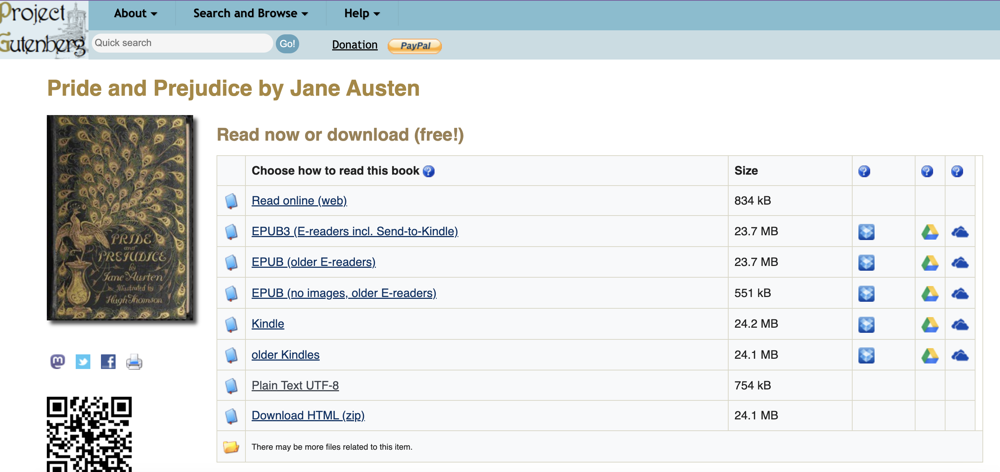
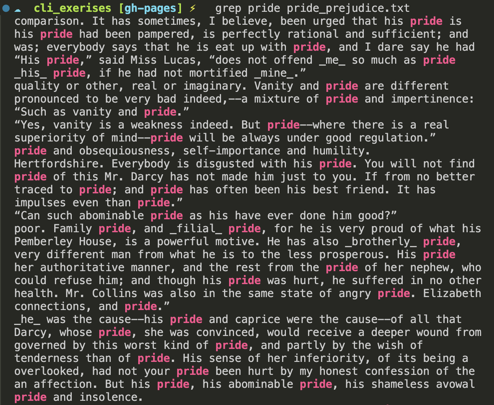
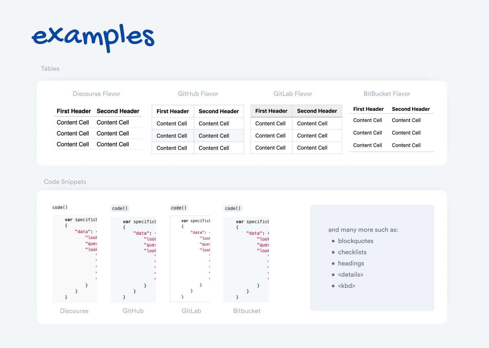

# From GUI to Command Line

## Recap: The Command Line

We've learned how to:

- Create directories with `mkdir` in Linux/Unix or `New-Item -ItemType Directory` in PowerShell
- Navigate with `cd` and `pwd` OR `Set-Location` and `Get-Location`
- List contents with `ls` OR `Get-ChildItem`
- Create files with `touch` OR `New-Item`

. . .

But what exactly *are* files?

::: {.notes}
Now that we have seen how we can use the command line to create directories and files, and move them around, it might seem like a lot of work to do something we could do with a GUI. But the command line is actually much more powerful - we can search for text, count words, and manipulate files in ways that would be tedious with a GUI.
:::

# Introducing File Formats


::: {.notes}
There are many different file formats and each one has its own purpose. What constitutes a document or a file might seem obvious, but is actually a robust and ongoing scholarly debate in Library and Information Sciences (LIS) and Computer Science (CS).
:::

## What is a File? A Somewhat Reductive Answer

A **file** is a collection of data stored in a single unit, identified by a filename.

. . .

Files can be:

- Documents
- Images
- Videos
- Audio
- Any other collection of data

::: {.notes}
To put it a bit simply, a file is a collection of data stored in a single unit, identified by a filename. It can be a document, an image, a video, a sound, or any other collection of data.
:::

## File Extensions

The **file extension** is the part of the file name after the period.

. . .

| Extension | Type |
|-----------|------|
| `.docx` | Microsoft Word document |
| `.jpg` | Image file |
| `.mp3` | Audio file |
| `.txt` | Plain text file |
| `.md` | Markdown file |

::: {.notes}
The file extension tells the computer what type of file it is and what program to use to open it.
:::

## Proprietary vs Open Formats

Some file formats depend on particular software ecosystems.

. . .

For example, `.docx` files are designed for Microsoft Word and similar word processors.


::: {.notes}
For example, a `.docx` file is a Microsoft Word document, a `.jpg` file is an image, and a `.mp3` file is an audio file. Some file formats depend on particular software ecosystems, meaning they may work best in certain programs even if other tools can sometimes open them. The point is not that Word is the only possible way to open a `.docx`, but that the file is designed for a particular kind of software environment.
:::

## What is this?

{height="400"}

::: {.notes}
This gibberish is actually part of the structured information that makes up the file, but since the PDF viewer or text editor doesn't know how to interpret that structure, it shows you the underlying contents rather than the formatted document.
:::

## Proprietary All the Way Down

To be clear, `.doc` was invented in 1983 along with the first version of the *software* for Microsoft Word which ran on MS-DOS, whereas `.docx` was only introduced in 2007 as part of an XML-based update to the software.

[](https://en.wikipedia.org/wiki/History_of_Microsoft_Word){target="_blank"}

# What Are Open or Plain Text Formats?

Open or plain text based formats are easier to inspect directly.

- `.txt` files work with any text editor
- Main benefit? More sustainable and portable

:::{.notes}
Other file formats are open or plain text based, meaning they can be opened by many different programs and are easier to inspect directly. For example, `.txt` files are plain text files that can be opened by any text editor. When we used the `touch` command, we told the terminal to create a `.txt` file. This is because `.txt` files are the simplest file format and only contain text.
:::

## Plain Text vs Formatted Text

A Word Document and a `.txt` file might look the same...

. . .

But Word contains **hidden formatting** that `.txt` does not.

. . .

In programming, we want to be **explicit** - so plain text is preferable.

::: {.notes}
As scholars working with computers, we need to be aware of the ways plain text and formatted text differ. While a Word document and a `.txt` file might look similar to us, the Word document contains a lot of hidden formatting that the `.txt` file does not. Today, we have been talking a lot about text, from text commands to text files. But the core concept with both of these is the idea of plain text.
:::

## What is Plain Text? The Unicode Definition

According to the [Unicode Standard](https://unicode.org/versions/Unicode13.0.0/){target="_blank"}:

> Plain text is a pure sequence of character codes; plain Unicode-encoded text is therefore a sequence of Unicode character codes.

. . .

**Key concept:** Plain text shows if it is formatted or not (we call this *markup*), and usually contains no formatting.

::: {.notes}
This is a bit technical, but the key concept is that plain text shows if it is formatted or not (we call this markup), and usually contains no formatting.
:::

## Who Decides What Counts as Text?

[{height="360"}](https://xkcd.com/927/){target="_blank"}

*Who has heard of the Unicode Consortium?*

::: {.notes}
Before getting too comfortable with the phrase "plain text," I want to pause on the infrastructure behind it. This XKCD comic is funny because standards are supposed to solve incompatibility, but they also have histories, politics, and sometimes competition. Character encoding is one of the examples named in the comic.

Computers do not automatically "know" what a letter, punctuation mark, emoji, accent mark, or symbol is. Those characters have to be represented through shared standards. One of the most important organizations responsible for those standards is the Unicode Consortium.

The Unicode Consortium is a nonprofit organization founded in 1991 to develop and maintain the Unicode Standard. Before Unicode, many computer systems used different character encodings, which meant that text could break when it moved across languages, operating systems, or software platforms. A file created on one machine might display incorrectly on another because the two systems did not agree on which numbers represented which characters.

Unicode tries to solve this problem by assigning characters standardized code points. In simplified terms, Unicode gives each character a stable identifier so that computers can exchange text more consistently across systems. This is why we can write not only English letters, but also accented characters, non-Latin scripts, mathematical symbols, and emoji in many modern digital environments.

For our purposes, Unicode matters because it shows that even "plain text" depends on infrastructure, institutions, and decisions about what should be represented. Text may seem simple, but representing text as data requires standards about which characters count, how they are encoded, and how software should interpret them.

[Sources] XKCD 927, "Standards"; Unicode Consortium, "The Unicode Standard."
:::

## Why Plain Text Matters

Plain text is:

- **Portable** - moves between programs easily
- **Manipulable** - responds to programmatic operations
- **Sustainable** - doesn't require specific software

. . .

Edited in a **text editor** like VS Code

::: {.notes}
Plain text can be moved between programs more fluidly and can respond to programmatic manipulations. It is often manipulated in something called a *text editor* (like VS Code), which is a program that allows you to edit plain text files.
:::

## Let's experiment with Plain Text & Project Gutenberg

{height="400"}

*[Pride and Prejudice by Jane Austen](https://www.gutenberg.org/ebooks/1342){target="_blank"}*

::: {.notes}
Project Gutenberg is a website that hosts public domain books in plain text format. This is a great resource for working with text files, but it is also useful because it makes visible how copyright status, volunteer labor, preservation, and plain text formats work together to shape what becomes computationally accessible.
:::

## Origins of Project Gutenberg

[](https://www.gutenberg.org/about/){target="_blank"}

Founded by **Michael Hart** at UIUC in **1971**

::: {.notes}
Project Gutenberg is one of the oldest and most important digital text projects. It began in 1971 when Michael Hart, then connected to the University of Illinois, used access to a mainframe computer to type a digital version of the U.S. Declaration of Independence.

His idea was that computers could be used to freely distribute texts to anyone with access to a networked machine. So when we download a plain text file from Project Gutenberg, we are not just using a convenient source of text. We are also entering a longer history of eBooks, digitization, volunteer labor, public access, and file formats.
:::

## Public Domain and Access

Project Gutenberg focuses especially on **public domain** texts.

That means many works can be legally:

- copied
- shared
- remixed
- redistributed

*How did Project Gutenberg initially start creating digital texts? What is Public Domain Day?*

::: {.notes}
Public domain texts are works that are no longer under copyright or were never protected by copyright. That legal status matters for computational work because it makes some cultural materials much easier to download, preserve, reuse, and analyze.

Public Domain Day happens every January 1, when new works enter the public domain in many countries. We will return to these questions later, but for now I want students to see that the availability of a text as data is not simply a technical question. It is also shaped by law, institutions, labor, and preservation choices.
:::


## Downloading Files from the Command Line

```sh
curl https://www.gutenberg.org/files/1342/1342-0.txt > pride-and-prejudice.txt
```

:::{.notes}
I can download this file directly from my terminal using the command line
:::

## The `curl` Command

- `curl` = "client URL" - downloads files from the internet
- `>` = redirect output to create a new file
- Result: a `.txt` file with the book's text

::: {.notes}
The curl command is a command line tool for transferring data and downloading files from the internet. We can also use it to upload files. In this example, I'm using the command `curl` to download the book from Project Gutenberg. The `>` symbol tells the terminal to create a new file, store this data in the file, and save the file as `pride-and-prejudice.txt`. We can see that this file is a `.txt` file, meaning it is a plain text file. `curl` stands for "client URL" and is a command line tool for transferring data and downloading files from the internet. We can also use it to upload files to the internet.
:::

## Windows Alternatives

**Using WSL/Ubuntu:**

```sh
wget https://www.gutenberg.org/files/1342/1342-0.txt > pride-and-prejudice.txt
```

. . .

**Using PowerShell:**

```powershell
wget https://www.gutenberg.org/files/1342/1342-0.txt -OutFile pride-and-prejudice.txt
```

::: {.notes}
If students are using WSL/Ubuntu on Windows, `wget` works like a Unix command. If they are using PowerShell and not WSL, the command looks slightly different because PowerShell treats `wget` as an alias for its own web request command. PowerShell requires the `-OutFile` flag.
:::

# Working with Text Files

## Displaying File Contents

**macOS / WSL / Linux**

```sh
cat pride-and-prejudice.txt
```

. . .

**PowerShell**

```powershell
Get-Content pride-and-prejudice.txt
```

. . .

`cat` usually works in PowerShell as an alias for `Get-Content`.


::: {.notes}
The cat command stands for concatenate, and is a command line tool for displaying the contents of a file. In PowerShell, cat usually works because it is an alias for Get-Content, but I want students to know the explicit PowerShell command too. For very long files like Pride and Prejudice, they'll likely only see the end of the text without scrolling for ages.
:::

## Counting Words

**macOS / WSL / Linux**

```sh
wc -w pride-and-prejudice.txt
```

. . .

**PowerShell**

```powershell
(Get-Content pride-and-prejudice.txt | Out-String).Split().Count
```

::: {.notes}
The wc command stands for word count. The -w flag tells the terminal to count words. This command does not usually work by default in normal PowerShell, so students using PowerShell need the Get-Content version. It is more verbose, but conceptually it does the same thing: read the file, treat it as a string, split it into words, and count the pieces.
:::

## Counting Lines

**macOS / WSL / Linux**

```sh
wc -l pride-and-prejudice.txt
```

. . .

**PowerShell**

```powershell
(Get-Content pride-and-prejudice.txt).Count
```

. . .

Pride and Prejudice has **14,911** lines.

::: {.notes}
The -l flag tells the terminal to count the number of lines instead of words. Since PowerShell does not usually include wc, students can use Get-Content and Count to count the lines in the file.
:::

## Searching for Text

**macOS / WSL / Linux**

```sh
grep pride pride-and-prejudice.txt
```

. . .

**PowerShell**

```powershell
Select-String "pride" pride-and-prejudice.txt
```

::: {.notes}
The grep command allows us to search for specific words or patterns in a file. It returns all lines containing the search term. The grep command does not usually work by default in normal PowerShell, so students using PowerShell should use Select-String instead.
:::

## Search Output

{height="300"}

::: {.notes}
This screenshot shows what the matching lines look like when we search for "pride" in the Project Gutenberg text. The output is not a polished visualization. It is a rough but useful way of asking a text file a quick question from the command line.
:::

## Counting Matching Lines

How many lines include "pride"?

**macOS / WSL / Linux**

```sh
grep -c pride pride-and-prejudice.txt
```

. . .

**PowerShell**

```powershell
(Select-String "pride" pride-and-prejudice.txt).Count
```

. . .

Result: **43 lines**

. . .

**Your turn:** How many lines include "prejudice"?

::: {.notes}
The `-c` flag with grep counts the number of matching lines instead of displaying them. In PowerShell, we can use Select-String and then count the matches. This is useful for quick text analysis, but it is not quite the same thing as counting every individual occurrence of a word, since a line could include the same word more than once.
:::

## Command Summary

| Command | What it does |
|---------|--------------|
| `curl` / `wget` | Download files from the web |
| `cat` | Display file contents |
| `wc -w` | Count words |
| `wc -l` | Count lines |
| `grep` | Search for text |
| `grep -c` | Count matching lines |

# Introducing Markdown


## What is Markdown?

- A **plain text** file format (`.md`)
- Uses symbols to add formatting
- You've already seen it: `README.md` files!

. . .

Like `.txt`, but with lightweight formatting capabilities.

::: {.notes}
While .txt files are useful, in digital humanities we often use a file format called Markdown. Like txt, Markdown is a plain text file format that uses symbols to add formatting to the text.
:::

## Creating a Markdown File

```sh
touch is310-culture-as-data.md
# OR (PowerShell)
New-Item -ItemType File -Name is310-culture-as-data.md
```

. . .

Open in VS Code and add:

```md
Culture as Data asks how cultural materials, practices, and communities become structured, interpreted, and transformed through data.
```

::: {.notes}
We can create a Markdown file using the touch command and adding .md to the end of the file name.
:::

## Adding Bold Text

Put two asterisks on either side:

```md
**Culture as Data** asks how cultural materials become structured data.
```

. . .

Renders as: **Culture as Data** asks how cultural materials become structured data.

::: {.notes}
Maybe we want to highlight the phrase "Culture as Data" in bold. To do this we would put two asterisks on either side of the phrase.
:::

## Adding Italics

Put one asterisk on either side:

```md
**Culture as Data** asks how cultural materials become *structured data*.
```

. . .

Renders as: **Culture as Data** asks how cultural materials become *structured data*.

::: {.notes}
We could also put `structured data` into italics by putting one asterisk on either side of the phrase.
:::

## Adding Headings

Put a hashtag in front:

```md
# Welcome to Culture as Data
```

. . .

Different levels:

- `#` = Heading 1
- `##` = Heading 2
- `###` = Heading 3

::: {.notes}
We can add headings by putting hashtags in front of the text. More hashtags = smaller heading.
:::

## Previewing Markdown in VS Code


*Click the preview icon in VS Code's top right corner*

::: {.notes}
We can see what this looks like in VS Code by using the Markdown Preview extension. This opens a preview of the Markdown file in a new tab.

Now you can see that our formatting has been applied to the text. This type of formatting is called Markdown syntax and it is a way of adding formatting to plain text files. What we did was exactly the same as what you do when you use the buttons in Word or Google Docs to add headers or styling to your text. The difference is that we are using symbols to add this formatting instead of buttons.

This may seem like a lot of extra work, but the advantages of Markdown are numerous.
:::

## Why Markdown? Advantage 1: Sustainability

Plain text is **future-proof**

. . .

- No license required
- No special software needed
- Works forever

::: {.notes}
Markdown is much more sustainable than Word or Google Docs. This is because the text is saved as plain text and not in a format that is optimized for editing. This makes it future-proof so that you don't require a license or access to an application to see your files.
:::

## Why Markdown? Advantage 2: Platform Agnostic

Can be rendered by **any text editor**

. . .

- Works on Mac, Windows, Linux
- Works on web, desktop, mobile
- No vendor lock-in

::: {.notes}
Markdown can also be rendered by any text editor. This is because Markdown is a plain text format and not a rich text format. This makes it platform agnostic.
:::

## Why Markdown? Advantage 3: GitHub Integration

GitHub **renders Markdown automatically**

. . .

- `README.md` displays on repository pages
- Easy to share documentation
- Integrates with version control

::: {.notes}
Finally, Markdown plays nicely with GitHub, which renders it directly in your browser. This makes it easy to push up your files into your repositories.
:::

## Markdown: A Brief History


Markdown was created by **John Gruber** with **Aaron Swartz** in 2004. 

## Markdown: A Brief History

The goal was to create a file format that was easy to read and write, could be converted into web documents, and could be used by anyone. You can read more about the history of Markdown, in Bednarski, Dawid. “The History of Markdown: A Prelude to the No-Code Movement.” *Taskade Blog*, March 25, 2022. [https://www.taskade.com/blog/markdown-history/](https://www.taskade.com/blog/markdown-history/){target="_blank"}.

::: {.notes}
It's important to understand that Markdown has this history because many flavors of Markdown exist, and standardization of Markdown has been an ongoing project.
:::

## Swartz, Creative Commons, Access

Aaron Swartz was connected to several open web projects.

. . .

- Markdown
- RSS
- Reddit
- Creative Commons
- Open access activism

::: {.notes}
Aaron Swartz matters to this history not only because of Markdown, but because he was part of a broader movement around open access, open standards, and the public web. As a teenager, Swartz helped with the technical infrastructure for Creative Commons.

Creative Commons was founded in 2001 to give creators legal tools for sharing their work more flexibly than the default model of "all rights reserved" copyright. Creative Commons licenses do not eliminate copyright. Instead, they let creators specify how others may copy, share, adapt, or cite their work.

This gives us a useful bridge from public domain materials to openly licensed materials. Project Gutenberg mostly works with public domain texts. Creative Commons helps creators share work before copyright expires.
:::

## Public Domain vs Licensed Access

| Model | What changes? |
|---|---|
| Project Gutenberg | Public domain texts, downloadable plain text |
| Creative Commons | Creators keep copyright but allow some reuse |
| JSTOR | Access shaped by vendors, libraries, and licenses |

::: {.notes}
This is where I want to introduce content vendors like JSTOR. JSTOR preserves and provides access to scholarly journals, books, and primary sources, but access is often mediated through institutional subscriptions and licensing agreements.

Swartz's life and death are often discussed in relation to these questions of access. In 2011, he was arrested after downloading millions of academic articles from JSTOR through MIT's network. JSTOR later said it had reached a civil settlement with Swartz and did not want the matter to continue as a criminal case, but federal prosecutors pursued charges under computer crime law. Swartz died by suicide in January 2013 while the case was ongoing.

This is one reason Project Gutenberg is such a useful contrast. Its public-domain plain text files are legally shareable in ways that subscription databases usually are not. That does not make Project Gutenberg neutral or complete, but it does show how copyright status, licensing, institutional access, and file formats shape what kinds of culture become easy to download, preserve, and analyze.
:::

## Markdown Flavors

{height="350"}

::: {.notes}
This figure shows some examples of how Markdown is written depending on the platform and standards. Different platforms have added their own extensions to the basic Markdown syntax.
:::

## GitHub Flavored Markdown (GFM)

Created by GitHub in 2009

. . .

Adds features like:

- Tables
- Task lists
- Syntax highlighting
- Autolinks

. . .

[GitHub Flavored Markdown Spec](https://github.github.com/gfm/){target="_blank"}

::: {.notes}
GitHub Flavored Markdown is a superset of Markdown, meaning it adds additional features to Markdown. For example, GFM allows you to create tables in Markdown, which is not possible in regular Markdown.
:::

## CommonMark Markdown

CommonMark is another popular Markdown style and improvements to it are discussed in this repository [https://github.com/commonmark/commonmark-spec/issues](https://github.com/commonmark/commonmark-spec/issues){target="_blank"}.

# Practice Exercise

Currently, your `README.md` is your first assignment [Init IS310 Homework](../materials/introducing-defining-cad/03-intro-versioning.qmd#homework-init-is310){target="_blank"}. What are some problems with this approach?

. . .

- `README.md` should indicate structure of repo, not be one assignment

## `init_is310`

Your first goal is to clean up your repository so that your first homework assignment has its own folder: `init_is310`.

. . .

That folder should contain your initial `README.md` and any images.

## Improve Your README.md

Then create a new `README.md` file in the root of your `is310-coding-assignments` repository.

. . .

Try adding:

- [ ] A heading
- [ ] A subheading
- [ ] A bulleted list

. . .

You can use AI tools and the [GitHub Markdown Cheatsheet](https://github.com/lifeparticle/Markdown-Cheatsheet){target="_blank"} to help you.

::: {.notes}
Now that students have a basic understanding of Markdown, this exercise asks them to improve the README.md file in their repository. The lesson frames this as both a Markdown practice exercise and a sustainability issue: the root README should help someone understand the whole repository, not only hold the first assignment.
:::

## Helpful Resources

- AI tools, if useful
- VS Code Markdown Preview

. . .

**Push your changes to GitHub when done!**

# Homework: Lost & Found in the Cultural Command Line


## Why a Cultural Data Maze?

This assignment has two goals:

1. **Explore** the cultural framing for your broader topic of interest
2. **See** how your group members each approach the same topic differently

. . .

Your maze should be themed around your **cultural data topic of interest**.

::: {.notes}
This assignment is designed to serve a dual purpose. First, it gives you practice with the command line skills we've been learning. But more importantly, it's an opportunity to start thinking about the cultural data topic you're interested in exploring this semester. By building a maze around your topic, you'll begin developing the cultural framing for your work. And by solving your group members' mazes, you'll get to see how others in your group approach the same broad topic differently.
:::

## Part 1: Build a Maze About Your Cultural Data

Create a command line maze **themed around your cultural data topic of interest** for your group members to solve! First, you should create a new folder in your `is310-coding-assignments` repository called `command-line-maze`. Inside this folder, you should create a maze using directories and files.

::: {.notes}
For this assignment, you will be using your new mastery of the command line to create a maze for your group members to solve. Your maze should be themed around the broader cultural data topic you are interested in exploring this semester. For example, if you're interested in the history of video games, your maze directories and files could reference game titles, developers, eras, or genres. You should work individually on this, though you are welcome to brainstorm ideas.
:::

## Maze Requirements

Your maze should have:

- [ ] A theme connected to your **cultural data topic of interest**
- [ ] An entrance and a solution
- [ ] At least 5 directories (can be nested)
- [ ] At least 5 files (can be nested)
- [ ] One hidden file or directory
- [ ] Clues to help solve the maze
- [ ] `ai-chat-log.md` if you use AI

::: {.notes}
Your directories, files, and clues should relate to the cultural data topic you are interested in exploring this semester. You are welcome to use Project Gutenberg for your files, but you can also use other files if you prefer. You can also use the command line to create your files, or use a text editor. If you use AI to help create, troubleshoot, or solve the maze, include an `ai-chat-log.md` file.
:::

## Documentation Required

Include a `README.md` in your maze folder:

- Instructions for solving the maze
- List of commands that might be helpful
- Your name and maze name as a header

. . .

**Do NOT zip the README!**

::: {.notes}
Be sure to not zip the README.md file, as we will need to read this file to solve the maze.
:::

## Hidden Files on Windows

Dotfiles are hidden by default on Mac/Linux, but not always in PowerShell.

. . .

If your maze depends on hidden files, include:

```powershell
hide-dotfiles.ps1
```

::: {.notes}
Different operating systems handle hidden files differently. If students want their hidden files and folders to behave as hidden on Windows, they should include a PowerShell script in the maze folder named hide-dotfiles.ps1 and tell PowerShell users to run it after unzipping the maze.
:::

## Zipping Your Maze

**Mac/Linux/WSL:**

```sh
zip -r path/to/your/zip/file path/to/your/directory
```

. . .

**PowerShell:**

```powershell
Compress-Archive -Path "path\to\your\directory" -DestinationPath "path\to\your\zip\file"
```

::: {.notes}
Once you have created your maze, you should zip the folder that contains your maze. Be sure to replace these dummy file paths with your actual desired ones.
:::

## Submission

1. Upload zipped maze to your `is310-coding-assignments` repo
2. Post link in [GitHub Discussion](https://github.com/CultureAsData-UIUC/is310-fall-2026/discussions/2){target="_blank"}

. . .

**Need inspiration?** Try the [example maze](https://github.com/CultureAsData-UIUC/is310-fall-2026/blob/main/assets/files/cli_exercises/zipped_gutenberg_maze.zip){target="_blank"}

::: {.notes}
If you need inspiration for your maze, take a look at the example maze which you can download and try solving.
:::

## Part 2: Solve Your Group Members' Mazes

Once your maze is posted, solve **at least two** mazes from students in your group!

. . .

**Steps:**

1. Clone their repository
2. Navigate to the maze folder
3. Read the README.md (`cat README.md`)
4. Unzip the maze
5. Navigate and solve!

::: {.notes}
You are required to solve at least two mazes from other students in your group. This is an opportunity to see how your group members are approaching the same broad cultural data topic. Pay attention to the choices they made in their maze themes - it will help you understand different angles on your shared topic.
:::

## Unzipping

**Mac/Linux/WSL:**

```sh
unzip path/to/your/zip/file -d path/to/your/desired/directory
```

. . .

**PowerShell:**

```powershell
Expand-Archive -Path "path\to\your\zip\file" -DestinationPath "path\to\your\desired\directory"
```

::: {.notes}
The -d flag or -DestinationPath just tells the terminal where to unzip the file. If you're already in the correct spot, you can just use unzip or Expand-Archive with just the path.
:::

## Useful Commands for Solving

| Command | Use Case |
|---------|----------|
| `cd` | Navigate through directories |
| `ls` | See what's in each directory |
| `ls -la` | Find hidden files/directories |
| `cat` | Read file contents |
| `pwd` | Check current location |

::: {.notes}
Students can use the command line cheatsheet, the lesson, peers, or an AI chatbot if useful. If they use AI to help create, troubleshoot, or solve the maze, they should include an `ai-chat-log.md` file.
:::

## When You Solve It

For **each** of the two mazes you solve:

1. Reply to their discussion post
2. Post a screenshot of your solved maze
3. Let them know you were successful!

. . .

**Pay attention to how your group members framed their cultural data topic!**

::: {.notes}
You need to do this for each of the two mazes you solve. Pay attention to how your group members approached the cultural data topic - you'll start to see different perspectives on the same broad area of interest.
:::

# Additional Resources

## Command Line

1. [Introduction to the Bash Command Line](https://programminghistorian.org/en/lessons/intro-to-bash){target="_blank"} - *Programming Historian*
2. [Bash Basics Part 1](https://youtu.be/eH8Z9zeywq0?t=885){target="_blank"}
3. [Beginner's Guide to the Bash Terminal](https://www.youtube.com/watch?v=oxuRxtrO2Ag){target="_blank"}
4. [The Most Important Thing You'll Learn in the Command Line](https://www.youtube.com/watch?v=q7-aEspwwEI){target="_blank"}
5. [CodeAcademy Command Line Course](https://www.codecademy.com/learn/learn-the-command-line){target="_blank"}
6. [Shell Scripting Tutorial](https://www.youtube.com/watch?v=hwrnmQumtPw){target="_blank"}

::: {.notes}
These resources provide additional depth on the command line if you want to continue learning beyond what we cover in class.
:::

## Questions?

Remember:

- **Files** = collections of data with extensions
- **Plain text** = portable, sustainable format
- **Markdown** = plain text with formatting
- Use `curl`/`wget`, `cat`, `wc`, `grep` for text work

. . .

See also: [Command Line Cheatsheet](../materials/introducing-defining-cad/04-command-line-cheatsheet.qmd){target="_blank"}
