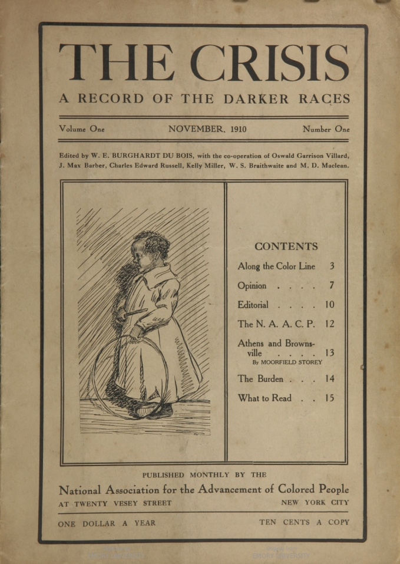
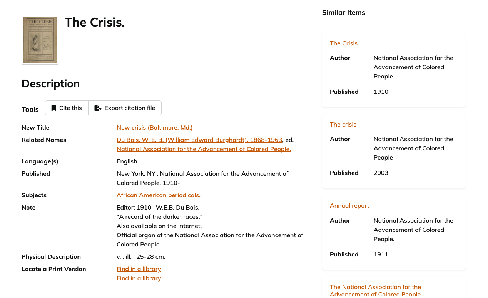
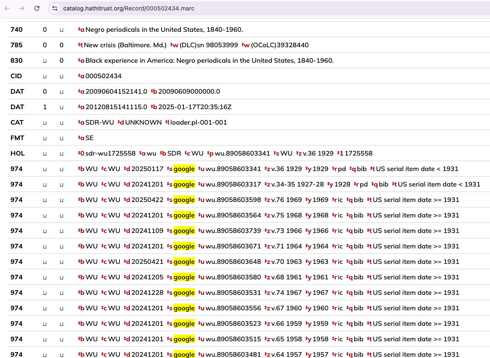
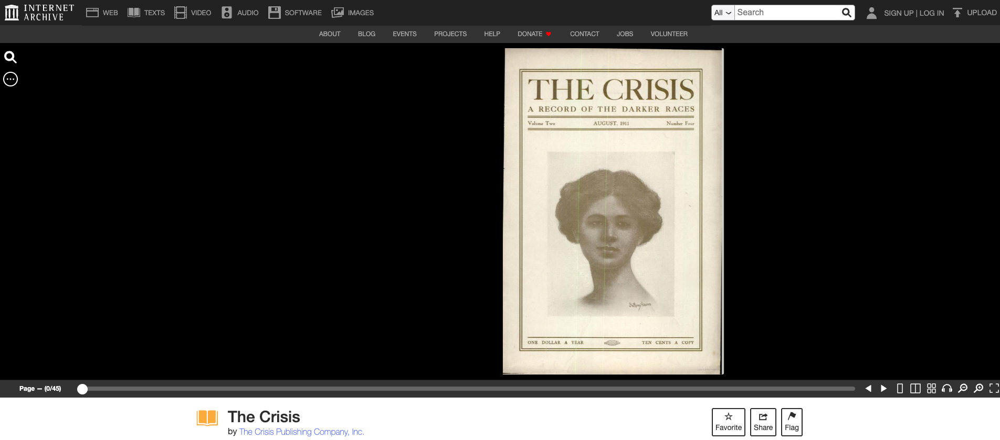
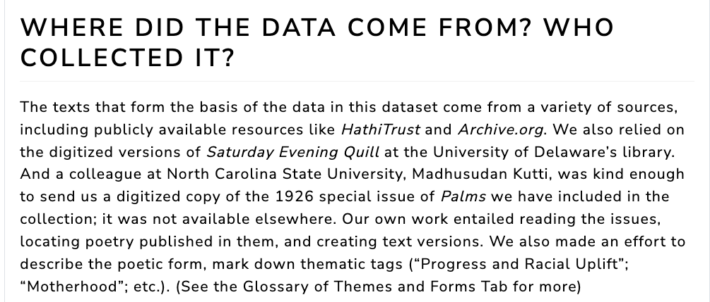

# Any Questions?

# Today's Overall Agenda

- Discuss assigned readings
- Brewster Kahle and the Internet Archive
- Histories of libraries, catalogs, and digitization
- Introduce Mass Digitization, Digital Libraries, and Data Retirement assignment
- In-class time to work on Collective & Individual Topic Selection
- **Reminder: Command line maze due Thursday!**

# Today's Core Questions

- How did culture first become data?
- What is the difference between a library, an archive, and a collection?
- How do standards shape how culture is transformed into data?
- What is digitization, and what are the trade-offs of digitizing cultural materials?
- When should digitized cultural materials be shared versus protected?

::: {.notes}
I want the day to start with Kahle because his vision makes the stakes immediately concrete: the Internet Archive is not just a website, but a claim about what digital culture and knowledge should become. Then we can step backward and ask what older library, archive, cataloging, and digitization histories this project inherits.

- Who chooses what gets collected?
- Who describes it?
- Who pays to preserve it?
- Who controls access?
- Who can ask for it to stop circulating?

These questions connect all three assigned readings. Kahle asks how universal access might work at scale. Hennessey and Singh show what responsible dataset documentation can look like. Ding, Diehm, and McGhee ask whether a data object can retire.
:::

# First Reading: Brewster Kahle and the Internet Archive

::: {.notes}
Any initial thoughts from this reading? Anything jump out to you?
:::

## Who Is Brewster Kahle? What is the Internet Archive?

:::: {.columns}
::: {.column width="50%"}
[](https://en.wikipedia.org/wiki/Brewster_Kahle){target="_blank"}
:::
::: {.column width="50%"}
[](https://blog.archive.org/2025/09/02/looking-back-on-preserving-the-internet-from-1996/){target="_blank"}
:::
::::

::: {.notes}

- CS at MIT, 1982
- Worked at an early AI company called Thinking Machines where he helped develop the Connection Machine and WAIS, the first distributed search and document retrieval system prior to the World Wide Web
- Co-founded WAIS, Inc. (sold to AOL in 1995) and Alexa Internet (sold to Amazon in 1999) for $250 million in stock
- Founded the Internet Archive in 1996, which he continues to direct
- Created the Wayback Machine, a public service that allows users to view archived versions of web pages dating back to 1996
From the blog post:

> The Internet Archive is such a new organization that is collecting the public materials on the Internet to construct a digital library. The first step is to preserve the contents of this new medium. This collection will include all publicly accessible World Wide Web pages, the Gopher hierarchy, the Netnews bulletin board system, and downloadable software.

:::

## A Decade of Running the Internet Archive

- Who is the audience for Kahle's essay? Who likely reads *American Archivist*? How does the audience shape his argument?
- What is Kahle's dream for the Internet Archive? Do you see any problems or tensions with this dream?

::: {.notes}
Kahle notes that the Internet Archive has been taking snapshots of the web since 1996. This is a good moment to ask: what does it mean to archive a website? What is captured? What is missed? What happens when a platform disappears, changes access, or blocks crawling?

> "Universal access to all knowledge is possible."
>
> Brewster Kahle, 2007

. . .

**Discussion:** What makes this vision exciting? What makes it dangerous?

Kahle's essay is intentionally bold. He wants archivists and librarians to treat universal access as technologically and financially possible. I want students to notice both the ambition and the assumptions. "All knowledge" sounds democratic, but it also raises problems of selection, rights, privacy, consent, labor, and governance.

Student annotations to surface:

- One student liked Kahle's argument that scanning everything may be cheaper than expert selection. Use this to ask whether "scan everything" avoids judgment or simply moves judgment elsewhere.
- Another student worried about "private tech companies controlling our access to human knowledge behind paywalls." This is a useful bridge to Kahle's public/private question later.
:::

# A Brief History: What Is a Library?

## Kahle's Ambitious Vision

> "Universal access to all knowledge is possible, and I'd say it could be measured as one of the great achievements of humankind, along with putting a man on the moon or **assembling the Library of Alexandria**."
> 
> — Brewster Kahle, 2007

::: {.fragment}
What was the Library of Alexandria? Why does Kahle invoke it here? What does it mean to compare a digital library to an ancient one?
:::

## The Library of Alexandria

{.r-stretch fig-align="center" width="800px"}

**The dream**: Collect *all* the world's knowledge in one place

- Scholars estimate: 400,000-700,000 scrolls
- Copying texts from ships that docked in port

## What Happened to Alexandria?

- **The problem**: Single point of failure
- Likely destroyed gradually (fires, neglect, political turmoil)
- Most devastating: 48 BCE fire during Caesar's visit
- By 3rd century CE: collection largely gone

::: {.fragment}
**Legacy?** Don't have just one copy in one location!
:::

## How Did We Get From Alexandria To Today?

[](https://www.prepressure.com/printing/history){target="_blank" .r-stretch fig-align="center" width="800px"}

::: {.notes}
**Before Gutenberg (~1440)**:
- Books copied by hand (monasteries)
- Expensive, rare, limited access
- Estimated: 30,000 books in all of Europe
**After Gutenberg**:
- By 1500: ~20 million books printed
- Prices dropped dramatically
- Knowledge became more accessible
- BUT: Still physical, still scarce, still expensive
:::

## Why Do *Modern, American* Libraries Exist?

:::: {.columns .r-fit-text}
::: {.column width="50%"}

:::
::: {.column width="50%"}
**18-19th century revolution**:

- Libraries as *public good*
- Free access regardless of ability to pay
- Democracy requires informed citizens
- Andrew Carnegie: 2,509 libraries funded (1883-1929)
:::
::::

::: {.notes}
The image here is the Main Reading Room of the Library of Congress, and the Library of Congress is actually a useful place to start this history. Kahle mentions it in the reading:

> Let’s start with text. How hard is it to bring printed materials, whether
bound or unbound, on-line on a large scale? Well, we started to look around.
How big is the task? Take the largest library collection of published materials,
the Library of Congress, which I understand holds between 26 and 28 million
bound volumes in its collections. If you take the text of a book and digitize it in
Microsoft Word format, it’s about a megabyte. If a book is about a megabyte, 26
million books is 26 million megabytes. The units go mega, giga, tera, so it would
take 26 terabytes to store all the words in the Library of Congress. In current
terms, that’s a computer that’s about the size of this podium and costs about
$60,000. So for $60,000 you could buy a computer system that could store all the
words in all the books of the Library of Congress. Pretty cool. So for much less
than the cost of a house, you can have the Library of Congress. Or in California,
you could have a garage, or a really nice rose garden, or a parking space. But it’s
within our grasp to talk about having all the words in the Library of Congress on
spinning storage that could be accessible from

The Library of Congress was established in 1800, when the federal government moved to Washington, D.C. Its original purpose was quite literal: it was a library for members of Congress. This was not initially a public library in our modern sense. It was a collection designed to give legislators access to the knowledge they needed to govern.

Then, during the War of 1812, British troops burned the Capitol and destroyed most of the original collection. Thomas Jefferson offered Congress his personal library as a replacement. Congress purchased it in 1815—more than 6,000 books—and that changed the character of the collection. Jefferson had collected extremely broadly: not just law and politics, but philosophy, science, literature, geography, languages, and much more. His argument was essentially that there was no subject that might not someday be useful to Congress.

That is an important shift in the idea of what a library is for. A library could aspire to collect knowledge very broadly because knowledge itself was understood as necessary to governing and civic life.

But the Library of Congress is only one part of a much larger transformation happening in the United States during the eighteenth and nineteenth centuries. Earlier libraries were often private collections, university libraries, or subscription libraries—you belonged to an organization or paid a fee in order to use them. Books themselves were expensive, so access to large collections was closely tied to wealth and institutional membership.

During the nineteenth century, that model gradually changes. The expansion of voting rights among white men, the common-school movement, rising literacy, cheaper mass printing, urbanization, and industrialization all contribute to a growing idea that ordinary citizens need access to information and education.

And that becomes connected to a particular democratic argument: if the United States is going to be governed by its citizens, those citizens need access to knowledge. Libraries therefore start being imagined not simply as collections owned by particular people or organizations, but as a **public good**.

By the mid-nineteenth century, cities begin establishing tax-supported public libraries, including the Boston Public Library in the 1850s. Instead of paying a subscription to enter, the basic principle becomes that the community collectively pays for a collection that anyone can use.

That movement accelerates enormously around the turn of the twentieth century. Andrew Carnegie eventually funded the construction of more than 2,500 library buildings around the world, including roughly 1,700 in the United States. Communities generally had to provide the land and commit public funds to operating them. So Carnegie helped build the buildings, but municipalities had to turn them into lasting public institutions.

And this is where we get many of the assumptions we still have about American libraries today: that access should generally be free, that collections should serve a broad public, that information and education have civic value, and that maintaining access to knowledge is something communities should collectively support.

Those ideas aren't inevitable. They emerged from a particular history—and they also came with exclusions and inequalities over who actually counted as part of that "public." But they establish the model of the library as a civic information infrastructure that projects like the Internet Archive will later inherit and try to extend into the digital world.
:::


## Challenges for Libraries in the 20th Century

[](https://www.prepressure.com/printing/history){target="_blank" .r-stretch fig-align="center" width="800px"}

::: {.notes}
**New challenges**:
- Explosion of publishing (journals, books, media)
- Specialization of collections
- Rising costs
- Copyright extensions
- Competing with commercial information providers

**New technologies**:
- Microfilm (1930s) — promises miniaturization
- Computers (1960s-70s) — catalog automation
- Networks (1980s-90s) — shared catalogs, interlibrary loan
- Web (1990s) — everything changes?
:::

::: {.notes}
So by the beginning of the twentieth century, we have increasingly established this idea of the library as a public institution: collect knowledge, organize it, preserve it, and make it available.

But there's a problem.

**The amount of stuff being produced starts exploding.**

Industrial printing had already dramatically reduced the cost of producing books and newspapers. But during the late nineteenth and twentieth centuries, publishing expands enormously: more books, more newspapers and magazines, more scholarly journals, more government documents, and eventually entirely new media like recorded sound, film, television, and born-digital materials.

So libraries encounter a problem that should feel very familiar to us today: **information abundance.**

The question is no longer simply, "Can we acquire books and make them available?"

It becomes: **How can humans possibly collect, organize, search, and preserve all of this?** Also increasingly how do we store it, because the physical space required for all of these materials is growing rapidly.
:::

# The Rise of Digitization & Digital Libraries

::: {.notes}
For culture as data to exist, we first need to create it! Today, we will dig into the history of digitization and digital libraries, and how they have shaped the way we access and preserve cultural materials.
:::

## First Digitization: Microfilm & Microfiche

:::: {.columns .r-fit-text}
::: {.column width="50%"}
{.r-stretch fig-align="center" width="400px"}
:::
::: {.column width="50%"}

From Kahle:

> We started doing some work with the University of North Carolina, testing
digitizing single pages, such as loose-leaf papers. We’re still in the early stages to
see if we can get that cost down to ten cents a page and do really high-quality
imaging. In some ways, this project is reminiscent of microfilm, but with color,
better resolution, and better accessibility. (p. 26)
:::
::::

::: {.notes}
What is microfilm? Microfilm is a photographic process that shrinks documents down to a small size, which can then be stored on reels or sheets. It was widely used in libraries and archives to preserve newspapers, periodicals, and other documents while saving physical space.

How does it differ from Microfiche? Microfiche is a flat sheet of film that contains multiple pages of reduced images, while microfilm is typically stored on reels. Both serve the same purpose of compact storage and preservation.

How it works is that a document is photographed and reduced in size, then stored on film. To read it, you need a special reader that magnifies the image back to a readable size. It was a way to preserve information and make it more compact, but it also required specialized equipment to access.

It was first invented in 1839 by John Benjamin Dancer, an English instrument maker. But it only became popularized in the 1920s and 1930s, first initially for bank records and then Kodak and other companies marketed it to libraries and archives. By the 1930s, microfilm was widely used in libraries and archives to preserve newspapers, periodicals, and other documents while saving physical space.
:::

## Example of Digitization? {.r-fit-text}

*What is this an where did it come from?*

[](https://babel.hathitrust.org/cgi/pt?id=emu.010000154224&seq=1){target="_blank"}

::: {.notes}
This is the cover of *The Crisis*, the official magazine of the NAACP, from 1910.

What we're looking at is not the physical magazine itself, but a **digitized representation** available through HathiTrust.

That distinction matters because digitized materials usually have a history: a physical copy belonged to an institution, it was scanned through some digitization workflow, files and OCR were produced, metadata was attached, and eventually the digital object became accessible through a platform like HathiTrust.
:::

## What is Digitization?


::: {.notes}

**Digitization**: Converting analog → digital

1. **Selection** — What gets digitized? (Already political!)
2. **Physical handling** — Moving, preparing materials
3. **Scanning/imaging** — Resolution, color depth, format choices
4. **OCR** — Optical Character Recognition (text extraction)
5. **Metadata creation** — How to describe and organize
6. **Storage** — Where and how to keep the files
7. **Preservation** — Maintaining access over time
8. **Access systems** — How users find and use materials
:::

## How and What Do We Digitize?

- What are some of the materials that Kahle mentions when discussing digitization?
- What is the process he describes for digitization?
- What institutions and communities are involved in digitization?

::: {.notes}

Kahle gives us a useful sense of just how many different kinds of materials libraries and archives are trying to digitize and preserve.

He starts with **books and printed materials**. The basic process is:

**physical book → page images → OCR → searchable text**

The Internet Archive experimented with outsourcing scanning to India, robotic scanners, and eventually in-library scanning stations with manual page turning. He estimates about **$10–30 per book**, depending on the process. The important point is that by 2007, Kahle thinks mass digitization is increasingly technologically and financially feasible.

But books are only one part of the story. He also discusses:

- **Audio** — LPs, CDs, tapes, and live concert recordings
- **Film and video** — including the Prelinger collection
- **Television** — continuously recording broadcasts from around the world
- **Software** — where preservation may require emulating old computing environments
- **The Web** — already digital, so the challenge becomes capturing and preserving something that constantly changes

And digitization isn't being done by one institution. Kahle describes a network of **libraries, universities, archives, companies, collectors, musicians, and online communities** all participating.

So Kahle's larger argument is that the technical problem is becoming surprisingly tractable: **we can digitize culture at enormous scales.**

But that creates another problem:

**Once you have millions of digital objects, how do you know what they are, find them, connect them, and make them usable?**

That's where **metadata and standards** come in.

:::

## Who does digitization?

:::: {.columns}
::: {.column width="50%"}
[](https://scanninglabor.github.io/IAScanningLabor/index.html){target="_blank"}
:::
::: {.column width="50%"}
[](https://theartofgooglebooks.tumblr.com/){target="_blank"}
:::
::::

::: {.notes}
Does Kahle ever mention who is responsible for digitization? He's very focused on costs and technology, but the labor of digitization is often invisible. These two examples show that digitization is a labor-intensive process, and that it is often done by people who are not recognized or credited for their work.
:::

## What happens to digital copies?

[](https://catalog.hathitrust.org/Record/000502434){target="_blank"}

*What is HathiTrust? Where does it come from?*

::: {.notes}
This is the catalog record for the Crisis. Here we can see a lot of information but first we need to understand the broader context of HathiTrust.

HathiTrust is a **collaborative digital repository created by research libraries**.
:::

## Google Books & HathiTrust

:::: {.columns}
::: {.column width="50%"}
[](https://www.google.com/books/edition/Along_Came_Google/3F-bEAAAQBAJ?hl=en&gbpv=1&dq=along+came+google+a+history+of+library+digitization+google+books&printsec=frontcover){target="_blank"}
:::
::: {.column width="50%"}
[](https://www.hathitrust.org/){target="_blank"}
:::
::::

::: {.notes}
So where does HathiTrust come from? Well it's partially about libraries but it is also the story of Google Books. Kahle mentions Google in passing, but the story is worth unpacking.

In 2004, Google announced a major effort to digitize books from research-library collections and make their contents searchable.

The important word here is **searchable**.

Google Books was not simply trying to create online images of books. It was applying the logic of web search to books: scan them, OCR their text, index that text, and let users search across enormous collections.

Google partnered with major libraries, scanned books from their collections, and returned digital copies to participating libraries. Those library-created digital holdings later became an important part of repositories such as HathiTrust. Google describes the Library Project as a way to make millions of library books searchable, including rare and out-of-print materials. 

But access depends heavily on copyright. Public-domain books can generally be viewed in full, while copyrighted books may appear only as previews, snippets, or bibliographic records.

For a great history of Google's digitization, highlighy recommend *Along Came Google* by Deanna B. Marcum and Roger C. Schonfeld [https://press.princeton.edu/books/paperback/9780691224374/along-came-google](https://press.princeton.edu/books/paperback/9780691224374/along-came-google){target="_blank"}.
:::

## Before Google: Vannevar Bush and the Memex 

:::: {.columns}
::: {.column width="50%"}
[](https://www.theatlantic.com/magazine/archive/1945/07/as-we-may-think/303881/){target="_blank"}
:::
::: {.column width="50%"}
[Vannevar Bush's **Memex**](https://brewster.kahle.org/2026/07/26/how-far-did-vannevar-bush-get-on-the-memex/){target="_blank"} imagined a personal machine for organizing knowledge through linked "trails."
:::
::::

::: {.notes}
This brings us to **Vannevar Bush**.

Bush was an American engineer and one of the most influential scientific administrators in the United States during World War II.

During the war, he headed the Office of Scientific Research and Development, coordinating an enormous amount of American military scientific research.

That experience made the information problem very concrete.

Scientists were producing more and more research. Knowledge was becoming increasingly specialized. Even experts couldn't possibly keep up with everything being published in their own fields.

Bush starts worrying that we have become extremely good at **producing information**, but our methods for organizing and retrieving information haven't kept pace.

In 1945, just as the war was ending, he published a famous essay in *The Atlantic* called **"As We May Think."**

In it, he imagines a machine called the **Memex**, which would:
- store documents
- retrieve them rapidly
- reproduce them
- connect them through **associative trails**

In this 2026 blog post, Kahle argues that the Memex itself was never built. Bush did build and fund component machines, especially the Rapid Selector, which used microfilm, coded search, and photo-copying output. But the defining feature of the Memex, associative trails linking items together, was not mechanized in Bush's lifetime.

Importantly, the Memex isn't a computer in our modern sense.

Bush imagines something more like a futuristic desk built around microfilm.

A person could store an enormous personal library of books, articles, photographs, and records in miniature form and retrieve them rapidly.

But simply storing lots of information isn't the really interesting part.

Bush thought that existing systems of classification forced knowledge into rigid hierarchies.

But he argued that **human thought doesn't actually work that way**.

We think associatively.

One idea reminds us of another idea, which reminds us of something we read six months ago, which connects to another document.

So the defining idea of the Memex was that a researcher could create **associative trails** through information: linking one item to another and saving those connections so they could return to them or share them.

If that sounds suspiciously like hyperlinks, that's one reason this essay became so famous.


This is also where interoperability starts to matter. If cultural collections cannot link to each other, share metadata, expose stable identifiers, or preserve relationships among objects, then we get piles of isolated files rather than a usable knowledge environment.
:::

## From Memex to Internet Archive {.r-fit-text}

Bush asks: **How can we store, retrieve, and connect enormous amounts of knowledge?**

Kahle asks: **What if we actually tried to preserve and provide access to nearly everything?**

. . .

Both want to build universal access to knowledge.


::: {.notes}
This is the connection I want to make between Bush and Kahle.

Kahle isn't literally building the Memex.

But they share a fundamental concern with **information abundance**.

Bush imagines a system for navigating vast personal collections.

Kahle pushes that ambition outward to the scale of libraries, archives, and eventually the Web itself.

And that creates a very different problem:

once the aspiration becomes **universal access to all knowledge**, what does it actually take to make that happen?
:::


## What Makes Universal Access Hard?

::: {.incremental .r-fit-text}

1. **Technical** — Can we capture, store, search, and preserve it?
2. **Economic** — Who pays for digitization and long-term storage?
3. **Institutional** — Who is responsible for maintaining it?
4. **Legal** — What can actually be copied and shared?
5. **Political** — What gets preserved, and who decides?
6. **Ethical** — Should everything remain accessible forever?

:::

::: {.notes}

**Library of Congress** (Kahle, 2007):

- 26–28 million bound volumes
- ~26 terabytes of text
- storage cost: ~$60,000 in 2007

. . .

> "Why don't we put it all on-line?"
Kahle spends a lot of time arguing that the first problem — technical feasibility — is becoming tractable.

But the further we go, the less technological the problems become.

Who pays?

Who owns the infrastructure?

What happens when copyright blocks access?

Whose materials get prioritized?

And eventually we reach the most difficult question:

**just because we can preserve and circulate something, should we?**

That is where Lenna is going to become important.

Kahle's provocative argument is that the scale of the problem is becoming technically manageable.

He uses the Library of Congress to make that concrete.

His larger rhetorical move is:

instead of beginning with scarcity and asking what tiny portion can we afford to preserve, what if declining storage and digitization costs let us start from abundance?

This is where his vision becomes exciting — but also where the complications start.
:::

## Should Everything Be Accessible?

[](https://pudding.cool/2021/10/lenna/){target="_blank"}

*Brings us to our second article!*

## Can Data Die?

- Thoughts on the article? Has anyone seen **Lenna** before? What is the argument of the article?
- What is *The Pudding*? Do you like the format?

## Methods & Data

[](https://github.com/the-pudding/lenna-data){target="_blank"}

*How did the build this project? Thoughts on their choices?*

## Kahle vs. Lenna

- How do we reconcile these two articles?
- What is the tensions between preservation and access?
- Who should have the power to decide what is preserved and what is retired? Is opt-out a good solution?


::: {.notes}
One of Kahle's recurring ideas is that libraries and archives can act as public infrastructure.

If individuals and communities want materials preserved and shared, the Internet Archive can remove the cost of hosting and bandwidth.

This helps explain why the collection becomes so heterogeneous.

The Internet Archive isn't simply digitizing books selected by librarians.

It is receiving materials from libraries, musicians, collectors, universities, communities, and individuals.

Who should control access to digitized knowledge?

**Google / ProQuest / commercial platforms**

vs.

**libraries / archives / nonprofit institutions**

This is one of the biggest unresolved questions in Kahle's essay.

He sees an important role for commercial companies, but worries about letting commercial systems become the primary gatekeepers to cultural memory.

His argument is that libraries and archives carry different values:

- longevity
- openness
- public access
- privacy
- service

So the question isn't just whether digitization happens.

It's **what institutional model governs the resulting digital culture**.


Kahle describes a strategy of:

1. Put material online
2. Remove it if someone objects
3. Favor access by default

. . .

**When might this work?**

**When might it fail badly?**


This is where I want to shift from the practical challenges of digitization to the ethical ones.

Kahle describes an opt-out approach in some communities: make material available, and take it down if somebody complains.

In certain contexts — such as communities that actively want their recordings shared — that may work reasonably well.

But notice the assumption:

**circulation is the default; objection comes afterward.**

What happens when the person represented in the data never agreed to that circulation in the first place?

That takes us directly to Lenna.
:::


## Preservation Can Also Cause Harm

::: {.r-fit-text}

Kahle:

**How do we keep data circulating?**

. . .

Lenna:

**How do we make circulation stop?**

:::

::: {.notes}
The Lenna image became culturally and technically durable.

It was copied across research papers, teaching materials, software libraries, websites, and technical communities.

That persistence is exactly what archives normally try to achieve.

But in this case, the person represented by the image eventually asked the community to stop using it.

So preservation and access are not automatically ethical goods.

Sometimes persistence itself can become the problem.
:::


## Finding Traces of Digitization

[](https://catalog.hathitrust.org/Record/000502434.marc){target="_blank"}

*What is in this image? Has anyone heard of MARC records?*

## History of Cataloging 

::: {.columns}
::: {.column width="50%"}

:::

::: {.column width="50%"}
**Before computers**:
- Every library had physical cards
- Filed alphabetically by author, title, subject
- To share catalog info: mail physical cards
- Each library maintained separately
:::
:::

::: {.fragment}
**Problem**: No way to search across libraries efficiently
:::

## Enter MARC (1966)

**MA**chine-**R**eadable **C**ataloging

[](https://benschmidt.org/sappingattention/a-brief-visual-history-of-marc/){target="_blank"}

## Enter MARC (1966)

**MA**chine-**R**eadable **C**ataloging

::: {.incremental}
- Developed by Library of Congress
- **Standard format** for bibliographic data
- Made catalog records **machine-readable**
- Enabled **sharing** records between libraries
- Foundation for online catalogs (OPACs)
:::

::: {.fragment}
**Key insight**: If we all describe books the same way, computers can share and search our catalogs
:::

## What MARC Records Look Like
```
=LDR  00000cam  2200000 a 4500
=001  123456789
=020  \\$a9780123456789
=100  1\$aKahle, Brewster.
=245  10$aUniversal access to all knowledge /$cBrewster Kahle.
=260  \\$aWashington, D.C. :$bSociety of American Archivists,$c2007.
=300  \\$app. 23-31.
=650  \0$aDigital libraries.
=650  \0$aDigitization.
```

::: {.fragment}
Each **field** (020, 100, 245) has a specific meaning

This allows computers to:
- Search by author, title, subject
- Sort results
- Share records between systems
:::

## Metadata = Data About Data

**MARC is metadata**: Information that describes the content

::: {.incremental .r-fit-text}
- **Author** (who created it?)
- **Title** (what's it called?)
- **Subject** (what's it about?)
- **Date** (when published?)
- **Format** (book? journal? recording?)
- **Location** (where can I find it?)

**Without metadata**: Just a pile of stuff

**With metadata**: Organized, searchable collection
:::

::: {.notes}
1. **Descriptive metadata** — What is it? (MARC, Dublin Core)
2. **Discovery metadata** — How do I find it? (subject headings, keywords)
3. **Administrative metadata** — How do I manage it? (file formats, permissions)
4. **Structural metadata** — How is it organized? (chapters, pages, sequences)
5. **Preservation metadata** — How do I keep it? (format history, migrations)
6. **Rights metadata** — Who can use it? (copyright, licenses)

**Digital materials need ALL of these** — not just descriptive
:::

## Why Standards Matter

:::: {.columns}
::: {.column width="50%"}
**Without standards**:

- Every library uses different system
- Can't search across collections
- Can't share records
- Everyone reinvents the wheel
:::
::: {.column width="50%"}
**With standards**:

- Interoperability — systems talk to each other
- Efficiency — share catalog records
- Better discovery — search across collections
- Preservation — future systems can understand
:::
::::

::: {.notes}

**Requirements**:

- **Metadata standards** (Dublin Core, METS, MODS)
- **Protocols** (OAI-PMH for harvesting)
- **Common formats** (TIFF, JPEG2000, PDF/A)
- **Persistent identifiers** (DOIs, Handles)
- **Authentication systems** (Shibboleth)

This is **years of infrastructure work**

Not visible to users, but essential for functionality
:::


## Digital Library, Archive, or Collection?

::: {.r-fit-text}

| Term | Main Emphasis | Who Usually Does This Work? | Key Question |
|---|---|---|---|
| **Digital collection** | Selection + grouping | Curators, scholars, librarians, communities | **What belongs together?** |
| **Digital archive** | Records + provenance + preservation | Archivists, records creators, communities | **What survives, and in what context?** |
| **Digital library** | Organization + access + services + stewardship | Librarians, catalogers, technologists | **How can people find and use it over time?** |

:::

::: {.notes}
These terms overlap, and institutions often use them somewhat loosely, but the distinctions are useful.

A **digital collection** is the broadest idea: a group of digital objects assembled around some theme, source, institution, or research question.

Our African American Periodical Poetry dataset could be thought of as a curated digital collection transformed into structured data.

A **digital archive** usually puts greater emphasis on preservation, provenance, and context: where records came from, how they relate to one another, and why they survive.

A **digital library** is more than a pile of digitized files.

This is where Harold Besser becomes useful. He argues that libraries traditionally do things like **select, collect, organize, preserve, and provide access**, but also provide services to communities and uphold values such as privacy, free speech, and equal access.

So digitizing ten million books does not automatically create a digital library.

You also need systems for:

- finding things
- describing them consistently
- connecting collections
- preserving them
- managing access and rights
- serving users

And that distinction is going to lead us directly into metadata, standards, and interoperability.

So HathiTrust is doing something beyond scanning:

**aggregating, preserving, describing, managing rights, and providing access to digital objects from many institutions.**

That immediately creates a metadata problem.

If millions of digital files are coming from different libraries, how does HathiTrust know:

- what each object is?
- which volumes belong to the same title?
- which institution contributed it?
- when it was published?
- whether users can legally view or download it?

That is where shared metadata and standards become essential.
:::

## Examples: Collection vs. Library vs. Archive {.r-fit-text}

:::: {.columns .r-fit-text}
::: {.column width="33%"}
**Digital Collection**:

- Google Books scans
- Files without metadata or preservation plan
- American Periodical Poetry dataset
:::
::: {.column width="33%"}
**Digital Library**:

- HathiTrust (rights management, preservation, services)
- Europeana (cultural heritage, multilingual)
- Library of Congress Digital Collections
:::
::: {.column width="33%"}
**Digital Archive**:

- National Archives and Records Administration (government records, long-term preservation)
- [UIUC Archives](https://archives.library.illinois.edu/){target="_blank"} (campus history, alumni records, special collections)
:::
::::

::: {.notes}
Digital Collections ≠ Digital Libraries

**Besser's key argument**:

> "A common misperception is that a large body of online materials constitutes a 'digital library.' But a library is much more than an online collection of materials."

**Having digital stuff** ≠ **Being a digital library**

:::

## What is the Internet Archive?

*The name says archive but is it actually?*

. . .

Why might've Kahle wanted to use the name archive? How do materials get into the internet archive?

::: {.notes}
So where does the **Internet Archive** fit into the categories we just discussed?

This is actually a surprisingly difficult question.

It calls itself an **archive**, but if you said that to some archivists, they might get a little annoyed.

Traditionally, archives aren't simply places where you save lots of old stuff. Archivists preserve records in relation to their **provenance and original context**. They make appraisal decisions about what should be preserved, organize records into collections, create finding aids, and maintain relationships among records.

The Internet Archive works rather differently.

Its basic philosophy is much closer to **collect at enormous scale and preserve copies**. Think about the Wayback Machine: it isn't a curator selecting the most historically important websites and carefully arranging them into archival collections. Automated crawlers capture enormous portions of the Web.

And Kahle repeatedly pushes against traditional selection. His provocative question is essentially: if selecting individual things is expensive and storage is getting cheap, **why not save everything we can?**

The Internet Archive also doesn't operate primarily through the traditional professional structure of librarians selecting books, catalogers creating records, and archivists arranging collections. It combines staff and institutional partnerships with automated collection, mass digitization, computational systems, and materials uploaded by users and communities.

But it's also clearly doing things we associate with **libraries**: acquiring materials, preserving them, providing search and access, lending digitized books, and pursuing an explicit public-access mission.

And it's full of individual **collections**, created by the Internet Archive itself, partner institutions, and users.

So "Internet Archive" is actually a really productive name for us to interrogate.

It shows that these categories aren't natural properties of websites. **Library, archive, and collection describe different traditions, practices, values, and responsibilities.**

And digital institutions can combine them in new and sometimes controversial ways.
:::

## The Crisis in IA

[](https://archive.org/details/bub_gb_AFoEAAAAMBAJ){target="_blank"}

*How does the metadata in the Internet Archive compare to the metadata available in HathiTrust?*

## What about the African American Periodical Poetry dataset?

[](https://www.responsible-datasets-in-context.com/posts/african-american-periodical-poetry/aa-periodical-poetry.html?tab=data-essay){target="_blank"}

*How much did the authors explain about the history of digitization?*

## African American Periodical Poetry

- What is this dataset focused on and why was it created?
- How did the authors organize their dataset? What metadata did they include? How did they document their sources and methods?
- Would you suggest any improvements to their documentation? What would you want to know if you were using this dataset for your own research?

::: {.notes}
Hennessey and Singh show how a dataset can document its sources, structure, absences, labor, and scholarly context. It is not just "data from magazines." It is a curated representation of Black periodical culture, shaped by digitized sources, metadata, OCR, editorial choices, and documentation.

:::

## Group Lab

[Mass Digitization, Digital Libraries, and Data Retirement](../assessments/06-collecting-digitizing-culture.qmd){target="_blank"}

::: {.notes}
Use the remaining time for groups to begin the assignment. They should start by documenting what they find in HathiTrust, Internet Archive, and the African American Periodical Poetry dataset, then connect those observations to the Lenna reading and the question of when data should keep circulating or be retired.
:::

