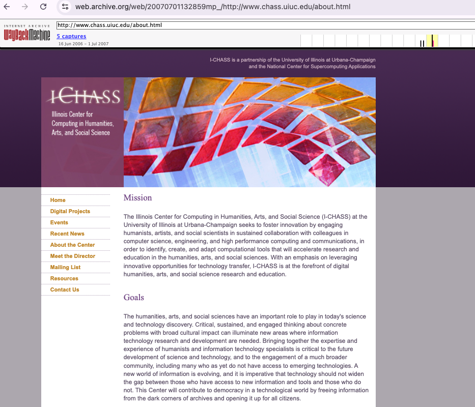
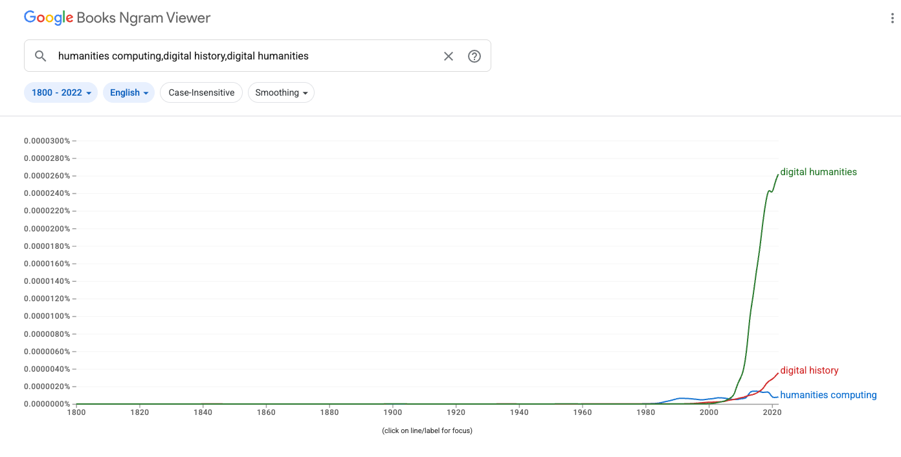

# Any Questions?

# Today's Overall Agenda

- Visit from Digital Historian, Prof. Orville Vernon Burton
- Discuss assigned readings
- Introduce Mass Digitization, Digital Libraries, and Data Retirement assignment
- In-class time to work on Collective & Individual Topic Selection
- **Reminder: Command line maze due Thursday!**

## Digital History of CHASS

:::: {.columns}
::: {.column width="50%"}
[](https://www.clemson.edu/cah/about/facultybio.html?id=130){target="_blank"}

:::
::: {.column width="50%"}
[](https://web.archive.org/web/20070701132859mp_/http://www.chass.uiuc.edu/about.html){target="_blank"}
:::
::::

*Special thanks to Aurora!*


## What is Digital History?

[](https://books.google.com/ngrams/graph?content=humanities+computing%2Cdigital+history%2C+digital+humanities&year_start=1800&year_end=2022&corpus=en&smoothing=3){target="_blank"}


# Today's Core Questions: What is Digitization?? {.r-fit-text}

::: {.r-fit-text}
- How did culture first become digital?
- What is digitization, and what are the trade-offs of digitizing cultural materials?
- When should digitized cultural materials be shared versus protected?
- What is the difference between a library, an archive, and a collection?
- How do standards shape how culture is transformed into data?
:::

# First Reading: Brewster Kahle and the Internet Archive


## Who Is Brewster Kahle? What is the Internet Archive?

:::: {.columns}
::: {.column width="50%"}
[](https://en.wikipedia.org/wiki/Brewster_Kahle){target="_blank"}
:::
::: {.column width="50%"}
[](https://blog.archive.org/2025/09/02/looking-back-on-preserving-the-internet-from-1996/){target="_blank"}
:::
::::


## A Decade of Running the Internet Archive

- Who is the audience for Kahle's essay? Who likely reads *American Archivist*? How does the audience shape his argument?
- What is Kahle's dream for the Internet Archive? Do you see any problems or tensions with this dream?


# A Brief History: What Is a Library?

## Kahle's Ambitious Vision

> "Universal access to all knowledge is possible, and I'd say it could be measured as one of the great achievements of humankind, along with putting a man on the moon or **assembling the Library of Alexandria**."
> 
> — Brewster Kahle, 2007

::: {.fragment}
What was the Library of Alexandria? Why does Kahle invoke it here? What does it mean to compare a digital library to an ancient one?
:::

## The Library of Alexandria

{.r-stretch fig-align="center" width="800px"}

**The dream**: Collect *all* the world's knowledge in one place

- Scholars estimate: 400,000-700,000 scrolls
- Copying texts from ships that docked in port

## What Happened to Alexandria?

- **The problem**: Single point of failure
- Likely destroyed gradually (fires, neglect, political turmoil)
- Most devastating: 48 BCE fire during Caesar's visit
- By 3rd century CE: collection largely gone

::: {.fragment}
**Legacy?** Don't have just one copy in one location!
:::

## How Did We Get From Alexandria To Today?

[](https://www.prepressure.com/printing/history){target="_blank" .r-stretch fig-align="center" width="800px"}


## Why Do *Modern, American* Libraries Exist?

:::: {.columns .r-fit-text}
::: {.column width="50%"}

:::
::: {.column width="50%"}
**18-19th century revolution**:

- Libraries as *public good*
- Free access regardless of ability to pay
- Democracy requires informed citizens
- Andrew Carnegie: 2,509 libraries funded (1883-1929)
:::
::::


## Challenges for Libraries in the 20th Century

[](https://www.prepressure.com/printing/history){target="_blank" .r-stretch fig-align="center" width="800px"}


# The Rise of Digitization & Digital Libraries


## First Digitization: Microfilm & Microfiche

:::: {.columns .r-fit-text}
::: {.column width="50%"}
{.r-stretch fig-align="center" width="400px"}
:::
::: {.column width="50%"}

From Kahle:

> We started doing some work with the University of North Carolina, testing
digitizing single pages, such as loose-leaf papers. We’re still in the early stages to
see if we can get that cost down to ten cents a page and do really high-quality
imaging. In some ways, this project is reminiscent of microfilm, but with color,
better resolution, and better accessibility. (p. 26)
:::
::::


## Example of Digitization? {.r-fit-text}

*What is this an where did it come from?*

[](https://babel.hathitrust.org/cgi/pt?id=emu.010000154224&seq=1){target="_blank"}


## What is Digitization?


## How and What Do We Digitize?

- What are some of the materials that Kahle mentions when discussing digitization?
- What is the process he describes for digitization?
- What institutions and communities are involved in digitization?


## Who does digitization?

:::: {.columns}
::: {.column width="50%"}
[](https://scanninglabor.github.io/IAScanningLabor/index.html){target="_blank"}
:::
::: {.column width="50%"}
[](https://theartofgooglebooks.tumblr.com/){target="_blank"}
:::
::::


## What happens to digital copies?

[](https://catalog.hathitrust.org/Record/000502434){target="_blank"}

*What is HathiTrust? Where does it come from?*


## Google Books & HathiTrust

:::: {.columns}
::: {.column width="50%"}
[](https://www.google.com/books/edition/Along_Came_Google/3F-bEAAAQBAJ?hl=en&gbpv=1&dq=along+came+google+a+history+of+library+digitization+google+books&printsec=frontcover){target="_blank"}
:::
::: {.column width="50%"}
[](https://www.hathitrust.org/){target="_blank"}
:::
::::


## Before Google: Vannevar Bush and the Memex 

:::: {.columns}
::: {.column width="50%"}
[](https://www.theatlantic.com/magazine/archive/1945/07/as-we-may-think/303881/){target="_blank"}
:::
::: {.column width="50%"}
[Vannevar Bush's **Memex**](https://brewster.kahle.org/2026/07/26/how-far-did-vannevar-bush-get-on-the-memex/){target="_blank"} imagined a personal machine for organizing knowledge through linked "trails."
:::
::::


## From Memex to Internet Archive {.r-fit-text}

Bush asks: **How can we store, retrieve, and connect enormous amounts of knowledge?**

Kahle asks: **What if we actually tried to preserve and provide access to nearly everything?**

. . .

Both want to build universal access to knowledge.


## What Makes Universal Access Hard?

::: {.incremental .r-fit-text}

1. **Technical** — Can we capture, store, search, and preserve it?
2. **Economic** — Who pays for digitization and long-term storage?
3. **Institutional** — Who is responsible for maintaining it?
4. **Legal** — What can actually be copied and shared?
5. **Political** — What gets preserved, and who decides?
6. **Ethical** — Should everything remain accessible forever?

:::


## Should Everything Be Accessible?

[](https://pudding.cool/2021/10/lenna/){target="_blank"}

*Brings us to our second article!*

## Can Data Die?

- Thoughts on the article? Has anyone seen **Lenna** before? What is the argument of the article?
- What is *The Pudding*? Do you like the format?

## Methods & Data

[](https://github.com/the-pudding/lenna-data){target="_blank"}

*How did the build this project? Thoughts on their choices?*

## Kahle vs. Lenna

- How do we reconcile these two articles?
- What is the tensions between preservation and access?
- Who should have the power to decide what is preserved and what is retired? Is opt-out a good solution?


## Finding Traces of Digitization

[](https://catalog.hathitrust.org/Record/000502434.marc){target="_blank"}

*What is in this image? Has anyone heard of MARC records?*

## History of Cataloging 

::: {.columns}
::: {.column width="50%"}

:::

::: {.column width="50%"}
**Before computers**:

- Every library had physical cards
- Filed alphabetically by author, title, subject
- To share catalog info: mail physical cards
- Each library maintained separately
:::
:::

::: {.fragment}
**Problem**: No way to search across libraries efficiently
:::

## Enter MARC (1966)

**MA**chine-**R**eadable **C**ataloging

[](https://benschmidt.org/sappingattention/a-brief-visual-history-of-marc/){target="_blank"}

## Enter MARC (1966)

**MA**chine-**R**eadable **C**ataloging

::: {.incremental}
- Developed by Library of Congress
- **Standard format** for bibliographic data
- Made catalog records **machine-readable**
- Enabled **sharing** records between libraries
- Foundation for online catalogs (OPACs)
:::

::: {.fragment}
**Key insight**: If we all describe books the same way, computers can share and search our catalogs
:::

## What MARC Records Look Like
```
=LDR  00000cam  2200000 a 4500
=001  123456789
=020  \\$a9780123456789
=100  1\$aKahle, Brewster.
=245  10$aUniversal access to all knowledge /$cBrewster Kahle.
=260  \\$aWashington, D.C. :$bSociety of American Archivists,$c2007.
=300  \\$app. 23-31.
=650  \0$aDigital libraries.
=650  \0$aDigitization.
```

::: {.fragment}
Each **field** (020, 100, 245) has a specific meaning

This allows computers to:
- Search by author, title, subject
- Sort results
- Share records between systems
:::

## Metadata = Data About Data

**MARC is metadata**: Information that describes the content

::: {.incremental .r-fit-text}
- **Author** (who created it?)
- **Title** (what's it called?)
- **Subject** (what's it about?)
- **Date** (when published?)
- **Format** (book? journal? recording?)
- **Location** (where can I find it?)

**Without metadata**: Just a pile of stuff

**With metadata**: Organized, searchable collection
:::


## Why Standards Matter

:::: {.columns}
::: {.column width="50%"}
**Without standards**:

- Every library uses different system
- Can't search across collections
- Can't share records
- Everyone reinvents the wheel
:::
::: {.column width="50%"}
**With standards**:

- Interoperability — systems talk to each other
- Efficiency — share catalog records
- Better discovery — search across collections
- Preservation — future systems can understand
:::
::::


## Digital Library, Archive, or Collection?

::: {.r-fit-text}

| Term | Main Emphasis | Who Usually Does This Work? | Key Question |
|---|---|---|---|
| **Digital collection** | Selection + grouping | Curators, scholars, librarians, communities | **What belongs together?** |
| **Digital archive** | Records + provenance + preservation | Archivists, records creators, communities | **What survives, and in what context?** |
| **Digital library** | Organization + access + services + stewardship | Librarians, catalogers, technologists | **How can people find and use it over time?** |

:::


## Examples: Collection vs. Library vs. Archive {.r-fit-text}

:::: {.columns .r-fit-text}
::: {.column width="33%"}
**Digital Collection**:

- Google Books scans
- Files without metadata or preservation plan
- American Periodical Poetry dataset
:::
::: {.column width="33%"}
**Digital Library**:

- HathiTrust (rights management, preservation, services)
- Europeana (cultural heritage, multilingual)
- Library of Congress Digital Collections
:::
::: {.column width="33%"}
**Digital Archive**:

- National Archives and Records Administration (government records, long-term preservation)
- [UIUC Archives](https://archives.library.illinois.edu/){target="_blank"} (campus history, alumni records, special collections)
:::
::::


## What is the Internet Archive?

*The name says archive but is it actually?*

. . .

Why might've Kahle wanted to use the name archive? How do materials get into the internet archive?


## The Crisis in IA

[](https://archive.org/details/bub_gb_AFoEAAAAMBAJ){target="_blank"}

*How does the metadata in the Internet Archive compare to the metadata available in HathiTrust?*

## What about the African American Periodical Poetry dataset?

[](https://www.responsible-datasets-in-context.com/posts/african-american-periodical-poetry/aa-periodical-poetry.html?tab=data-essay){target="_blank"}

*How much did the authors explain about the history of digitization?*

## African American Periodical Poetry

- What is this dataset focused on and why was it created?
- How did the authors organize their dataset? What metadata did they include? How did they document their sources and methods?
- Would you suggest any improvements to their documentation? What would you want to know if you were using this dataset for your own research?


## First Group Lab

[Mass Digitization, Digital Libraries, and Data Retirement](../assessments/06-collecting-digitizing-culture.qmd){target="_blank"}

*Due in two-ish weeks!* First, focus on Collective and Individual Topic selection and command line maze!


