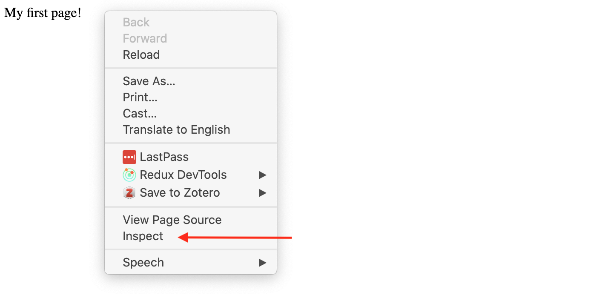
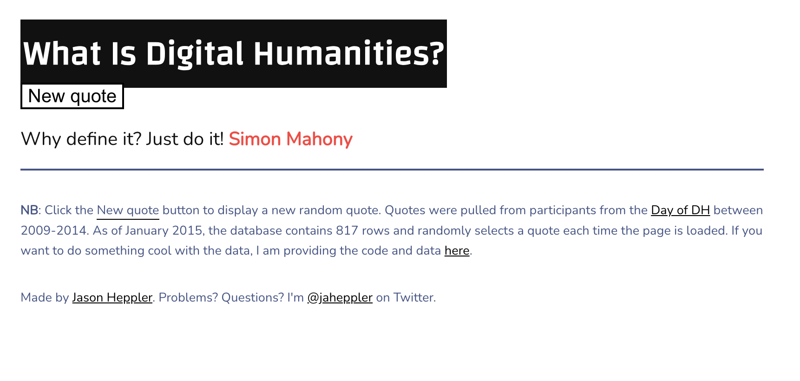
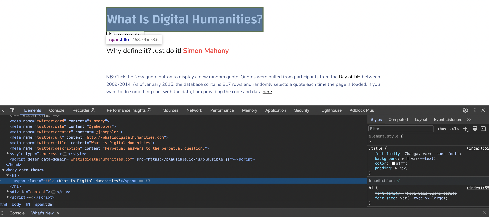
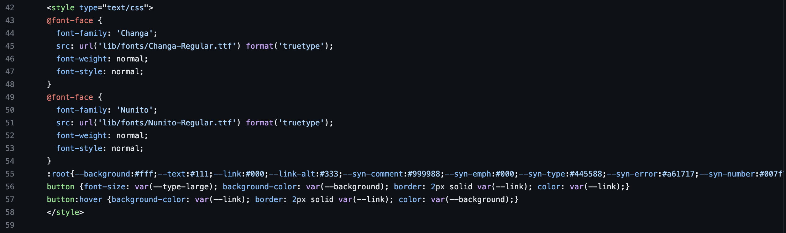
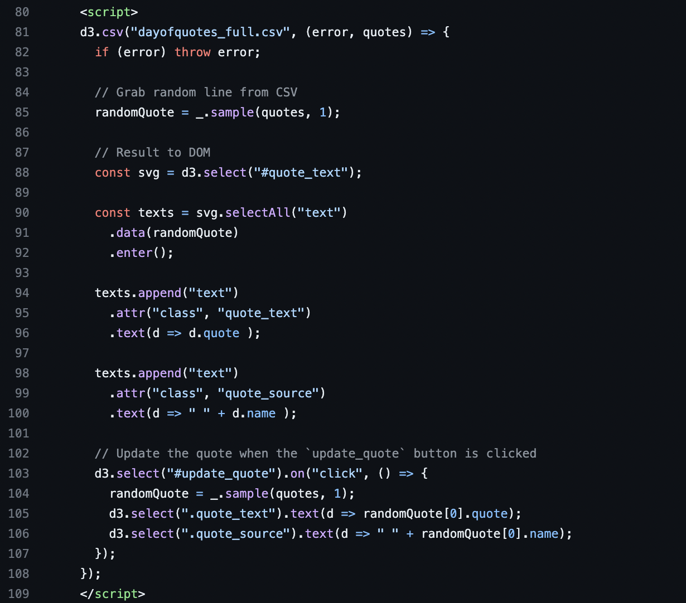

# Any Questions?

## Today's Agenda

- Review the command line maze homework
- Review the introduction to Markup and Styling Web Documents lesson
- Work on your group assignments, complete any mazes that have yet to be tested.

# Homework Review

*Who wants to volunteer to share their code?*

# From Markdown to HTML

Last week we learned about Markdown. This week you learned about **HTML**.

*So what is a Markup language?*

::: {.notes}
We've spent time learning about markup languages in the context of Markdown, which uses symbols like `#` to format text. Now we're going to expand that understanding and look at how the web uses markup languages differently. The key shift is that we're moving from a simple notation system to a more complex, tag-based system that powers the entire web.

From [handy Wikipedia](https://en.wikipedia.org/wiki/Markup_language){target="_blank"}:

> "a markup language is a system for annotating a document in a way that is syntactically distinguishable from the text, meaning when the document is processed for display, the markup language is not shown, and is only used to format the text."

So a markup language is really about annotating content with metadata that describes how it should be formatted or displayed. In Markdown, we use `#` to say "this is a heading." In HTML, we use tags like `<h1>` for the same purpose.

This is fundamentally different from a programming language like Python or JavaScript, which is used to create programs that can be executed by a computer. Markup languages don't perform logic—they just annotate or describe text.

A markup language adds structure or meaning to text.

. . .

Examples from the lesson:

- Markdown uses symbols like `#` and `[]()`
- HTML uses tags like `<h1>` and `<p>`
- TEI uses markup to encode cultural and textual features
:::

## What type of Markup Language is this?

[](https://www.oldbaileyonline.org/about/a-narrative-history-of-the-project#digitisation){target="_blank"}


::: {.notes}
Another important markup language is TEI. It has a long history in Computing in the Humanities. TEI is used to encode texts in a way that makes them machine-readable. You can read more about it at https://tei-c.org/what-is-tei/.

Today we are used to having OCR and other tools that can help us digitize texts, and then programming languages like Python and R that let us manipulate text into data (a topic we'll cover later in the semester). But in the early days of the web, this was not the case, which made it difficult for machines to know what was in a text. This is where TEI comes in, as it allows us to encode texts in a way that makes them useable to machines. For example, TEI often involves marking what a date is, or what a person's name is, or what a place is. This allows us to search and analyze texts in ways that would be impossible without TEI.

TEI and HTML both were created in the same historical moment, the early days of the web. HTML was created by Tim Berners-Lee in 1991, while TEI was created in 1987.

The Old Bailey Online project (started in 1999) is one of the older Digital Humanities projects that's still in operation. They've been digitizing the records of the Old Bailey, the central criminal court of England and Wales. They use TEI/XML to encode the text of the records, which allows them to be searched and analyzed in sophisticated ways.

What's unique about the Old Bailey is that they manually marked up all the text using a "double rekeying" strategy—having each text transcribed twice and then automatically compared to identify errors. They did this because OCR software in the 1990s wasn't good enough for eighteenth-century print, especially from microfilm.

This incredibly laborious process resulted in 99.9% accurate transcriptions. The authors note that "XML markup would not have worked with the kind of error-ridden text produced by OCR methodologies, so applying complex markup was dependent on adopting rekeying."

Not only did this facilitate accurate searching, but it meant that the text could be reused in subsequent digital projects. This example shows us that rigorous markup and encoding requires significant human effort, but that effort creates very high-quality data.
:::

## What does HTML stand for?

[{fig-align="center"}](https://developer.mozilla.org/en-US/docs/Learn_web_development/Core/Structuring_content/Basic_HTML_syntax#what_is_html){target="_blank"}

::: {.notes}
HTML is **not a programming language**—it's a markup language used to:

- Tell your browser how to structure web pages
- Create documents that are rendered in your browser
- Make content appear or act a certain way

While TEI is still in use today, by far the most popular of all markup languages is HTML, which stands for **HyperText Markup Language**. HTML is the language of the web and is used to create web pages. This might be surprising to learn but when you go to a website, it is just showing you a document (just like our `.txt` or `.md` files). The difference is that this document is written and marked-up in HTML and is rendered by your browser.

This is an important distinction. HTML is purely about structure and presentation. It doesn't perform logic or calculations. Unlike Markdown, which uses simple symbols, HTML uses more formal "tags" that describe the semantic meaning and structure of content.

So while in Google Docs you might use the GUI to format text, or in Markdown we use `#` symbols, in HTML we use a series of **tags**. Tags have a name, a series of key/value pairs called **attributes**, and some textual content.

When you visit a website, you're viewing an HTML document rendered by your browser.
:::

## How can we create an HTML file?

*Bonus if you can do it exclusively in the terminal!*

::: {.notes}
```sh
touch first_page.html
```
:::

## How can we add content to an HTML file?

*More bonus if you can do it exclusively in the terminal!*

::: {.notes}
Creating an HTML file is really simple—it's just a text file with the `.html` extension. You can create it with the command line or a text editor. Once you create the file with some HTML tags in it, you can open it in any web browser.

I can then save this file and open it in a browser. To do this, I can either right click on the file and select `open with` and then select my browser, or simply go to my preferred browser and select `Open File`. We'll talk more about web browsers in the next lesson, but some popular ones include Chrome, Firefox, Safari, and Edge.

We should see our text in the browser, just like we did with our Markdown file. So everything is working so far!
:::

## How is HTML structured?

*What tags could we add to make our content more organized?*

. . .

What happens if we add `<p>` and `</p>` tags around our text?

::: {.notes}
This is a key realization—when you add HTML tags to your content and view it in the browser, you don't see the tags themselves. The browser interprets the tags as instructions for how to display the content, but doesn't show the tags to the user.

So even though you added `<p>` and `</p>` tags, the browser just displays "My first page!" without showing the tags. This can be confusing at first—did the tags actually do anything? Are they there?
:::

## Anatomy of an HTML Tag

```html
<p>My first page!</p>
```

. . .

- **Opening tag**: `<p>`
- **Content**: "My first page!"
- **Closing tag**: `</p>`
- **Element**: all three together


::: {.notes}
This is the fundamental building block of HTML. The `<p>` tag means "paragraph." The opening tag tells the browser where the paragraph starts, the content is what you see on the page, and the closing tag tells the browser where the paragraph ends.

It's really important to close your tags. Forgetting the closing tag is a common beginner error that can produce strange results and make your HTML invalid.

In HTML, the element is the combination of the opening tag, the content, and the closing tag all together. This is the unit that browsers understand and render.

To see the HTML tags in your browser, you need to open the Developer Tools Console by right-clicking on a page and selecting "Inspect." This shows you the **source code**—the HTML that creates the page you're looking at.
:::

## How can we inspect the HTML of a webpage?

. . .



::: {.notes}
This is one of the most important skills for web development. When you right-click and select "Inspect," your browser opens a panel showing you the actual HTML source code of the page you're viewing.

This works on any website—not just your own pages. You can inspect any website to see how it was built, what HTML structure it uses, what CSS is applied, etc. This is how you learn web development.

Different browsers have slightly different names:
- Chrome/Edge: "Inspect" or "Inspect Element"
- Firefox: "Inspect Element"
- Safari: "Inspect Element"

You can read more about Chrome Developer Tools here: https://developers.google.com/web/tools/chrome-devtools/console/
And Firefox Developer Tools here: https://developer.mozilla.org/en-US/docs/Tools/Page_Inspector/How_to/Open_the_Inspector
:::

## What is an HTML attribute?

. . .

HTML elements can have **attributes**—extra information about the element.


This diagram is also from the Mozilla docs and you can read more about how HTML elements can also have [attributes here](https://developer.mozilla.org/en-US/docs/Learn_web_development/Core/Structuring_content/Basic_HTML_syntax#attributes){target="_blank"}.

::: {.notes}
Attributes appear in the opening tag and provide additional information about how the element should behave or what it contains. They follow a specific syntax: the attribute name, followed by an equals sign, then the value wrapped in quotes.

Some guidelines for attributes:
- There should be a space between the element name and the first attribute
- Multiple attributes should be separated by spaces
- The attribute name is followed by an equal sign
- The attribute value is wrapped in opening and closing quote marks
:::

## What is an `href` attribute?

*Bonus what sorts of tags do we use `href` with?*

::: {.notes}
The `href` attribute is used with anchor (`<a>`) tags to specify the URL of the page the link goes to. The value of the `href` attribute is the URL you want to link to. For example, `<a href="https://www.example.com">Click here</a>` creates a link that says "Click here" and takes you to "https://www.example.com" when clicked.
:::

## Reviewing Common HTML Tags

- How could I add a header to my page?
- What about a list of items? How can we nest lists?
- What about a link to another page?

::: {.notes}
These are some of the most common tags you'll encounter. There are many more tags available, but these cover the basic structural elements of most web pages.

- Headings go from h1 (most important) to h6 (least important)
- Paragraphs are blocks of text
- Divs are generic containers that you can style
- Anchors create links to other pages
- Lists can be ordered (numbered) or unordered (bulleted)

You can find a full list at W3Schools: https://www.w3schools.com/tags/ref_byfunc.asp
:::

## What are some of the limitations of HTML?

::: {.notes}
But HTML also has some limitations. Take a look at this helpful overview of [*HTML's shortcomings by Alison Parrish*](https://github.com/aparrish/dmep-python-intro/blob/master/scraping-html.ipynb){target="_blank"} (bold added for emphasis)

> HTML documents are intended to add **markup** to text to add information that allows browsers to display the text in different ways---e.g., HTML markup might tell the browser to make the font of the text a particular size, or to position it in a particular place on the screen.

> **Because the primary purpose of HTML is to change the appearance of text, HTML markup usually does not tell us anything useful about what the text means, or what kind of data it contains.** When you look at a web page in the browser, it might appear to contain a list of newspaper articles, or a table with birth rates, or a series of names with associated biographies, or whatever. But that's information that we get, as humans, from reading the page. There's (usually) no easy way to extract this information with a computer program.

This is a critical limitation. HTML can tell you that something is a heading or a paragraph, but it can't tell you that it's a product price or a person's name (unless you add special attributes). When you look at a web page in the browser, it might appear to contain a list of newspaper articles, or a table with birth rates, or a series of names with biographies. But that's information we get as humans from reading the page. There's usually no easy way for a computer program to automatically extract that meaning.

This is why TEI was developed—to add semantic meaning to markup. And it's also why modern HTML encourages using semantic tags like `<article>`, `<nav>`, and `<footer>` to give more meaning to the structure.

HTML is Forgiving (But Messy)

> **HTML is also notoriously messy---web browsers are very forgiving of syntax errors and other irregularities in HTML (like mismatched or unclosed tags).** For this reason, we need special libraries to parse HTML into data structures that our Python programs can use, libraries that can make a "good guess" about what the structure of an HTML document is, even when that structure is written incorrectly or inconsistently.

Browsers are deliberately forgiving of HTML errors because the early web was chaotic, and they wanted to make the web work for everyone. This is good for user experience but bad for data extraction.

If you forget to close a tag, the browser will usually figure out what you meant and render it anyway. This means invalid HTML can still display, which is why we need special parsing libraries when we want to programmatically analyze HTML.
:::

## Learn More About HTML

Understanding these limitations is important as we start to work with HTML and other web technologies. For more detailed information, I recommend reading through this [introduction from Mozilla on HTML](https://developer.mozilla.org/en-US/docs/Learn_web_development/Core/Structuring_content/Basic_HTML_syntax#what_is_html){target="_blank"}.

## How can we add style to our HTML?

*How could we change the color of the text?*

::: {.notes}
Here's another example that we should add to our html page, using the HTML `<div>` tag:

```html
<div class="header" style="background: blue;">About Me</div>
```

In our example, the `href` attribute tells a link where to navigate to when clicked. The `class` attribute is another common one that helps you identify elements for styling with CSS.
:::

## What did we learn from whatisDH.com ?

[](https://whatisdigitalhumanities.com/){target="_blank"}

*What do we see in the inspector?*

::: {.notes}
Let's look at a real, working example. When you inspect the source code of whatisdigitalhumanities.com, you see the HTML structure. You'll notice the first line is `<!DOCTYPE html>`, then the `<html>` tag, which contains `<head>` and `<body>`.

When you open the inspector (right-click → Inspect), you can see the HTML structure of the page. You'll also see two other important elements: the `<style>` tag (which contains CSS code) and the `<script>` tag (which contains JavaScript code). These are the other two pillars of the web that make it interactive and beautiful.
:::

## What is `<!DOCTYPE html>`?

. . .

```html
<!DOCTYPE html>
<html>
  <head>
    <!-- Metadata about the page -->
  </head>
  <body>
    <!-- The actual content -->
  </body>
</html>
```

::: {.notes}
You'll notice that on every website we inspect, the first line is `<!DOCTYPE html>`. This is called a **document type declaration** and it tells the browser what type of document it is. In this case, it's an HTML document. Then we see the `<html>` tag, which is the root element of an HTML page. This element contains two other elements: `<head>` and `<body>`. The `<head>` element contains metadata about the document, while the `<body>` element contains the actual content of the document. While there are some exceptions, most of the time the `<head>` element comes before the `<body>` element, and most websites use both.
:::

## How can we select elements?

. . .



::: {.notes}
If click the small arrow in the corner, we can start selecting elements. I'm trying to select the black box that says "What is Digital Humanities?".
:::

## What is CSS?

. . .

```css
selector {
    property: value;
    property: value;
}
```

- **Selector** (`.title`) - which elements to style
- **Properties and values** - how to style them

::: {.notes}
CSS is what makes websites beautiful. The term "cascading" refers to how styles cascade down through the document hierarchy—parent styles apply to children unless overridden. Much like HTML, CSS has a defined structure that is comprises a **selector** (in our case the `.title`) and a **declaration block** (the curly brackets), where you write your style rules. The selector specifies which HTML elements the rules apply to, and the declaration block contains one or more declarations separated by semicolons. Each declaration includes a CSS property name and a value, separated by a colon.

In our example, the selector `.title` targets any element with the class "title". The declaration block (inside the curly braces) contains the style rules. Each rule has a property (like `font-family` or `background`) and a value (like `Garamond` or `#faf`).

This separation of content (HTML) from presentation (CSS) is crucial. It means you can completely change how a page looks by just changing the CSS, without touching the HTML. 
:::

## What is the `style` attribute vs. tag?

[](https://github.com/hepplerj/whatisdigitalhumanities){target="_blank"}

. . .

To learn more about this particular code, read the callout [Deep Dive Into CSS on the course website.](../materials/introducing-defining-cad/07-intro-html.qmd#css-deep-dive){target="_blank"}

::: {.notes}
To get a better sense of what this code looks like, we can look directly at the `index.html` file directly in the GitHub repository [https://github.com/hepplerj/whatisdigitalhumanities](https://github.com/hepplerj/whatisdigitalhumanities){target="_blank"}.

Seeing the full document, we can find both the `span` element we edited, as well as see how it fits within the overall structure of the HTML document. There's also a number of other elements that we haven't discussed yet, but I want to highlight two of them: `<style>` and `<script>`.

When you look at the actual HTML/CSS source code of a website like whatisdigitalhumanities, you see complex CSS that includes:
- Custom fonts (@font-face)
- CSS variables (:root)
- Dark mode support ([data-theme="dark"])
- Different selectors for different elements
- Media queries for responsive design
- Detailed styling rules for every aspect

Overall, CSS is used to enhance the user experience by providing a visually appealing and functional interface. It allows web developers to:

- Apply custom styles to their web pages, making them look unique.

- Define responsive designs that adapt to different screen sizes and devices.

- Implement theme toggling (like dark mode) to enhance accessibility and user preference.

- Ensure that the presentation of the content is consistent across different browsers and platforms.

So here we can see that the `.title` code we altered is actually part of a larger set of code that is used to style the entire website. This example hopefully shows how powerful and complex web development can be.
:::

## Learn More about CSS

A great resource for learning more about CSS is the Mozilla docs [https://developer.mozilla.org/en-US/docs/Learn_web_development/Core/Styling_basics/What_is_CSS](https://developer.mozilla.org/en-US/docs/Learn_web_development/Core/Styling_basics/What_is_CSS){target="_blank"}.

## Example of Advanced CSS

- [CSS Zen Garden](http://www.csszengarden.com/){target="_blank"}
- [CodePen](https://codepen.io/ste-vg/pen/GRooLza){target="_blank"}

<figure>
<iframe height="300" style="width: 100%;" scrolling="no" title="Airplanes." src="https://codepen.io/ste-vg/embed/GRooLza?default-tab=result" frameborder="no" loading="lazy" allowtransparency="true" allowfullscreen="true">
  See the Pen <a href="https://codepen.io/ste-vg/pen/GRooLza">
  Airplanes.</a> by Steve Gardner (<a href="https://codepen.io/ste-vg">@ste-vg</a>)
  on <a href="https://codepen.io">CodePen</a>.
</iframe>
</figure>

::: {.notes}
A great example of CSS in action is the [CSS Zen Garden](http://www.csszengarden.com/), which shows how the same HTML document can be styled in a variety of different ways. Another great example is this [CodePen](https://codepen.io/ste-vg/pen/GRooLza) that shows how CSS can be used to create a 3D airplane (I found it via [this blog post](https://dev.to/keefdrive/top-5-most-hearted-animations-and-designs-on-codepen-whats-under-the-hood-5b0l)).
:::

## What is JavaScript?

*What is the tag to include JavaScript in an HTML document?*

. . . 




. . .

Learn more in the callout on [the Deep Dive Into JavaScript on our course website.](../materials/introducing-defining-cad/07-intro-html.qmd#js-deep-dive){target="_blank"}


::: {.notes}
The main other tag that we should pay attention to is the `script` element is the other way that interactivity happens on most websites. If we search for the `<script>` tags, we can see it is located between lines `80` and `109` that it contains the following code:

This code is in a language called JavaScript. This code is using a JavaScript library called jQuery, which is a library that makes it easier to write JavaScript. Unlike HTML or CSS, JavaScript is a `programming language` (the distinction is not crucial to know but can be helpful when learning about different Digital Humanities methods). At this point, most of the web is powered by JavaScript, so it is incredible powerful and ubiquitous.

When you look at the actual JavaScript in whatisdigitalhumanities, you see it using D3.js (a powerful data visualization library) and Lodash (a utility library) to:
1. Load quote data from a CSV file
2. Select a random quote from that data
3. Display it on the page using the DOM
4. Listen for click events on the "update quote" button
5. Change the quote when the user clicks

If you want to learn more about what exactly this code is doing, toggle the following section. Full disclosure some of this language and concepts are fairly advanced, so feel free to use Co-Pilot or ask the Instructors for help.
:::

## Is JavaScript a Markup Language?

*What is this code doing?*
```javascript
document.getElementById("button").addEventListener("click", () => {
  // Do something when button is clicked
});
```

::: {.notes}
While HTML and CSS are declarative (you describe what things are and how they should look), JavaScript is imperative—it describes what should happen when things occur.

JavaScript can listen for events (like clicks), modify the HTML and CSS dynamically, load new content without reloading the page, and create complex interactive experiences.

In the whatisdigitalhumanities website, for example, there's JavaScript that loads a random quote from a CSV file and displays it on the page. When you click the "update quote" button, JavaScript listens for that click, picks a new random quote, and updates the page content—all without reloading.
:::

## What is the DOM?

. . .

**Document Object Model**

```
html
├── head
│   └── title
└── body
    ├── h1
    ├── p
    └── ul
        ├── li
        └── li
```

::: {.notes}
The DOM is how programming languages understand and manipulate the structure of a web page. It's a tree structure where each HTML element is a node. JavaScript can traverse this tree, find specific elements, modify them, add new ones, or remove them.

Think of a webpage as a tree with many branches. Each branch and leaf could be a piece of text, a picture, or a button. JavaScript can work with this tree to change what appears on the page.

This is incredibly powerful. It means you can create dynamic, responsive pages that change based on user input or data from servers, all without reloading the page.
:::

## The Three Pillars of the Web

| Technology | Purpose |
|-----------|---------|
| **HTML** | Structure - what things are |
| **CSS** | Presentation - how things look |
| **JavaScript** | Behavior - what things do |

::: {.notes}
HTML alone creates a functional webpage, but it's not very beautiful or interactive. To create modern websites, we need three technologies working together.

HTML provides the semantic structure and content. CSS controls how everything looks. JavaScript makes things interactive.

The combination of HTML, CSS, and JavaScript is what makes the modern web possible. Yes, it can be complex, but this complexity is necessary to create the rich, interactive experiences we expect from websites today.

For example, think about Gmail or Google Maps. These are incredibly interactive applications running in your browser. They're possible because of the combination of these three technologies.

Also note that these technologies can make websites slow to load (large JavaScript files can take a long time) and difficult to maintain. This is an ongoing challenge for web developers.

Looking at projects like whatisdigitalhumanities, you can even see the effort required by exploring the commit history on GitHub—showing many contributions over time as people continuously update, fix, and improve the site.
:::


# Source and Style Homework

## What You Will Submit

[Source and Style Homework](../materials/introducing-defining-cad/07-intro-html.qmd#homework-source-and-style){target="_blank"}

. . .

Create a `source-and-style` folder with:

- a `README.md` assessing one cultural website
- an `index.html` presenting one digitized cultural object
- screenshots in an `images` folder, if you use them
- an `ai-chat-log.md`, if you use AI

::: {.notes}
The homework has two parts: inspecting a cultural website and creating a simple HTML page. I should emphasize that the goal is not a polished professional website. The goal is to show they understand HTML structure, links, metadata, and basic styling or interaction.
:::

## Your HTML Page

Include:

- standard HTML structure
- at least one heading, paragraph, div, link, and list
- a digitized cultural object related to your interests
- relevant metadata and source links
- optional styling or interaction

::: {.notes}
This is a good moment to show a tiny example if needed. The key phrase is "minimum requirements." They can get creative, but they should make sure the required elements are present and easy to find.
:::

## GitHub Submission

Push your work to your `is310-coding-assignments` repository.

```sh
git add .
git commit -m "Completed Source and Style Assignment"
git push origin main
```

. . .

These Git commands work in macOS, Linux, WSL, and PowerShell.

::: {.notes}
Remind them not to commit `.DS_Store` files.
:::

# Group Work Time {.r-fit-text}

To dos in your breakout rooms:

- [ ] Finalize and work on your [Collective and Individual Topic Selection](../assessments/03-semester-project.qmd#milestone-1-collective--individual-topic-selection){target="_blank"} due this upcoming Tuesday September 15 (though optional extension available until September 22).
- [ ] Complete any mazes that have yet to be tested and help troubleshoot any issues with your group members' code.
- [ ] Select your focus for the Source and Style Assignment and start working on your HTML page.
- [ ] Start looking at the [Mass Digitization Group Lab](../assessments/06-collecting-digitizing-culture.qmd). You will have time to work on this in class next week, but you can start thinking about it now. Due in-class on September 29 (though if you finish early you can present September 22).
