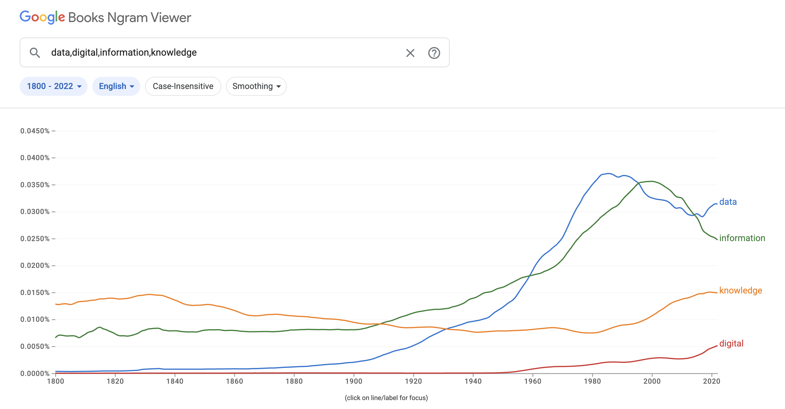
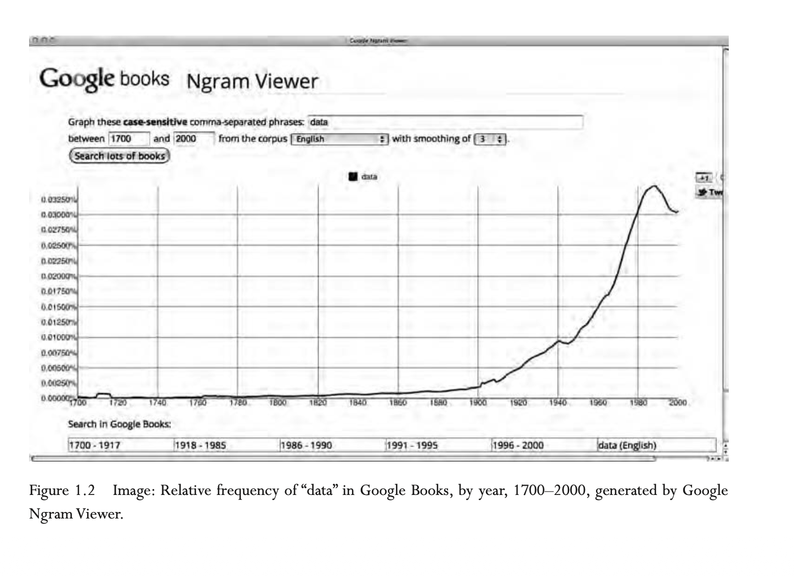
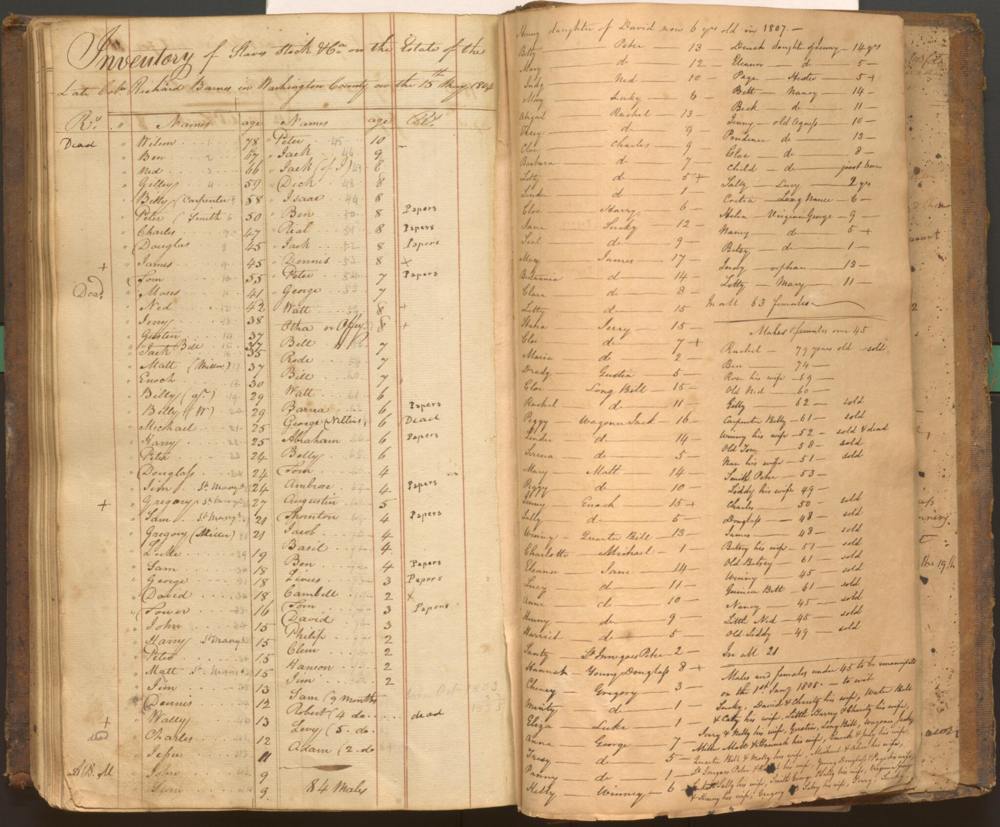
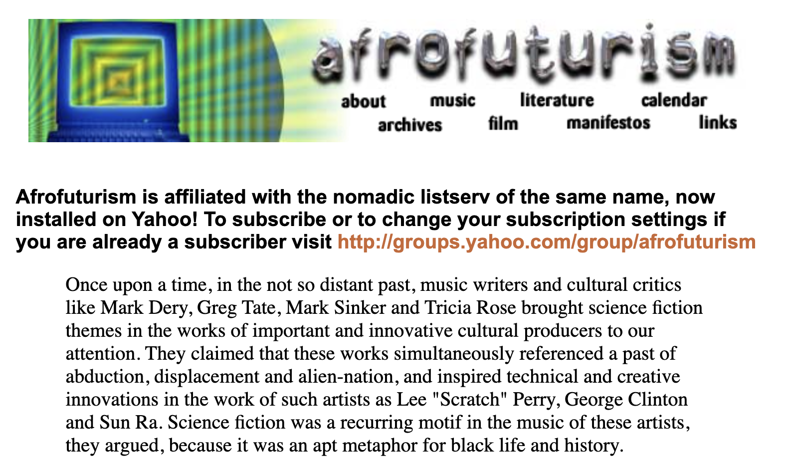

## Today's Agenda

- Discuss the assigned readings.
- Discuss the semester long project more in-depth.
- Start working on the [Mass Digitization, Digital Libraries, and Data Retirement](../assessments/06-collecting-digitizing-culture.qmd){target="_blank"} group assignment.

## A Note on Today's Readings {.r-fit-text}

This material is **intense and important**.

**Guidelines for discussion:**

- Listen with care and attention to the humanity in these histories
- Centering the perspectives and experiences of the enslaved and their descendants
- Ask questions when something is unclear, not to challenge but to understand
- Recognize that some in this room may have personal or familial connections to this history

Our goal: **Not to achieve comfort, but to develop critical understanding of how data and technology reproduce historical injustice—and how they can resist it.**

## Markup Bodies by Jessica Marie Johnson
*Who is Prof. Jessica Marie Johnson? Thoughts on her article?*

:::: {.columns}
::: {.column width="33%"}
[{fig-alt="Jessica Marie Johnson headshot" width="90%"}](https://www.jessicamariejohnson.phd/){target="_blank"}

**Jessica Marie Johnson**
:::

::: {.column width="33%"}
[{fig-alt="Life x Code project logo" width="90%"}](https://www.lifexcode.org/){target="_blank"}

**Life x Code**
:::

::: {.column width="33%"}
[{fig-alt="Diaspora Solidarities Lab logo" width="90%"}](https://www.dslprojects.org/){target="_blank"}

**Diaspora Solidarities Lab**
:::
::::

## Why title the article "Markup Bodies"? 
::: {.r-fit-text .fragment}

> "In the United States, historians of slavery have made particular use of digital tools to document the forced migration of black women, children, and men throughout the Atlantic littoral over the last five centuries. In 1974, Eugene Genovese coined the phrase “the world the slaves made” to describe the political economy, society, and culture of the antebellum South. Over four decades later, scholars struggle to translate “the world the slaves made” into code and express it in technical language. From blogs and journals built on fourth-generation hypertext markup language (HTML) guided by cascading style sheets (CSS) to databases using extensible markup language (XML) and standard query language (SQL), [**scholars using digital tools mark up the bodies and requantify the
lives of people of African descent**.]{bg="#d7ecff"}" (emphasis added) p. 59
:::

## Who Was Neptune? {.r-fit-text}

. . . 

Why does Dr. Johnson start her article with his story?

. . .

> "For abolitionists, Neptune’s death, though narrated by Stedman, who was far from an abolitionist, offered readers necessary explanatory data. It offered neutral, stable, even quantifiable information about the depravity of bondage. [...] In other words, for abolitionists, Neptune’s death-as-data evidenced the carnal violence of overseers, drama of slavery, injustice meted out to free and enslaved alike, and vulgarity of black death. But *Curious Adventures*, like much abolitionist media that claimed to advocate for the enslaved, also recreated and legitimized a ledger of torture." p. 58

## Is data ever objective or neutral? 

{target="_blank"}

## A Short History of the Word “Data”

{target="_blank"}

## Tabulation Technologies & Thingification

{target="_blank"}

## 19th Century Tabulating Machines

{target="_blank"}

## Ted Codd & Relatational Databases

:::: {.columns}
::: {.column width="50%"}
{target="_blank"}
:::
::: {.column width="50%"}
{target="_blank"}
:::
::::

## VisiCalc & Spreadsheet Software

:::: {.columns}
::: {.column width="50%"}

{target="_blank"}
:::
::: {.column width="50%"}
{target="_blank"}
:::
::::

## How have historians used this historical data to study slavery?

::: {.r-fit-text}
> 
> "[**These historians also drew on slave ship manifests, lists of enslaved in plantation documents, and census records.**]{bg="#d7ecff"} The impulse to revisit the plantation South from the perspective of black laborers and their experiences contributed to changing conceptions of data as historians struggled with which sources would be of value, what meaning could be gleaned from narratives and numbers, and what archival material appeared to be stable, objective, and quantifiable. Many of these scholars emerged from their research with differing conclusions about the slave personality, the role African retentions played in making African America, the nature of resistance, and black family life. Naturally, these histories and how they were written generated intense and heated debates." p. 61
:::

## How have historians used this historical data to study slavery?

::: {.r-fit-text}
> "These historians also drew on slave ship manifests, lists of enslaved in plantation documents, and census records. The impulse to revisit the plantation South from the perspective of black laborers and their experiences [**contributed to changing conceptions of data as historians struggled with which sources would be of value, what meaning could be gleaned from narratives and numbers, and what archival material appeared to be stable, objective, and quantifiable.**]{bg="#d7ecff"} Many of these scholars emerged from their research with differing conclusions about the slave personality, the role African retentions played in making African America, the nature of resistance, and black family life. Naturally, these histories and how they were written generated intense and heated debates." p. 61
:::

## What was the problem with Cliometrics?
:::: {.columns}
::: {.column width="40%" }
{target="_blank"}
:::

::: {.column width="60%" .r-fit-text}
> **Statistics on their own, enticing in their seeming neutrality, failed to address or unpack black life hidden behind the archetypes, caricatures, and nameless numbered registers of human property.** p. 61
:::
::::

## What are some of the problems with representing slavery as data both in the past and today?

::: {.r-fit-text}
> **Databases reinscribe enslaved Africans' biometrics as users transfer the racial nomenclature of the time period (négre, moreno, quadroon) into the present and encode skin color, hair texture, height, weight, age, and gender in new digital forms, replicating the surveilling actions of slave owners and slave traders.** p. 59

> **There is nothing neutral, even in a digital environment, about doing histories of slavery.** p. 60
:::

## How does this history of cliometrics relate to DH?

. . .

::: {.r-fit-text}

> "This article questions the role spectacular black death and commodification in slavery’s eighteenth- and nineteenth-century Atlantic archive play alongside the digital humanities’ drive for data and a centuries- long black diasporic ight for justice and redress. The brutality of black codes, the rise of Atlantic slaving, and everyday violence in the lives of the enslaved created a devastating archive. Left unattended, these devastations reproduce themselves in digital architecture, even when and where digital humanists believe they advocate for social justice." p. 58
:::

## How does DH study the history of slavery?

- *The Trans-Atlantic Slave Trade Database* [https://www.slavevoyages.org/](https://www.slavevoyages.org/){target="_blank"}.
- *Freedom on the Move* [https://freedomonthemove.org/](https://freedomonthemove.org/){target="_blank"}.
- *Enslaved: Peoples of the Historical Slave Trade* [https://enslaved.org/](https://enslaved.org/){target="_blank"}

## What is the Trans-Atlantic Slave Trade Database?

{target="_blank"}

## What are Dr. Johnson's critiques of this project?

> "The brutality of black codes, the rise of Atlantic slaving, and everyday violence in the lives of the enslaved  created  a  devastating  archive.  Left  unattended,  these  devastations reproduce themselves in digital architecture, even when and where digital  humanists  believe  they  advocate  for  social  justice.  A  just  attention  to  the  dead,  I  argue,  requires  digital  humanists  to  learn  from  black freedom  struggles  and  radical  coalition  building  that  offer  new  models for “social justice, accessibility, and inclusion." p. 58

## What are Dr. Johnson's critiques of this project?

At a 2008 conference, researchers presented a CD-ROM:

> **Understanding the dimensions of slave ships provided context for the experience of the Middle Passage but could not seem to capture the moral rupture and sense of injustice expressed by people of African descent.** pg. 62

## Rise of Genealogy Companies

:::: {.columns}
::: {.column width="60%" }
{target="_blank"}
:::
::: {.column width="40%" .r-fit-text}

:::
::::

## Is Ancestry.com an archive?

. . .

> **Archives are not just the records bequeathed to us by the past; archives also consist of the tools we use to explore it, the vision that allows us to read its signs, and the design decisions that communicate our sense of history's possibilities.**
> —Vincent Brown, "Mapping a Slave Revolt"

## What is bias in data? Is it always bad?

::: {.r-fit-text}

> "As this brief history of the Trans-Atlantic Slave Trade Database sug gests, bias is built into the architecture of digital technology." p. 65

:::

## What does it mean to defragment data?

> "The data set, corrupted by its creation as part of a project of manufacturing slaves and masters, needed to be defragmented before it could be used. And yet it is the only archive from which the descendants of slaves can demand “a fully loaded cost accounting." pg. 65

## An Alternative: Black Digital Practice

::: {.r-fit-text}
> **Black digital practice is the revelation that black subjects have themselves taken up science, data, and coding, in other words, have commodified themselves and digitized and mediated their own black freedom dreams, in order to hack their way into systems.** p. 59

:::

## W.E.B. Du Bois and the 1900 Paris Exposition

{target="_blank"}

For more on the visualizations, see Forrest, Jason. 2018. “W. E. B. Du Bois’ Staggering Data Visualizations Are as Powerful Today as They Were in 1900 (Part 1), Nightingale.” Nightingale, June 18. [https://nightingaledvs.com/w-e-b-du-bois-staggering-data-visualizations-are-as-powerful-today-as-they-were-in-1900-part-1/](https://nightingaledvs.com/w-e-b-du-bois-staggering-data-visualizations-are-as-powerful-today-as-they-were-in-1900-part-1/){target="_blank"}.

## Afrofuturism Listserv

{target="_blank"}

## Black Digital Practice & Future

> **The study of black life and culture must also accompany an ethical and moral concern with sustaining black life and shaping black futures**

A corrective that:

- Centers descendants and their needs
- Embraces the uncomfortable and unquantifiable
- Refuses disposability
- Infuses data work with humanity

## Is the Pudding Piece a good example of this kind of work?

{target="_blank"}

## Authors

:::: {.columns}
::: {.column width="50%"}
{target="_blank"}
:::
::: {.column width="50%"}
{target="_blank"}
:::
::::

## Sources?

- What sources do the authors use? 
- Can you locate the original data? 
- How do they describe the data? 
- What do they say about its limitations, if anything?

## Testing the Same Questions on a Different Dataset

{target="_blank"}

## Authors

:::: {.columns}
::: {.column width="50%"}
{target="_blank"}
:::
::: {.column width="50%"}
{target="_blank"}	
:::
::::

## How do the authors detail some of the uncertainty or missingness in the data?

{target="_blank"}

## How do we handle missingness in data?

{target="_blank"}

## Black Digital Practice and Missingness

:::: {.columns}
::: {.column width="50%"}
{target="_blank"}

:::
::: {.column width="50%"}
{target="_blank"}
:::
::::

## Final Thoughts or Questions?

*We will be returning to similar themes next week when we discuss categorization and data feminism.*

# Semester Long Project Discussion

- Initial Collective and Individual topic selection due today! Extension available until next Tuesday.

Let's discuss project requirements!

## Pivoting Is Allowed

- The topic selection is pass/fail intentionally to let you explore topics without worrying about grades.
- Goal is to try and make a broad plan for your semester project, not to have a final plan.
- Requires you thinking about three components:
  - Group topic & website
  - Individually creating a dataset
  - Individually auditing a dataset

## For Group Work

- You should try and find a collective topic that is broad but not so broad to just be cultural data.
- Think about different ways to draw connections between your group members’ individual datasets.
- We will discuss final website and GitHub repository requirements in the upcoming weeks.

*If you are struggling to find a collective topic, please reach out to the instructors for guidance.*

## For individual work

Your custom created dataset needs to involve the following components:

- Should relate to your group topic
- Should try to capture cultural complexity and interpretative subjectivity
- Should involve some form of computation beyond a spreadsheet

## What is cultural complexity?

For your semester project, **cultural complexity** means your dataset should capture more than the easiest categories.

It might include:

- Ambiguity, uncertainty, or conflicting interpretations
- Context around genre, platform, audience, circulation, or reception
- Relationships among people, objects, places, institutions, and events
- Evidence of absences, silences, or limits
- Notes on categories that do not quite fit

## What is subjectivity?

A strong cultural dataset does not pretend interpretation disappears.

Instead, it documents:

- Who made the data
- What choices shaped the fields
- What evidence supports each category
- What remains uncertain
- What another person might classify differently

## Computation Beyond a Spreadsheet

Computation does not have to mean advanced programming.

It can mean using code or digital tools to:

- Extract text from images or PDFs
- Create an HTML page for curating objects
- Check consistency across records
- Compare categories or sources
- Identify missing values
- Create a simple visualization
- Transform messy data into reusable data

## Examples of Computationally Creating Datasets

[Computationally Create Culture As Data](../assessments/03-semester-project.qmd#computationally-create-culture-as-data){target="_blank"}

## What is auditing?

Auditing means investigating how an existing dataset represents culture.

You are asking:

- Where did this data come from?
- What categories does it use?
- What does it make visible?
- What does it flatten, omit, or distort?
- How does it compare to your custom dataset?

## What is contextualizing?

Contextualizing means explaining what someone needs to know before they responsibly use your data.

It might include:

- Provenance: where the data came from
- Method: how it was created or transformed
- Categories: what the fields mean
- Limits: what the data cannot show
- Scholarship: how your choices connect to existing research

## Computation for Auditing

Computation can help you test, compare, and question existing data.

It can mean using code or digital tools to:

- Check missing values or inconsistent fields
- Compare records across two sources
- Sample records for closer inspection
- Trace metadata, dates, categories, or URLs
- Visualize patterns or outliers
- Add checked annotations or corrected fields

## Examples of Computationally Auditing Datasets

[Computationally Audit Existing Culture As Data](../assessments/03-semester-project.qmd#computationally-audit-existing-culture-as-data){target="_blank"}

## How should the two datasets connect?

Your custom dataset and audit should speak to each other.

They might connect through:

- A shared cultural question
- A shared source, platform, community, or genre
- A shared field like title, date, creator, place, or category
- A comparison between close interpretation and large-scale data
- A mismatch that reveals something important

## Proposal Check

Before submitting your topic selection, make sure you can answer:

- What is your group’s shared focus?
- What custom dataset might you create?
- What existing dataset, collection, platform, or archive might you audit?
- What cultural complexity are you trying to preserve?
- What scholarship helps explain why this matters?

## Mass Digitization Group Lab

Time permitting let's work on the [Mass Digitization Group Lab](../assessments/06-collecting-digitizing-culture.qmd){target="_blank"}. 