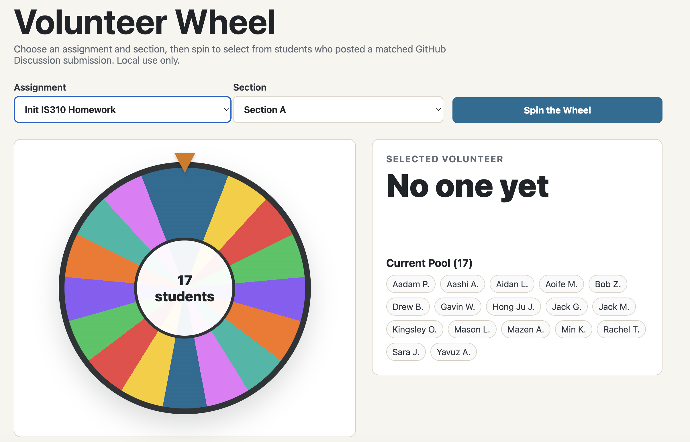
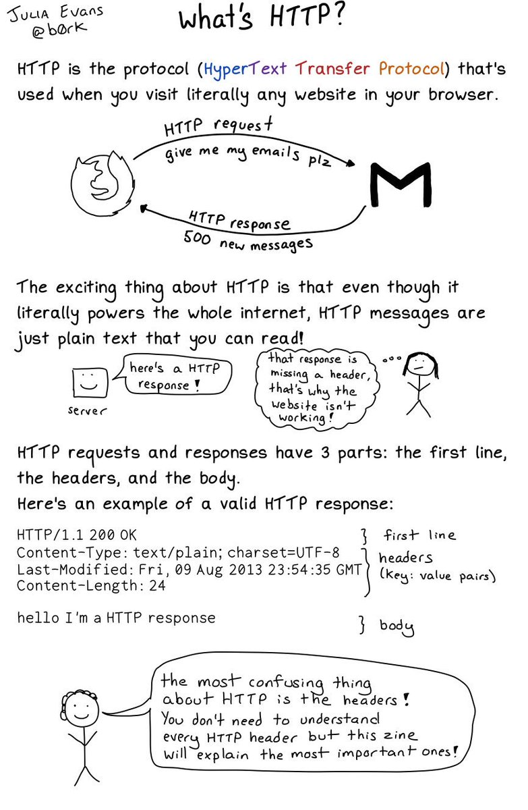
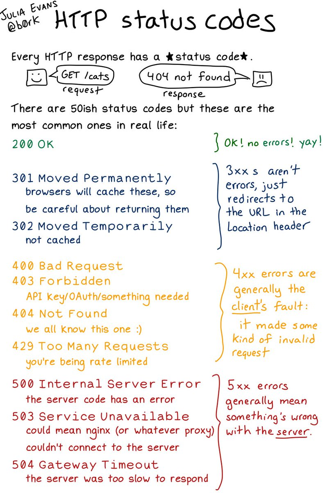
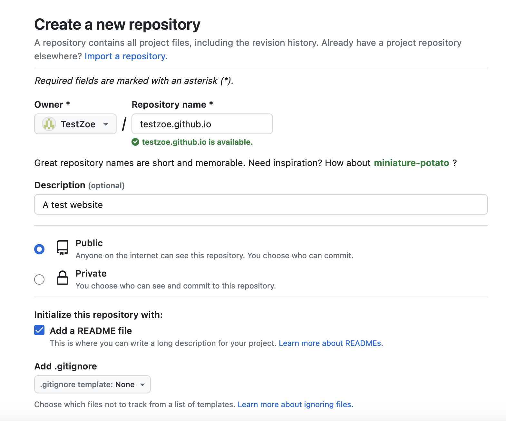
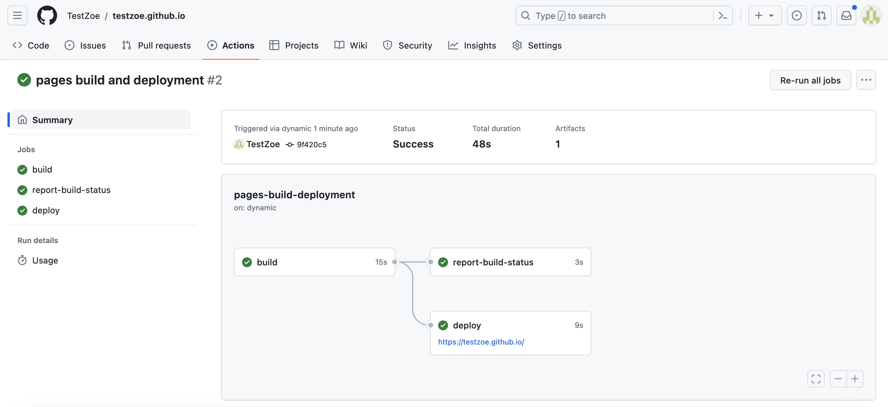

## Today's Agenda

- Review the [Source & Style homework](../materials/introducing-defining-cad/07-intro-html.qmd#homework-source-and-style){target="_blank"} assignment and discuss any questions.
- Review the [Introduction to the Web & Servers](../materials/introducing-defining-cad/08-intro-web.qmd){target="_blank"} lesson and discuss any questions. Slides are available [here](../slides/08-intro-web.qmd){target="_blank"}.
- Work in breakout groups on the [Collective and Individual Topic Selection](../assessments/03-semester-project.qmd#milestone-1-collective--individual-topic-selection){target="_blank"} assignment (due next Tuesday) and the [Mass Digitization, Digital Libraries, and Data Retirement](../assessments/06-collecting-digitizing-culture.qmd){target="_blank"} group assignment (due in two weeks).


## Any Volunteers?

[](https://github.com/CultureAsData-UIUC/is310-fall-2026/discussions/3){target="_blank"}


# What is the Web?

We all use the web constantly, but what exactly is it?

## The World Wide Web

:::{.r-fit-text}
[**From Wikipedia:**](https://en.wikipedia.org/wiki/World_Wide_Web){target="_blank"}

> "The World Wide Web (WWW), commonly known as the Web, is an information system where documents and other web resources are identified by Uniform Resource Locators (URLs), which may be interlinked by hypertext, and are accessible over the Internet. The resources of the WWW are transferred via the Hypertext Transfer Protocol (HTTP) and may be accessed by users by a software application called a web browser and are published by a software application called a web server."
:::

## Histories of the Web: Memex

The core idea of hypertext and the web is about **linking information across machines**.

We've seen this previously with **Vannevar Bush's *Memex*** (1940s), which envisioned using microfilm to link information


## Histories of the Web: Xanadu

:::: {.columns}
::: {.column width="40%" }
[](https://en.wikipedia.org/wiki/Project_Xanadu){target="_blank"}

:::
::: {.column width ="60%" .r-fit-text}

[](https://www.xanadu.net/){target="_blank"}
:::
::::


## Histories of the Web: Mouse & NLS


:::: {.columns}
::: {.column width="40%" }
[](https://www.smithsonianmag.com/innovation/douglas-engelbart-invented-future-180967498/){target="_blank"}
:::
::: {.column width="60%" .r-fit-text}
[](https://dougengelbart.org/content/view/155/){target="_blank"}
:::
::::


## Histories of the Web: ARPANET

:::: {.columns}
::: {.column width="40%" }
[](https://theconversation.com/how-the-internet-was-born-from-the-arpanet-to-the-internet-68072){target="_blank"}
:::
::: {.column width="60%" .r-fit-text}
[](https://en.wikipedia.org/wiki/ARPANET){target="_blank"}
:::
::::


## Histories of the Web: USENET

[](https://thehistoryoftheweb.com/the-importance-of-being-on-usenet/){target="_blank"}


## Histories of the Web: Humanist Listserv

[](https://dhhumanist.org/){target="_blank"}


## Histories of the Web: World Wide Web

:::: {.columns}
::: {.column width="50%"}
[](https://www.w3.org/People/Berners-Lee/)
:::

::: {.column width="50% .r-fit-text}

[](https://worldwideweb.cern.ch/browser/){target="_blank"}
:::
::::


## What did Berners Lee Invent Exactly?

Berners-Lee developed three key components:

. . .

- **URI** 

. . .

- **HTTP** 
  
. . .

- **HTML** 


## What is a URL?

. . .

A **URL (Uniform Resource Locator)** is a web address—a string of characters that provides a way to access a specific resource on the web.

URLs are made up of different components:

[](https://developer.mozilla.org/en-US/docs/Learn_web_development/Howto/Web_mechanics/What_is_a_URL){target="_blank"}


## How do we write URLs in HTML documents?

. . .

```html
<a href="https://ischool.illinois.edu/">My first page!</a>
```

This creates a **hyperlink** or **link** that allows us to connect webpages.

## What types of hyperlinks exist?

. . .

- **Internal links** 

. . .

- **External links** 

. . .

- **Incoming links** 

. . .

- **Anchors** or **page fragments**

More on hyperlinks: [Mozilla: Types of Links](https://developer.mozilla.org/en-US/docs/Learn_web_development/Howto/Web_mechanics/What_are_hyperlinks#types_of_links){target="_blank"}


## How does the web work? 

**What is this model?**


. . .

- **Client** = computer that *requests* data
- **Server** = computer that *hosts* and *sends* data


## How do Clients and Servers Communicate?


## What is HTTP?

What is the difference between `http://` and `https://`?

. . .

[](https://developer.mozilla.org/en-US/docs/Learn/Common_questions/Web_mechanics/What_is_a_URL#scheme){target="_blank"}


## How can you see an HTTP response?




## What is an HTTP status code?




## What does 404 indicate?


## What is the difference between Websites, Browsers, and Search Engines?


## Histories of the Web: Mosaic

[](https://www.ncsa.illinois.edu/research/project-highlights/ncsa-mosaic/){target="_blank"}


## What is a Domain Name?

. . .


## What is Sandra Bullock typing in this clip?

[https://youtu.be/M1K-B8QVLyo?t=242](https://youtu.be/M1K-B8QVLyo?t=242){target="_blank"}

. . .


## What is DNS?

[](https://en.wikipedia.org/wiki/Domain_Name_System){target="_blank"} 


## What is the difference between top and second-level domains?


## Who Connects Us to the Internet?

[](https://en.wikipedia.org/wiki/Internet_service_provider){target="_blank"}

*How did internet access become a commercial service?*


## Histories of the Web: Submarine Cables

[](https://www.submarinecablemap.com/){target="_blank"}

*What infrastructure carries culture as data across oceans?*


## Who Coordinates Domain Names?

[{width="55%"}](https://www.icann.org/history){target="_blank"}

*Who should have authority over a global naming system?*


## Learn More?

For more on TLDs, see this article about dead TLDs: [https://web.archive.org/web/20240214095930/https://astrid.tech/2022/04/05/1/dead-tlds/](https://web.archive.org/web/20240214095930/https://astrid.tech/2022/04/05/1/dead-tlds/){target="_blank"}

There's also Ingrid Burrington's fascinating piece on visiting a Domain-Names Conference: [https://www.theatlantic.com/technology/archive/2017/02/domain-names-dot-horse/516438/](https://www.theatlantic.com/technology/archive/2017/02/domain-names-dot-horse/516438/){target="_blank"}

# Questions About Hosting HTML Pages with GitHub Pages?

[](https://docs.github.com/en/pages){target="_blank"}


## REMINDER TWO OPTIONS 

- Either personal `github.io` site (Option 1) or group/organization site (Option 2) via `cultureasdata-uiuc.github.io` (Option 2)


## Personal Website? First Create the Repository

How do we create a repository for our personal website?

. . .

Create a new repository with the exact name: **`yourusername.github.io`**

For example: `ZoeLeBlanc.github.io`




## Group Website? Find Your Group Repository

*Is everyone part of a group and added to the group repository?*

## Add Your HTML Files


## Add Your HTML Files

For group websites, you'll still create an `index.html` but should also create a folder structure for your digital objects:

```
group-repository/digital-objects/
├── index.html (main showcase page)
├── member1-name/
│   └── index.html
├── member2-name/
│   └── index.html
└── member3-name/
    └── index.html
```

## How do we get the files on GitHub? 

. . .

Use the standard git workflow:

```sh
git add .
git commit -m "Initial commit: add digital object page"
git push origin main
```


## Enable Pages (for group websites)

In your repository, go to **Settings** → **Pages**:

. . .

- Under "Source," select the branch (usually `main`)
- Click Save

GitHub will now host your site.


## Find Your Live Site

Your website is now live at: `https://yourusername.github.io` OR at: `https://cultureasdata-uiuc.github.io/is310-fall-2026-group-*/digital-objects`

Verify deployment by checking the **Actions** tab for green checkmarks:




## Monitoring Your Deployment

Whether you choose Option 1 or Option 2, you can always check your deployment status:

1. Go to your repository on GitHub
2. Click the **Actions** tab
3. Look for the most recent workflow run

. . .

A green checkmark ✓ means your site deployed successfully.


## Understanding What's Happening

When you push your HTML files to GitHub, here's what happens behind the scenes:

1. GitHub detects the push to your repository
2. GitHub Pages automatically builds your site
3. Your HTML, CSS, and JavaScript files are copied to a web server
4. Your site becomes accessible at your unique URL


## Understanding What's Happening

When someone visits your URL:

1. Their browser sends an **HTTP request** to GitHub's servers
2. GitHub's servers respond with your **HTML file**
3. The browser **renders** the page

You've created content (HTML), version controlled it (Git), and deployed it to a live web server!


## Your Turn: Doing It Live Assignment

[](../materials/introducing-defining-cad/08-intro-web.qmd#assignment-doing-it-live){target="_blank"}

Review the assignment instructions here: [Doing It Live](../materials/introducing-defining-cad/08-intro-web.qmd#assignment-doing-it-live){target="_blank"}.


## Remainder Agenda

- [ ] Complete the Collective and Individual Topic Selection assignment (due next Tuesday)
- [ ] Start reading through the Mass Digitization, Digital Libraries, and Data Retirement assignment (due in two weeks)
- [ ] Complete any remaining work on the Source & Style assignment (due today!)
