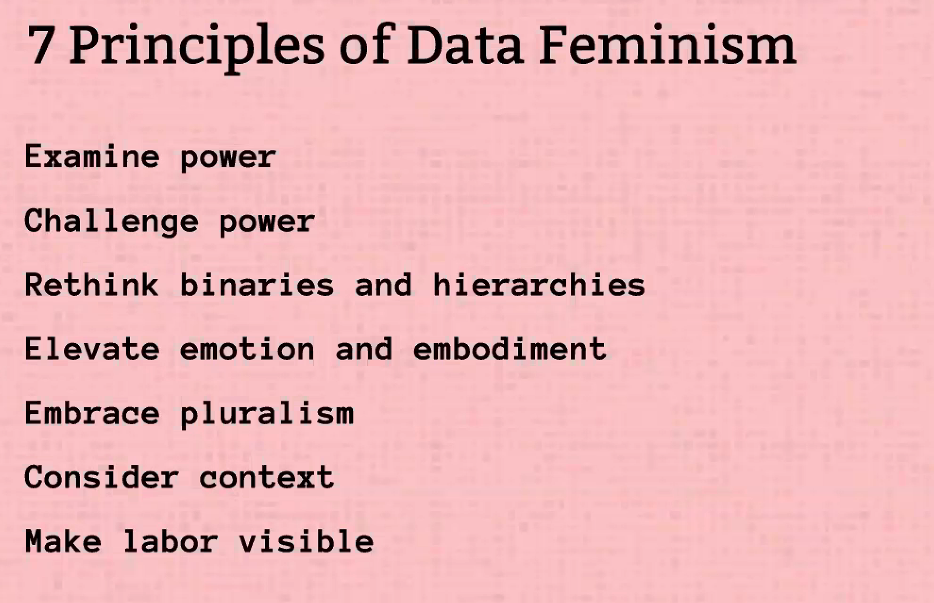
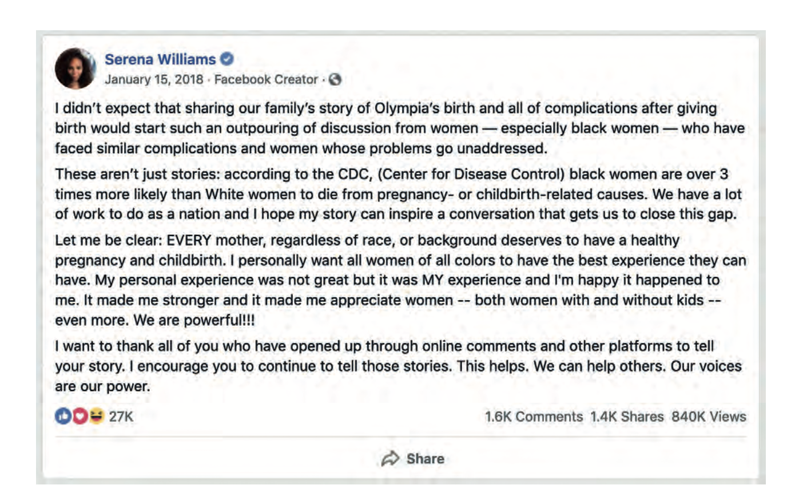
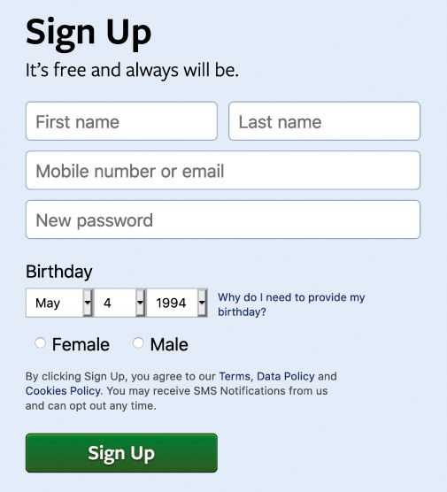
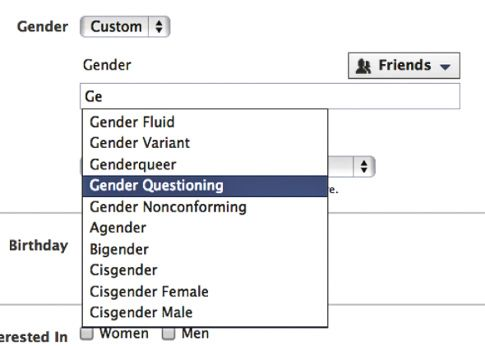
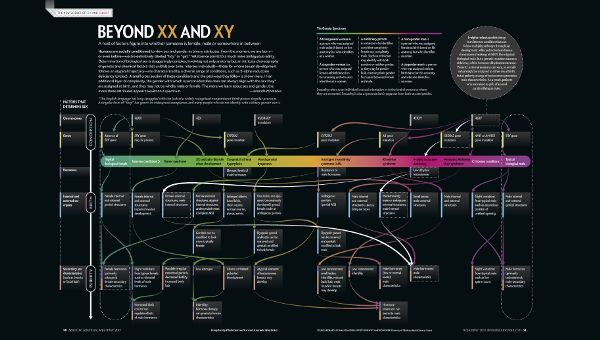
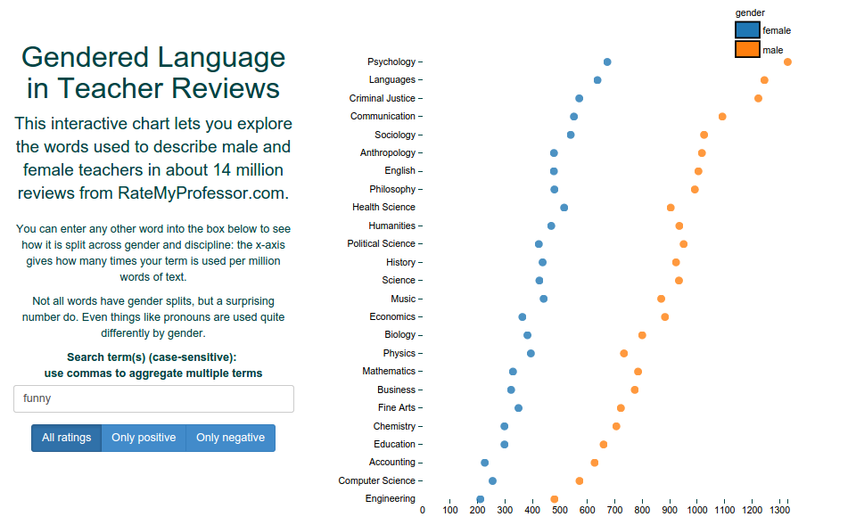
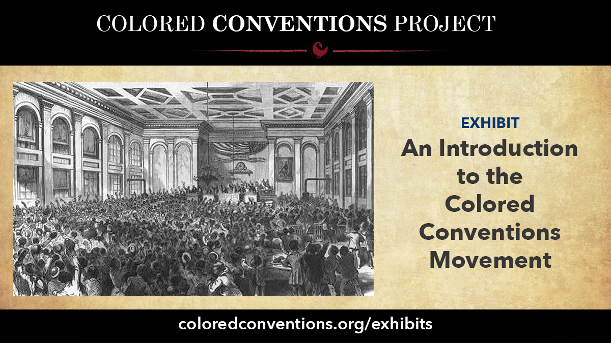

# Today's Agenda

- Discuss *Data Feminism* chapters and the Gender Violence at the Border dataset
- Review the Doing it Live Homework Assignment
- Review foundational Python concepts

. . .

*Any questions?*

## Data Feminism by Catherine D’Ignazio and Lauren F. Klein

:::: {.columns}
::: {.column width="50%" }
{target="_blank"}
:::
::: {.column width="50%" }
{target="_blank"}
:::
::::

## What are the seven principles of Data Feminism? {.r-fit-text}

. . .

::: {.r-fit-text}
{.r-stretch fig-alt="The seven principles of Data Feminism"}
:::

## Let's Start With The Power Chapter

## What do the authors mean by “examine power”?

What is the Matrix of Domination? How do they define power?

## How does this relate to voting rights?

## What is the difference between a minority and a minoritized group?

## What is Algorithms of Oppression?

:::: {.columns}
::: {.column width="50%" }
{target="_blank"}
:::
::: {.column width="50%" }
{target="_blank"}
:::
::::

## How does machine learning classify? What is Precision & Recall?

{target="_blank"}

## What is the privilege hazard and OPP?

{target="_blank"}

## What is ground-up or counter-data collection?

## Gender Violence At The Border Dataset

{target="_blank"}

## How was this data collected?

{target="_blank"}

## How did the original authors try to humanize the data?

## Torn Apart/Separados

{target='_blank'}

## SUCHO

{target="_blank"}

## Data Rescue Project

{target="_blank"}

## What are the three Ss?

{target="_blank"}

# What Counts Gets Counted Chapter

- How does this privilege hazard and matrix of domination impact “what gets counted counts”?
- How did it shape the experiences of Maria Munir, or female screenwriters in the UK, or the *ProbPublica* reporting on maternal health?

## What are classification systems?

What are their dangers and what was the problem with Facebook’s gender classification system?

:::: {.columns}
::: {.column width="50%" }

:::
::: {.column width="50%" }

:::
::::

## Why can’t we just build better or more accurate classification systems?

:::: {.columns}
::: {.column width="50%" }

:::
::: {.column width="50%" }

:::
::::

## Who is Sasha Constanza-Chock and what is Design Justice?

{target="_blank"}

## Design Justice Principles

{target="_blank"}

## Example of Pockets

:::{.r-fit-text}
{target="_blank"}
:::

## What is the Paradox of Exposure and how does that relate to binaries?

. . .

What is the solution?

Couldn’t we just solve the problem with just diversifying datasets?

## How can data visualization also help?

{target="_blank"}

## Example of ProfGender

[](https://web.archive.org/web/20260218074507/https://benschmidt.org/profGender/#%7B%22database%22%3A%22RMP%22%2C%22plotType%22%3A%22pointchart%22%2C%22method%22%3A%22return_json%22%2C%22search_limits%22%3A%7B%22word%22%3A%5B%22his%20kids%22%2C%22her%20kids%22%5D%2C%22department__id%22%3A%7B%22%24lte%22%3A25%7D%7D%2C%22aesthetic%22%3A%7B%22x%22%3A%22WordsPerMillion%22%2C%22y%22%3A%22department%22%2C%22color%22%3A%22gender%22%7D%2C%22counttype%22%3A%5B%22WordCount%22%2C%22TotalWords%22%5D%2C%22groups%22%3A%5B%22unigram%22%5D%2C%22testGroup%22%3A%22D%22%7D){target="_blank"}

## How can documentation help as well?

{target="_blank"}

# Homework Review

[Doing It Live Homework Assignment](../materials/introducing-defining-cad/08-intro-web.qmd#assignment-doing-it-live){target="_blank"}

*Any volunteers?* Or should we spin the wheel?

# Python Refresher

# Quick Review Time!

## How Can I Start Writing Python Quickly?

. . .

How do we check our python version?

. . .

How do we open the interpreter?

. . .

How do we enter data into the interpreter?

. . .

What happens when you quit?

## What Are Variables?

. . .

How do we write variables?

. . .

What happens if we assign new values to an existing variable?

. . .

What are best practices for writing variable names? What are reserved keywords?

## What are Data Types?
. . .

When do we use quotations?

. . .

What are the differences between intergers and floats?

. . .

How do we check for true or false?

## What Are Operators?

. . .

How can we add variables together or subtract them?

. . .

How can we check if variables contain the same values?

## What Are Data Structures?

. . .

How do we write lists? What can they contain?

. . .

How do we access values in a list? How can we get the last two values or the first two?

. . .

How do we combine lists?

. . .

How do we write dictionaries? What can they contain?

. . .

How do we add new values to a dictionary? 

. . .

When should we use a list or a dictionary structure?

## Why Scripts?

What is the value of using a script rather than the interpreter?

. . .

How do we create a Python script?

. . .

How do we run a Python script?

. . .

How can we output from a script?

## What are Built-In Methods?

What are some of the built-in methods you have learned so far?

. . .

How can we check the type or length of a variable?

. . .

How can we shorten text with a built-in method? What is a delimiter and how can we use it to manipulate strings?

. . .

How could we ask for user input with a built-in method?

## What is Control Flow?

What happens if we call a variable before it is defined?

. . .

What is a `for-loop`? How do we write them in Python and why does indentation matter?

. . .

When we loop through a list, what does the variable represent and what is iteration?

. . .

What happens to that variable after the loop ends?

. . .

How would you loop through the keys and values of a dictionary?

. . .

What's the `.items()` method?

## What Are Functions?

What's the syntax for creating a function?

. . .

What are arguments?

. . .

How do you pass data into a function?

. . .

Why would you use `return` in a function?

. . .

What happens to the returned value?

. . .

If you create a variable inside a function, can you use it outside?

. . .

What's **local scope** vs **global scope**?

# What Are Conditionals?

What's the structure of a conditional statement?

. . .

What operators could you use to test conditions?

. . .

What's the difference between `=` and `==`?

. . .

How could you test more than one condition?

. . .

What keywords let you combine conditions?

. . .

What if you have more than two possibilities?

. . .

When would you use `elif` instead of multiple `if` statements?

# Check In? 

Any questions?? 

Ideally this is just review but please speak up now before we start new content! Also optional homework for those newer to Python is available at the end of the Advanced Python lesson.
