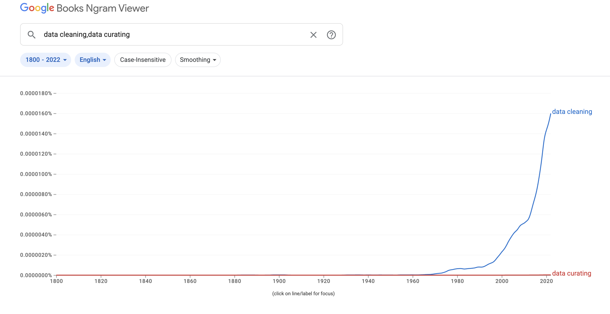
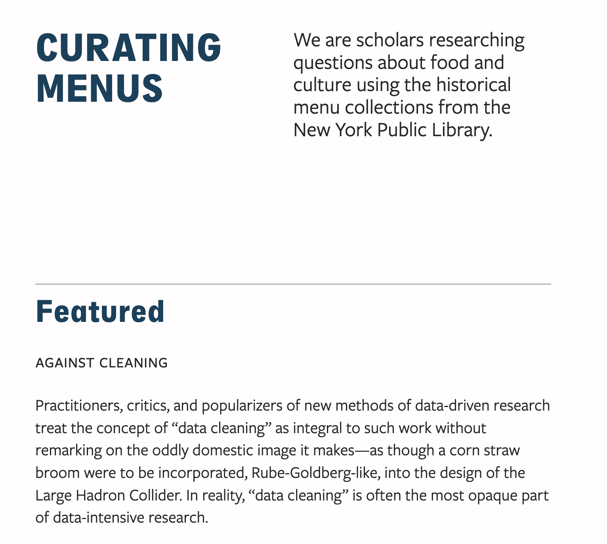
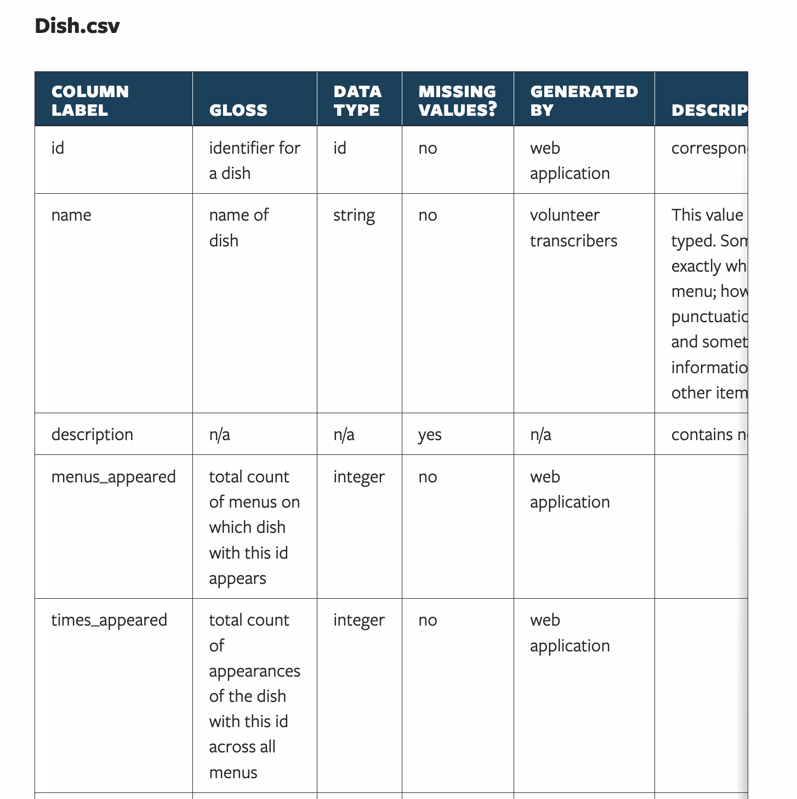
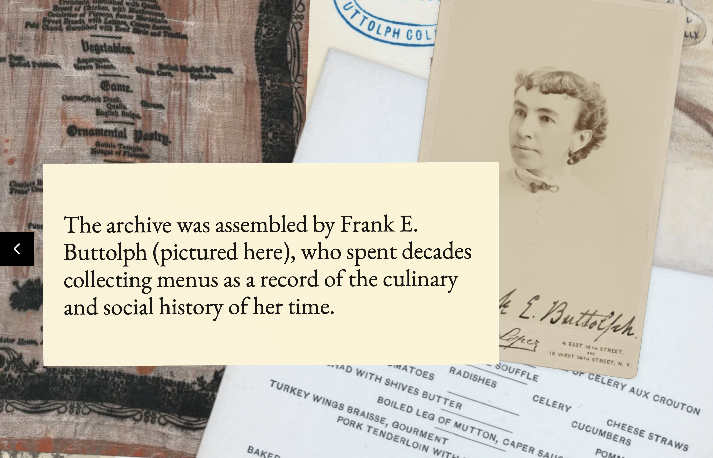
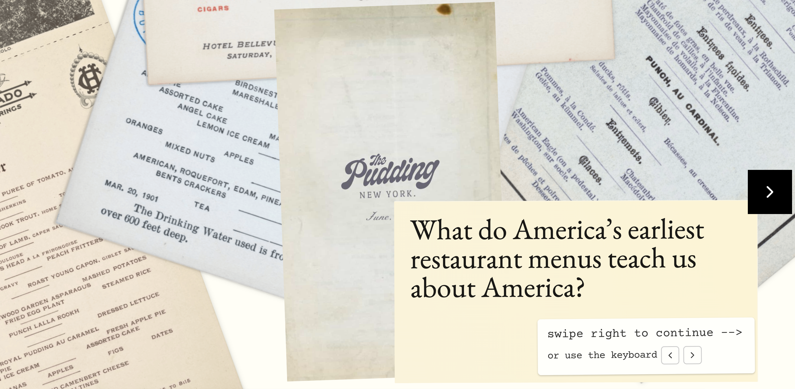
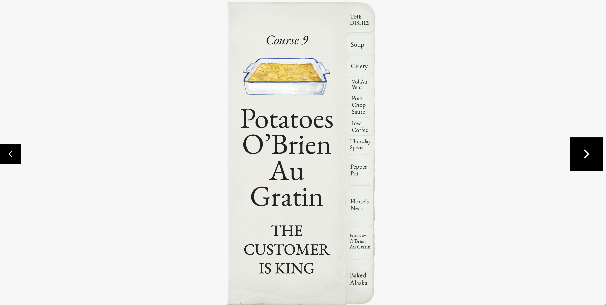

# Today's Agenda

- Discuss assigned readings
- Complete remainder of Python refresher (time permitting)
- Update on group work & breakout rooms


## Against Cleaning by Rawson and Muñoz

:::: {.columns}
::: {.column width="50%"}
[](https://www.library.upenn.edu/staff/katie-rawson){target="_blank"}
:::
::: {.column width="50%"}
[](https://mith.umd.edu/people/trevor-munoz/){target="_blank"}
:::
:::: 


## What is data cleaning?


*What are some methods of data cleaning that you have heard of or tried?*


## Why "Against Cleaning"?

[](https://books.google.com/ngrams/graph?content=data+cleaning%2C+data+curating&year_start=1800&year_end=2022&corpus=en&smoothing=3){target="_blank"}

*Does their argument remind you of any previous readings?*

## Why is data cleaning counter to how humanists think about data?

. . .

::: {.r-fit-text}

> “Yet the humanities cannot import paradigms and practices wholesale from other fields, whether from “technoscience” or the nearer “social” sciences, without risking the foreclosure of specific and valuable humanistic modes of producing knowledge. **If we are interested in working with data, and we accept that there is something in our work with data that is like what other fields might call “data cleaning,” we have no choice but to try to articulate both what it is and what it means in terms of how humanists make knowledge**.” (Rawson and Muñoz, 2019, p. 280)
> 
> “In other data-intensive fields in which researchers have long been explicit about their framing orders, the limits of results are often understood and articulated using specialized discourses. For example, in climate science, researchers confine their claims to the data they can work with and report results with margins of error. **While humanities researchers do have discourses for limiting claims (acknowledging the choice of an archive or a particular intellectual tradition), the move into data-intensive research asks humanists to modify such discourses or develop new ones suitable for these projects.**” (Rawson and Muñoz, 2019, p. 281)
:::


## What is the Curating Menus Project?

[](http://curatingmenus.org/){target="_blank"}


## What is the What's on the Menu Project?

[](https://www.nypl.org/research/support/whats-on-the-menu){target="_blank"}


## How was the data created?

[](https://www.nypl.org/blog/2015/11/23/scribe-framework-community-transcription){target="_blank"}


## What was the problem with Potatoes au Gratin in Curating Menus?

```
id
2759 Potatoes, au gratin
7176 Potatoes au Gratin
8373 Potatoes — Au gratin
35728 Potatoes: au gratin
44271 Au Gratin Potatoes
84510 Au Gratin (Potatoes)
94968 Potatoes, au Gratin,
97166 POTATOES:-­ Au gratin
185040 Au Gratin [potatoes]
313168 Au Gratin Potatoes
315697 (Potatoes) Au Gratin
325940 Au Gratin Potatoes
330420 au-­ Gratin Potatoes
353435 Potatoes: Au gratin
373639 Potatoes Au Gratin
```


## How did they build their data model? How did their data model transform?

[](http://curatingmenus.org/data_dictionary){target="_blank"}


## Where did the menus come from?

[](https://pudding.cool/2026/06/menu-story/){target="_blank"}


## How did A History of Menus is a Menu of History work with the same data?



*What did you learn about the history of restaurants from this data?*


## How would you compare the Potatoes au Gratin example to the menu data?




## How does the interactive map differ from the menu history article?


## How does the map work exactly? How does the Pudding data differ from the Curating Menus data?


## How does scale relate to Deep Fried Data?

[](https://idlewords.com/talks/deep_fried_data.htm){target="_blank"}


## How does bias relate to data cleaning?


## What are alternatives to the language of cleaning?


## What is Non-Scalability Theory?

:::: {.columns}
::: {.column width="50%"}

:::
::: {.column width="50%"}

:::
::::


## Scale & Menus

:::: {.columns .r-fit-text}
::: {.column width="50%"}
> A menu describes what a restaurant serves—but a menu also describes who is being served.
> They reflect the class, gender, political, technological, and environmental shifts of history.
> The thousands of menus in this collection document a period of fundamental transformation – and the birth of the society and the restaurant we know today. (The Pudding, 2026)
:::
::: {.column width="50%"}
> “Making menus is a scalable process. Although menus are sometimes handwritten or elaborately printed on ribbon-sewn silk, the format of a menu is designed to be scalable. Menus are an efficient typographical vehicle for communicating a set of offerings for often low-margin dining enterprises. Part of the way that we know that menus are scalable is how alike they appear. “Eggs Benedict” or “caviar,” with their accompanying prices, may fit interchangeably into the “slots” of the menu’s layout.” (Rawson and Muñoz, 2019, p. 285)
:::
::::


## What about community based approaches? What are authorities or taxonomies?

[](https://pudding.cool/2024/10/fanfic/){target="_blank"}


# Python Refresher Continuation

- Continue where we left off in [the previous slides](../private_slides/09-data-feminism-python-refresher.qmd#what-are-built-in-methods)

# Group Work Update

- [Mass Digitization assignment is archived](../assessments/06-collecting-digitizing-culture.qmd){target="_blank"}
- Moving forward will now have [group log in the GitHub repository](../assessments/02-weekly-assessments.qmd#group-collaboration-and-work-logs){target="_blank"}
- Start discussing [group aspects of semester long project](../assessments/03-semester-project.qmd#milestone-4-final-project-submission){target="_blank"}
