# Today's Agenda

- Complete Python Refresher review
- Review Complex Python and Virtual Environments lessons
- Time permitting work in groups

# Final Review of Python Refresher

## What are Built-In Methods?


What are some of the built-in methods you have learned so far?

. . .

How can we check the type or length of a variable?

. . .

How can we shorten text with a built-in method? What is a delimiter and how can we use it to manipulate strings?

. . .

How could we ask for user input with a built-in method?

## What is Control Flow?


What happens if we call a variable before it is defined?

. . .

What is a `for-loop`? How do we write them in Python and why does indentation matter?

. . .

When we loop through a list, what does the variable represent and what is iteration?

. . .

What happens to that variable after the loop ends?

. . .

How would you loop through the keys and values of a dictionary?

. . .

What's the `.items()` method?

## What Are Functions?


What's the syntax for creating a function?

. . .

What are arguments?

. . .

How do you pass data into a function?

. . .

Why would you use `return` in a function?

. . .

What happens to the returned value?

. . .

If you create a variable inside a function, can you use it outside?

. . .

What's **local scope** vs **global scope**?

## What Are Conditionals?


What's the structure of a conditional statement?

. . .

What operators could you use to test conditions?

. . .

What's the difference between `=` and `==`?

. . .

How could you test more than one condition?

. . .

What keywords let you combine conditions?

. . .

What if you have more than two possibilities?

. . .

When would you use `elif` instead of multiple `if` statements?


# Check In? 

Any questions?? 

Reminder: **Optional homework: [Python Scripting Foundations](../materials/creating-curating-cad/02-python-refresher-advanced.qmd#homework-scripting-python-foundations-optional-but-recommended){target="_blank"}**

# Programming Languages Have Histories

## What Is a Programming Language?

[](https://www.bloomberg.com/graphics/2015-paul-ford-what-is-code/){target="_blank"}


## History of Programming Languages

[{fig-alt="Timeline of programming languages" style="height: 72vh; width: 100%; object-fit: contain;"}](https://www.computer.org/publications/tech-news/insider-membership-news/timeline-of-programming-languages){target="_blank"}


## Where Did Python Come From?

:::: {.columns}
::: {.column width="38%"}
[](https://docs.python.org/3/faq/general.html#why-was-python-created-in-the-first-place){target="_blank"}
:::
::: {.column width="62%"}

:::
::::


## Why Do Python Versions Matter?

[](https://pythonclock.org/){target="_blank"}


# Complex Python & Advanced Data Structures

## What is a Class?

. . .

How can we tell if something is a class in Python?

. . .

What is object-oriented programming and how does it relate to classes?

. . .

When might we want to use a class instead of a dictionary or a list?


## Programming Design Patterns

[](https://circleci.com/blog/functional-vs-object-oriented-programming/){target="_blank"}


## How to turn a function into a class?

::: {.r-fit-text}

```python
def check_movie_release(movie):
    if movie['release_year'] < 2000:
        print(f"{movie['name']} was released before 2000")
    else:
        print(f"{movie['name']} was released after 2000")
        return movie['name']

recent_movies = []

favorite_movies =[
    {
        "name": "The Matrix I",
        "release_year": 1999,
        "sequels": ["The Matrix II", "The Matrix III", "The Matrix IV"]
    },
    {
        "name": "Star Wars IV",
        "release_year": 1977,
        "sequels": ["Star Wars V", "Star Wars VI", "Star Wars VII", "Star Wars VIII", "Star Wars IX"],
        "prequels": ["Star Wars I", "Star Wars II", "Star Wars III"]
    }
]

for movie in favorite_movies:
    result = check_movie_release(movie)
    if result is not None:
        recent_movies.append(result)

print(recent_movies)
```
:::


## What is the syntax of a class?

. . .

```python
# Define a class
class Blank:
    pass  # Pass means "Move along, please. Nothing to see here."

# Create an instance of the class and invoke it
Blank()
```


## How could we create a class for our movies?

. . .

```python
class Movie:
    def __init__(self, name):
        self.movie_name = name

a_movie = Movie("The Matrix")
a_movie.movie_name
```


## How do we add methods to a class?

Methods are functions **inside** a class. They operate on the instance's data.

. . .

```python
def add_directors(self, directors):
    """Adds directors to the movie"""
    if isinstance(directors, list) is False:
        directors = [directors]
    self.directors.extend(directors)
```


## How can we add more attributes to a class?

. . .

```python
class Movie:
    def __init__(self, name):
        self.movie_name = name
        self.directors = []
        self.release_year = None
        self.age = 0
        self.sequels = []
```

Initialize attributes as empty or None to structure your data.


## Adding More Functionality

So what's going in this code block?

```python
class Movie:
    """Contains methods for data about a movie

    Methods:
    --------
    add_directors
    add_release_year
    calculate_age
    """
    def __init__(self, name):
        self.movie_name = name
        self.directors = []
        self.release_year = None
        self.age = 0
        self.sequels = []
        self.prequels = []


    def add_directors(self, directors):
        """Adds a list of directors of the movie

        Method argument:
        -----------------
        directors(list) -- A list of people who director the movie
        """
        if isinstance(directors, list) is False:
            directors = [directors]

        self.directors.extend(directors)


    def add_release_year(self, year):
        """Adds the release year of the movie

        Method argument:
        -----------------
        year(integer or string) -- A year the movie was released
        """

        self.release_year = int(year)

    def add_sequels(self, sequels):
        """Adds a list of sequels to the movie

        Method argument:
        -----------------
        sequels(list) -- A list of sequels to the movie
        """
        if isinstance(sequels, list) is False:
            sequels = [sequels]

        self.sequels.extend(sequels)

    def add_prequels(self, prequels):
        """Adds a list of prequels to the movie

        Method argument:
        -----------------
        prequels(list) -- A list of prequels to the movie
        """
        if isinstance(prequels, list) is False:
            prequels = [prequels]

        self.prequels.extend(prequels)


    def calculate_movie_age(self):
        """Calculates the age of the movie
        """
        from datetime import date
        self.age = date.today().year - self.release_year

a_movie = Movie("The Matrix I")
a_movie.add_directors(["Lana Wachowski", "Lilly Wachowski"])
a_movie.add_release_year(1999)
a_movie.add_sequels(["The Matrix II", "The Matrix III", "The Matrix IV"])
a_movie.calculate_movie_age()
print(a_movie.age)
print(a_movie.add_directors.__doc__) # To view the docstring for the method
```


## Adding More Methods

What if we wanted to add a method for printing out an entire movie's information? What is this code doing and how can we call this method?

```python
def get_movie_info(self):
    """Prints out the movie's information
    """
    for key, value in self.__dict__.items():
        print(f"{key}: {value}")

```

## Adding More Classes

What if we wanted to store prequels and sequels as instances of our `Movie` Class? What is this code doing exactly?

```python
class Movie:
    """Contains methods for data about a movie

    Methods:
    --------
    add_directors
    add_release_year
    calculate_age
    """
    def __init__(self, name, release_year=None):
        self.movie_name = name
        self.directors = []
        self.release_year = release_year
        self.age = 0
        self.sequels = []
        self.prequels = []

    def add_directors(self, directors):
        """Adds a list of directors of the movie

        Method argument:
        -----------------
        directors(list) -- A list of people who director the movie
        """
        if isinstance(directors, list) is False:
            directors = [directors]

        self.directors.extend(directors)

    def add_release_year(self, year):
        """Adds the release year of the movie

        Method argument:
        -----------------
        year(integer or string) -- A year the movie was released
        """

        self.release_year = int(year)

    def calculate_movie_age(self):
        """Calculates the age of the movie
        """
        from datetime import date
        self.age = date.today().year - self.release_year

    def add_sequel(self, sequel, release_year):
        """Adds a sequel to the movie

        Method argument:
        -----------------
        sequel(string) -- The name of the sequel
        release_year(integer) -- The release year of the sequel
        """
        sequel_movie = Movie(sequel, release_year)
        self.sequels.append(sequel_movie)

    def add_prequel(self, prequel, release_year):
        """Adds a prequel to the movie

        Method argument:
        -----------------
        prequel(string) -- The name of the prequel
        release_year(integer) -- The release year of the prequel
        """
        prequel_movie = Movie(prequel, release_year)
        self.prequels.append(prequel_movie)

    def get_movie_info(self):
        """Prints out the movie's information
        """
        for key, value in self.__dict__.items():
            if key in ['sequels', 'prequels']:
                print(f"{key}: {[movie.movie_name for movie in value]}")
            else:
                print(f"{key}: {value}")

    def calculate_movie_order(self):
        """Calculates the order of movies based on release year
        """
        all_movies = [self] + self.sequels + self.prequels
        all_movies.sort(key=lambda movie: movie.release_year)
        return [movie.movie_name for movie in all_movies]

a_movie = Movie("The Matrix I")
a_movie.add_directors(["Lana Wachowski", "Lilly Wachowski"])
a_movie.add_release_year(1999)
a_movie.calculate_movie_age()
a_movie.add_sequel("The Matrix II", 2003)
a_movie.add_sequel("The Matrix III", 2003)
a_movie.add_sequel("The Matrix IV", 2021)
a_movie.add_prequel("The Matrix 0", 1998)
a_movie.get_movie_info()
print(a_movie.calculate_movie_order())
```

# Comments and Documentation


## How do we add inline comments?

. . .

```python
movie = dict()  # Could also write {}
```

Use `#` to comment a single line.


## How do we add block comments?

. . .

```python
def add_directors(self, directors):
    """Adds directors to the movie

    Arguments:
    directors (list) -- List of director names
    """
    # implementation here
```

. . .

Docstrings are triple-quoted strings at the start of functions/classes.

```python
print(a_movie.add_directors.__doc__) # To view the docstring for the method
```


## Documentation

:::: {.columns}
::: {.column width="40%" .r-fit-text}
In addition to comments, the other main resource for understanding how to use a class or function is the documentation. The documentation is a set of instructions that explains how to use a class or function.

This documentation explains how to define a class, how to create an instance of a class, and how to use methods in a class. It also explains how to use inheritance, which is a way to create a new class that inherits the attributes and methods of an existing class.

Learning to read documentation is a critical skill, so would highly recommend taking a look at the documentation when it is available.
:::
::: {.column width="60%" .r-fit-text}
[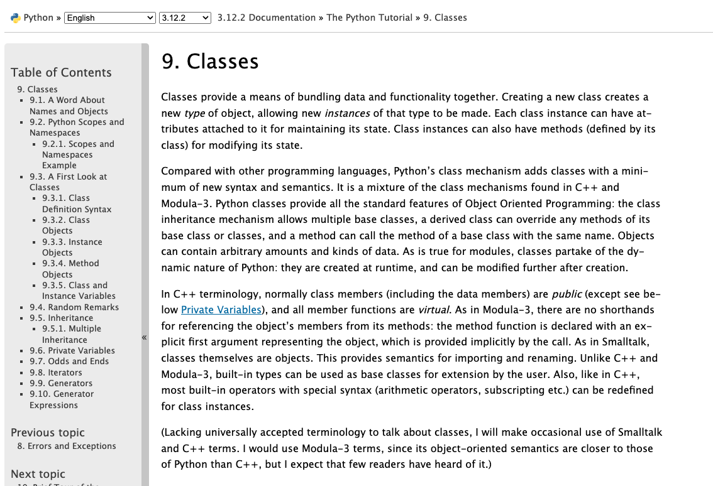](https://docs.python.org/3/tutorial/classes.html){target="blank"}
:::
::::


# Python Libraries & Imports


## What is the Python Standard Library?

[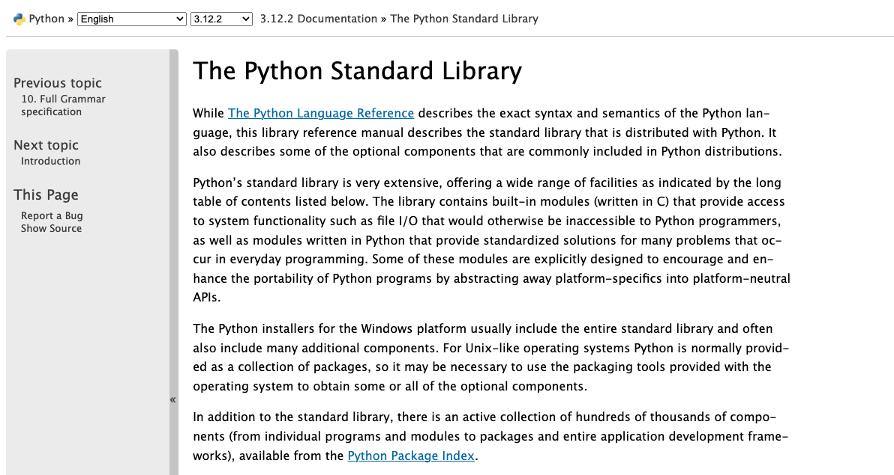](https://docs.python.org/3/library/){target="_blank"}

The Python Standard Library contains modules built into Python.


## `pathlib`

Let's scroll down to the [`pathlib` module](https://docs.python.org/3/library/pathlib.html){target="_blank"}.

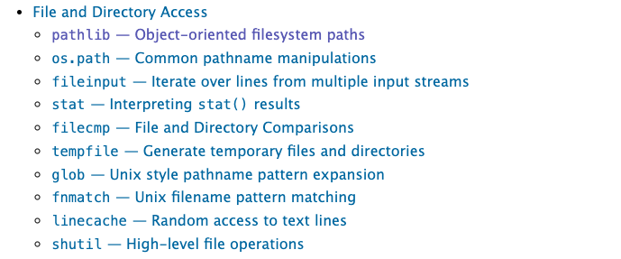

Now click on the link to the `pathlib` module.

## `pathlib` Methods

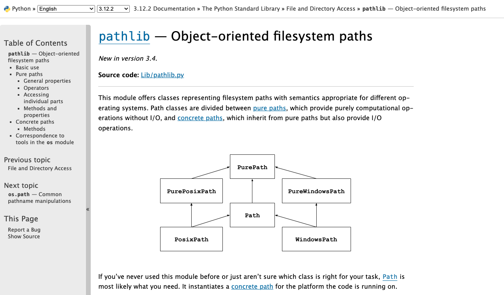

First take a look at the current [`pathlib` source code](https://github.com/python/cpython/blob/main/Lib/pathlib/__init__.py){target="_blank"}. Notice how it is organized, and try to find the definition of `class Path` (*hint*: use Control+F or Command+F).

Let's take a look at the methods in the `class Path` [https://docs.python.org/3/library/pathlib.html#methods](https://docs.python.org/3/library/pathlib.html#methods){target="_blank"}. How would we would print out the current working directory using `pathlib`? 

## Importing Libraries

Let's try importing `pathlib` into our script.

```python
import pathlib

pathlib.Path()
```

. . .

Or import a specific class:

```python
from pathlib import Path
```


## Aliasing Imports

```python
import pathlib as pl
```

. . .

Now you can use `pl.Path()` instead of `pathlib.Path()`.


## Using pathlib

So now that we've explored ways to import `pathlib`, let's try using this module. We'll start by using `pathlib` to print out the current working directory.

```python
from pathlib import Path

current_directory = Path.cwd()
print(current_directory)
```


## File Input and Output

But `pathlib` is useful not just for printing out working directories, it can also let us load in files.

## Reading in Data

Let's try it out with Pathlib by passing in one of the datasets from the *Responsible Datasets in Context* Project that we have been reviewing each week. You can use any of the datasets, but I'm selecting the one by Os Keyes and Melanie Walsh. “U.S. National Park Visit Data (1979-2023) – Responsible Datasets in Context.” *Responsible Datasets in Context*, June 1, 2024. [https://www.responsible-datasets-in-context.com/posts/np-data/](https://www.responsible-datasets-in-context.com/posts/np-data/){target="_blank"}.

Once you've downloaded the data, you should have a file called `US-National-Parks_RecreationVisits_1979-2023.csv`. Now let's try using `pathlib` to read in the data.

## Reading Files

```python
from pathlib import Path

file = Path('US-National-Parks_RecreationVisits_1979-2023.csv')
print(file, type(file))
```

Now if this code worked, it should show you the path of your spreadsheet and then the type of the object, either `<class 'pathlib.PosixPath'>` or `<class 'pathlib.WindowsPath'>`. Calling `Path()` creates the appropriate concrete path class for the current operating system. `PosixPath` and `WindowsPath` are subclasses of `Path`, so they share the same general interface while handling operating-system-specific path conventions.


## Reading Files

We can also look at the methods built into the `Path` class. One in particular is useful for us: `read_text()`, which reads the contents of a file and returns them as a string. Read more about it in the [`Path.read_text()` documentation](https://docs.python.org/3/library/pathlib.html#pathlib.Path.read_text){target="_blank"} and test it out in your script.

```python
from pathlib import Path

file = Path('US-National-Parks_RecreationVisits_1979-2023.csv')
print(file, type(file))

print(file.read_text(encoding="utf-8"))
```

What does this do?


# Beyond Pathlib: Using the `open` Function

## The `open` Built-in Function

So far we've been using `pathlib` to work with files, but Python also provides the built-in `open()` function for reading and writing files.

For example, we could use the [`open()` built-in function in Python](https://docs.python.org/3/library/functions.html#open){target="_blank"}.


## File Input - Basic Approach

To open a file for reading (input), we just do:

```python
input_file = open("US-National-Parks_RecreationVisits_1979-2023.csv", "r", encoding="utf-8")
text = input_file.read()
print(text)
input_file.close()
```

Here, we use the `open()` function to open a file in mode `"r"` (read). `open()` returns a [file object](https://docs.python.org/3/tutorial/inputoutput.html#reading-and-writing-files){target="_blank"} that provides methods for reading and writing.


## Using Path Objects with `open`

We could even just pass in our Path object to the `open` function:

```python
file = Path('US-National-Parks_RecreationVisits_1979-2023.csv')
input_file = open(file, "r", encoding="utf-8")
text = input_file.read()
print(text)
input_file.close()
```

At the end, we close the file so that its operating-system resources are released. Closing a file also ensures that buffered output has been written when we are writing rather than reading.


## The `with` Statement

Often, you'll see file handling used with the `with` keyword:

```python
with open("US-National-Parks_RecreationVisits_1979-2023.csv", "r", encoding="utf-8") as input_file:
    print(input_file.read())
```

This performs the same reading operation, but the file is automatically closed at the end of the block, even if an error occurs.


## File Output

::: {.r-fit-text}
File output is very similar. We just use mode `w`, which overwrites the file specified. We can also use `x` (which only works for new files) or `a` (which appends data at the end of the file).

|Character| Mode |Description|
|-|-|-|
|`r`|Read (default)|Open an existing file for reading|
|`w`|Write|Open for writing, truncating an existing file or creating a new one|
|`a`|Append|Open for writing at the end, creating the file if needed|
|`r+`|Read and write|Open an existing file for both reading and writing|
|`x`|Exclusive creation|Create a new file and fail if it already exists|
:::
## Writing to a File Example

To understand file output, let's try working with a file that doesn't exist:

```python
with open("new_text.txt", "w", encoding="utf-8") as output_file:
    for i in range(100):
        output_file.write(str(i**2) + "\n")
```

Once you run it, you should see a new file in your directory called `new_text.txt`, containing a list of numbers.


## Type Conversion with `write()`

Here's something tricky: `i` and `i**2` are integers, but a text file's `write()` method expects a string. If we try `output_file.write(i**2)`, we'll get: `TypeError: write() argument must be str, not int`

To get around this, we can convert from int to string using `str()`:

```python
"4"+str(4)  # produces "44"
int("4")+4  # returns 8
```

The newline character `"\n"` inserts a line break. Without it, all the numbers would be on the same line.


## Example: Save Movie Info

Here's a function to save the movie's information to a file:

```python
def save_movie_info(self, file_name):
	"""Saves the movie's information to a file

	Method argument:
	-----------------
	file_name(string) -- The name of the file to save the movie's information to
	"""
	with open(file_name, "w", encoding="utf-8") as f:
		f.write(f"Movie Name: {self.movie_name}\n")
		f.write(f"Directors: {', '.join(self.directors)}\n")
		f.write(f"Release Year: {self.release_year}\n")
		f.write(f"Age: {self.age}\n")
		f.write(f"Sequels: {', '.join([sequel.movie_name for sequel in self.sequels])}\n")
		f.write(f"Prequels: {', '.join([prequel.movie_name for prequel in self.prequels])}\n")
```

## Using Save Movie Info

Now you can call this function on your `a_movie` object:

```python
a_movie = Movie("The Matrix I")
a_movie.add_directors(["Lana Wachowski", "Lilly Wachowski"])
a_movie.add_release_year(1999)
a_movie.add_sequel("The Matrix II", 2003)
a_movie.add_sequel("The Matrix III", 2003)
a_movie.add_sequel("The Matrix IV", 2021)
a_movie.add_prequel("The Matrix 0", 1998)
a_movie.calculate_movie_age()
a_movie.save_movie_info("movie_info.txt")
```

## Example: Read Movie Info

Here's a function to read in a file and set the movie's information:

```python
def read_movie_info(self, file_name):
	"""Reads in a file and sets the movie's information based on the file

	Method argument:
	-----------------
	file_name(string) -- The name of the file to read the movie's information from
	"""
	with open(file_name, "r", encoding="utf-8") as f:
		lines = f.readlines()
		self.movie_name = lines[0].split(": ")[1].strip()
		self.directors = lines[1].split(": ")[1].strip().split(", ")
		self.release_year = int(lines[2].split(": ")[1].strip())
		self.age = int(lines[3].split(": ")[1].strip())
		self.sequels = [Movie(sequel.strip()) for sequel in lines[4].split(": ")[1].strip().split(", ")]
		self.prequels = [Movie(prequel.strip()) for prequel in lines[5].split(": ")[1].strip().split(", ")]
```

## Using Read Movie Info

Now you can call this function on your `a_movie` object:

```python
a_movie = Movie("The Matrix I")
a_movie.read_movie_info("movie_info.txt")
a_movie.get_movie_info()
```


# Virtual Environments & Packages

## What is a Virtual Environment? Why do we need one?


## Why Virtual Environments Matter

::: {.r-fit-text}
From the Python documentation:

> "Python applications will often use packages and modules that don’t come as part of the standard library. Applications will sometimes need a specific version of a library, because the application may require that a particular bug has been fixed or the application may be written using an obsolete version of the library’s interface.

> This means it may not be possible for one Python installation to meet the requirements of every application. If application A needs version 1.0 of a particular module but application B needs version 2.0, then the requirements are in conflict and installing either version 1.0 or 2.0 will leave one application unable to run.

>The solution for this problem is to create a virtual environment, a self-contained directory tree that contains a Python installation for a particular version of Python, plus a number of additional packages." 

You can read more here about [virtual environments](https://docs.python.org/3/library/venv.html#venv-def){target="_blank"}.
:::

## What About `pip`?

`pip` is Python's package installer. A virtual environment created with `venv` normally includes it automatically, so we do not need to install packages globally before creating `.venv`.

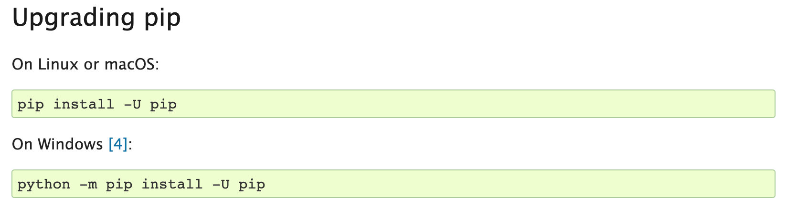

## Check `pip` After Activation

After `.venv` is created and activated, check the environment's copy of `pip` with:

```sh
python -m pip --version
python -m pip install --upgrade pip
```

If Python reports that `pip` is unavailable, follow the official [`pip` installation instructions](https://pip.pypa.io/en/stable/installation/){target="_blank"} or ask an instructor for help.


## `venv`

Now we'll use the built-in Python virtual environment, called `venv`, which you can read more about here [https://docs.python.org/3/library/venv.html](https://docs.python.org/3/library/venv.html){target="_blank"}. One thing to note is that there are LOTS of different ways to setup your virtual environment (which lots of people have *very* strong feelings about). I like this answer from Stack Overflow for giving an overview of the differing options [https://stackoverflow.com/a/65854168/7437781](https://stackoverflow.com/a/65854168/7437781){target="_blank"}.

## Creating Virtual Environments

Now that we have a sense of what a virtual environment is, let's create a project-local environment named `.venv`. We'll start in VS Code and then look at the equivalent terminal commands.

## Creating Virtual Environments in VS Code

::: {.r-fit-text}
::: {.callout-note}
This information has been adapted from the [VS Code documentation for Python environments](https://code.visualstudio.com/docs/python/environments){target="_blank"}.
:::

In VS Code, first open your `is310-coding-assignments` project folder and then open the Command Palette:

- **Mac**: `⇧⌘P`
- **Windows**: `Ctrl+Shift+P`

You can also access the Command Palette by clicking on the `View` menu and selecting `Command Palette`.

Once it is open, type `Python: Create Environment` and select it from the menu. Choose `Venv`, which uses Python's built-in virtual-environment tool.


:::

## Selecting Python Version

Once you select `Venv`, you'll be prompted to select the Python interpreter used to create the environment. Choose a currently supported Python 3 interpreter. If multiple versions are installed, select the recent version you have been using for this course.


## Locating Your Virtual Environment

Once VS Code creates the environment, you should see a `.venv` folder inside the project folder. If you try this without opening a folder first, VS Code will ask you to open a workspace.

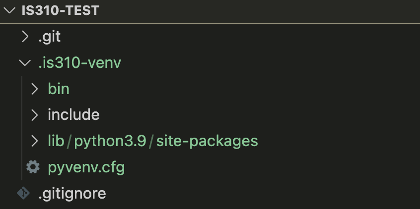

## Keep the `.venv` Name and Location

Do **not** rename or move `.venv` after creating it. Virtual environments contain paths to their original location. If you need a different name or location, delete the environment and create a new one there.

We will consistently use `.venv` for this repository. The leading period also helps identify it as project configuration rather than coursework, and later we will add `.venv/` to `.gitignore` so it is not committed to GitHub.

## Activating Your Virtual Environment

:::: {.columns}
::: {.column width="60%" .r-fit-text}
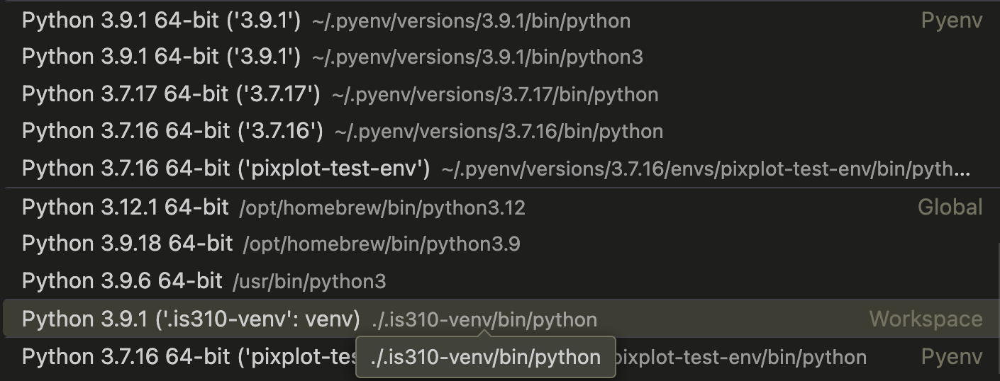

:::
::: {.column width="40%" .r-fit-text}

VS Code should select the newly created `.venv` automatically. The interpreter list organizes environments by type and location, helping us distinguish the project environment from globally installed Python interpreters.
:::
::::

## Activated Venv in VS Code


Once you select the virtual environment, its Python interpreter should appear in the VS Code status bar. This selection tells VS Code which Python to use when running code, debugging, and providing language features.

## Not Activated? Select Interpreter!

If `.venv` is not selected, open the Command Palette, choose `Python: Select Interpreter`, and select the interpreter inside `.venv`. You can also select the Python version shown in the status bar to switch interpreters.


## Final Check

After selecting `.venv`, close any terminal that was already open and create a **new** VS Code terminal. You should see `(.venv)` at the beginning of the prompt, indicating that the environment is active.


## Creating Virtual Environments in Terminal (Optional)

VS Code provides a convenient interface for creating virtual environments, and I recommend that method for this course. The following slides show the equivalent terminal workflow because you may see me use it in class and because it makes the underlying commands visible.

## Start in the Project Folder

To create the environment in the terminal, first navigate to your `is310-coding-assignments` project directory. We will create `.venv` directly inside that project, matching the VS Code convention.

```sh
cd path/to/is310-coding-assignments
```

## Creating Virtual Environments in Terminal

On macOS or Linux:

```sh
python3 -m venv .venv
```

On Windows PowerShell:

```powershell
python -m venv .venv
```

If Windows does not recognize `python`, try `py -m venv .venv`.


## Activating Virtual Environments

On macOS, Linux, or WSL:

```sh
source .venv/bin/activate
```

On Windows Command Prompt:

```bat
.venv\Scripts\activate.bat
```

On Windows PowerShell:

```powershell
.\.venv\Scripts\Activate.ps1
```

If you are getting errors in PowerShell, you may need to change your execution policy. You can do this by running the following command:

```powershell
Set-ExecutionPolicy -ExecutionPolicy RemoteSigned -Scope Process
```
## Deactivating Virtual Environments

To deactivate your virtual environment in the terminal:

```sh
deactivate
```

Your virtual environment will no longer be in the terminal prompt.

This removes `(.venv)` from the terminal prompt. In VS Code, closing the active terminal and opening a new one after selecting a different interpreter also starts a new shell context.

## Adding to `.gitignore`

Virtual environments are specific to your computer. Don't commit them to git.

Add this to your `.gitignore`:

```text
.venv/
```

Or if you accidentally committed it:

```sh
git rm -r --cached .venv
```

Then add `.gitignore`, commit the change, and run `git status` to confirm that `.venv` is no longer tracked.


## Installing Libraries with `pip` in `venv`

Now that we have our virtual environment created and activated in VS Code, we can start to try installing external Python libraries. 

Today, we will try installing the Python package `Rich` by running the following command:

```sh
python -m pip --version
python -m pip install rich
```

**Remember**: Always do this with your virtual environment activated!


## Testing the Installation

To verify the installation worked:

```sh
python -m pip show rich
```

Or check all installed libraries:

```sh
python -m pip list
```

Either command should show whether `Rich` is installed and which version is present.

## Recording Package Requirements

Do not commit or share `.venv`. Record the packages needed to recreate it:

```sh
python -m pip freeze > requirements.txt
```

Someone who clones the repository can create and activate their own environment, then install the same versions:

```sh
python -m pip install -r requirements.txt
```


## `site-packages`

You can also look in your virtual environment directory and see if there is a `site-packages` directory. This is where all the libraries you install with `pip` are stored. You can see that the `Rich` library is installed in the `site-packages` directory.

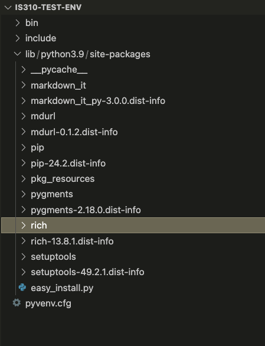

## The Rich Library

:::: {.columns}
::: {.column width="60%" .r-fit-text}
Rich is a Python library created by [Will McGugan](https://www.willmcgugan.com/){target="_blank"} to add formatted text, tables, progress indicators, and other visual elements to terminal applications. Its source code and development history are available in the [Rich GitHub repository](https://github.com/Textualize/rich){target="_blank"}.

:::
::: {.column width="40%" .r-fit-text}
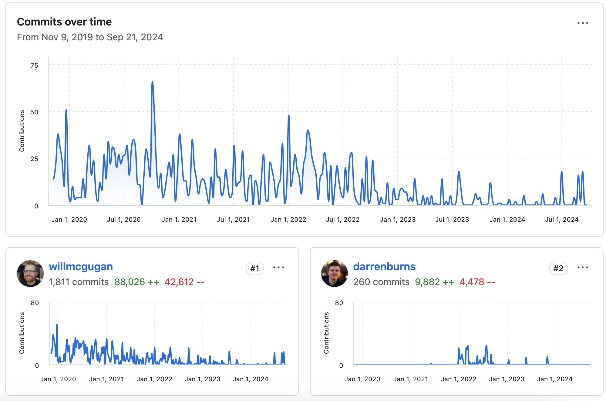
:::
::::


## Rich Features

:::: {.columns}
::: {.column width="60%" .r-fit-text}
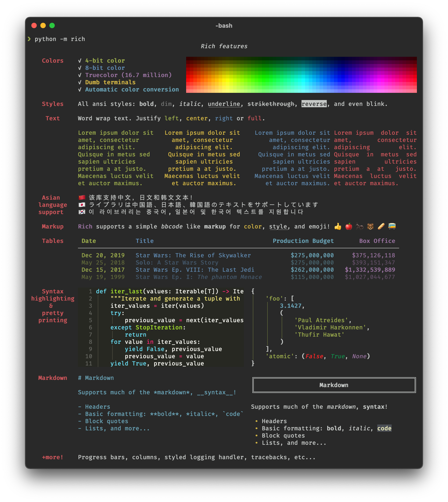
:::
::: {.column width="40%" .r-fit-text}
We can start to get a sense of what the library can do by looking at the features listed on the GitHub repository but we can also read the documentation for the library to get a better sense of what it can do [https://rich.readthedocs.io/en/stable/introduction.html](https://rich.readthedocs.io/en/stable/introduction.html){target="_blank"}.
:::
::::

## Rich Documentation

::: {.r-fit-text}
This documentation is **very** detailed, but we can start with the Quickstart guidelines [https://rich.readthedocs.io/en/stable/introduction.html#quick-start](https://rich.readthedocs.io/en/stable/introduction.html#quick-start){target="_blank"} to get a sense of how to use the library.

From the guidelines we can see how to import the library into our Python script. In your `is310-coding-assignments` directory, create a new folder called `python-libraries` and create a new file called `rich_example.py`. In this file, add the following code:

```python
from rich import print

print("Hello, [bold magenta]World[/bold magenta]!", ":vampire:")
```
:::
## Rich Outputs

::: {.r-fit-text}
Run it:

```sh
python rich_example.py
# Or, from the repository root:
python python-libraries/rich_example.py
```

You should see the following output in your terminal:

```shell
Hello, World! 🧛
```

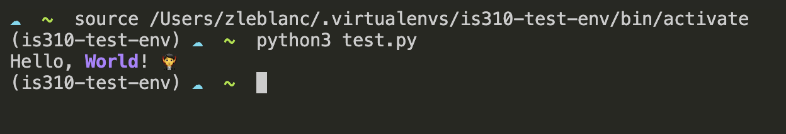

Notice that the word `world` is in bold and magenta and that there is a vampire emoji at the end of the sentence. This is the power of the `Rich` library. 
:::

## Rich Tables

:::: {.columns}
::: {.column width="50%" .r-fit-text}
Rich has powerful classes like `Console` and `Table` for formatting:

```python
from rich.console import Console
from rich.table import Table

console = Console()

table = Table(title="Star Wars Movies")
table.add_column("Released", style="cyan", no_wrap=True)
table.add_column("Title", style="magenta")
table.add_column("Box Office", justify="right")
table.add_row("Dec 20, 2019", "Star Wars: The Rise of Skywalker", "$952,110,690")
table.add_row("May 25, 2018", "Solo: A Star Wars Story", "$393,151,347")
table.add_row("Dec 15, 2017", "Star Wars Ep. VIII: The Last Jedi", "$1,332,539,889")
table.add_row("Dec 16, 2016", "Rogue One: A Star Wars Story", "$1,332,439,889")

console.print(table)
```
:::
::: {.column width="50%" .r-fit-text}
And you should see the following output in your terminal:

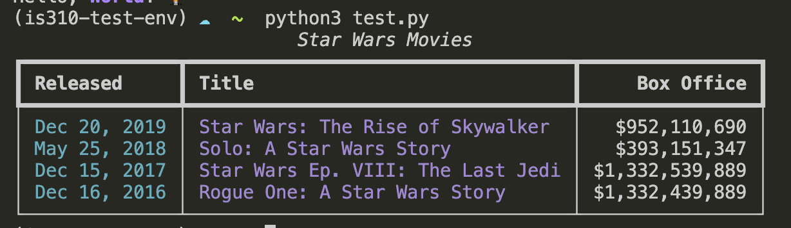
:::
::::


## Rich Classes

:::: {.columns}
::: {.column width="50%" .r-fit-text}
[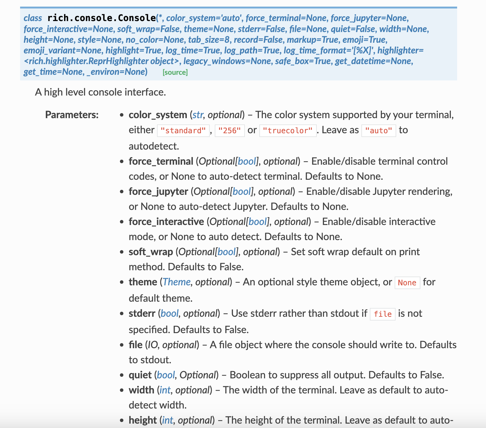](https://rich.readthedocs.io/en/stable/reference/console.html#rich.console.Console){target="_blank"}

:::
::: {.column width="50%" .r-fit-text}
You'll notice this documentation is somewhat difficult to read, but it does show us the different methods and attributes that are available to us in the `Console` class. We can also click the small green `source` button to see the source code for the class [https://rich.readthedocs.io/en/stable/_modules/rich/console.html#Console](https://rich.readthedocs.io/en/stable/_modules/rich/console.html#Console){target="_blank"}. 
:::
::::

## Rich with Data Structures

:::: {.columns}
::: {.column width="50%" .r-fit-text}
You can use Rich to format data from lists and dictionaries:

```python
from rich.console import Console
from rich.table import Table

# Create a Console instance to print formatted text
console = Console()

# Initial movie data stored in a list of dictionaries
movies = [
    {
        "Released": "Dec 20, 2019",
        "Title": "Star Wars: The Rise of Skywalker",
        "Box Office": "$952,110,690"
    },
    {
        "Released": "May 25, 2018",
        "Title": "Solo: A Star Wars Story",
        "Box Office": "$393,151,347"
    },
    {
        "Released": "Dec 15, 2017",
        "Title": "Star Wars Ep. VIII: The Last Jedi",
        "Box Office": "$1,332,539,889"
    },
    {
        "Released": "Dec 16, 2016",
        "Title": "Rogue One: A Star Wars Story",
        "Box Office": "$1,332,439,889"
    }
]

# Loop through the list of movies
for movie in movies:
    console.print("\n[bold cyan]Reviewing movie information:[/bold cyan]")
    for field, value in movie.items():
        console.print(f"[magenta]{field}[/magenta]: {value}")
```
:::
::: {.column width="50%" .r-fit-text}
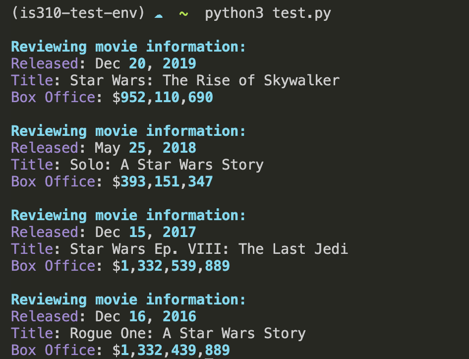
:::
::::


# Homework: Command Line Data Curation

## Two Development Pathways

:::: {.columns}
::: {.column width="50%"}
**Without AI**

Build and document a working Python CLI that collects and saves structured cultural data.
:::
::: {.column width="50%"}
**With AI Assistance**

Build the CLI **and** an equivalent HTML interface, then compare the two approaches.
:::
::::


## Compare the Interfaces

- What does each interface make easier or harder?
- Did the fields, instructions, or validation change?
- What did AI contribute?
- What did you revise, reject, or troubleshoot?
- Which interface better fits the cultural material and intended user?


## What to Submit

- `cli_data_entry.py`
- `README.md` with installation and running instructions
- `requirements.txt`
- A sample structured data file produced by the script
- `ai-chat-log.md`, or a note that no AI chatbot was used
- For the AI-assisted pathway: HTML, CSS, and JavaScript files plus the interface comparison


## Full Assignment

[Command Line Data Curation](../materials/creating-curating-cad/04-virtual-environments.qmd#homework-command-line-data-curation){target="_blank"}
