So far in class we have briefly mentioned APIs (for example, the Spotify API), but haven't yet discussed what they are or how to use them. This week we will start to work through the basics of using APIs to get data from the web.

## What is an API?

::: {.r-fit-text}
API stands for **Application Programming Interface**, but what does that mean exactly?

While according to [Wikipedia](https://en.wikipedia.org/wiki/API){target="_blank"},

> An application programming interface is a connection between computers or between computer programs. It is a type of software interface, offering a service to other pieces of software. A document or standard that describes how to build or use such a connection or interface is called an API specification.

But while that is technically correct, it probably leaves you with more questions than answers.
:::

## What is an API?


## Origins of APIs

[](https://web.archive.org/web/20190722130022/https://history.apievangelist.com/){target="_blank"}


## Web 2.0


## History of APIs


## Post-API Age & The End of the Social Web


## Many Users of APIs


## Working with APIs

[](https://the-one-api.dev/){target="_blank"}


## The One API

If we go to the about page [https://the-one-api.dev/about](https://the-one-api.dev/about){target="_blank"}, we can learn that the project was created in 2019 by Ulrike Exner and Mateusz Kikmunter, who are both developers.

[](https://github.com/gitfrosh/lotr-api/graphs/contributors){target="_blank"}


## Making an API Request

In your `is310-coding-assingments`, create a new folder called `api-getting-data` and then create a new script called `first_api_script.py`. In this script, import the `requests` library and then create a variable called `url` that is the base url for the LOTR API.

```python
import requests

url = 'https://the-one-api.dev/v2/book'
```

*How could we use requests with this url? How could we check that the request work?*


## Making an API Request

```python
response = requests.get(url)
print(response.status_code)
```

Hopefully we are all seeing `200` responses, but if you are seeing a `404` or `403` response, you might need to authenticate with the API. We will discuss this more in the next section, but for now, let's try to print out the response.

## Getting JSON

::: {.r-fit-text}
In our web scraping lesson, we used the `.text` method to print out the response, but for APIs, we often use the `.json()` method. Let's try that out.

```python
print(response.json())
```

You should see something like the following:

```json
{
	'docs': 
		[
			{
				'_id': '5cf5805fb53e011a64671582',
				'name': 'The Fellowship Of The Ring'
			},
			{
				'_id': '5cf58077b53e011a64671583', 
				'name': 'The Two Towers'
			},
			{
				'_id': '5cf58080b53e011a64671584', 
				'name': 'The Return Of The King'
			}
		],
 	'total': 3,
 	'limit': 1000,
 	'offset': 0,
 	'page': 1,
 	'pages': 1
}
```
:::

## JavaScript Oject Notation


## Breaking Down JSON

::: {.r-fit-text}
Based on this data, we can see that *The One API* has returned data about the three books in the *Lord of the Rings* series. Each book has an `_id` and a `name`. The books themselves are returned in a list for the key `docs`, and then there are some other keys that provide information about the data that was returned, including `total`, `limit`, `offset`, `page`, and `pages`. `Total` tells us how many items were returned, `limit` tells us how many items *could be* returned per page, `offset` tells us where in the data we are (similar to indexing), `page` tells us what page we are on, and `pages` tells us how many pages of data there are.

```json
{
	'docs': 
		[
			{
				'_id': '5cf5805fb53e011a64671582',
				'name': 'The Fellowship Of The Ring'
			},
			{
				'_id': '5cf58077b53e011a64671583', 
				'name': 'The Two Towers'
			},
			{
				'_id': '5cf58080b53e011a64671584', 
				'name': 'The Return Of The King'
			}
		],
 	'total': 3,
 	'limit': 1000,
 	'offset': 0,
 	'page': 1,
 	'pages': 1
}
```
:::


## Authentication & Endpoints
::: {.r-fit-text}
[](https://the-one-api.dev/documentation#4){target="_blank"}
:::


## Using Endpoints

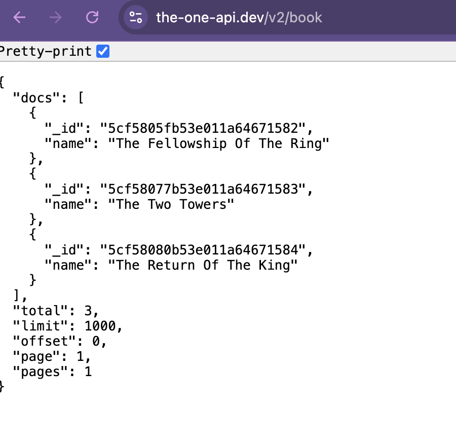


## Using Endpoints?

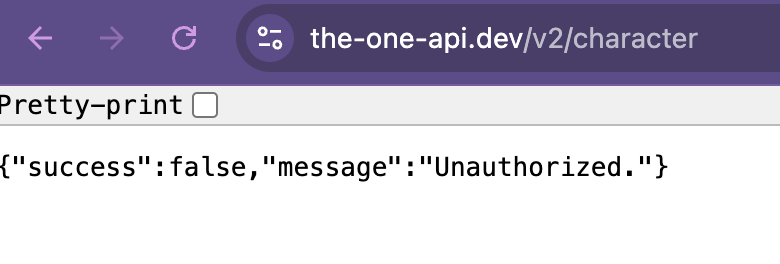


## Using Endpoints?

```python
url = 'https://the-one-api.dev/v2/character'
response = requests.get(url)
print(response.status_code)
```

This should return a `401` status code, which means that we are not **authorized** to access this data. This is because the LOTR API requires us to authenticate before we can access data about characters or quotes. This is a common feature of APIs, as it allows the API to track who is accessing their data and to limit access to certain users.

## Authentication

::: {.r-fit-text}
[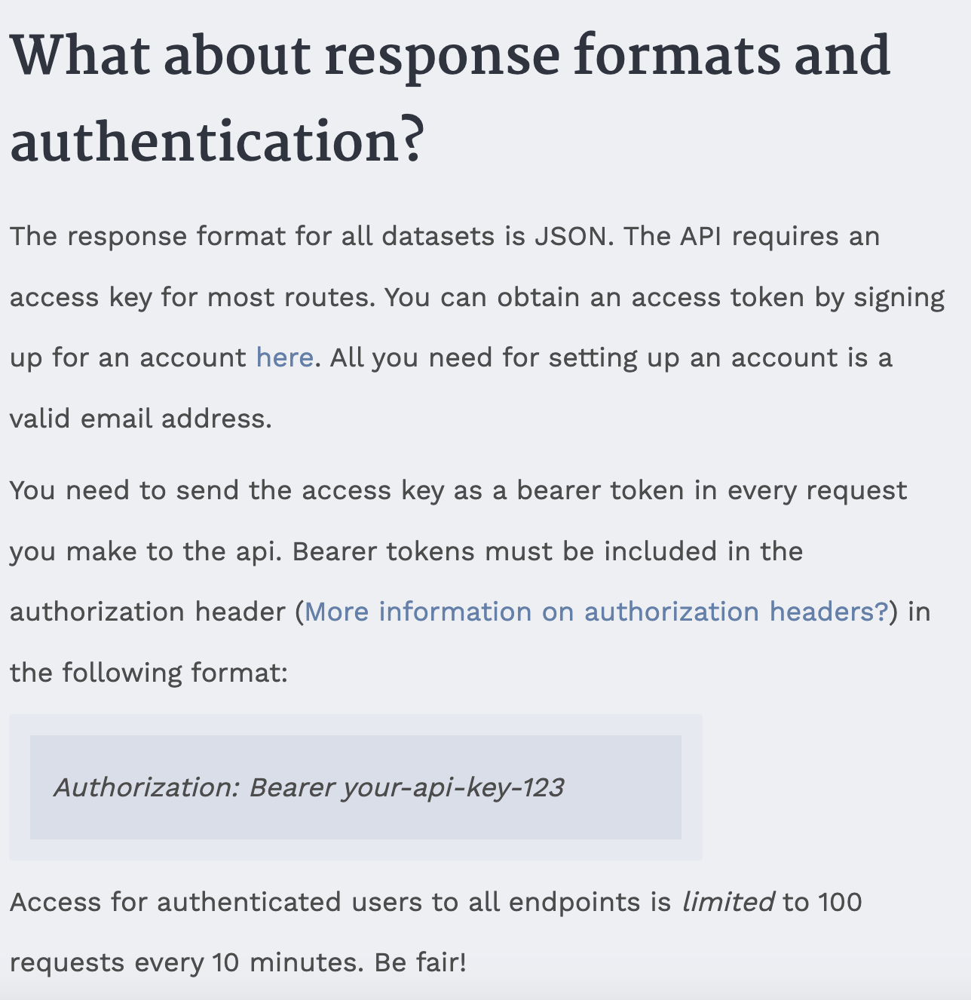](https://the-one-api.dev/documentation#3){target="_blank"}
:::


## Authentication

::: {.r-fit-text}
[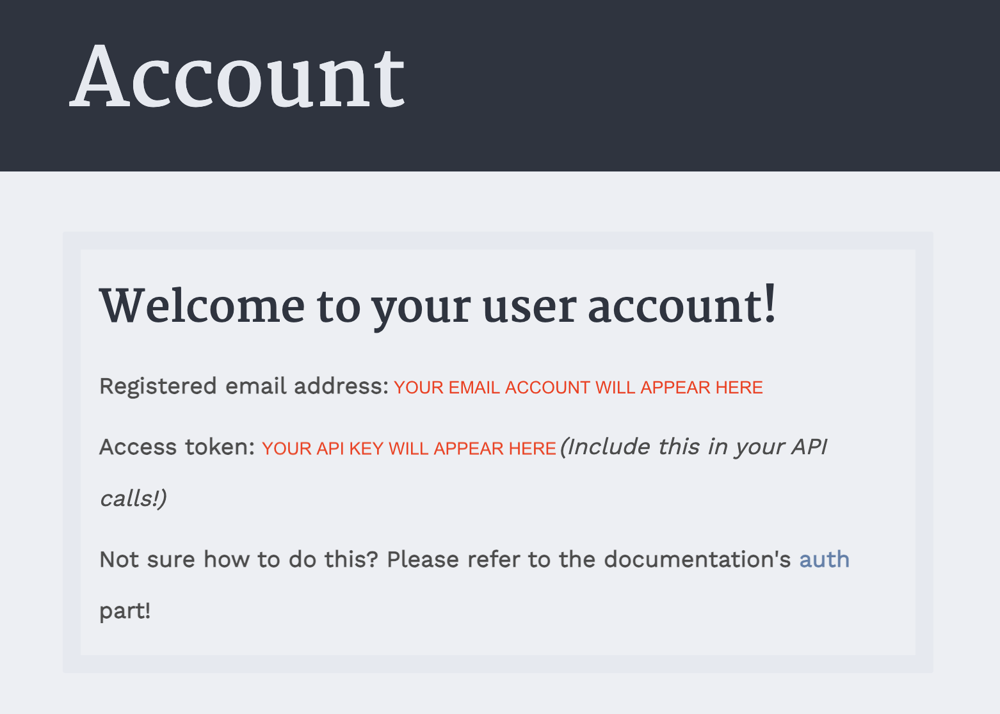](https://the-one-api.dev/sign-up){target="_blank"}
:::


## API Keys

```python
api_key = "API KEY HERE"
url = 'https://the-one-api.dev/v2/character'
authorization_headers = {
	'Authorization: Bearer ' + api_key
}
```


## API Keys

Now let's update our `requests.get` method to include these headers.

```python
response = requests.get(url, headers=authorization_headers)
print(response.status_code)
```


## Storing API Keys: Environment Variables

To create an environment variable, you open your terminal and type the following, replacing `api_key` with your API key.

For Macs/WSL:

```sh
export THE_ONE_API_KEY="YOUR_API_KEY_HERE"
```

For Windows/PowerShell:

```sh
setx THE_ONE_API_KEY "YOUR_API_KEY_HERE"
```


## Storing API Keys: Environment Variables

Now you can access these environment variables in your Python script by using the `os` library.

```python
import os
the_one_api_key = os.environ['THE_ONE_API_KEY']
print(the_one_api_key)
```


## `apikey` Library

This is a bit more work though, and one easier option is to use a Python library for storing API keys, called `apikey` [https://github.com/ulf1/apikey](https://github.com/ulf1/apikey).

In your terminal, type `pip install "apikey>=0.2.4"` to install the library. Then import it into your script and write:

```python
import apikey

apikey.save("THE_ONE_API_KEY", "YOUR_API_KEY_HERE")

the_one_api_key = apikey.load("THE_ONE_API_KEY")
```


## Making API Requests

Now that we have our api key stored securely, let's try to get data about characters from *The One API*. We can do this by updating our `url` variable to include the `/character` endpoint.

```python
the_one_api_key = apikey.load("THE_ONE_API_KEY")
authorization_headers = {
	'Authorization': 'Bearer ' + the_one_api_key
}
url = 'https://the-one-api.dev/v2/character'
response = requests.get(url, headers=authorization_headers)
if response.status_code == 200:
	print(response.json())
else:
	print(response.status_code)
```

## More Data

```json
{'docs': [{'_id': '5cd99d4bde30eff6ebccfbbe',
   'name': 'Adanel',
   'wikiUrl': 'http://lotr.wikia.com//wiki/Adanel',
   'race': 'Human',
   'birth': None,
   'gender': 'Female',
   'death': None,
   'hair': None,
   'height': None,
   'realm': None,
   'spouse': 'Belemir'},
  {'_id': '5cd99d4bde30eff6ebccfbbf',
   'name': 'Adrahil I',
   'wikiUrl': 'http://lotr.wikia.com//wiki/Adrahil_I',
   'race': 'Human',
   'birth': 'Before ,TA 1944',
   'gender': 'Male',
   'death': 'Late ,Third Age',
   'hair': None,
   'height': None,
   'realm': None,
   'spouse': None},
  {'_id': '5cd99d4bde30eff6ebccfbc0',
   'name': 'Adrahil II',
   'wikiUrl': 'http://lotr.wikia.com//wiki/Adrahil_II',
...
 'total': 933,
 'limit': 1000,
 'offset': 0,
 'page': 1,
 'pages': 1}
```


## Processing JSON With Python

Since the api response is in json format, we can work with it similar to working with a dictionary. For example, we can see all the keys in the response by using the `.keys()` method.

```python
response.json().keys()
```

This should show the following:

```python
dict_keys(['docs', 'total', 'limit', 'offset', 'page', 'pages'])
```

*How would we see total number of characters?*

## Processing JSON With Python

We can access the `total` key to see how many characters are in the database.

```python
response.json()['total']
```

This should return `933`, which means that there are 933 characters in the database. We can also loop through the `docs` key to see each character.

```python
for character in response.json()['docs']:
	print(character)
```


## Processing JSON With Python

So if we only wanted to see the data about a certain character, like Galadriel, we could loop through the characters and print out the data for Galadriel.

```python
for character in response.json()['docs']:
	if character['name'] == 'Galadriel':
		print(character)
```

Which would return the following data:

```json
{'_id': '5cd99d4bde30eff6ebccfd06', 'name': 'Galadriel', 'wikiUrl': 'http://lotr.wikia.com//wiki/Galadriel', 'race': 'Elf', 'birth': 'YT 1362', 'gender': 'Female', 'death': 'Still alive: Departed over the sea on ,September 29 ,3021', 'hair': 'Golden', 'height': 'Tall', 'realm': 'Eregion,Lothlórien,Caras Galadhon', 'spouse': 'Celeborn'}
```

## Query Parameters

While we can do this using Python, we could also change our URL to only get data about Galadriel. We can do this by adding a query parameter to our URL.

```python
url = 'https://the-one-api.dev/v2/character?name=Galadriel'
response = requests.get(url, headers=authorization_headers)
print(response.json())
```


## Query Parameters

Returning to the API's documentation [https://the-one-api.dev/documentation#5](https://the-one-api.dev/documentation#5), we can see that we can use query parameters for sorting, filtering, and pagination data from *The One API*.

```python
url = 'https://the-one-api.dev/v2/character?name!=Galadriel&race=Elf'
response = requests.get(url, headers=authorization_headers)
print(f"Total number of elves besides Galadriel: {response.json()['total']}")
```


## Query Parameters

Finally, we can also use the `id` in each data returned from the API to get more specific data. For example, if we wanted to get data about all the movie quotes of Galadriel, we could first get the id of Galadriel and then use that id to get data about her quotes.

```python
url = 'https://the-one-api.dev/v2/character?name=Galadriel'
response = requests.get(url, headers=authorization_headers)
galadriel_id = response.json()['docs'][0]['_id']
quote_url = f'https://the-one-api.dev/v2/character/{galadriel_id}/quote'
response = requests.get(quote_url, headers=authorization_headers)
print(response.json())
```

## `time` & Rate Limiting

:::: {.columns}
::: {.column width="60%" .r-fit-text}
```python
import time

url = 'https://the-one-api.dev/v2/character?name=Galadriel'
response = requests.get(url, headers=authorization_headers)
galadriel_id = response.json()['docs'][0]['_id']
quote_url = f'https://the-one-api.dev/v2/character/{galadriel_id}/quote'
response = requests.get(quote_url, headers=authorization_headers)
print(response.json())
time.sleep(10)
```
:::
::: {.column width="40%" .r-fit-text}

:::
::::


## Python API Wrappers

So far we have been using the `requests` library to make our API calls, which is usually how you should work with APIs. However, occasionally, developers will create Python libraries to work with APIs, which can make working with APIs easier. These libraries are called API wrappers, and they are essentially Python libraries that provide a set of functions to work with an API.


## NRH-LOTR

Indeed, a developer named Nathanial Hapeman has created one for *The One API*, which you can see here [https://pypi.org/project/nrh-lotr/0.0.3/](https://pypi.org/project/nrh-lotr/0.0.3/){target="_blank"}. If you want to try out this library, all you have to do is type `pip install nrh-lotr==0.0.3` in your terminal. 

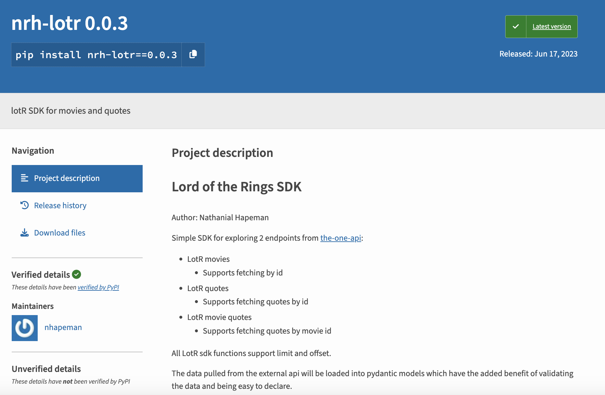


## NRH-LOTR Structure

We can also see how the library is organized if we inspect it after installing it:

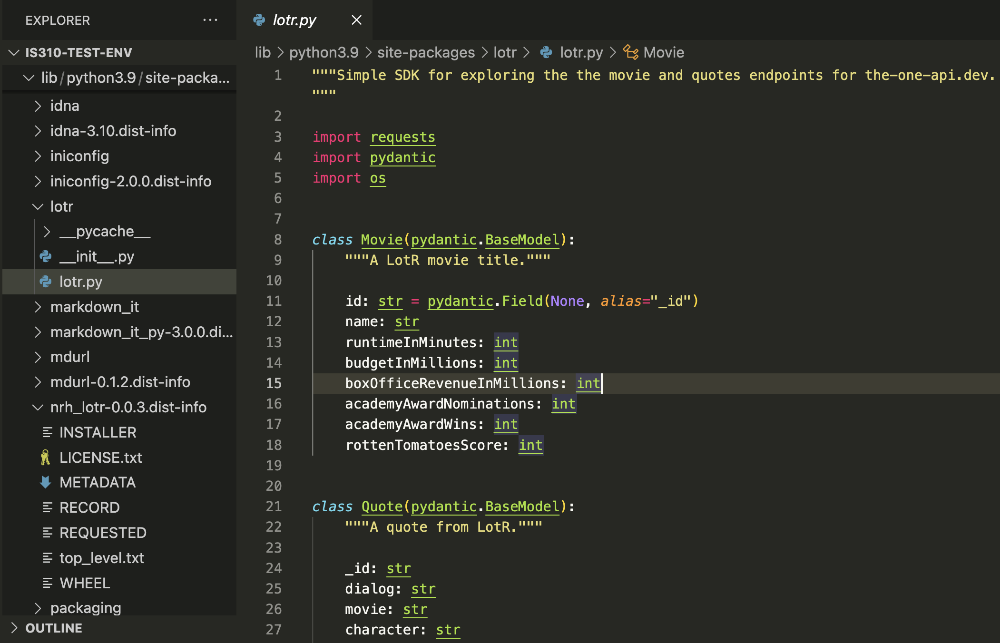

## NRH-LOTR Structure

And you can see how's it making requests to the API by looking at the source code.

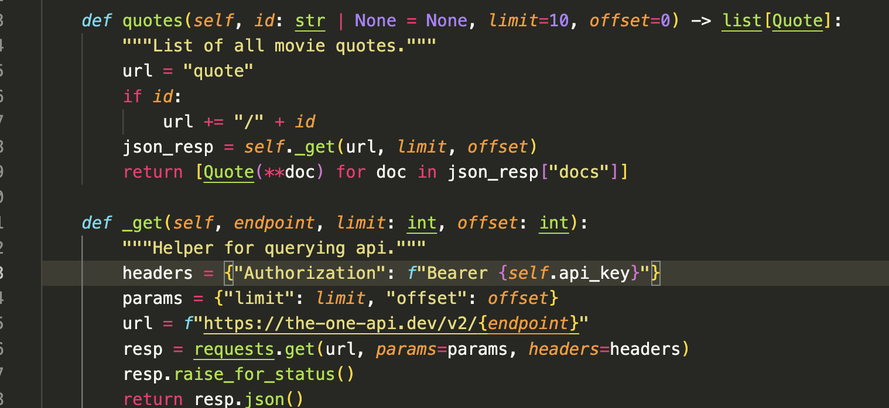

## Fixing the Source Code

In our class on Thursday, we ran into an issue with installing and using the `nrh-lotr` library, with this issue appearing in the terminal:

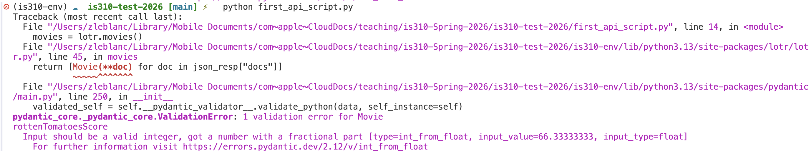

## What Went Wrong?

**Pydantic** is a data validation library that checks whether the data you receive from an API matches the types you declared in your model. When the API returned a value for `rottenTomatoesScore` of `66.33333333` (a decimal), but the model was expecting an `int` (whole number), Pydantic rejected it. You can't fit a float into an integer without losing information, so Pydantic threw a validation error.

## The Fix

The library developer assumed Rotten Tomatoes scores would be integers, but the actual API returns percentage scores with decimal values. The solution was simple: change the type annotation from `int` to `float` to allow decimal numbers:

```python
class Movie(pydantic.BaseModel):
    """A LotR movie title."""

    id: str = pydantic.Field(None, alias="_id")
    name: str
    runtimeInMinutes: int
    budgetInMillions: int
    boxOfficeRevenueInMillions: float # Changed from int to float
    academyAwardNominations: int
    academyAwardWins: int
    rottenTomatoesScore: float  # Changed from int to float
```


## Using NRH-LOTR

```python
# First grab an api key from: https://the-one-api.dev/documentation#3
# Then put it in an env var like: `export API_KEY=SOME_API_KEY`
# Or insert it directly into the LOTR class as depicted below
from lotr import LOTR, Movie, Quote

# Movie basics.
lotr = LOTR("YOUR_API_KEY")
# lotr = LOTR() # if using env var
movies = lotr.movies(limit=5)
```

## Using NRH-LOTR

::: {.r-fit-text}
However, if you scroll down further in the documentation, you'll notice that this library only makes requests for the following endpoints:

```bash
/movie
/movie/{id}
/movie/{id}/{quote}
/quote
/quote/{id}
```

Such limited functionality means that we couldn't use this library to get data about characters or books, which is a major limitation. These types of limitations are common when working with API wrappers, as they are often created by developers who are not affiliated with the API itself and who may not have the time or resources to create a full-featured library.
:::

## Europeana Digital Library

[](https://www.europeana.eu/en){target="_blank"}


## Europeana API Example

[](https://culturepics.org/colour/#/){target="_blank"}


## Europeana Items


*Sofia Kretzulescu - 1852 - National Heritage Institute, Bucharest, Romania - CC BY-SA.
[https://www.europeana.eu/item/1190/INP_postcards_6415?utm_source=api&utm_medium=api&utm_campaign=bkV8GDrrp](https://www.europeana.eu/item/1190/INP_postcards_6415?utm_source=api&utm_medium=api&utm_campaign=bkV8GDrrp){target="_blank"}*


## Europeana Metadata

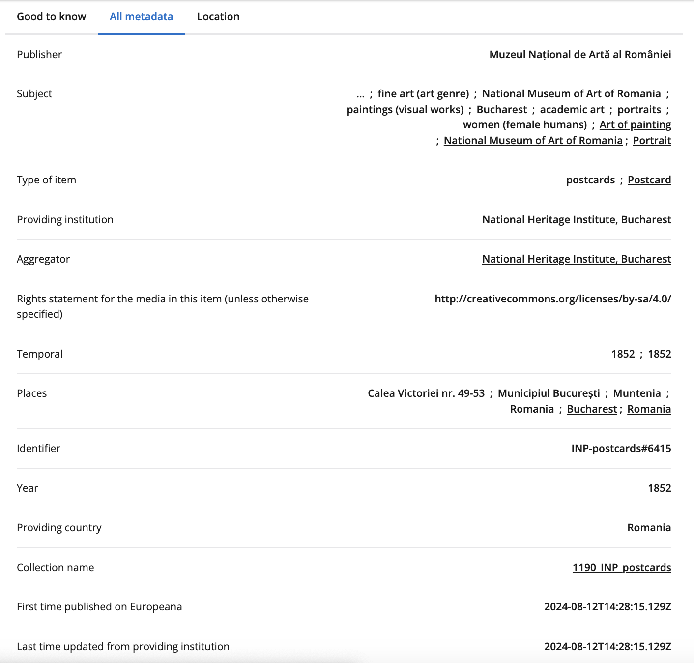


## Europeana APIs


## Europeana API Key

To do this, we first need to get an API key from Europeana, which you can do by signing up for an account here [https://pro.europeana.eu/pages/get-api](https://pro.europeana.eu/pages/get-api){target="_blank"}. 

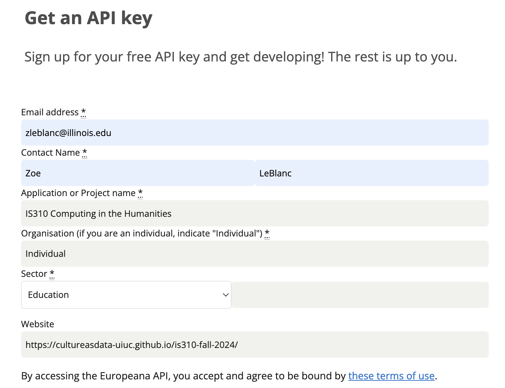


## `pyeuropeana`

You can see the documentation for this library here [https://rd-europeana-python-api.readthedocs.io/en/stable/index.html](https://rd-europeana-python-api.readthedocs.io/en/stable/index.html){target="_blank"} and the GitHub repository here [https://github.com/europeana/rd-europeana-python-api/tree/master](https://github.com/europeana/rd-europeana-python-api/tree/master){target="_blank"}. 

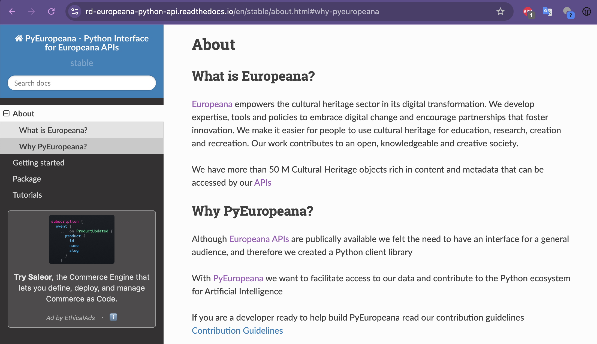

## Quickstart

If we go to the `Quickstart` page in the documentation [https://rd-europeana-python-api.readthedocs.io/en/stable/usage.html#](https://rd-europeana-python-api.readthedocs.io/en/stable/usage.html#){target="_blank"}, we can see that we can install the library with the following command:

```sh
pip install pyeuropeana
```

## Authentication with `pyeuropeana`

Then if we scroll down to `Authentication` we can start to see how we can use the library to authenticate with the Europeana API.

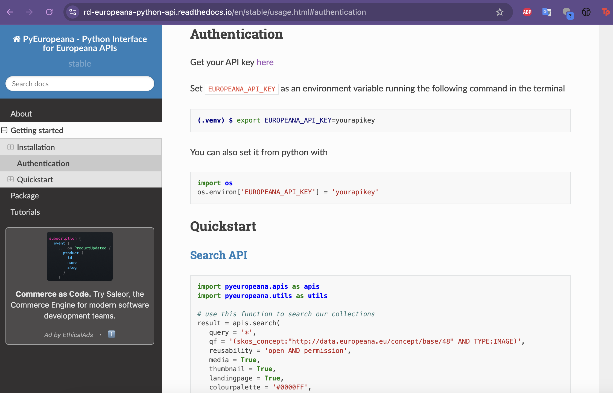


## Authentication with `pyeuropeana`

```python
import apikey
import os

apikey.save("EUROPEANA_API_KEY", "YOUR_API_KEY_HERE")
europeana_api_key = apikey.load("EUROPEANA_API_KEY")
os.environ['EUROPEANA_API_KEY'] = europeana_api_key
```

Getting errors? [Check out these steps on the lesson page](../materials/creating-curating-cad/06-getting-data-apis.qmd#errors-pyeuropeana){target="_blank"}

## `pyeuropeana` Functionality

This is the example from the documentation:

```python
import pyeuropeana.apis as apis
import pyeuropeana.utils as utils

# use this function to search our collections
result = apis.search(
   query = '*',
   qf = '(skos_concept:"http://data.europeana.eu/concept/base/48" AND TYPE:IMAGE)',
   reusability = 'open AND permission',
   media = True,
   thumbnail = True,
   landingpage = True,
   colourpalette = '#0000FF',
   theme = 'photography',
   sort = 'europeana_id',
   profile = 'rich',
   rows = 1000,
   ) # this gives you full response metadata along with cultural heritage object metadata

   # use this utility function to transform a subset of the cultural heritage object metadata
   # into a readable Pandas DataFrame
dataframe = utils.search2df(result)
```


## `pyeuropeana` Functionality

:::: {.columns .r-fit-text}
::: {.column }
Let's try a simpler example first though:

```python
import pyeuropeana.apis as apis

response = apis.search(query="Galadriel")
print(response)
```
:::
::: {.column}
Which should show the following output:

```python
{'apikey': 'tondflanrino',
 'success': True,
 'requestNumber': 999,
 'itemsCount': 0,
 'totalResults': 3,
 'items': [{'completeness': 0,
   'country': ['Italy'],
   'dataProvider': ['Internet Culturale'],
   'dcCreator': ['http://data.europeana.eu/agent/159584',
    'Karunesh',
    'Karunesh'],
   'dcCreatorLangAware': {'def': ['http://data.europeana.eu/agent/159584',
     'Karunesh'],
    'en': ['Karunesh']},
   'dcTitleLangAware': {'def': ['Galadriel'],
    'en': ['Galadriel'],
    'it': ['Galadriel']},
   'edmConcept': ['http://data.europeana.eu/concept/soundgenres/Music'],
   'edmConceptLabel': [{'def': 'Musik'},
    {'def': 'Music'},
    {'def': 'Musica'},
    {'def': 'Muzyka'},
    {'def': 'Musique'},
    {'def': 'Música'}],
   'edmConceptPrefLabelLangAware': {'de': ['Musik'],
...
  'profile': None,
  'rows': 12,
  'cursor': '*',
  'callback': None,
  'facet': None}}
```
:::
::::


## `pyeuropeana` Search API

::: {.r-fit-text}
We can also see in the `Search API` documentation what keys we should expect for our initial search request [https://europeana.atlassian.net/wiki/spaces/EF/pages/2385739812/Search+API+Documentation#Response](https://europeana.atlassian.net/wiki/spaces/EF/pages/2385739812/Search+API+Documentation#Response){target="_blank"}, as well as what data should return for each item [https://europeana.atlassian.net/wiki/spaces/EF/pages/2385739812/Search+API+Documentation#Metadata-Sets](https://europeana.atlassian.net/wiki/spaces/EF/pages/2385739812/Search+API+Documentation#Metadata-Sets){target="_blank"}. For example, if we wanted to see the item in the browser we would just need to use the `guid` key.

```python
response['items'][0]['guid']
```
:::

## `pyeuropeana` Entity API

::: {.r-fit-text}
We could also try out the `Entity API`, which allows us to get more information about a specific entity in the collection. According to the api's documentation [https://europeana.atlassian.net/wiki/spaces/EF/pages/2324561923/Entity+API+Documentation](https://europeana.atlassian.net/wiki/spaces/EF/pages/2324561923/Entity+API+Documentation), the Europeana collection has these types of entities:

- a person (or “agent”), for instance Lili Boulanger or Claude Debussy;
- a topic (or “concept”) like Art Nouveau, migration or Musique Concrète
- a place, for instance Perpignan, Bratislava or Arnhem
- a time period, for instance the 21st century

In the `pyeuropeana` documentation, there's a section of tutorials, including one for using the Entity API [https://rd-europeana-python-api.readthedocs.io/en/stable/tutorials_source/entity_api_tutorial.html](https://rd-europeana-python-api.readthedocs.io/en/stable/tutorials_source/entity_api_tutorial.html){target="_blank"}.
:::

## `pyeuropeana` Entity API

According to this tutorial, we can use the `entity.suggest` method to get suggestions for a specific entity. For example, if we wanted to get suggestions for the entity `Galadriel`, we could use the following code:

```python
response = apis.entity.suggest(
	text = 'Galadriel',
   TYPE = 'agent',
)
print(response)
```

*Did it work?*

## `pyeuropeana` Entity API

:::: {.columns .r-fit-text}
::: {.column}
Likely see there's no results for this query. We could try a different entity, like `Tolkien`, and see if we get any results.

```python
response apis.entity.suggest(
   text = 'Tolkien',
   TYPE = 'agent',
)
print(response)
```
:::
::: {.column}
This should give the following output:

```python
',
 'ugc': [False],
 'year': ['1989']}
{'@context': ['https://www.w3.org/ns/ldp.jsonld',
  'http://www.europeana.eu/schemas/context/entity.jsonld'],
 'type': 'ResultPage',
 'total': 3,
 'items': [{'id': 'http://data.europeana.eu/agent/60065',
   'type': 'Agent',
   'isShownBy': {'id': 'http://pbc.gda.pl/Content/20559/03.mp3',
    'type': 'WebResource',
    'source': 'http://data.europeana.eu/item/0940417/_nnbqsf5',
    'thumbnail': 'https://api.europeana.eu/api/v2/thumbnail-by-url.json?uri=http%3A%2F%2Fpbc.gda.pl%2FContent%2F20559%2F03.mp3&type=SOUND'},
   'prefLabel': {'en': 'J. R. R. Tolkien'},
   'altLabel': {'en': ['J-R-R Tolkien',
     'Tolkien',
     'John Ronald Reuel Tolkien',
     'John Tolkien',
     'J.R.R Tolkien',
     'J.R.R. Tolkien',
     'John R. R. Tolkien']},
   'dateOfBirth': '1892-01-03',
   'dateOfDeath': '1973-09-02'},
  {'id': 'http://data.europeana.eu/agent/60339',
   'type': 'Agent',
   'prefLabel': {'en': 'Christopher Tolkien'},
   'altLabel': {'en': ['Christopher John Reuel Tolkien',
     'Christopher Reuel Tolkien',
...
   'dateOfDeath': '2020-01-16'},
  {'id': 'http://data.europeana.eu/agent/79852',
   'type': 'Agent',
   'prefLabel': {'en': 'Tim Tolkien'},
   'dateOfBirth': '1962-09-01'}]}
```
:::
::::

## `pyeuropeana` Entity API

We could also look for concepts or places, like `Literature` or `London`, to see what results we get. However, to do that we need to change the `TYPE` parameter to `concept` or `place`.

```python
response_concept = apis.entity.suggest(
	text = 'Literature',
   TYPE = 'concept',
)

response_place = apis.entity.suggest(
	text = 'London',
   TYPE = 'place',
)
```


## GETting Culture Across APIs Homework

Time for the [next homework assignment](../materials/creating-curating-cad/06-getting-data-apis.qmd#getting-culture-across-apis-homework) where you put this all together!