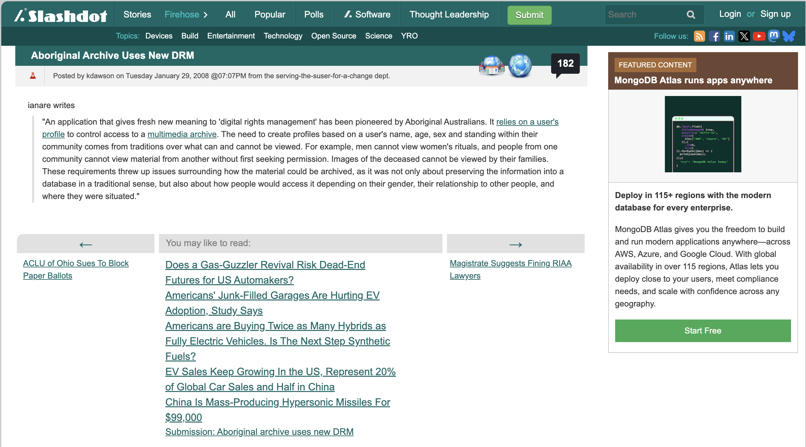
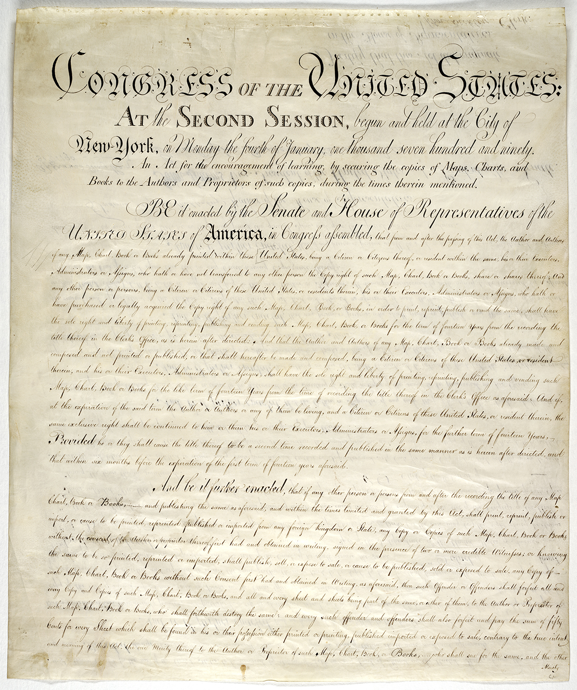
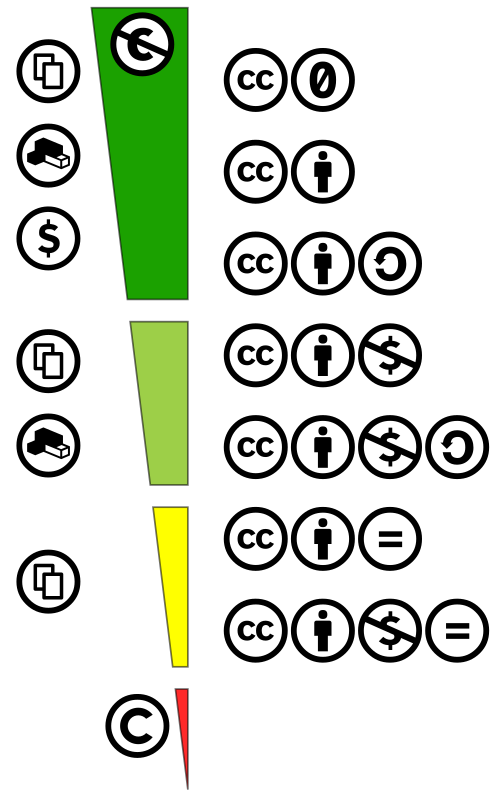
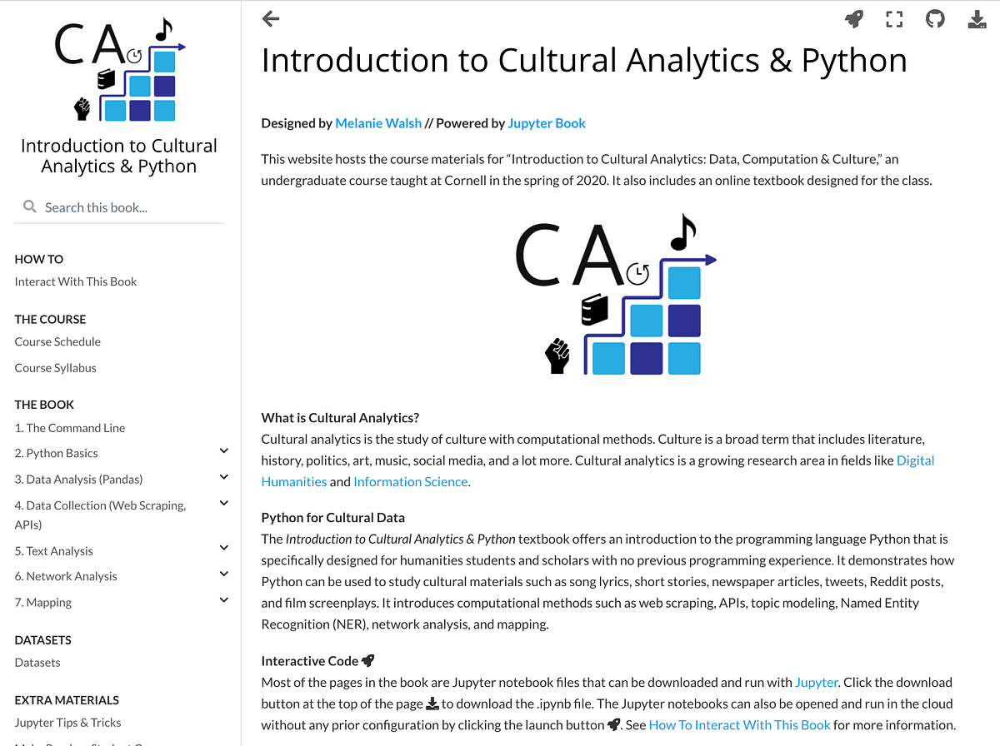
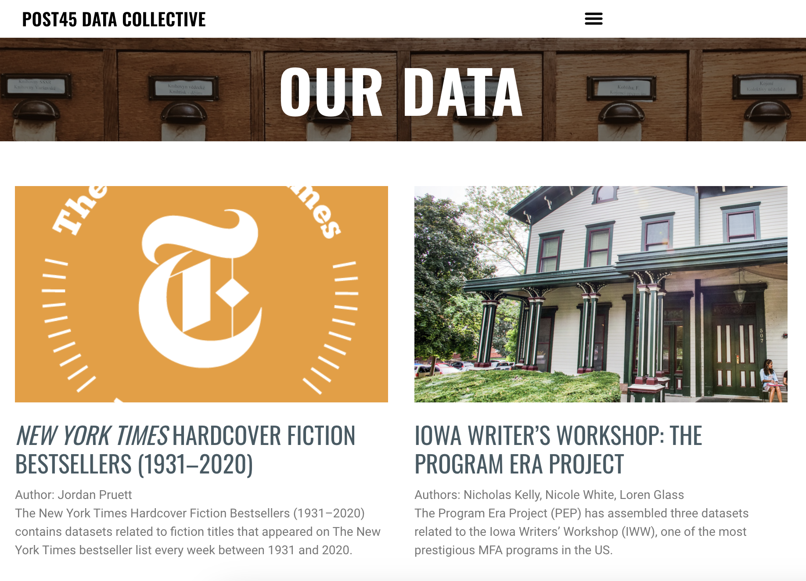
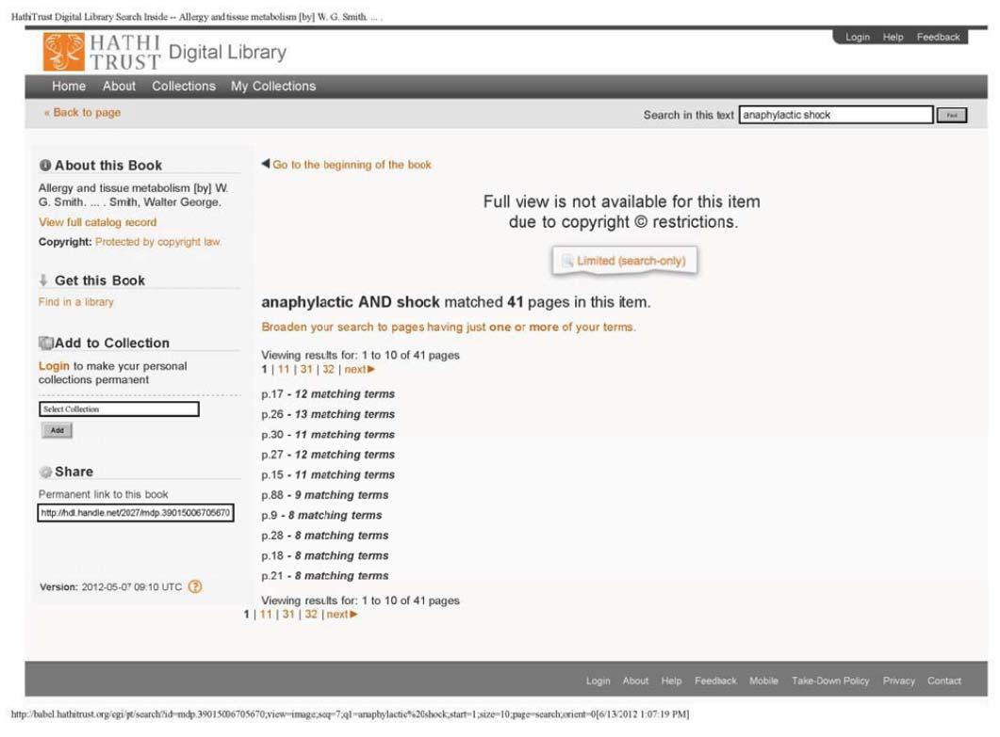
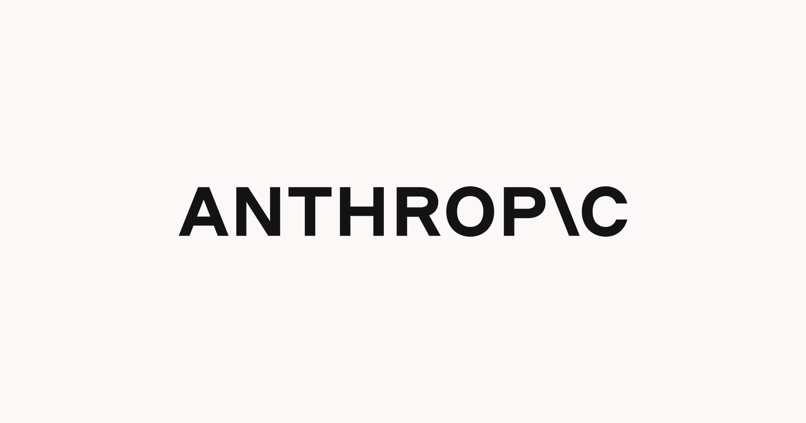

# Today's Agenda

- Discuss assigned readings
- Complete virtual environments lesson
- Breakout groups to discuss topic feedback

. . .

*Any questions?*

## Who Is Kimberly Christen?

:::: {.columns}
::: {.column width="46%"}
[{fig-alt="Portrait of Kimberly Christen"}](https://dtc.wsu.edu/people/pullman/wsu-profile/kachristen/){target="_blank"}
:::
::: {.column width="54%" .r-fit-text}
- Scholar of digital technology, archives, and Indigenous knowledge
- Founder of [Mukurtu CMS](https://mukurtu.org/){target="_blank"}
- Co-director of [Local Contexts](https://localcontexts.org/){target="_blank"}

**How does her work connect technology to relationships and responsibility?**
:::
::::

## Why Does Christen Begin With Slashdot?

[{fig-alt="Screenshot of the Slashdot post Aboriginal Archive Uses New DRM"}](https://yro.slashdot.org/story/08/01/29/2253239/Aboriginal-Archive-Uses-New-DRM){target="_blank"}

## What Is Mukurtu?

[{fig-alt="Screenshot of a Mukurtu-powered cultural heritage portal"}](https://mukurtu.org/){target="_blank"}

## What Problem Was Mukurtu Built to Solve?

[{fig-alt="Diagram showing relationships among Mukurtu communities, cultural protocols, and categories"}](https://www.dlib.org/dlib/may17/christen/05christen.html){target="_blank"}

. . .

**What if access depends on relationships rather than a universal public?**

## Does Information "Want" to Be Free?

> "On the one hand information wants to be expensive, because it's so valuable. ... On the other hand information wants to be free, because the cost of getting it out is getting lower and lower all the time."  
> — Stewart Brand, 1984

## Is Privacy the Opposite of Sharing?

> "What people care most about is not simply restricting the flow of information but ensuring that it flows appropriately."  
> — Helen Nissenbaum, quoted by Christen

## Why Was Copyright Created?

[{fig-alt="Page from the United States Copyright Act of 1790"}](https://www.copyright.gov/timeline/timeline_18th_century.html){target="_blank"}

## Why Did Creative Commons Emerge?

[{fig-alt="Spectrum of Creative Commons licenses from public domain to more restrictive licenses"}](https://creativecommons.org/history/){target="_blank"}

## Why do we need Traditional Knowledge Labels?

[{fig-alt="Traditional Knowledge Labels from Local Contexts"}](https://localcontexts.org/labels/traditional-knowledge-labels/){target="_blank"}

## Who Is Melanie Walsh?

:::: {.columns}
::: {.column width="46%"}
[{fig-alt="Portrait of Melanie Walsh"}](https://melaniewalsh.org/bio/){target="_blank"}
:::
::: {.column width="54%" .r-fit-text}
- Assistant Professor, University of Washington Information School
- Co-leads the [Post45 Data Collective](https://data.post45.org/){target="_blank"}
- Works on cultural data, books, libraries, and public readership

**What changes when cultural data is closed?**
:::
::::

## Where Is All the Book Data?

::: {.r-fit-text}
[{fig-alt="Visual related to Melanie Walsh's article Where Is All the Book Data"}](https://www.publicbooks.org/where-is-all-the-book-data/){target="_blank"}
:::

## What Is BookScan? What are some of the problems with BookScan?

[![]
(https://www.publishersmarketplace.com/bookscan/images/VisualizeData-580.png)](https://www.publishersmarketplace.com/bookscan/about.cgi){target="_blank"}

## What is Post45 Data?

[{fig-alt="Post45 Data Collective website"}](https://data.post45.org/){target="_blank"}

## What Does Library Data Reveal and Risk?

[{fig-alt="Making Visible the Invisible installation at Seattle Public Library"}](https://www.georgelegrady.com/spl.html){target="_blank"}

## Why Did Data Privacy Become a Legal Right?

:::: {.columns}
::: {.column width="42%"}
[{fig-alt="Flag of Europe"}](https://commission.europa.eu/law/law-topic/data-protection/data-protection-explained_en){target="_blank"}
:::
::: {.column width="58%" .r-fit-text}
**If data is useful, does that mean it should be collected and released?**

. . .

- Purpose limitation
- Data minimization
- Storage limitation
- Security and accountability
:::
::::

## What is Fair Use?

[{fig-alt="Page from the Authors Guild v. HathiTrust court decision"}](https://www.copyright.gov/fair-use/summaries/authorsguild-hathitrust-2dcir2014.pdf){target="_blank"}

## How has fair use evolved?

[{fig-alt="Anthropic wordmark on a dark background"}](https://www.anthropiccopyrightsettlement.com/){target="_blank"}

## Which Term Answers Which Question? {.r-fit-text}

| Term | Core Question |
|---|---|
| **Copyright** | Who controls specified uses of creative expression? |
| **Fair use** | When may copyrighted material be used without permission? |
| **Public domain** | Is the work free of copyright restrictions? |
| **License** | What uses has a rights holder authorized? |
| **Privacy** | Is information flowing appropriately, and could people be harmed? |
| **Access** | Who can obtain, interpret, or use the material in practice? |

## What Makes the Governors Dataset "Open"?

[{fig-alt="Portrait of Nellie Tayloe Ross from A Historical Dataset of U.S. Governors"}](https://www.responsible-datasets-in-context.com/posts/gubernatorial-bios/){target="_blank"}

## What is web scraping?

## What Kind of Permission Are We Checking? {.r-fit-text}

| Signal | What It Can Tell Us |
|---|---|
| **`robots.txt`** | Which paths compliant crawlers are asked to access or avoid |
| **HTTP status** | Whether the server will fulfill this request |
| **Terms and licenses** | Which forms of access or reuse are authorized |
| **Privacy and community protocols** | What collection or circulation may cause harm |

## Who Gets to Decide What Becomes Open? {.r-fit-text}

{.r-stretch fig-alt="An illustration of an open data ecosystem"}

## Is "Open" One Thing?

. . .

- **Accessible**
- **Publicly visible**
- **Openly licensed**
- **In the public domain**
- **Reusable**
- **Ethically shareable**

## What Should "Open" Require From Our Projects?

. . .

1. **Provenance** — Where did the material come from?
2. **Authority** — Who can decide how it circulates?
3. **Purpose** — What use does the project enable?
4. **Risk** — Who could be harmed by release or reuse?
5. **Access** — Who can actually use it?
6. **Documentation** — What choices and limits remain visible?

