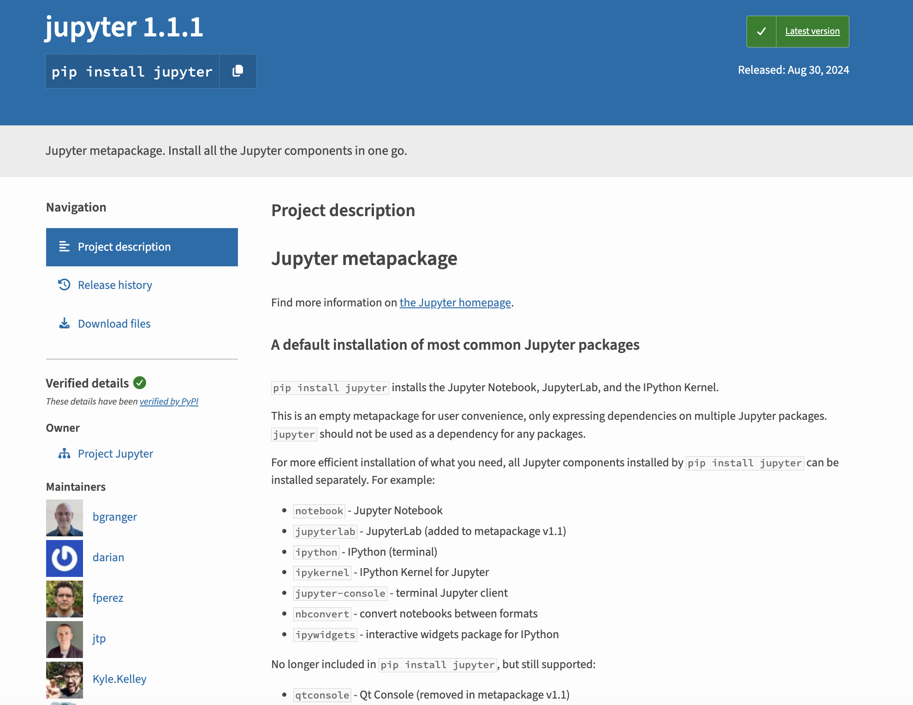
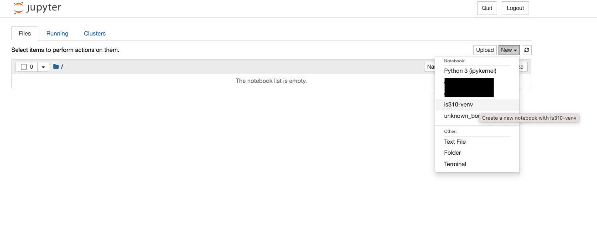
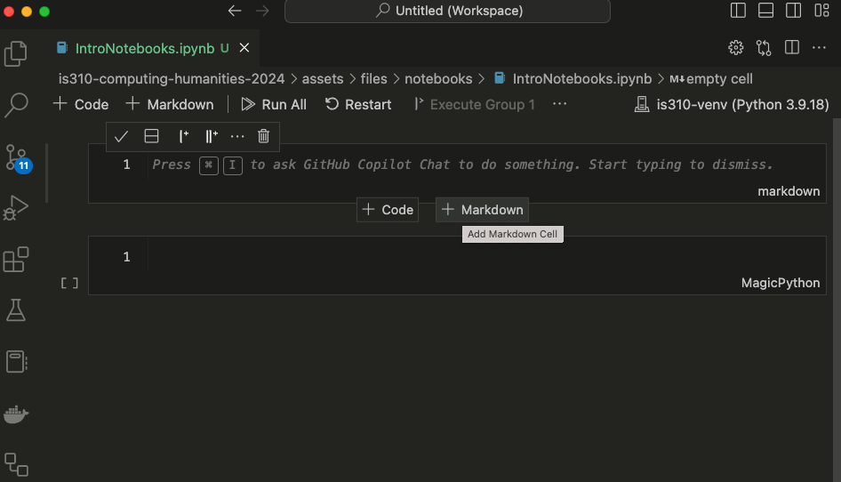
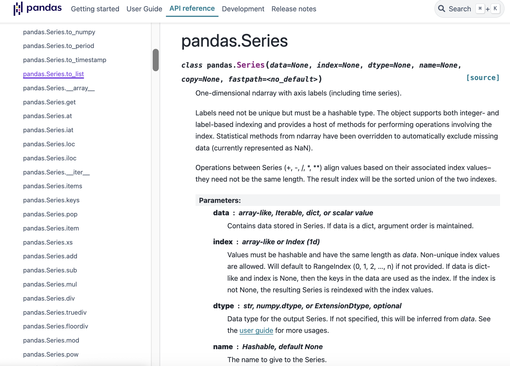
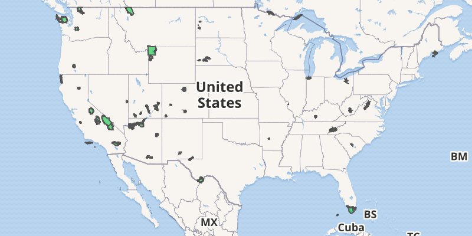
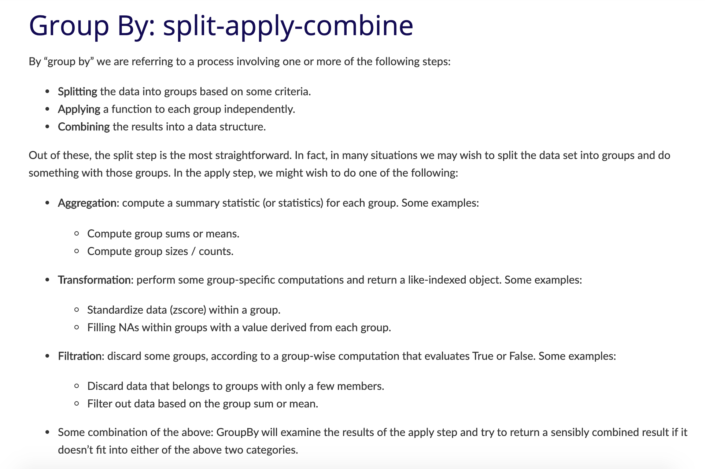
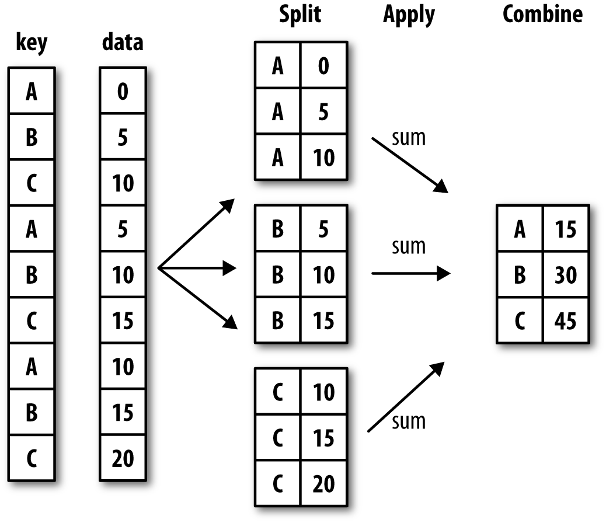

So far in the course, when we've been writing Python code, we've either been using the Python interpreter in the terminal or saving a Python script. However, there's a third way to write Python code that's very popular - that is with Jupyter notebooks [https://jupyter.org/](https://jupyter.org/){target="_blank"}. While many of you are familiar with Jupyter notebooks, this lesson will serve as a refresher and introduction to some of the features of Jupyter notebooks, as well as how to use them with the Pandas library.

## What Are Jupyter Notebooks?

{fig-align="center"}


## Brief History of Jupyter Notebooks

[](https://www.youtube.com/watch?v=NuRiz8CbvBg){target="_blank" fig-align="center"}


## Brief History of Jupyter Notebooks

{fig-align="center"}


## Connection To CU

{fig-align="center"}


## Rise of IPython

[](https://en.wikipedia.org/wiki/Project_Jupyter){target="_blank" fig-align="center"}


## The Notebook Wars

[](https://yihui.org/en/2018/09/notebook-war/){fig-align="center" target="_blank"}


## The Rise of Quarto

{fig-align="center"}


## Alternatives to Jupyter

[](https://marimo.io/){target="_blank" fig-align="center"}


## Why Use Jupyter Notebooks?

:::: {.columns}
::: {.column width="50%"}
[](https://melaniewalsh.github.io/Intro-Cultural-Analytics/welcome.html){target="_blank" fig-align="center"}
:::
::: {.column width="50%"}

[](https://journalofdigitalhistory.org/en/articles/){target="_blank" fig-align="center"}
:::
::::


## Getting Started: Installation

[](https://pypi.org/project/jupyter/){fig-align="center" target="_blank"}

## Getting Started: Installation

*Before we install Jupyter, what should we do?*

```sh
pip install jupyter
```

::: {.callout-tip}
## What to follow along interactively?

Download the Jupyter notebook version of this lesson: <a href="../assets/files/01-intro-notebooks.ipynb" download target="_blank">01-intro-notebooks.ipynb</a>

Open it in Jupyter and run the code examples as you read through the lesson. You can experiment, modify examples, and practice everything in real time!
:::


## Getting Started: Virtual Environment Setup

*Next, we need to tell Jupyter about our virtual environment*

```sh
python -m ipykernel install --user --name=is310-class-env #Or whatever you named your virtual environment
```


## Running Jupyter Notebooks & Localhost

```sh
jupyter notebook
```

*You should see the Jupyter interface open in your browser. What is the domain name?*


## New Notebook

{fig-align="center"}


## New Notebook

{fig-align="center"}


## Renaming & Saving Notebooks

{fig-align="center"}


## Key Shortcuts

::: {.r-fit-text}
| Mac        | Jupyter Function                                                                                             | Windows       |
|:---------------------------:|:-----------------------------------------------------------------------------------------------------------:|:---------------------------:|
| `Shift` + `Return`  | Run cell  (**Both modes**)                                            | `Shift` + `Enter`     |
| `Option` + `Return`                      | Create new cell below (**Both modes**)                                          | `Alt` + `Enter`
| `B`                      | Create new cell below (**Command mode**)                                         | `B`
| `A`                      | Create new cell above (**Command mode**)                                       | `A`
| `D` + `D`                      | Delete cell (**Command mode**)                                         | `D` + `D`                    |
| `Z`                      | Undo cell action (**Command mode**)                                         | `Z`  
| `Shift` + `M`                     | Merge cells (**Command mode**)                     | `Shift` + `m`                      |
| `Control` + `Shift` + `-`                   | Split cell into two cells (**Edit mode**)   |         `Control` + `Shift` + `-`   |
| `Tab`                      | Autocomplete file/variable/function name (**Edit mode**)     | `Tab`

:::


## Jupyter Notebooks in VS Code

*How can we quit the Jupyter notebook server and work in VS Code instead?*

{fig-align="center"}


## Writing Code & Markdown in Jupyter Notebooks

{fig-align="center"}


## Writing Code & Markdown in Jupyter Notebooks

{fig-align="center"}


## Writing Code & Markdown in Jupyter Notebooks

::: {.r-fit-text}
Try pasting the following within the first cell of the Jupyter notebook. *What should we see in our Notebook?*

```python
def check_movie_release(movie):
    if movie['release_year'] < 2000:
        print(f"{movie['name']} was released before 2000")
    else:
        print(f"{movie['name']} was released after 2000")
        return movie['name']

recent_movies = []

favorite_movies =[
    {
        "name": "The Matrix IV",
        "release_year": 2022,
        "sequels": ["The Matrix I", "The Matrix II", "The Matrix III"]
    },
    {
        "name": "Star Wars IV",
        "release_year": 1977,
        "sequels": ["Star Wars V", "Star Wars VI", "Star Wars VII", "Star Wars VIII", "Star Wars IX"],
        "prequels": ["Star Wars I", "Star Wars II", "Star Wars III"]
    },
    {
        "name": "The Lord of the Rings: The Fellowship of the Ring",
        "release_year": 2001,
        "sequels": ["The Two Towers", "The Return of the King"]
    }
]

for movie in favorite_movies:
    result = check_movie_release(movie)
    if result is not None:
        recent_movies.append(result)

print(recent_movies)
```

:::


## Important: Notebooks Hold State

::: {.r-fit-text}
Unlike with scripts, notebooks hold variables in memory, which means that our function now exists in the notebook and we can call in a new cell.

To test this out, add a new cell below our function one by pressing the `+ Code` symbol when you hover. Then paste the following code and run it.

```python
def updated_check_movie_release(movie, released_after_year, released_before_year=2024):
    if released_after_year < movie['release_year'] and movie['release_year'] < released_before_year:
        movie['recent'] = True
    else:
        movie['recent'] = False
    return movie
```

Now we can call this function in our for-loop by updating the original code:

```python
for movie in favorite_movies:
    updated_movie = updated_check_movie_release(movie, 2020)
    if updated_movie['recent']:
        recent_movies.append(updated_movie['name'])
```
:::


## Important: Notebooks Hold State

{fig-align="center"}


## Introduction to Pandas

{fig-align="center"}

*The Pandas Library [https://pandas.pydata.org/docs/index.html](https://pandas.pydata.org/docs/index.html){target="_blank"}*


## History of Pandas

[](https://github.com/pandas-dev/pandas){fig-align="center" target="_blank"}


## History of Pandas

[](https://pandas.pydata.org/about/team.html){fig-align="center" target="_blank"}


## BDFL of Pandas

::: {.r-fit-text}
*Who is Wes McKinney?* 

[](https://pandas.pydata.org/about/governance.html#bdfl){fig-align="center" target="_blank"}

Highly recommend checking out his recent blog post [https://wesmckinney.com/transcripts/2026-02-10-rill-data-podcast](https://wesmckinney.com/transcripts/2026-02-10-rill-data-podcast){target="_blank"} where he talks about his vision for the future of data science.
:::


## Pandas Basics

First we need to install `pandas`, which we can do by visiting the documentation and following the steps under the `Getting Started` and `Installation` [https://pandas.pydata.org/docs/getting_started/install.html](https://pandas.pydata.org/docs/getting_started/install.html). 

```sh
pip install pandas
```

You're welcome to use any installation method, but I highly recommend installing into a virtual environment, and using `pip` to install [https://pandas.pydata.org/docs/getting_started/install.html#installing-from-pypi](https://pandas.pydata.org/docs/getting_started/install.html#installing-from-pypi).

## Using Pandas in Jupyter Notebooks

Now if we start to go through the tutorials in the `Getting Started` section, we can start to learn how to work with `pandas`. Specifically, this tutorial on reading and writing data with `pandas`: [https://pandas.pydata.org/docs/getting_started/intro_tutorials/02_read_write.html](https://pandas.pydata.org/docs/getting_started/intro_tutorials/02_read_write.html).

You'll notice the first line of the tutorial is the following syntax:

```python
import pandas as pd
```
*How can we check the version of Pandas?*


## Reading Data with Pandas

{fig-align="center"}


## Reading Data with Pandas

[](https://pandas.pydata.org/docs/reference/api/pandas.read_csv.html#pandas-read-csv){fig-align="center" target="_blank"}


## Reading Data with Pandas

[ ](https://www.responsible-datasets-in-context.com/posts/np-data/?tab=explore-the-data){fig-align="center" target="_blank"}

*How could we use a remote URL to read data?*


## Read CSV with Pandas

```python
import pandas as pd

parks_data_df = pd.read_csv('https://raw.githubusercontent.com/melaniewalsh/responsible-datasets-in-context/main/datasets/national-parks/US-National-Parks_RecreationVisits_1979-2023.csv')
```

*How can we see the type of data we have in our `parks_data_df` variable?*


## What is a DataFrame?

::: {.r-fit-text}
:::: {.columns}
::: {.column width="50%"}
[](https://pandas.pydata.org/docs/reference/api/pandas.DataFrame.html#pandas.DataFrame){fig-align="center" target="_blank"}
:::
::: {.column width="50%"}


DataFrames are the primary data structures or Classes in `pandas` and are defined as:

> A DataFrame is a 2-dimensional data structure that can store data of different types (including characters, integers, floating point values, categorical data and more) in columns. It is similar to a spreadsheet, a SQL table or the data.frame in R.

*Is there a built-in Python method we could use to learn more?*
:::
::::
:::


## Exploring DataFrames

- How could we see what is in our DataFrame?
- What are some of the built-in methods we can use to explore our DataFrame? 
- How might we see the first few rows of our DataFrame?
- How might we see the number of rows and columns in our DataFrame?

## Exploring DataFrames

```python
parks_data_df.head()        # First few rows
parks_data_df.shape         # Number of rows and columns
parks_data_df.dtypes        # Data types of each column
```


## Pandas Data Types

::: {.r-fit-text}

| Pandas dtype | Python type | NumPy type | Usage|
|:----------:|:----------:|:----------:|:----------:|
|object | str or mixed | string_, unicode_, mixed types |Text or mixed numeric and non-numeric values |
int64 | int | int_, int8, int16, int32, int64, uint8, uint16, uint32, uint64 |  Integer numbers |
float64 | float | float_, float16, float32, float64 |Floating point numbers |
bool | bool | bool_ | True/False values |
datetime64 | NA| datetime64[ns]| Date and time values
timedelta[ns] |NA | NA | Differences between two datetimes |
category| NA| NA |Finite list of text values|

Pandas data types build from ones available in Python. This table compares Pandas to Python and another library called `numpy` (you can read more about Pandas data types here [https://pandas.pydata.org/docs/reference/arrays.html#pandas-arrays-scalars-and-data-types](https://pandas.pydata.org/docs/reference/arrays.html#pandas-arrays-scalars-and-data-types).
:::


## Exploring DataFrames

We can get an overview of our data using two additional methods: `info()` and `describe()`. The `info()` method gives us a summary of the DataFrame, including the number of non-null values in each column, while the `describe()` method gives us summary statistics for the numeric columns.

```python
parks_data_df.info()

parks_data_df.describe()
```


## Indexing & Selecting Data with Pandas

::: {.r-fit-text}
:::: {.columns}
::: {.column width="50%"}
[](https://pandas.pydata.org/pandas-docs/stable/user_guide/indexing.html){fig-align="center" target="_blank"}
:::
::: {.column width="50%}
At a high level, we can select data using the following methods:

- **Selecting columns**: We can select a single column using a single bracket, or multiple columns using double brackets.
- **Selecting rows**: We can select rows using the `loc[]` and `iloc[]` methods.
- **Boolean indexing**: We can filter data based on conditions.
- **Setting values**: We can set values in the DataFrame using the `loc[]` method.
- **Using the `query()` method**: We can filter data using a query string.
- **Using the `filter()` method**: We can filter data based on labels.
- **Using the `at[]` and `iat[]` methods**: We can access a single value for a row/column label pair or by integer position.
:::
::::
:::

## Selecting Columns

::: {.r-fit-text}

Let's start by trying to select columns and explore the `Year` column. Try typing in one cell `parks_data_df['Year']` and then in the following cell `parks_data_df[['Year']]`. 

*What differences do you notice?*

Let's try out some examples:

- Type `parks_data_df[0:5]` in a cell and run it. What results do you get?
- Type `parks_data_df[['Year', 'Region']]` in a cell and run it. What results do you get?
:::


## Selecting Columns

::: {.r-fit-text}
:::: {.columns}
::: {.column width="50%"}

:::
::: {.column width="50%"}

:::
::::
:::


## Series vs DataFrame

[](https://pandas.pydata.org/docs/reference/api/pandas.Series.html#pandas-series){fig-align="center" target="_blank"}


## Exploring Series

*How could we get a list of all unique values in a Year column?*

Let's try the `to_list()` method, which we can read about here [https://pandas.pydata.org/docs/reference/api/pandas.Series.to_list.html](https://pandas.pydata.org/docs/reference/api/pandas.Series.to_list.html){target="_blank"}.


You should get a long list of all the values in the column as your output. However, it might be hard to tell if we have unique values. We can use the `unique()` method to see just the unique values in the column, [https://pandas.pydata.org/docs/reference/api/pandas.Series.unique.html](https://pandas.pydata.org/docs/reference/api/pandas.Series.unique.html){target="_blank"}.

## Renaming Columns

While the columns in the `parks_data_df` are capitalized, usually we try to keep column names lowercase and use underscores instead of spaces for ease of typing. *How could we rename them to be lowercased and have underscores instead of spaces?*


## Filtering Data

One of the things that makes Pandas so powerful is that it allows us to filter data easily. We can filter data using boolean indexing, which allows us to select rows based on conditions, just like `if` statements in Python.

For example, if we want to filter the DataFrame to only include rows for visits to Illinois, we could select the `state` column and see how many rows have the value `IL`, we can do the following:

```python
parks_data_df[parks_data_df['state'] == 'IL']
```

## Filtering Data

Now we'll see that this gives us zero values because this dataset is only for "the current 63 National Parks administered by the United States National Park Service (NPS), from 1979 to 2023."

{fig-align="center"}

*How else could we have discovered this using Pandas?*


## Value Counts Method

We can use the `value_counts()` method to see how many times each value appears in the `state` column! We can read more about the method here [https://pandas.pydata.org/pandas-docs/stable/reference/api/pandas.DataFrame.value_counts.html#pandas-dataframe-value-counts](https://pandas.pydata.org/pandas-docs/stable/reference/api/pandas.DataFrame.value_counts.html#pandas-dataframe-value-counts){target="_blank"}.

```python
parks_data_df['state'].value_counts()
```

*Now what if we only wanted to include rows for a specific state?*

## Filtering Data with Boolean Indexing

```python
# Boolean indexing
parks_data_df[parks_data_df['state'] == 'CA']

# Multiple values
parks_data_df[parks_data_df['state'].isin(['CA', 'AK'])]
```

*What if we wanted to see how many rows there are for parks are in each state?*


## Grouping Data
::: {.r-fit-text}
:::: {.columns}
::: {.column width="50%"}
[](https://pandas.pydata.org/docs/user_guide/groupby.html#group-by-split-apply-combine){fig-align="center" target="_blank"}
:::
::: {.column width="50%"}
{fig-align="center"}
:::
::::
:::


## Grouping Data
First, we select a or multiple columns we want to group our data by. For example, in our case we could group by `state` so that we could see how many parks exist in each state.

```python
parks_data_df.groupby('state')
```

While this code works, we'll see that it only returns a `DataFrameGroupBy` object, which is not very useful on its own. To see the actual data, we could use the `get_group()` method to see the data for a specific state.

```python
parks_data_df.groupby('state').get_group('CA')
```

*How could we use groupby to count the number of parks in each state?*

## Grouping Data
```python
parks_data_df.groupby('state').size()

parks_data_df.groupby('state')['park_name'].nunique()
```


## Reseting Index

Because we are getting a Series, we can also convert it back to a DataFrame using the `reset_index()` method, which will turn the Series back into a DataFrame.

```python
parks_data_df.groupby('state')['park_name'].nunique().reset_index()
```


## Common Aggregation Methods

::: {.r-fit-text}
How could we create a new variable `parks_per_state_df` and what aggregation should we use to count the number of unique parks in each state?

| Pandas method | Explanation |
|:----------:|:----------:|
|`.count()`| Number of non-null observations|
|`.sum()`| Sum of values|
|`.mean()`| Mean of values|
|`.median()`| Median of values|
| `.min()` | Minimum value|
| `.max()`| Maximum value|
| `.mode()`| Mode|
| `.std()`| Sample standard deviation of values |
| `.describe()` | Compute set of summary statistics for Series or each DataFrame column|
| `.value_counts()` | Count unique values in a Series|
| `.nunique()` | Count unique values in a Series|
| `.size()` | Count number of rows in each group|


:::


## Renaming Columns

*How could we rename the `park_name` column to `num_parks` to more accurately reflect its content?* 

More info available here [https://pandas.pydata.org/pandas-docs/stable/reference/api/pandas.DataFrame.rename.html#pandas-dataframe-rename](https://pandas.pydata.org/pandas-docs/stable/reference/api/pandas.DataFrame.rename.html#pandas-dataframe-rename){target="_blank"}.


## Inplace vs Not In Place


## Inplace vs Not In Place

Many methods in Pandas have an `inplace` argument, which allows us to modify the DataFrame directly rather than returning a new DataFrame. For example, the `sort_values()` method also has an `inplace` argument.

```python
parks_per_state_df.sort_values(by='num_parks', ascending=False, inplace=True)
```

Now when we run this cell, `parks_per_state_df` will have the new column, and be sorted by the number of parks in descending order.

## Adding New Data

*How could we add Illinois to our DataFrame?*

## Adding New Data

```python
new_state = pd.DataFrame({'state': ['IL'], 'num_parks': [0]})
parks_per_state_df = pd.concat([parks_per_state_df, new_state], ignore_index=True)
```

*Any alternatives?*


## Adding New Data

```python
import numpy as np

new_state = pd.DataFrame({'state': ['IL'], 'num_parks': [np.nan]})
new_state = pd.DataFrame([{'state': 'IL', 'num_parks': None}])
```


## Combining DataFrames

*How can we combine DataFrames?*

. . .

```python
combined_parks_per_state_df = pd.concat([parks_per_state_df, new_state], ignore_index=True)
```


## Quick Exercise: Answering Questions with Pandas

::: {.r-fit-text}
In the documentation for the National Parks Dataset, Walsh and Keyes have an `Exercises` page that you can find here: [https://www.responsible-datasets-in-context.com/posts/np-data/exercises-python/NP-Data-Groupby-Pandas.html](https://www.responsible-datasets-in-context.com/posts/np-data/exercises-python/NP-Data-Groupby-Pandas.html).

In that exercise, they have three questions:

1. What is the average number of visits for each state?
2. What is the average number of visits for each National Park?
3. How many National Parks are there in each state?

:::

## Quick Exercise: Answering Questions with Pandas
::: {.r-fit-text}
Let's try and answer them together with what we have learned so far! In your `is310-coding-assignments` repository, create a new folder called `pandas-eda` and in that folder create a new Jupyter Notebook called `NationalParksEDA.ipynb`. Feel free to also move your `IntroNotebooks.ipynb` into that folder as well.

In the Notebook, you should start by adding a title in Markdown and a brief description of what you are doing. Then, you can import the necessary libraries and read in the dataset.

Then you should create a section for each question, where you can write the code to answer the question. You can use the methods we learned in this lesson, such as `groupby()`, `mean()`, and `size()`, to help you answer the questions.

To create a section, you can use the `#` symbol in Markdown to create a header. For example, you could use `## Average Number of Visits for Each State` for the first question, which would create a second-level header.
:::
