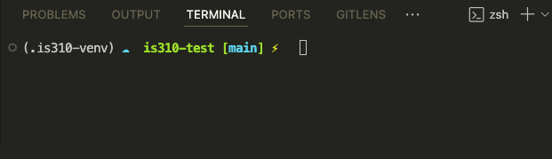

# Today's Agenda

- Review web scraping lesson
- Breakout rooms to discuss project feedback
- Work on CLI Data Curation Homework (time permitting)

## What Is Web Scraping?

[{fig-alt="Diagram showing a web page being transformed into structured data through web scraping"}](../materials/creating-curating-cad/05-web-scraping.qmd){target="_blank"}

. . .

**What changes when we treat a webpage as data rather than as a page to read?**


## Why Might We Scrape the Web?

[{fig-alt="Screenshot of the Saving Ukrainian Cultural Heritage Online project"}](https://www.sucho.org/){target="_blank"}

. . .

**What purposes besides research might web scraping serve?**


## If a Page Is Public, Can We Scrape It?

[{fig-alt="Screenshot of the New York Times robots.txt file"}](https://www.nytimes.com/robots.txt){target="_blank"}

. . .

**What does public access permit, and what does it not settle?**


## Is Legal the Same as Ethical?

[{fig-alt="Melanie Walsh's overview of ethical approaches to collecting internet data"}](https://melaniewalsh.github.io/Intro-Cultural-Analytics/04-Data-Collection/01-User-Ethics-Legal-Concerns.html){target="_blank"}

. . .

**Whose expectations and possible harms should shape our collection choices?**


## What Does `robots.txt` Tell Us?

[{fig-alt="Screenshot of the Tolkien Gateway robots.txt file"}](https://tolkiengateway.net/robots.txt){target="_blank"}

. . .

**Is `robots.txt` permission, a prohibition, or something else?**


## What Are the Two Main Jobs in Our Scraper?

:::: {.columns}
::: {.column width="50%"}
### `requests`

**How do we retrieve the page?**

{fig-alt="Requests library documentation"}
:::
::: {.column width="50%"}
### `BeautifulSoup`

**How do we search its HTML?**

{fig-alt="Beautiful Soup documentation"}
:::
::::


## Why Return to Our Virtual Environment?

:::: {.columns}
::: {.column width="58%"}
{fig-alt="Terminal showing an activated Python virtual environment"}
:::
::: {.column width="42%" .r-fit-text}
**Where will Python install our new packages?**

. . .

**How can we tell which environment is active?**
:::
::::


## Where Should We Install the Packages?

```sh
python -m pip install requests beautifulsoup4 rich
```

. . .

**Which Python receives these packages? How can we check?**


## What Is a Software Library?

[{fig-alt="Beautiful Soup documentation describing the library"}](https://www.crummy.com/software/BeautifulSoup/bs4/doc/){target="_blank"}

. . .

**How is using a library different from writing every part of a scraper ourselves?**


## What Is a Python Package?

[{fig-alt="Python Package Index logo"}](https://pypi.org/){target="_blank"}

. . .

**Why do people sometimes use “package” and “library” interchangeably?**


## How can we import Beautiful Soup?

. . .

:::: {.columns}
::: {.column width="55%"}
{fig-alt="Python error produced by trying to import beautifulsoup4"}
:::
::: {.column width="45%" .r-fit-text}
```python
import beautifulsoup4
```

. . .

**Installation name or import name?**
:::
::::


## What Does Beautiful Soup Need From Us?

[{fig-alt="Beautiful Soup Quick Start documentation"}](https://beautiful-soup-4.readthedocs.io/en/latest/#quick-start){target="_blank"}

```python
soup = BeautifulSoup(html_doc, "html.parser")
```

. . .

**What are the two arguments?**


## How Does Beautiful Soup First See HTML?

::: {.r-fit-text}
```python
html_doc = """
<html>
  <head><title>The Dormouse's story</title></head>
  <body>
    <p class="title"><b>The Dormouse's story</b></p>
    <p class="story">
      Once upon a time there were three little sisters:
      <a href="http://example.com/elsie" class="sister">Elsie</a>,
      <a href="http://example.com/lacie" class="sister">Lacie</a>, and
      <a href="http://example.com/tillie" class="sister">Tillie</a>.
    </p>
  </body>
</html>
"""

soup = BeautifulSoup(html_doc, "html.parser")
print(soup.prettify())
```
:::


## How Can We Extract the Links?

```python
links = soup.find_all("a")

for link in links:
    print(link.get("href"))
    print(link.get_text())
```

. . .

**What is each loop iteration holding?**


## What Kind of Object Did We Find?

```python
first_link = soup.find("a")

print(type(first_link))
print(first_link.name)
print(first_link.attrs)
print(first_link.get_text())
```

. . .

**How does a `Tag` connect HTML attributes, nested text, and Python methods?**


## How Do We Move Through the Tree?

```python
paragraphs = soup.find_all("p")

for paragraph in paragraphs:
    print(paragraph.get_text(" ", strip=True))
    print(paragraph.parent.name)
```

. . .

**What do “parent,” “child,” and “descendant” mean in HTML?**


## What Do These Methods Return?

```python
soup.find("h2")
soup.find_all("h2")
element.find_next("ol")
element.get_text(" ", strip=True)
link.get("href")
```

. . .

**Which returns one element, many elements, text, or an attribute?**


## Why Does HTML Structure Matter?

{fig-alt="Browser developer tools showing the HTML around Project Gutenberg book titles"}

. . .

**Which element represents one item? Which element contains the list?**


## What Happens If We Search Too Broadly?

{fig-alt="Developer tools showing a Project Gutenberg Top 100 heading"}

. . .

```python
titles = soup.find_all("li")
```

**What will this collect besides book titles?**


## What Does a Server Tell Us?

:::: {.columns}
::: {.column width="50%"}
{fig-alt="Screenshot of the Requests documentation"}
:::
::: {.column width="50%" .r-fit-text}
**What do these status codes suggest?**

- `200`
- `403`
- `404`
- `429`
- `500`
:::
::::


## What Is Happening Here?

```python
response = requests.get(url)
soup = BeautifulSoup(response.text, "html.parser")
```

. . .

**What are the types of `response`, `response.text`, and `soup`?**


## What Is Wrong With This Link?

```text
/ebooks/84
```

. . .

**Why might `requests.get()` fail if we use it by itself?**

. . .

```text
https://www.gutenberg.org/ebooks/84
```


## What Changes When We Follow Links?

{fig-alt="Screenshot of the Tolkien Gateway homepage"}

. . .

**How is scraping one index page different from building records from many detail pages?**


## When Should We Not Keep Scraping?

{fig-alt="Examples of large fan wikis"}

. . .

**What should we do when a site returns `403`, `429`, or a bot-protection page?**


## What Should a Responsible Request Include?

```python
HEADERS = {
    "User-Agent": "is310-course-scraper/1.0 "
    "(student project; netid@illinois.edu)"
}

response = requests.get(url, headers=HEADERS, timeout=30)
time.sleep(1)
```

. . .

**Why identify ourselves and deliberately make the script slower?**


## What Question Are We Asking?

[{fig-alt="Promotional image for The Rings of Power"}](https://tolkiengateway.net/wiki/The_Lord_of_the_Rings:_The_Rings_of_Power){target="_blank"}

. . .

**How does Tolkien Gateway distribute attention between literary and adaptation-created characters?**


## Where Do Our Records Come From?

:::: {.columns}
::: {.column width="50%"}
[{fig-alt="Tolkien Gateway category listing Lord of the Rings characters"}](https://tolkiengateway.net/wiki/Category:Characters_in_The_Lord_of_the_Rings){target="_blank"}
:::
::: {.column width="50%"}
[{fig-alt="Tolkien Gateway category listing Rings of Power characters"}](https://tolkiengateway.net/wiki/Category:The_Rings_of_Power_(TV_series)_characters){target="_blank"}
:::
::::

**What has the wiki already decided for us?**


## How Do We Find Every Character?

{fig-alt="HTML structure of a Tolkien Gateway character category"}

```python
characters_section = category_page.find(id="mw-pages")
character_items = characters_section.find_all("li")
```


## What Part of a Character Page Should Count?

{fig-alt="Developer tools showing the main article content on a Tolkien Gateway character page"}

. . .

**What would happen if we counted the entire webpage?**


## What Might Count as Attention?

| Measurement | Possible interpretation |
|---|---|
| Words | Length of documentation |
| Characters | Another measure of text extent |
| All internal links | Every connection made in the article |
| Unique internal links | Breadth of distinct wiki destinations |

. . .

**Which of these is fandom attention, and which is only a proxy?**


## Why Count All and Unique Links?

```text
Elrond, Elrond, Elrond, Galadriel, Galadriel
```

. . .

**All links:** `5`  
**Unique links:** `2`

. . .

**What different kind of page might each measure reward?**


## How Do We Define an Internal Link?

```python
for link in content.find_all("a", href=True):
    href = link["href"]
    if href.startswith("/wiki/") and "#" not in href:
        links.append(href)
```

. . .

**What does this include that we may not actually want?**


## Who Appears in Both Worlds?

{fig-alt="Tolkien Gateway HTML showing a Galadriel page link to The Rings of Power"}

. . .

**What can a link to the television series tell us about a literary character?**


## Why Break the Scraper Into Functions?

```text
fetch_soup()
scrape_characters()
get_internal_links()
analyze_character()
save_csv()
print_results_table()
main()
```

. . .

**What single responsibility does each function have?**


## What Does `main()` Make Visible?

```python
def main():
    literary_characters = ...
    adaptation_characters = ...
    all_characters = literary_characters + adaptation_characters

    results = []
    for character in all_characters:
        results.append(analyze_character(character))

    print_results_table(results)
    save_csv(results, RESULTS_OUTPUT)
```


## What Do You Notice in the Results?

{fig-alt="Rich console table of Tolkien Gateway character-page measurements"}

. . .

**Which pattern would you investigate first? What would you verify before making a claim?**


## What Can We Responsibly Conclude?

> **The categories and measurements are evidence, not neutral containers.**

. . .

- What did Tolkien Gateway editors classify?
- What did our selectors include?
- What did our metrics count?
- What remains outside the dataset?


## What Does the Homework Ask You to Produce?

::: {.r-fit-text}
- A question and justified choice of community wiki
- A documented `robots.txt` and access check
- A scraper using `requests` and `BeautifulSoup`
- An honest `User-Agent`, response check, and delay
- At least two levels or types of pages
- A CSV or JSON dataset
- A reflection on the gap between your metric and your concept
:::


## Where Will You Begin?

[Web Scraping Lesson and Homework](../materials/creating-curating-cad/05-web-scraping.qmd#community-wikis-and-web-scraping-homework){target="_blank"}

[GitHub Discussion](https://github.com/CultureAsData-UIUC/is310-fall-2026/discussions/6){target="_blank"}

. . .

**What wiki, cultural question, and first page will you investigate?**


## CLI Data Curation Homework

Sample script is now available in the homework section as inspiration for your assignment. Please do not copy it directly; your own project should have a different question, source, and fields. The sample is meant to illustrate the workflow and structure of a scraper, not to be a template for your submission. You can see the sample script in the [homework section](../materials/creating-curating-cad/04-virtual-environments.qmd#homework-command-line-data-curation){target="_blank"}.

## Milestone 2 Updates

- Deadline now pushed back a week to **October 27, 2026** with optional extension until **November 3, 2026**.
- Added a checklist to each milestone section to help you know what needs to be submitted.