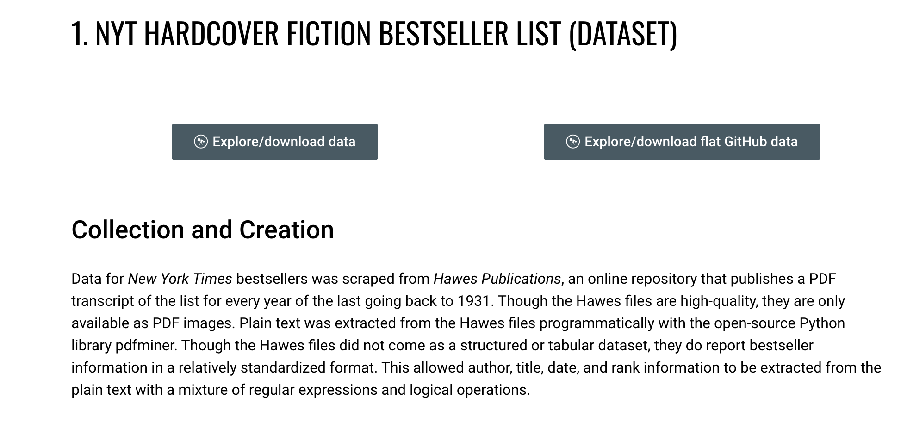
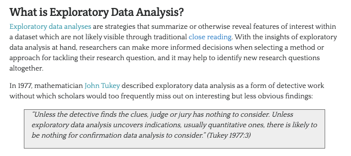
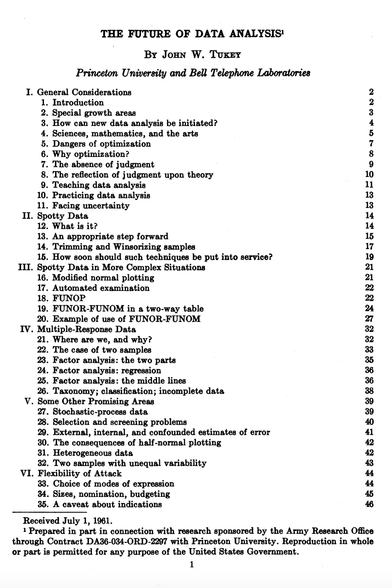
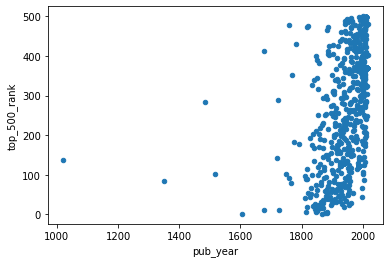
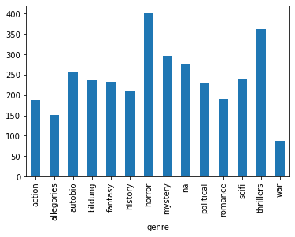
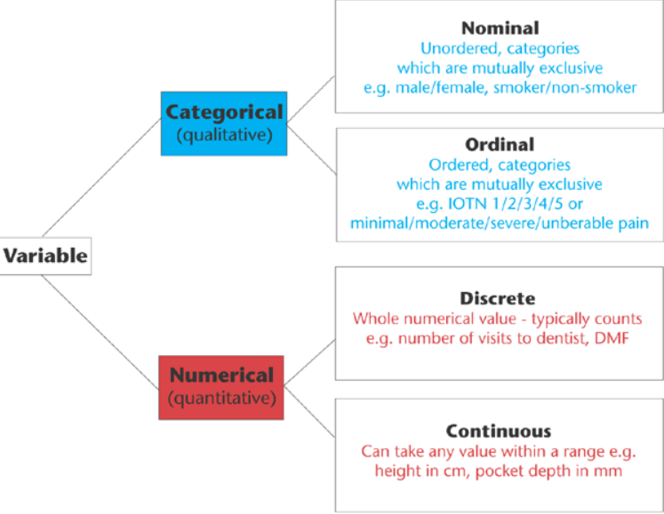
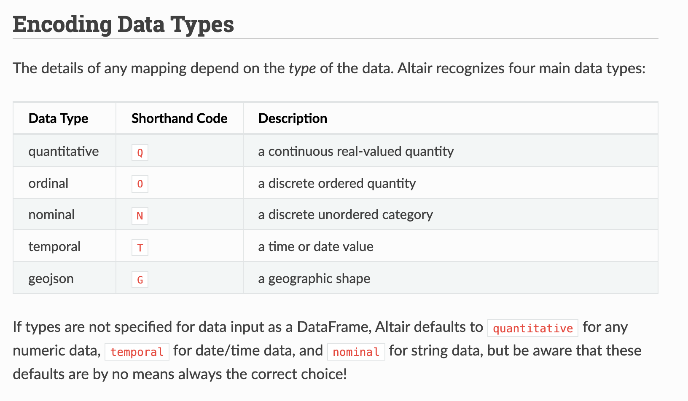
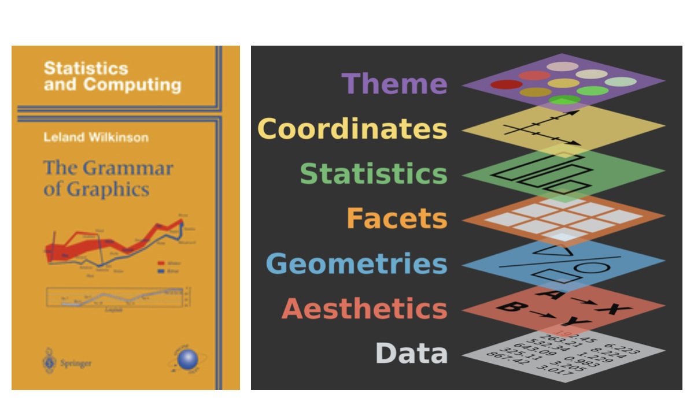

## Last Lesson Recap

In our last lesson, we tried to answer the following questions:

1. What is the average number of visits for each state?
2. What is the average number of visits for each National Park?
3. How many National Parks are there in each state?

*Anyone want to share their solutions?*

## My Solution

Here's the solution code:

```python
import re
import pandas as pd

parks_data_df = pd.read_csv('https://raw.githubusercontent.com/melaniewalsh/responsible-datasets-in-context/main/datasets/national-parks/US-National-Parks_RecreationVisits_1979-2023.csv')

def split_on_uppercase(name):
    return re.sub(r'(?<!^)(?=[A-Z])', '_', name).lower()

new_column_names = [split_on_uppercase(col) for col in parks_data_df.columns]
parks_data_df.columns = new_column_names

print(parks_data_df.groupby(['state'])['recreation_visits'].mean().reset_index())
print(parks_data_df.groupby(['park_name'])['recreation_visits'].mean().reset_index())
print(parks_data_df.groupby(['state'])['park_name'].nunique().reset_index())
```

We could store each of these in new variables, but we also want to visualize this data. That's what we're exploring today.

## A New Dataset: Top 500 Novels

[](https://www.responsible-datasets-in-context.com/posts/top-500-novels/top-500-novels.html){fig-align="center" target="_blank" width="600"}

First, we need to create a new Jupyter notebook in our `pandas-eda` folder called `Top500NovelsEDA.ipynb` and then load in the data. As a reminder, how can we **read** data in Pandas?


## Loading the Novels Data

To load the dataset, we need to look at the GitHub repository [https://github.com/melaniewalsh/responsible-datasets-in-context/tree/main/datasets/top-500-novels](https://github.com/melaniewalsh/responsible-datasets-in-context/tree/main/datasets/top-500-novels){target="_blank"} and find the raw URL for the `final_merged_dataset_no_full_text.tsv` file. Then we can use `pd.read_csv()` to load it:

```python
novels_df = pd.read_csv(
    "https://raw.githubusercontent.com/melaniewalsh/responsible-datasets-in-context/"
    "main/datasets/top-500-novels/final_merged_dataset_no_full_text.tsv",
)
```

*Why didn't this work though?*

## Tab-Separated Values & Encoding

If we run this locally, we should see the following error:
```bash
ParserError: Error tokenizing data. C error: Expected 1 fields in line 163, saw 3
```

*What is encoding?*


## Revised Loading the Novels Data

In our case, we didn't need to specify the encoding, but if we did, we could have added the `encoding` parameter to our `read_csv()` method.

```python
# Import data
novels_df = pd.read_csv("https://raw.githubusercontent.com/melaniewalsh/responsible-datasets-in-context/main/datasets/top-500-novels/final_merged_dataset_no_full_text.tsv", sep="\t", encoding='utf-8')
```

## Missing Data in Pandas

```python
novels_df.info()
```

```bash
author_field_of_activity  329 non-null    object
author_occupation         458 non-null    object
```

In the last lesson, we covered how we could add null values to a DataFrame, but now we want to explore how we can work with them. Pandas has a lot of documentation for handling **missing data** that you can read here [https://pandas.pydata.org/docs/user_guide/missing_data.html](https://pandas.pydata.org/docs/user_guide/missing_data.html){target="_blank"}. For our purposes, we're mostly concerned with the `isna()` and `notna()` methods. *What does 329 non-null mean?* Let's return to the [documentation to find out](https://www.responsible-datasets-in-context.com/posts/top-500-novels/top-500-novels.html?tab=data-essay#whats-in-the-data){target="_blank"}.


## AUTHOR_FIELD_OF_ACTIVITY

From the documentation, we can learn the following about this column:

> AUTHOR_FIELD_OF_ACTIVITY: Author's primary fields of activity, according to VIAF. VIAF includes data from multiple global partner institutions, but we only collect VIAF data associated with the Library of Congress (LOC).

## VIAF: The Virtual International Authority File

:::: {.columns}
::: {.column width="50%"}
{fig-align="center"}
:::
::: {.column width="50%"}

:::
::::


## Handling Missing Values

Now knowing this background, we can start to explore which authors have missing values in this column. We can do this by using the `isna()` method to check for missing values in the `author_field_of_activity` column.

```python
novels_df[novels_df['author_field_of_activity'].isna()]
```


## Handling Missing Values

If we wanted to see only rows where the column is not null, we could use the `notna()` method instead.

```python
novels_df[novels_df['author_field_of_activity'].notna()]
```

This will give us a DataFrame with all the authors who have a field of activity listed. We could also use the `~` operator to negate the boolean values returned by `isna()`.

```python
novels_df[~novels_df['author_field_of_activity'].isna()]
```


## Handling Missing Values

Finally, if we wanted to get rid of all rows in the `novels_df` DataFrame that have missing values in the `author_field_of_activity` column, we could either use our filtering logic to assign the result to a new variable or we could use the `dropna()` method.

```python
novels_df_cleaned = novels_df.dropna(subset=['author_field_of_activity'])
```

`dropna()` is a powerful method that can be used to remove missing values from a DataFrame. The `subset` parameter allows us to specify which columns we want to check for missing values. If we don't specify a subset, `dropna()` will remove any row that has a missing value in any column.

## Handling Missing Values

::: {.r-fit-text style="font-size: 0.45em"}
Here's a quick overview of the most common methods for handling missing values in Pandas:

| Pandas Method | Description | Usage |
|---------------|-------------|-------|
| `isna()`      | Boolean mask for missing values | `df.isna().sum()` to count missing |
| `notna()`     | Boolean mask for non-missing values | Inverse of `isna()` |
| `isnull()`    | Alias for `isna()` | Interchangeable with `isna()` |
| `notnull()`   | Alias for `notna()` | Interchangeable with `notna()` |
| `dropna()`    | Removes rows/columns with missing values | Use `subset=` to target columns |
| `fillna()`    | Fills missing values | Replace with a value or interpolate |
:::


## Merging Data With Pandas

[](https://data.post45.org/){fig-align="center" target="_blank"}


## NYT Bestsellers Dataset

Let's use the one about *New York Times* Hardcover Fiction Bestsellers, 1931–2020, created by Jordan Pruett [https://data.post45.org/nyt-fiction-bestsellers-data/](https://data.post45.org/nyt-fiction-bestsellers-data/){target="_blank"}. 




## Loading the NYT Bestsellers Data

If we click on the `Explore/download data` for the first dataset, we see a new page that has the remote url for the dataset: [https://raw.githubusercontent.com/ecds/post45-datasets/main/nyt_full.tsv](https://raw.githubusercontent.com/ecds/post45-datasets/main/nyt_full.tsv){target="_blank"}. 

```python
nyt_bestsellers_df = pd.read_csv(
    "https://raw.githubusercontent.com/ecds/post45-datasets/main/nyt_full.tsv",
    sep="\t",
    encoding='utf-8'
)
```

*How coul we explore this dataset?*


## Merging Data with Pandas

{fig-align="center"}

Pandas has built in functionality that let's us merge together DataFrames so that we can perform analysis on the combined dataset, with extensive documentation [https://pandas.pydata.org/docs/user_guide/merging.html](https://pandas.pydata.org/docs/user_guide/merging.html){target="_blank"}.


## Merging Syntax


## Types of Joins

{fig-align="center"}


## Finding Common Columns

Now that we are starting to understand this logic, we can consider how we might merge our datasets. First, we can double check the columns in our `novels_df` and `nyt_bestsellers_df` DataFrames to see if there are any common columns we can use to merge them.

```python
novels_df.columns, nyt_bestsellers_df.columns
```

*How can we find the common columns?*

. . .

```python
set(novels_df.columns).intersection(set(nyt_bestsellers_df.columns))
```

*What happens when we merge on these two columns?*


## Attempting to Merge

```python
merged_df = novels_df.merge(nyt_bestsellers_df, how='left', on=['author', 'title'])
```

While this code should work, you'll notice if you print out the `merged_df` DataFrame that while there are new columns from the `nyt_bestsellers_df` in our `merged_df` there only `NaN` values in those columns. *Why is that?*


## Investigating the Most Prolific Authors

```python
novels_df[novels_df['author'].isin(nyt_bestsellers_df['author'])]['author'].value_counts().head(5)
```

```python
nyt_bestsellers_df[nyt_bestsellers_df['author'].isin(novels_df['author'])]['author'].value_counts()
```


## The Problem: Title Casing

```python
novel_titles = novels_df[novels_df.author == "Stephen King"].title.unique()
nyt_titles = nyt_bestsellers_df[nyt_bestsellers_df.author == "Stephen King"].title.unique()
```

```bash
novels:  ['The Stand' 'It' 'The Shining' ...]
NYT:     ['THE SHINING' 'THE STAND' 'IT' ...]
```


## String Methods in Pandas

::: {.r-fit-text style="font-size: 0.25em"}
| Pandas String Method | Explanation |
|---------------------|-------------|
| `df['column'].str.lower()` | Lowercase all values |
| `df['column'].str.upper()` | Uppercase all values |
| `df['column'].str.capitalize()` | Capitalize the first letter of each value |
| `df['column'].str.replace('old', 'new')` | Replace all instances of one string with another |
| `df['column'].str.split('delimiter')` | Split a column by a delimiter |
| `df['column'].str.strip()` | Remove leading and trailing whitespace |
| `df['column'].str.len()` | Count characters in each value |
| `df['column'].str.contains('pattern')` | Check if a column contains a pattern |
| `df['column'].str.startswith('pattern')` | Check if a column starts with a pattern |
| `df['column'].str.endswith('pattern')` | Check if a column ends with a pattern |
| `df['column'].str.count('pattern')` | Count occurrences of a pattern in each value |
| `df['column'].str.extract('pattern')` | Extract the first regex match in each value |
| `df['column'].str.findall('pattern')` | Find all regex matches in each value |

An in-depth discussion of these methods is available in the Pandas documentation [https://pandas.pydata.org/docs/user_guide/text.html](https://pandas.pydata.org/docs/user_guide/text.html){target="_blank"}.
:::


## Fixing the Casing & Merging

```python
# Preserve original, create normalized version
nyt_bestsellers_df = nyt_bestsellers_df.rename(columns={'title': 'nyt_title'})
nyt_bestsellers_df['title'] = nyt_bestsellers_df['nyt_title'].str.capitalize()
```

If we rerun our shared titles check, we should now see some overlap:

```python
shared_titles = novels_df[novels_df['title'].isin(nyt_bestsellers_df['title'])]['title'].nunique()
print(f"Number of shared titles: {shared_titles}")
```


## Final Merge

```python
inner_merged_df = novels_df.merge(nyt_bestsellers_df, how='inner', on=['author', 'title'])
outer_merged_df = novels_df.merge(nyt_bestsellers_df, how='outer', on=['author', 'title'])
left_merged_df = novels_df.merge(nyt_bestsellers_df, how='left', on=['author', 'title'])
print(f"Inner merge length: {len(inner_merged_df)}")
print(f"Outer merge length: {len(outer_merged_df)}")
print(f"Left merge length: {len(left_merged_df)}")
```
This should give us the following output:

```bash
Inner merge length: 231
Outer merge length: 60876
Left merge length: 721
```
So our final merge will be the left merge, which keeps all the novels and adds NYT bestseller data where available.
```python
combined_novels_nyt_df = novels_df.merge(nyt_bestsellers_df, how='left', on=['author', 'title'])
```

## The Full Combined Dataset

::: {.r-fit-text}
Now that we have our combined DataFrame, we also want to bring in the full text of each novel so we can start to explore the text data directly. I've included a pre-built version of the combined dataset that has the scraped and cleaned Project Gutenberg texts, plus pre-computed word and pronoun counts, which you can download from Canvas. You can read about the process of creating it [here](../materials/augmenting-preserving-cad/02-eda-data-viz.qmd#additional-notes){target="_blank"}.

The pre-built dataset includes:

- All novel metadata (genre, author, publication year, ratings, etc.)
- NYT bestseller columns where matched
- Pre-computed columns: `word_counts`, `he_counts`, `she_counts`, `they_counts`

In the rest of this lesson, I will be working with the fully run dataset that includes the text data and pre-computed columns, but you can also follow along with the smaller viz-only dataset if you want to keep things fast.
:::


## Counting Characters and Words

The simplest measure of a text is its length. We can count the number of characters in each novel using `str.len()`:

```python
combined_novels_nyt_df['novel_length_chars'] = combined_novels_nyt_df['eng_text'].str.len()
combined_novels_nyt_df[['title', 'author', 'novel_length_chars']].sort_values('novel_length_chars', ascending=False).head(10)
```

To get a more useful **word count**, we can split the text on spaces and count the resulting list:

```python
combined_novels_nyt_df['novel_length_words'] = combined_novels_nyt_df['eng_text'].str.split().str.len()
combined_novels_nyt_df[['title', 'author', 'novel_length_words']].sort_values('novel_length_words', ascending=False).head(10)
```

## Searching for Patterns With `str.contains()`

`str.contains()` checks whether each value in a column matches a given pattern. This is useful for filtering rows, counting occurrences, or finding subsets of a dataset. For example, how many of the novels in our dataset include the word "war" in their `genre` field?

```python
combined_novels_nyt_df[combined_novels_nyt_df['genre'].str.contains('war', case=False, na=False)][['title', 'author', 'genre']]
```


## How did we generate the counts columns?

We can also use `str.contains()` on the text column itself. For example, let's count how many novels contain the word "she" at all:

```python
combined_novels_nyt_df['mentions_she'] = combined_novels_nyt_df['eng_text'].str.contains(r'\bshe\b', case=False, na=False)
combined_novels_nyt_df['mentions_she'].value_counts()
```

Here we use a **regex** pattern `\bshe\b` — the `\b` characters are "word boundaries" that ensure we match the standalone word "she" rather than the letters inside words like "sheer" or "fisherman."

*Next week will cover more advanced text analysis techniques.*

## Counting Occurrences With `str.count()`

Rather than just knowing *whether* a word appears, `str.count()` tells us *how many times* it appears. This is especially useful for comparing word frequencies across documents. Let's count pronouns to start exploring gender representation across our novels:

```python
combined_novels_nyt_df['he_counts'] = combined_novels_nyt_df['eng_text'].str.count(r'\bhe\b')
combined_novels_nyt_df['she_counts'] = combined_novels_nyt_df['eng_text'].str.count(r'\bshe\b')
combined_novels_nyt_df['they_counts'] = combined_novels_nyt_df['eng_text'].str.count(r'\bthey\b')

combined_novels_nyt_df[['title', 'author', 'genre', 'he_counts', 'she_counts', 'they_counts']].head(10)
```


## Extracting Information With `str.extract()`

`str.extract()` uses a regular expression to pull specific pieces of text out of a string. For example, each of our Project Gutenberg URLs follows a consistent pattern — we could extract the book ID number from it:

```python
combined_novels_nyt_df['pg_book_id'] = combined_novels_nyt_df['pg_eng_url'].str.extract(r'/epub/(\d+)/')
combined_novels_nyt_df[['title', 'pg_eng_url', 'pg_book_id']].head(5)
```


## Exploratory Data Analysis

[](https://programminghistorian.org/en/lessons/sentiment-analysis){fig-align="center" target="_blank"}


## John W. Tukey & The History of EDA

:::: {.columns}
::: {.column width="50%" .r-fit-text}
[](https://projecteuclid.org/download/pdf_1/euclid.aoms/1177704711){fig-align="center" target="_blank"}
:::
::: {.column width="50%" .r-fit-text style="font-size: 0.45em"}
In the paper, Tukey writes:

> For a long time I have thought I was a statistician, interested in inferences from the particular to the general. But as I have watched mathematical statistics evolve, I have had cause to wonder and to doubt. [...] All in all, I have come to feel that my central interest is in *data analysis*, which I take to include, among other things: procedures for analyzing data, techniques for interpreting the results of such procedures, ways of planning the gathering of data to make its analysis easier, more precise or more accurate, and all the machinery and results of (mathematical) statistics which apply to analyzing data.
:::
::::


## Bell Labs

{fig-align="center"}


## Tukey's Principles of EDA

{fig-align="center"}

## EDA With Pandas: The Toolkit

::: {.r-fit-text}
How Pandas helps us implement Tukey's principles of EDA:

1. **Explore structure** — `head()`, `tail()`, `sample()`, `.shape`, `.dtypes`
2. **Summarize** — `describe()`
3. **Sort & rank** — `sort_values()`, `nsmallest()`, `nlargest()`
4. **Check missing** — `isna().any()`, `isna().sum()`
5. **Visualize** — `plot()`
:::


## Visualizing Data With Pandas

[](https://pandas.pydata.org/pandas-docs/stable/reference/api/pandas.DataFrame.plot.html){fig-align="center" target="_blank"}


## Matplotlib & Plots

::: {.r-fit-text}
`plot` is built into Pandas and is a wrapper around the `matplotlib` library [https://matplotlib.org/](https://matplotlib.org/){target="_blank"}, one of the most popular Python libraries for data visualization. The documentation lists the kinds of plots we can create:

- 'line' : line plot (default)
- 'bar' : vertical bar plot
- 'barh' : horizontal bar plot
- 'hist' : histogram
- 'box' : boxplot
- 'kde' : Kernel Density Estimation plot
- 'density' : same as 'kde'
- 'area' : area plot
- 'pie' : pie plot
- 'scatter' : scatter plot (DataFrame only)
- 'hexbin' : hexbin plot (DataFrame only)
:::

## How to Visualize Our Data?

*What if we wanted to create a scatter plot looking at the relationship between the `pub_year` and `top_500_rank` columns? How can we create this graph?*




## How to Visualize Our Data?

*What if we wanted to explore the relationship between `genre` and the average `top_500_rank` for each genre? How can we create this graph?*




## "Cleaning" Data With Pandas

As we've discussed previously, `cleaning` data is core part of working with data but also one that tends to get overlooked or rarely foregrounded, even though it is extremely important for any interpretation. In our current example, we've already started to clean our data by merging the DataFrames together and transforming the data to make it more amenable to analysis. We might also want to subset the data, since as we can see above not every book has a genre:

```python
subset_combined_novels_nyt_df = combined_novels_nyt_df[combined_novels_nyt_df.genre.notna()]
```

## Cleaning Data: GIGO

[](https://www.atlasobscura.com/articles/is-this-the-first-time-anyone-printed-garbage-in-garbage-out){fig-align="center" target="_blank" width="400"}


## Types of Data

{fig-align="center"}


## Data Visualization in Python

:::: {.columns}
::: {.column width="50%"}

:::
::: {.column width="50%"}

:::
::::

## Data Visualization With Altair

[](https://altair-viz.github.io/index.html){fig-align="center" target="_blank"}


## Installing Altair

Remember to activate your virtual environment!

```sh
pip install "altair[all]"
```


## Using Altair

Now we can try out Altair with one of the built-in datasets

```python
import altair as alt
from altair.datasets import data

source = data.cars()

alt.Chart(source).mark_circle(size=60).encode(
    x='Horsepower',
    y='Miles_per_Gallon',
    color='Origin',
    tooltip=['Name', 'Origin', 'Horsepower', 'Miles_per_Gallon']
)
```


## Altair Class

[](https://altair-viz.github.io/user_guide/generated/toplevel/altair.Chart.html#altair.Chart){fig-align="center" target="_blank"}


## Altair Marks

[](https://altair-viz.github.io/user_guide/marks/index.html){fig-align="center" target="_blank"}


## Altair Encodings

:::: {.columns}
::: {.column width="50%"}
[](https://altair-viz.github.io/user_guide/encodings/index.html){fig-align="center" target="_blank"}
:::
::: {.column width="50%"}
[](https://altair-viz.github.io/user_guide/encodings/index.html#data-types){fig-align="center" target="_blank"}
:::
::::


## Trying It Out

Now that we understand a bit of Altair's syntax, let's try to recreated our `genre` by average `top_500_rank` plot that we made previously. To do this, we don't have to do `groupby`, instead Altair can handle most of the logic for us:

```python
alt.Chart(combined_novels_nyt_df[['genre', 'top_500_rank']]).mark_bar().encode(
	x="genre:N",
	y="mean(top_500_rank):Q",
)
```

You can read more about aggregation here [https://altair-viz.github.io/user_guide/transform/aggregate.html#aggregation-functions](https://altair-viz.github.io/user_guide/transform/aggregate.html#aggregation-functions){target="_blank"}.


## The Grammar of Graphics

:::: {.columns}
::: {.column width="50%"}
{fig-align="center"}
:::
::: {.column width="50%" .r-fit-text}
In *The Grammar of Graphics*, every visualization is built using the following core components:

1. Data: The dataset that you want to visualize.
2. Mappings: How the data variables map to visual properties like axes, colors, or sizes.
3. Geometries (Marks): The basic shapes used to represent the data, such as points, lines, bars, etc.
4. Statistical transformations: Aggregations or transformations applied to the data, such as grouping, counting, or averaging.
5. Scales: How data values are translated into visual values, like positioning on the x- or y-axis.
6. Coordinates: The coordinate system used, such as Cartesian or polar coordinates.
7. Faceting: How the data is split into different panels or sections to show comparisons.
:::
::::


## Adding Color, Tooltip & Title

*What is this code visualizing?*

```python
alt.Chart(combined_novels_nyt_df[['genre', 'top_500_rank', 'title']]).mark_bar().encode(
    x="genre:N",
    y="count():Q",
    color=alt.Color("top_500_rank:Q", scale=alt.Scale(scheme="viridis")),
    tooltip=["genre:N", "count():Q", "top_500_rank:Q", "title"]
).properties(
    title="Top 500 Novels by Genre",
    width=600,
    height=400
)
```


## Pronoun Counts by Genre

*How could we visualize if certain genres more likely to use particular pronouns? What columns would we pass to Altair as encodings?*

. . .

Let's explore this code!

```python
melted_df = pd.melt(
    combined_novels_nyt_df,
    id_vars=['title', 'author', 'pub_year', 'genre'],
    value_vars=['he_count', 'she_count', 'they_count'],
    var_name='pronoun',
    value_name='pronoun_count'
).assign(pronoun=lambda df: df['pronoun'].str.replace('_count', ''))
```

## Reshaping Data With Pandas

{fig-align="center"}


## Putting It All Together

```python
import pandas as pd
import altair as alt
melted_df = pd.melt(
    combined_novels_nyt_df,
    id_vars=['title', 'author', 'pub_year', 'genre'],
    value_vars=['he_counts', 'she_counts', 'they_counts'],
    var_name='pronoun',
    value_name='pronoun_count'
).assign(pronoun=lambda df: df['pronoun'].str.replace('_count', ''))

selection = alt.selection_point(fields=['pronoun'], bind='legend')

alt.Chart(melted_df[melted_df['genre'].notna()][['genre', 'pronoun', 'pronoun_count']]).mark_bar().encode(
    x=alt.X('genre:N', title='Genre', sort='-y'),
    y=alt.Y('sum(pronoun_count):Q', title='Total Pronoun Count'),
    color=alt.Color('pronoun:N', title='Pronoun'),
    opacity=alt.condition(selection, alt.value(1), alt.value(0.2)),
    tooltip=[
        alt.Tooltip('genre:N', title='Genre'),
        alt.Tooltip('pronoun:N', title='Pronoun'),
        alt.Tooltip('sum(pronoun_count):Q', title='Count', format=',')
    ]
).add_params(selection).properties(
    title='Pronoun Counts by Genre',
    width=600,
    height=400
)
```


## Altair Interactivity: Selections

Full interactivity documentation: [https://altair-viz.github.io/user_guide/interactions/index.html](https://altair-viz.github.io/user_guide/interactions/index.html){target="_blank"}

```python
selection = alt.selection_point(fields=['genre'], bind='legend')

alt.Chart(...).mark_bar().encode(
    ...
    opacity=alt.condition(selection, alt.value(1), alt.value(0.2))
).add_params(selection)
```


## Handling Dates in Altair

*What happens if we use `pub_year` directly as a temporal encoding?*

```python
alt.Chart(combined_novels_nyt_df[[ 'pub_year', 'genre']]).mark_bar().encode(
	x="pub_year:T",
	y="count():Q",
	color="genre:N"
)
```


## Dates in Pandas

To fix this, we can create a `pub_date` column:

```python
combined_novels_nyt_df['pub_date'] = pd.to_datetime(
    combined_novels_nyt_df['pub_year'].astype(str) + '-01-01',
    errors='coerce'
)
```

We append `-01-01` to make a full date string (January 1st of each year), then use `pd.to_datetime()` to parse it. `errors='coerce'` turns any unparseable values into NaT (Not a Time) rather than raising an error.

## Top 500 Novels by Genre Over Time

*Click a genre in the legend to highlight it*

```python
#| label: fig-genres-over-time
#| fig-cap: "Top 500 Novels by Genre Over Time"

selection = alt.selection_point(fields=['genre'], bind='legend')

alt.Chart(combined_novels_nyt_df[[ 'pub_date', 'genre' ]]).mark_bar().encode(
    x=alt.X('pub_date:T', title='Publication Year'),
    y=alt.Y('count():Q', title='Number of Novels'),
    color=alt.Color('genre:N', title='Genre'),
    tooltip=['genre:N', 'count():Q'],
    opacity=alt.condition(selection, alt.value(1), alt.value(0.2))
).add_params(selection).transform_filter(
    alt.datum.genre != None
).properties(
    title='Top 500 Novels by Genre Over Time',
    width=800,
    height=400
)
```

## Homework: Exploring and Visualizing Culture

::: {.r-fit-text}
Create a new Jupyter Notebook in `is310-coding-assignments/pandas-eda/`.

- Title it in CamelCase reflecting your focus (e.g. `GenderTrendsInTopNovels`)
- Use `Altair` for all visualizations
- Include prose interpreting each chart
- Engage critically with the data — identify patterns, gaps, potential biases

Post your link in the [GitHub discussion](https://github.com/CultureAsData-UIUC/is310-spring-2026/discussions/9).
:::


