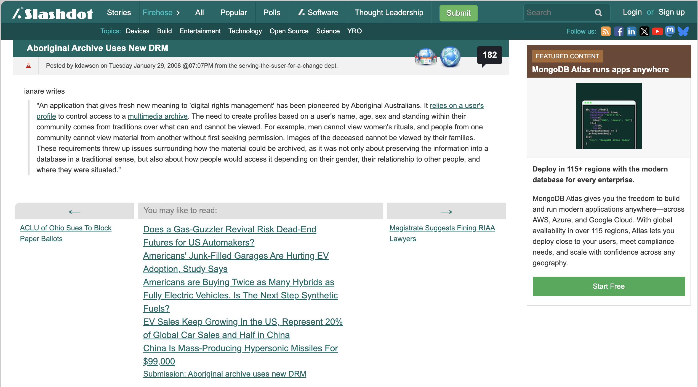
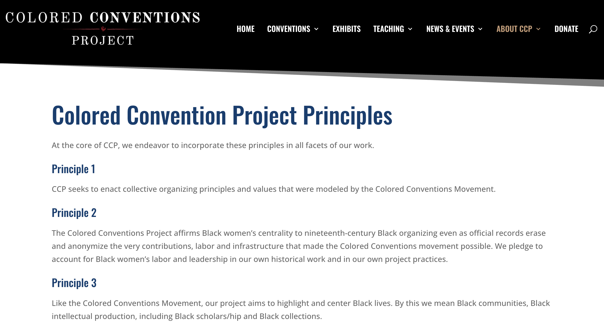

## What do we do with cultural data, once it is collected?

## Today's discussion: When and how should we share cultural data?

## Let's Start with the Christen Piece

Why does Christen open her article with the Slashdot story about the Aboriginal archive and its use of new DRM?

{target="_blank"}

## What is Mukurtu? How was it developed and why?

{target="_blank"}

## What are the origins and problems with the idea of information wanting to be free?

## Why is digital rights management important for cultural data?

- What makes Mukurtu different from other digital platforms?
- What is the problem of copyright in the context of indigenous cultural data?

{target="_blank"}

## How does this relate to the Colored Conventions Project? 

{target="_blank"}

## What are some of the core CCP Principles?

{target="_blank"}

## How does this relate to the Lenna Image piece?

{target="_blank"}

## How did the Pudding track the spread of the image?

## Why ask if "can data die?"

## Why do we need alternatives to how data is managed and shared?

:::: {.columns}
::: {.column width="50%" .r-fit-text}
- What are some of the tradeoffs between privacy and openness in data management?
- What are the problems with valuing openness and public domain as default?
- What are some of the ways we can ensure communities have a say in how their data is managed and shared?
:::
::: {.column width="50%"}

:::
::::

## Spectrum of Openness

{target="_blank"}

## Documentation as a lamp in the dark forest

::: {.r-fit-text}
{target="_blank"}
:::

## Tidy data, briefly

{target="_blank"}

## Digital publishing: Some considerations for your final projects!

::: {.r-fit-text}
No universal answers, but every project answers each of these implicitly, so make it explicit:

- **Audience** — Who is your audience? Scholars, general public, a specific community? Different audiences need different framings!
- **Accessibility** — How accessible are your materials? Do you include alt text, open access, alternative formats, plain language summaries, etc?
- **Interactivity** — How interactive are your materials? When do multimedia and interactive visualizations help, and when are they decoration?
- **Sustainability** — How sustainable is your project? Who maintains this in 5 years?
- **Politics/Ethics** — How does your project engage with communities? Do you have informed consent? Are you considering privacy and future use?
- **Transparency** — How transparent is your project? Do you provide clear documentation, data sources, and methodologies?
:::

## Your Group Work & Principles

Let's revisit the [GitHub repository and website expectations](../assessments/03-semester-project.qmd#github-repository-and-website){target="_blank"}

## Remaining Classes

- All coding assignments must be submitted by next Tuesday.
- Please consult with the instructors about your final dataset to ensure it is feasible and within the scope of the course.
- Please work on finalizing your group principles and cleaning up your group repository
- All group projects will be downloaded **May 15**!
